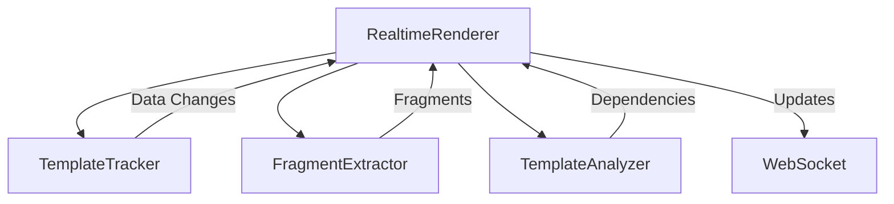

# StateTemplate LLM Instructions

This document provides comprehensive guidance for Language Learning Models (LLMs) working with the StateTemplate codebase.

## 🎯 Project Overview

StateTemplate is a real-time Go template rendering library that enables granular fragment-based updates for web applications. It extends Go's `html/template` package with:

- **Fragment Extraction**: Automatic identification of updateable template segments
- **Dependency Tracking**: Smart detection of data-to-template relationships
- **Real-time Updates**: WebSocket-compatible minimal update payloads
- **Performance Optimization**: Only re-render changed fragments

## 📁 Repository Structure

```text
statetemplate/
├── realtime_renderer.go     # 🎬 Main orchestrator - entry point for LLM analysis
├── template_tracker.go      # 📊 Data change detection via reflection
├── fragment_extractor.go    # ✂️ Template fragment identification and extraction
├── advanced_analyzer.go     # 🔍 Advanced template analysis and optimization
├── parse_api_test.go        # ✅ Parse API unit tests
├── examples/                # 📚 Working demos - start here for understanding
│   ├── comprehensive-demo/  # 🚀 Complete application example
│   ├── range-demo/          # 📋 List operations and sorting
│   └── e2e/                 # 🧪 End-to-end tests
├── docs/                    # 📖 All documentation (MANDATORY location)
│   ├── ARCHITECTURE.md      # 🏗️ Technical deep-dive
│   ├── API_DESIGN.md        # 🔌 Public API reference
│   ├── EXAMPLES.md          # 💡 Usage patterns and integration
│   └── README.md            # 🗺️ Documentation index
├── testdata/                # 🧪 Template files for testing
│   ├── comments/           # Template comment handling
│   ├── conditionals/       # If/else/with logic
│   ├── range/              # Loop constructs
│   ├── variables/          # Variable assignment
│   └── comprehensive/      # Complex multi-action templates
└── scripts/                # 🛠️ Build and validation tools
    ├── validate-ci.sh      # ✅ CI validation (MUST pass for success)
    └── install-git-hooks.sh # 🪝 Development workflow setup
```

## 🧠 LLM Context Understanding

### Key Mental Models

1. **Fragment-Centric Architecture**: Templates are decomposed into independently updateable fragments
2. **Dependency Graphs**: Data changes propagate through mapped template dependencies
3. **Minimal Update Strategy**: Only changed fragments generate update payloads
4. **Real-time Pipeline**: Template → Fragment → Update → WebSocket → DOM

### Code Analysis Priority

When analyzing code, prioritize understanding:

1. **Entry Points**: `realtime_renderer.go` - main API surface
2. **Core Logic**: Fragment extraction and dependency tracking
3. **Test Patterns**: Table-driven tests in `testdata/` directory
4. **Examples**: Working code in `examples/` for practical context

## 🔍 Fragment Types (Critical Concept)

Understanding fragment types is essential for StateTemplate work:

### Simple Fragments

```go
{{.Title}}           // Direct field access
{{.User.Name}}       // Nested field access
{{printf "%s" .ID}}  // Function calls
```

### Conditional Fragments

```go
{{if .IsLoggedIn}}
    <p>Welcome {{.User.Name}}</p>
{{else}}
    <p>Please log in</p>
{{end}}
```

### Range Fragments (Most Complex)

```go
{{range .Items}}
    <div data-id="{{.ID}}">{{.Name}}</div>
{{end}}
```

- Support granular item operations (add, remove, reorder)
- Use stable key-based IDs for DOM operations
- Enable precise positioning with `insertafter`/`insertbefore`

### Block Fragments

```go
{{block "header" .}}
    <h1>{{.Title}}</h1>
{{end}}
```

## 🎯 Template Actions (Complete Reference)

StateTemplate supports all Go template actions. Key patterns:

| Action Type      | Syntax                     | LLM Consideration                    |
| ---------------- | -------------------------- | ------------------------------------ |
| **Comments**     | `{{/* comment */}}`        | Ignored in output but tracked        |
| **Variables**    | `{{$var := .Field}}`       | Local scope, dependency tracking     |
| **Pipelines**    | `{{.Field \| func}}`       | Function chains, data transformation |
| **Conditionals** | `{{if}}/{{else}}/{{end}}`  | Fragment visibility control          |
| **Loops**        | `{{range}}/{{with}}`       | Granular item tracking               |
| **Functions**    | `{{eq}}/{{len}}/{{index}}` | Built-in and custom functions        |
| **Blocks**       | `{{block}}/{{template}}`   | Template composition                 |

## 🔄 Development Workflow

### Mandatory Validation

```bash
# ALWAYS run before considering work complete
./scripts/validate-ci.sh
```

This script MUST pass for any milestone success. It includes:

- All tests passing
- Code formatting (`gofmt`)
- Static analysis (`go vet`)
- Linting (`golangci-lint`)
- Dependency management (`go mod tidy`)

### Testing Strategy

StateTemplate uses **table-driven testing**:

```go
func TestFeature(t *testing.T) {
    tests := []struct {
        name     string
        template string
        data     interface{}
        expected string
    }{
        {
            name:     "descriptive_scenario",
            template: `{{.Field}}`,
            data:     map[string]interface{}{"Field": "value"},
            expected: "value",
        },
    }

    for _, tt := range tests {
        t.Run(tt.name, func(t *testing.T) {
            // Test implementation
        })
    }
}
```

### File Organization Rules (MANDATORY)

**❌ Never Create:**

- `cmd/` directory for any purpose
- Debug executables or `main.go` files for debugging
- Documentation outside `docs/` directory (except root `README.md`)

**✅ Always Use:**

- `examples/` for all demo code and usage patterns
- `*_test.go` files for temporary debug functions (delete after use)
- `docs/` for ALL documentation and markdown files
- `testdata/` for template files used in tests

## 🏗️ Architecture Understanding

### Core Components



### Data Flow Sequence

1. **Parse**: Template → AST → Fragment extraction
2. **Track**: Data dependencies mapped to fragments
3. **Update**: Data change → Fragment identification → Minimal update
4. **Deliver**: Update payload → WebSocket → DOM manipulation

## 🎛️ Public API (Stable Interface)

```go
// Constructor
renderer := statetemplate.NewRenderer(opts...)

// Template Loading
renderer.Parse(templateString)
renderer.ParseFiles("template.html")
renderer.ParseGlob("templates/*.html")
renderer.ParseFS(fsys, "templates/*.html")

// Real-time Operations
html, err := renderer.SetInitialData(data)
updateChan := renderer.GetUpdateChannel()
renderer.SendUpdate(newData)
renderer.Start()
renderer.Stop()
```

**⚠️ API Stability**: Public API is frozen until next major version. Changes require explicit approval.

## 🧪 Testing Guidelines for LLMs

### Test File Patterns

- Use real files from `testdata/` directory
- Test all fragment types (simple, conditional, range, block)
- Include edge cases: empty data, nil values, malformed templates
- Follow TDD: failing test → implementation → refactor

### Error Scenarios to Test

- Malformed template syntax
- Missing data fields
- Type mismatches
- Circular dependencies
- Concurrent access patterns

## 🚀 Performance Considerations

### Optimization Targets

- **Fragment Count**: Degrades >1000 fragments per template
- **Update Frequency**: Optimized for <100 updates/second
- **Data Size**: Efficient with objects <10MB
- **Template Complexity**: Nested depth >5 levels impacts performance

### Memory Management

- Fragment stores and range fragments need cleanup
- Template re-parsing overhead on additions
- Reflection metadata caching opportunities

## 🔐 Security Model

### Built-in Protections

- **HTML Escaping**: Automatic via Go template engine
- **XSS Prevention**: Template auto-escaping prevents injection
- **Template Injection**: Limited by Go template sandbox

### Application Responsibilities

- WebSocket authentication
- Rate limiting for real-time updates
- Input validation on data updates

## 🐛 Common Debugging Patterns

### Fragment Issues

```go
// Debug fragment extraction
func TestDebug_FragmentExtraction(t *testing.T) {
    renderer := NewRenderer()
    err := renderer.Parse(problematicTemplate)
    // Analyze fragment store and dependencies
}
```

### Data Tracking Issues

```go
// Debug dependency mapping
func TestDebug_DataTracking(t *testing.T) {
    // Test data change detection
    // Verify fragment update generation
}
```

## 📊 Technical Debt Awareness

### High Priority Issues

1. **Fragment ID Generation**: Timestamp-based, not deterministic
2. **Memory Management**: Fragment cleanup not implemented
3. **Error Handling**: Inconsistent across components
4. **Concurrency**: Thread safety gaps in fragment updates

### Known Limitations

- Templates re-parsed on each addition (performance impact)
- Complex nested dependency resolution
- Limited configuration options
- Missing benchmark tests

## 🔄 LLM Workflow Recommendations

### Code Analysis Approach

1. **Start with Examples**: Understand usage patterns first
2. **Follow Data Flow**: Template → Fragment → Update → Output
3. **Check Tests**: Verify understanding with existing test cases
4. **Validate Changes**: Always run `./scripts/validate-ci.sh`

### Documentation Updates

When making changes:

1. **Architecture changes** → Update `docs/ARCHITECTURE.md`
2. **API changes** → Update `docs/API_DESIGN.md`
3. **New features** → Add examples to `docs/EXAMPLES.md`
4. **Instructions** → Update this file for future LLMs

### Code Generation Guidelines

- Follow existing patterns in the codebase
- Use table-driven tests for new functionality
- Include error handling and edge cases
- Add performance considerations for new features
- Document complex algorithms inline

## 🎯 Success Criteria for LLM Tasks

### Completion Checklist

- [ ] All tests pass (`go test ./...`)
- [ ] CI validation succeeds (`./scripts/validate-ci.sh`)
- [ ] Code follows existing patterns and style
- [ ] Documentation updated appropriately
- [ ] Examples provided for new features
- [ ] Performance implications considered
- [ ] Error handling implemented
- [ ] Thread safety addressed if relevant

### Quality Indicators

- **Good**: Code works and tests pass
- **Better**: Code follows patterns and handles edge cases
- **Best**: Code is optimized, well-documented, and future-proof

## 💡 Advanced LLM Guidance

### Template AST Understanding

StateTemplate heavily uses Go's `text/template` and `html/template` parsing:

```go
// Template AST nodes relevant for fragment extraction
parse.ActionNode    // {{.Field}} actions
parse.IfNode       // {{if}} conditionals
parse.RangeNode    // {{range}} loops
parse.TemplateNode // {{template}} includes
```

### Reflection Patterns

Data tracking uses reflection extensively:

```go
// Common patterns for LLM understanding
reflect.ValueOf(data).Kind()           // Type detection
reflect.DeepEqual(old, new)            // Change detection
reflect.Value.FieldByName(fieldName)   // Field access
```

### WebSocket Integration

Updates are designed for WebSocket delivery:

```go
// Update payload structure
type Update struct {
    FragmentID string    `json:"fragment_id"`
    HTML       string    `json:"html"`
    Action     string    `json:"action"`
    *RangeInfo `json:"range,omitempty"`
}
```

This structure enables precise DOM manipulation on the client side.

---

_This document is maintained for LLM understanding and should be updated when architectural changes occur._
