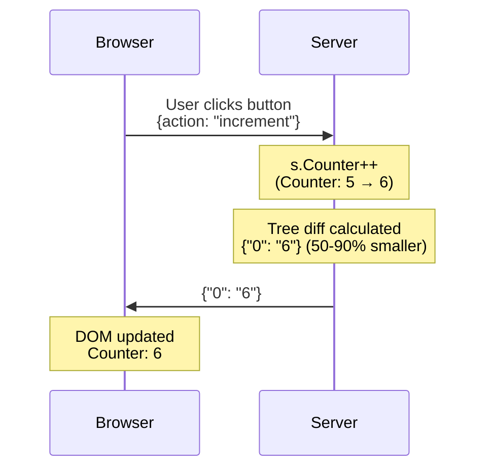

# LiveTemplate

Build interactive web applications in Go using a simplified programming model. Write server-side code, get reactive UIs automatically.

**[Quick Start](#quick-start)** • **[API Docs](https://pkg.go.dev/github.com/livetemplate/livetemplate)** • **[CLI Tool](https://github.com/livetemplate/lvt)** • **[Examples](https://github.com/livetemplate/examples)**

---

> **ALPHA SOFTWARE**
>
> LiveTemplate is currently in **alpha stage**. Core features work and are tested, but the API may change before v1.0. Use in production at your own risk.

---

## A Better Way to Build Interactive Apps

Traditional web development splits your application across two worlds. You write server code in one language, client code in another, then spend your time orchestrating between them - managing REST APIs, synchronizing state, serializing JSON, and manually updating the DOM. Every interactive feature requires wiring code in multiple places.

LiveTemplate takes a different approach, inspired by Phoenix LiveView. Your application state lives in Go on the server. When a user clicks a button, LiveTemplate sends the action to your server, you update your Go struct, and the UI updates automatically. No REST endpoints to design, no state synchronization code to write, no manual DOM manipulation.



This works because LiveTemplate uses **tree-based diffing** - a data model that makes updates predictable and efficient. When your state changes, LiveTemplate calculates exactly what changed and sends only that data (50-90% less than full HTML). The same predictable model that enables efficient updates also powers the `lvt` code generator, which can create complete CRUD applications that are reactive by default.

## Why LiveTemplate?

### 1. Write Server-Side, Get Reactive UIs

Your templates use familiar Go template syntax with `lvt-*` attributes for interactivity:

```html
<h1>Counter: {{.Counter}}</h1>
<button lvt-click="increment">+</button>
```

Handle the action in Go:

```go
func (s *CounterState) Change(ctx *livetemplate.ActionContext) error {
    if ctx.Action == "increment" {
        s.Counter++
    }
    return nil
}
```

That's it. No client code needed. The UI updates automatically when `Counter` changes.

### 2. Generate Complete Apps Instantly

Because the tree-based model is predictable, code generation works reliably. The `lvt` CLI generates complete CRUD applications - forms, tables, validation, database integration - all reactive by default:

```bash
lvt new myapp
cd myapp
lvt gen products name price:float stock:int
lvt serve
```

Generated code inherits the reactive programming model. No glue code, no manual wiring.

### 3. Efficient by Design

Tree-based diffing sends only what changed:

```json
// First render: Full tree
{"s": ["<div>Counter: ", "</div>"], "0": "5"}

// Updates: Only changed values
{"0": "6"}
```

Static HTML is cached client-side. Updates are 50-90% smaller than traditional approaches.

### 4. Idiomatic Go Error Handling

Errors flow naturally using Go's familiar error handling patterns. Just return an error from `Change()` and LiveTemplate automatically displays it in your template:

**Server (familiar Go code):**

```go
func (s *State) Change(ctx *livetemplate.ActionContext) error {
    var input SignupInput
    if err := ctx.BindAndValidate(&input, validate); err != nil {
        return err  // Validation errors automatically sent to client
    }

    if s.usernameExists(input.Username) {
        return livetemplate.NewFieldError("username",
            errors.New("username already taken"))
    }

    return nil
}
```

**Template (automatic error display):**

```html
<input name="username" {{if .lvt.HasError "username"}}aria-invalid="true"{{end}}>
{{if .lvt.HasError "username"}}
    <small>{{.lvt.Error "username"}}</small>
{{end}}
```

When you return a `FieldError` from Go, LiveTemplate automatically makes it available in your templates via `.lvt.HasError` and `.lvt.Error` helpers. No error serialization code. No client-side error state management.

## Quick Start

```bash
go get github.com/livetemplate/livetemplate
```

**1. Create your state** ([main.go](https://github.com/livetemplate/examples/blob/main/counter/main.go))

```go
type CounterState struct {
    Counter int
}

func (s *CounterState) Change(ctx *livetemplate.ActionContext) error {
    switch ctx.Action {
    case "increment":
        s.Counter++
    case "decrement":
        s.Counter--
    }
    return nil
}

func main() {
    state := &CounterState{Counter: 0}
    tmpl := livetemplate.New("counter")
    http.Handle("/", tmpl.Handle(state))
    http.ListenAndServe(":8080", nil)
}
```

**2. Create your template** ([counter.tmpl](https://github.com/livetemplate/examples/blob/main/counter/counter.tmpl))

```html
<!-- counter.tmpl -->
<h1>Counter: {{.Counter}}</h1>
<button lvt-click="increment">+</button>
<button lvt-click="decrement">-</button>

<script src="https://cdn.jsdelivr.net/npm/@livetemplate/client@latest/dist/livetemplate-client.browser.js"></script>
```

**3. Run it**

```bash
go run main.go  # Open http://localhost:8080
```

That's it! Click buttons and watch the counter update automatically.

## How It Works

```
User clicks button → Server updates state → Template renders →
Tree diff calculates changes → Client receives minimal update → DOM updates
```

1. Define your state as a Go struct
2. Handle actions in the `Change(ctx)` method
3. Use standard Go templates with `lvt-*` attributes
4. LiveTemplate automatically syncs state to UI

All interactive features work over HTTP. WebSocket is optional, required only for server-initiated broadcasts (e.g., multi-user chat notifications).

## Performance

LiveTemplate is designed for high-performance reactive updates with minimal bandwidth usage.

### Key Metrics

| Operation | Latency | Bandwidth Savings |
|-----------|---------|-------------------|
| Initial Render | ~20-65µs | - |
| Small Update (1-2 fields) | ~18-20µs | 85% vs full render |
| Large Update (5+ fields) | ~65µs | 65% vs full render |
| Range Operations | ~30-65µs | 80% vs full render |

*Actual benchmarks from baseline (Go 1.21, Apple M1). See [baseline.txt](testdata/benchmarks/baseline.txt) for complete results.*

### How It Works

1. **First Render:** Full HTML + tree structure with static/dynamic separation
2. **Subsequent Updates:** Only changed values (statics cached client-side)
3. **Result:** 85%+ bandwidth savings, sub-millisecond latency

### Running Benchmarks

```bash
# Run all benchmarks
make bench

# Compare against baseline
make bench-compare

# Generate performance profiles
make profile-cpu
make profile-mem
```

See the full [performance documentation](docs/performance/) for comprehensive analysis.

## Learn More

**Core Documentation:**

- [Go API Reference](https://pkg.go.dev/github.com/livetemplate/livetemplate) - Server-side API
- [Client Attributes](docs/references/client-attributes.md) - `lvt-*` event bindings
- [Error Handling](docs/references/error-handling.md) - Validation and errors
- [Configuration](docs/CONFIGURATION.md) - Template and server options

**Feature Guides:**

- [File Uploads](docs/uploads.md) - Phoenix LiveView-inspired upload system
- [Server Actions](docs/references/server-actions.md) - Push updates from server-side code
- [Session Management](docs/references/session.md) - Session stores and scaling
- [Horizontal Scaling](docs/SCALING.md) - Redis-backed session stores
- [Authentication](docs/references/authentication.md) - User identification and custom authenticators
- [Observability](docs/OBSERVABILITY.md) - Logging and metrics

**Architecture:**

- [Architecture Overview](docs/ARCHITECTURE.md) - System design
- [Performance Characteristics](docs/performance/performance-characteristics.md) - Phase analysis
- [Benchmarking Guide](docs/performance/benchmarking-guide.md) - How to benchmark

**Related Projects:**

- [CLI Tool (lvt)](https://github.com/livetemplate/lvt) - Code generator and dev server
- [Client Library](https://github.com/livetemplate/client) - TypeScript client (npm: `@livetemplate/client`)
- [Examples](https://github.com/livetemplate/examples) - Counter, Todos, Chat, and more

## Contributing

**New to the codebase?** Start with the [Contributor Walkthrough](docs/guides/new-contributor-walkthrough.md) - a comprehensive guide to the 5-phase architecture with links to code and tests.

See [CONTRIBUTING.md](CONTRIBUTING.md) for development setup and guidelines.

## License

MIT License - see [LICENSE](LICENSE) file for details.

---

**Built with LiveTemplate?** Share your project in [GitHub Discussions](https://github.com/livetemplate/livetemplate/discussions).

Inspired by [Phoenix LiveView](https://hexdocs.pm/phoenix_live_view).
