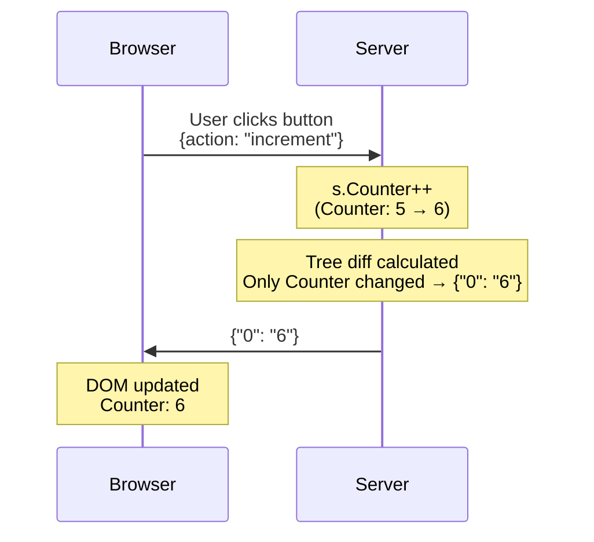

# LiveTemplate

Reactive web UIs in standard HTML and Go. No custom template language. No client-side framework. No persistent connection required.

📚 **Documentation:** **<https://livetemplate.fly.dev>** — guides, recipes, patterns catalog, full reference.

**[Quick Start](#quick-start)** | **[Docs site](https://livetemplate.fly.dev)** | **[Examples](https://github.com/livetemplate/examples)** | **[API Reference](https://pkg.go.dev/github.com/livetemplate/livetemplate)**

> **Alpha** — Core features work and are tested, but the API may change before v1.0.

<p align="center">
  
</p>

The HTML and Go behind a reactive todo list:

```html
<form method="POST">
    <input type="text" name="title" required placeholder="What needs to be done?">
    <button name="add">Add Todo</button>
</form>
<ul>
{{range .Items}}<li>{{.Title}}</li>{{end}}
</ul>
```

```go
func (c *TodoController) Add(state TodoState, ctx *livetemplate.Context) (TodoState, error) {
    state.Items = append(state.Items, Todo{Title: ctx.GetString("title")})
    ctx.BroadcastAction("Refresh", nil) // pushes update to other WS-connected tabs
    return state, nil
}
```

The button's `name` IS the action — `<button name="add">` routes to `Add()`. No custom attributes, no JavaScript wiring. Without JS, the form POSTs normally. With the JS client, the DOM patches in place. Add a WebSocket and other tabs sync automatically. See [Standard HTML Reactivity](docs/guides/standard-html-reactivity.md) for how this compares to htmx, Livewire, and LiveView.

> The full [todos example](https://github.com/livetemplate/examples/tree/main/todos) uses SQLite, form validation, and toasts. The snippet above is the minimal in-memory shape.

## How It Works



When a user clicks a button, LiveTemplate calls a method on your Go struct, diffs the template output, and sends only what changed.

## Quick Start

```bash
go get github.com/livetemplate/livetemplate
```

**1. Define controller and state** ([full example](https://github.com/livetemplate/examples/blob/main/counter/main.go))

```go
type CounterState struct {
    Counter int
}

type CounterController struct{}

func (c *CounterController) Increment(state CounterState, ctx *livetemplate.Context) (CounterState, error) {
    state.Counter++
    return state, nil
}

func (c *CounterController) Decrement(state CounterState, ctx *livetemplate.Context) (CounterState, error) {
    state.Counter--
    return state, nil
}

func main() {
    controller := &CounterController{}
    state := &CounterState{Counter: 0}
    tmpl := livetemplate.Must(livetemplate.New("counter"))
    http.Handle("/", tmpl.Handle(controller, livetemplate.AsState(state)))
    http.ListenAndServe(":8080", nil)
}
```

`New` auto-discovers `*.tmpl` files in the current directory — `counter.tmpl` is picked up automatically.

**2. Write the template** ([counter.tmpl](https://github.com/livetemplate/examples/blob/main/counter/counter.tmpl))

```html
<h1>Counter: {{.Counter}}</h1>
<form method="POST" style="display:inline">
    <button name="increment">+</button>
    <button name="decrement">-</button>
</form>

<link rel="stylesheet" href="https://cdn.jsdelivr.net/npm/@livetemplate/client@latest/livetemplate.css">
<script defer src="https://cdn.jsdelivr.net/npm/@livetemplate/client@latest/dist/livetemplate-client.browser.js"></script>
```

**3. Run it**

```bash
go run main.go  # Open http://localhost:8080
```

## Features

**Standard HTML first** — Forms, buttons, dialogs, and links work reactively without custom attributes. `lvt-*` attributes are available for behaviors HTML can't express (debounce, keyboard shortcuts, reactive DOM). [Guide →](docs/guides/progressive-complexity.md)

**Safe state management** — Controllers (singleton, hold dependencies) are separated from state (pure data, cloned per session). No accidental data leakage between users. [Reference →](docs/references/controller-pattern.md)

**Efficient updates** — Templates split into static structure (cached) and dynamic values. Updates send only changed values — typically 85%+ bandwidth savings. [Details →](docs/performance/performance-characteristics.md)

**Idiomatic Go errors** — Actions return `(State, error)`. Validation errors flow to templates automatically. No error serialization code. [Error handling →](docs/references/error-handling.md)

**Code generation** — `lvt new myapp && lvt gen resource products name price:float` scaffolds full CRUD apps with reactive UIs. [CLI →](https://github.com/livetemplate/lvt)

## Learn More

**Guides:**

- [Standard HTML Reactivity](docs/guides/standard-html-reactivity.md) — How LiveTemplate compares to htmx, Livewire, LiveView
- [Progressive Complexity](docs/guides/progressive-complexity.md) — Standard HTML → `lvt-*` attributes
- [Scaling](docs/guides/SCALING.md) — Redis-backed sessions, horizontal scaling

**References:**

- [Controller+State Pattern](docs/references/controller-pattern.md) — Core architecture
- [Client Attributes](docs/references/client-attributes.md) — `lvt-*` reference
- [Navigate Action](docs/references/navigate.md) — `__navigate__` reserved action invariants
- [Error Handling](docs/references/error-handling.md) — Validation and errors
- [Configuration](docs/references/CONFIGURATION.md) — Options and environment variables
- [Current Limitations](docs/references/current-limitations.md) — Known gaps and workarounds

**Related Projects:**

- [CLI Tool (lvt)](https://github.com/livetemplate/lvt) — Code generator and dev server
- [Client Library](https://github.com/livetemplate/client) — TypeScript client (npm: `@livetemplate/client`)
- [Examples](https://github.com/livetemplate/examples) — Counter, Todos, Chat, and more
- [Tinkerdown](https://github.com/livetemplate/tinkerdown) — Build data-driven apps from a single markdown file (built on LiveTemplate)

## Contributing

**New to the codebase?** Start with the [Contributor Walkthrough](docs/guides/new-contributor-walkthrough.md).

See [CONTRIBUTING.md](CONTRIBUTING.md) for development setup and guidelines.

## License

MIT License — see [LICENSE](LICENSE) file for details.
