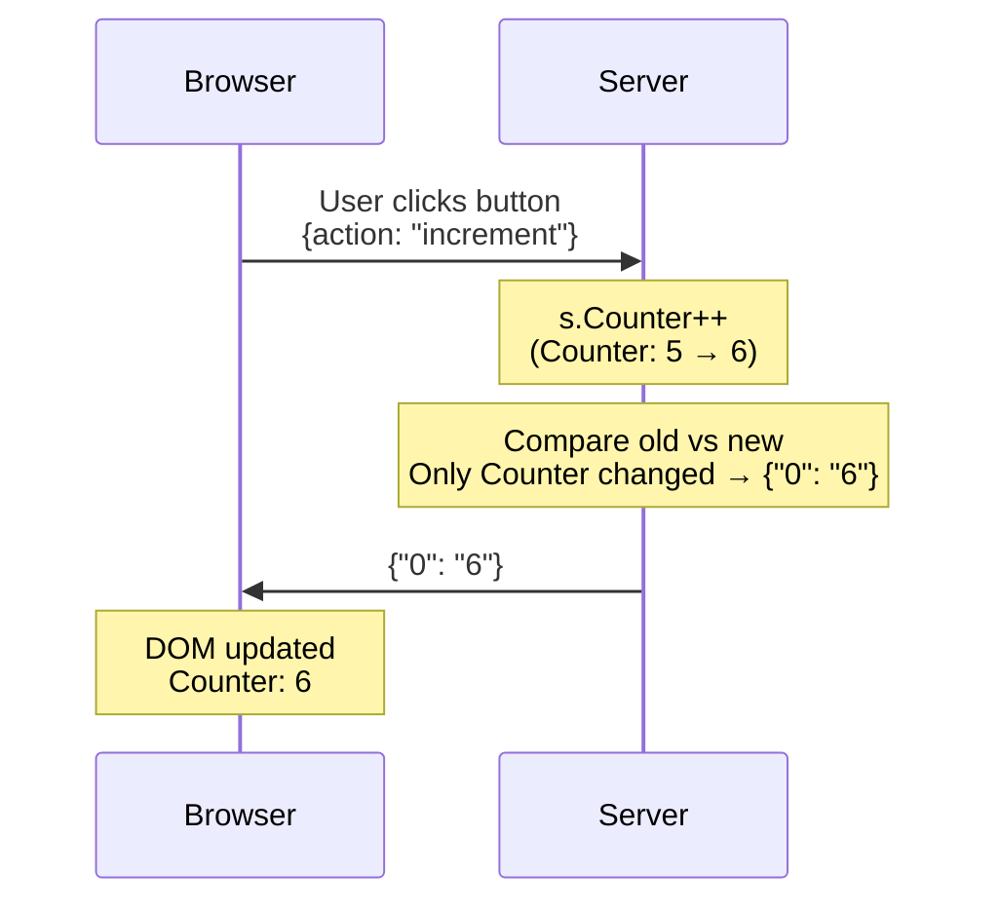

# LiveTemplate

Build interactive web applications in Go using a simplified programming model. Write server-side code, get reactive UIs automatically.

**[Quick Start](#quick-start)** • **[API Docs](https://pkg.go.dev/github.com/livetemplate/livetemplate)** • **[CLI Tool](https://github.com/livetemplate/lvt)** • **[Examples](https://github.com/livetemplate/examples)**

---

> **ALPHA SOFTWARE**
>
> LiveTemplate is currently in **alpha stage**. Core features work and are tested, but the API may change before v1.0. Use in production at your own risk.

---

## A Better Way to Build Interactive Apps

Every interactive feature in a traditional web app pays a complexity tax: design a REST endpoint, write a serializer, manage client-side state, update the DOM, and wire it all together. This tax adds up. Features that should be dynamic stay static because the cost of making them interactive isn't worth it. Chris McCord [described the problem well](https://fly.io/blog/how-we-got-to-liveview/) when explaining why he built Phoenix LiveView — conventional frameworks make you "fetch the world, munge it into some format, and shoot it over the wire... then throw all that state away" on every request.

LiveTemplate brings that same idea to Go. Your application state lives on the server. When a user clicks a button, LiveTemplate calls a method on your Go struct, you update your state, and the UI reflects the change automatically. No endpoints to design, no JSON to serialize, no client-side state to synchronize. There's no complexity tax for making things interactive — so whatever makes sense to be dynamic gets to be dynamic.



This works because LiveTemplate splits your template into **static parts** (the HTML that never changes) and **dynamic parts** (the values that do). On first render, the client caches all the static HTML. After that, only changed values travel over the wire - a counter update sends `{"0": "6"}` instead of re-rendering the entire page. This is 50-90% less data than traditional approaches, and the same static/dynamic split powers the `lvt` code generator, which can create complete CRUD applications that are reactive by default.

## Why LiveTemplate?

The core idea — pioneered by [Phoenix LiveView](https://hexdocs.pm/phoenix_live_view) — is that your application state lives on the server, user interactions call server-side functions, and the framework automatically figures out what changed and pushes minimal updates to the browser. No REST APIs, no client-side state management, no JavaScript build step. LiveView proved this model works in production, but it requires Elixir. LiveTemplate brings it to Go: if your team already runs Go, you get reactive UIs without adopting a new language, runtime, or deployment model.

### 1. Reactive UIs in Pure Go

Your templates use familiar Go template syntax with `lvt-*` attributes for interactivity:

```html
<h1>Counter: {{.Counter}}</h1>
<button lvt-click="increment">+</button>
```

Handle the action in Go:

```go
func (c *CounterController) Increment(state CounterState, ctx *livetemplate.Context) (CounterState, error) {
    state.Counter++
    return state, nil
}
```

No client code needed. The UI updates automatically when `Counter` changes. Your existing Go toolchain, testing infrastructure, and deployment pipeline all work as-is.

### 2. Generate Complete Apps Instantly

The `lvt` CLI generates complete CRUD applications — forms, tables, validation, database integration — all reactive by default:

```bash
lvt new myapp
cd myapp
lvt gen products name price:float stock:int
lvt serve
```

Code generation works reliably because templates have a predictable static/dynamic structure. Generated code inherits the reactive programming model. No glue code, no manual wiring. Pluggable CSS kits (Tailwind, Bulma, Pico, or plain HTML) let you match your team's preferred styling approach.

### 3. Safe State Management

LiveTemplate separates **controllers** (singleton, holds dependencies) from **state** (pure data, cloned per session). This prevents a class of bugs where session-specific data like OAuth tokens or caches accidentally leaks between users:

```go
// Controller: Singleton, holds shared dependencies — never cloned
type TodoController struct {
    DB     *sql.DB
    Logger *slog.Logger
}

// State: Pure data, cloned per session — must be serializable
type TodoState struct {
    Items  []Todo
    Filter string
}

func (c *TodoController) Add(state TodoState, ctx *livetemplate.Context) (TodoState, error) {
    todo := c.DB.InsertTodo(ctx.GetString("title"))
    state.Items = append(state.Items, todo)
    return state, nil
}
```

The separation is enforced at the API level: `tmpl.Handle(controller, livetemplate.AsState(state))`. There's no way to accidentally put a database connection in cloned state.

### 4. Efficient by Design

LiveTemplate separates your template into static HTML (the parts that never change) and dynamic values (the parts that do). On first render, the client receives and caches the full structure:

```json
{"s": ["<div>Counter: ", "</div>"], "0": "5"}
```

When the counter changes from 5 to 6, only the new value is sent:

```json
{"0": "6"}
```

No re-rendered HTML, no string diffing — just the single value that changed. For typical pages with lots of markup and few changing values, this means **50-90% less data** than sending full HTML. This is the same static/dynamic split that [Phoenix LiveView uses](https://hexdocs.pm/phoenix_live_view/Phoenix.LiveView.html) — a proven approach to minimizing wire traffic.

### 5. Idiomatic Go Patterns

Errors flow naturally using Go's familiar patterns. Return an error and LiveTemplate automatically displays it in your template:

```go
func (c *AuthController) Signup(state AuthState, ctx *livetemplate.Context) (AuthState, error) {
    var input SignupInput
    if err := ctx.BindAndValidate(&input, validate); err != nil {
        return state, err  // Validation errors automatically sent to client
    }

    if c.usernameExists(input.Username) {
        return state, livetemplate.NewFieldError("username",
            errors.New("username already taken"))
    }

    return state, nil
}
```

```html
<input name="username" {{if .lvt.HasError "username"}}aria-invalid="true"{{end}}>
{{if .lvt.HasError "username"}}
    <small>{{.lvt.Error "username"}}</small>
{{end}}
```

No error serialization code. No client-side error state management. Actions return `(State, error)` — the standard Go signature.

## Quick Start

```bash
go get github.com/livetemplate/livetemplate
```

**1. Create your controller and state** ([main.go](https://github.com/livetemplate/examples/blob/main/counter/main.go))

```go
// State: Pure data, cloned per session
type CounterState struct {
    Counter int
}

// Controller: Holds dependencies, singleton
type CounterController struct{}

// Action "increment" maps to method Increment()
func (c *CounterController) Increment(state CounterState, ctx *livetemplate.Context) (CounterState, error) {
    state.Counter++
    return state, nil
}

// Action "decrement" maps to method Decrement()
func (c *CounterController) Decrement(state CounterState, ctx *livetemplate.Context) (CounterState, error) {
    state.Counter--
    return state, nil
}

func main() {
    controller := &CounterController{}
    state := &CounterState{Counter: 0}
    tmpl := livetemplate.New("counter")
    http.Handle("/", tmpl.Handle(controller, livetemplate.AsState(state)))
    http.ListenAndServe(":8080", nil)
}
```

**2. Create your template** ([counter.tmpl](https://github.com/livetemplate/examples/blob/main/counter/counter.tmpl))

```html
<!-- counter.tmpl -->
<h1>Counter: {{.Counter}}</h1>
<button lvt-click="increment">+</button>
<button lvt-click="decrement">-</button>

<script src="https://cdn.jsdelivr.net/npm/@livetemplate/client@latest/dist/livetemplate-client.browser.js"></script>
```

**3. Run it**

```bash
go run main.go  # Open http://localhost:8080
```

That's it! Click buttons and watch the counter update automatically.

## How It Works

```
User clicks button → Server updates state → Template re-renders →
Only changed values sent → Client patches the DOM
```

1. Define your **State** as a Go struct (pure data, cloned per session)
2. Define your **Controller** with dependencies (singleton)
3. Handle actions as methods on the Controller (action name → method name)
4. Use standard Go templates with `lvt-*` attributes
5. LiveTemplate automatically syncs state to UI

All interactive features work over HTTP. WebSocket is optional, required only for server-initiated broadcasts (e.g., multi-user chat notifications).

## Performance

LiveTemplate is designed for high-performance reactive updates with minimal bandwidth usage.

### Key Metrics

| Operation | Latency | Bandwidth Savings |
|-----------|---------|-------------------|
| Initial Render | ~20-65µs | - |
| Small Update (1-2 fields) | ~18-20µs | 85% vs full render |
| Large Update (5+ fields) | ~65µs | 65% vs full render |
| Range Operations | ~30-65µs | 80% vs full render |

*Actual benchmarks from baseline (Go 1.21, Apple M1). See [baseline.txt](testdata/benchmarks/baseline.txt) for complete results.*

### How It Works

1. **First Render:** Full HTML sent; client caches the static parts
2. **Subsequent Updates:** Only changed values sent (static HTML already cached)
3. **Result:** 85%+ bandwidth savings, sub-millisecond latency

### Running Benchmarks

```bash
# Run all benchmarks
make bench

# Compare against baseline
make bench-compare

# Generate performance profiles
make profile-cpu
make profile-mem
```

See the full [performance documentation](docs/performance/) for comprehensive analysis.

## Learn More

**Core Documentation:**

- [Go API Reference](https://pkg.go.dev/github.com/livetemplate/livetemplate) - Server-side API
- [Controller+State Pattern](docs/references/controller-pattern.md) - Core architecture pattern
- [Client Attributes](docs/references/client-attributes.md) - `lvt-*` event bindings
- [Error Handling](docs/references/error-handling.md) - Validation and errors
- [Configuration](docs/CONFIGURATION.md) - Template and server options

**Feature Guides:**

- [File Uploads](docs/uploads.md) - Phoenix LiveView-inspired upload system
- [Server Actions](docs/references/server-actions.md) - Push updates from server-side code
- [Session Management](docs/references/session.md) - Session stores and scaling
- [Horizontal Scaling](docs/SCALING.md) - Redis-backed session stores
- [Authentication](docs/references/authentication.md) - User identification and custom authenticators
- [Observability](docs/OBSERVABILITY.md) - Logging and metrics

**Architecture:**

- [Architecture Overview](docs/ARCHITECTURE.md) - System design
- [Performance Characteristics](docs/performance/performance-characteristics.md) - Phase analysis
- [Benchmarking Guide](docs/performance/benchmarking-guide.md) - How to benchmark

**Related Projects:**

- [CLI Tool (lvt)](https://github.com/livetemplate/lvt) - Code generator and dev server
- [Client Library](https://github.com/livetemplate/client) - TypeScript client (npm: `@livetemplate/client`)
- [Examples](https://github.com/livetemplate/examples) - Counter, Todos, Chat, and more

## Contributing

**New to the codebase?** Start with the [Contributor Walkthrough](docs/guides/new-contributor-walkthrough.md) - a comprehensive guide to the 5-phase architecture with links to code and tests.

See [CONTRIBUTING.md](CONTRIBUTING.md) for development setup and guidelines.

## License

MIT License - see [LICENSE](LICENSE) file for details.

---

**Built with LiveTemplate?** Share your project in [GitHub Discussions](https://github.com/livetemplate/livetemplate/discussions).
