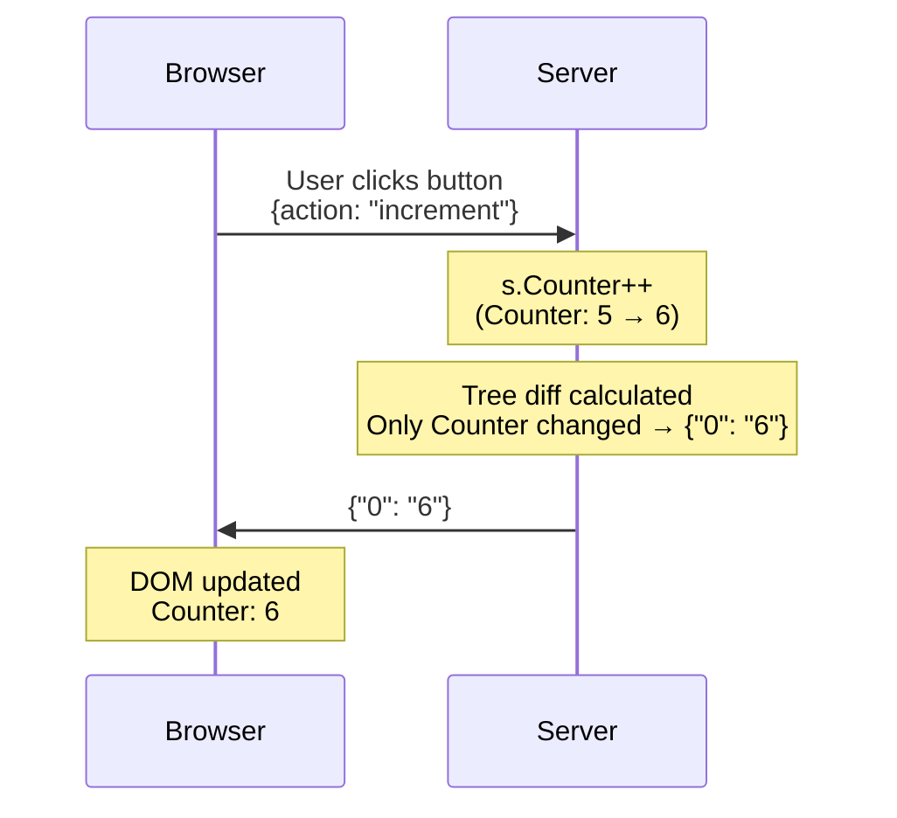

# LiveTemplate

Build interactive web applications in Go using a simplified programming model. Write server-side code, get reactive UIs automatically.

**[Quick Start](#quick-start)** • **[API Docs](https://pkg.go.dev/github.com/livetemplate/livetemplate)** • **[CLI Tool](https://github.com/livetemplate/lvt)** • **[Examples](https://github.com/livetemplate/examples)**

<p align="center">
  
</p>

---

> **ALPHA SOFTWARE**
>
> LiveTemplate is currently in **alpha stage**. Core features work and are tested, but the API may change before v1.0. Use in production at your own risk.

---

## A Better Way to Build Interactive Apps

Every interactive feature in a traditional web app requires the same ceremony: design a REST endpoint, write a serializer, manage client-side state, update the DOM, and wire it all together. That overhead discourages interactivity — teams leave things static not because they should be, but because the plumbing isn't worth it. As Chris McCord [put it](https://fly.io/blog/how-we-got-to-liveview/) when explaining why he built Phoenix LiveView: conventional frameworks make you "fetch the world, munge it into some format, and shoot it over the wire... then throw all that state away" on every request.

LiveView's answer was to keep all state on the server and push rendered updates over a persistent connection — no REST layer, no client-side framework. LiveTemplate brings that approach to Go, but with one major difference: it doesn't require a persistent connection and works equally well over standard HTTP. When a user clicks a button, LiveTemplate calls a method on your Go struct, you update your state, and only what changed is sent back to the browser. No endpoints to design, no JSON to serialize, no client-side state to synchronize.



## Why LiveTemplate?

### 1. Reactive UIs in Pure Go

All user-initiated interactions work over plain HTTP — no WebSocket required. The JS client sends actions as standard HTTP requests and patches the DOM with the response. WebSocket is only needed when the *server* needs to push updates unprompted (e.g., notifying other users in a chat room). Unlike Phoenix LiveView, which requires a persistent connection for all interactions, LiveTemplate treats WebSocket as an optional upgrade for broadcast scenarios only.

This extends to progressive enhancement at the HTML level too. LiveTemplate follows a **progressive complexity** model — start with standard HTML, add custom attributes only when you need behaviors HTML can't express:

| Tier | What you write | When to use |
|------|---------------|-------------|
| **Tier 1: Standard HTML** | `<form>`, `<button name="add">`, `<dialog>`, `<a href>` | Forms, actions, modals, navigation |
| **Tier 2: `lvt-*` attributes** | `lvt-debounce`, `lvt-key`, `lvt-addClass-on:pending` | Timing, keyboard shortcuts, reactive DOM |

A form that works at all transport levels — no JS, fetch, and WebSocket — with zero custom attributes:

```html
<form method="POST">
    <input type="text" name="title" required placeholder="What needs to be done?">
    <button name="add">Add Todo</button>
</form>
```

The button's `name` IS the action — `<button name="add">` routes to the `Add()` method. Without JS, the form POSTs normally. With the JS client, the submission is intercepted and the DOM is patched in place. One declaration, three transport modes.

```go
func (c *TodoController) Add(state TodoState, ctx *livetemplate.Context) (TodoState, error) {
    if err := ctx.ValidateForm(); err != nil {  // Inferred from HTML required attr
        return state, err
    }
    state.Items = append(state.Items, Todo{Title: ctx.GetString("title")})
    return state, nil
}
```

Forms without a named button auto-route to a conventional `Submit()` method — no attributes needed at all for the simplest case. See the [Progressive Complexity Guide](docs/guides/progressive-complexity.md) for the full walkthrough and the [todos-progressive](https://github.com/livetemplate/examples/tree/main/todos-progressive) and [profile-progressive](https://github.com/livetemplate/examples/tree/main/profile-progressive) examples.

For behaviors that HTML can't express — timing control, reactive DOM, keyboard shortcuts — use `lvt-*` attributes:

```html
<!-- Debounced search: waits 300ms after typing stops before querying -->
<input name="Query" value="{{.Query}}"
    lvt-input="search" lvt-debounce="300"
    placeholder="Search...">
```

```go
func (c *AppController) Search(state AppState, ctx *livetemplate.Context) (AppState, error) {
    state.Query = ctx.GetString("Query")
    state.Results = c.DB.Search(state.Query)
    return state, nil
}
```

Your existing Go toolchain, testing infrastructure, and deployment pipeline all work as-is. See the [examples](https://github.com/livetemplate/examples) repository.

### 2. Safe State Management

LiveTemplate separates **controllers** (singleton, holds dependencies) from **state** (pure data, cloned per session). This prevents a class of bugs where session-specific data like OAuth tokens or caches accidentally leaks between users:

```go
// Controller: Singleton, holds shared dependencies — never cloned
type TodoController struct {
    DB     *sql.DB
    Logger *slog.Logger
}

// State: Pure data, cloned per session — must be serializable
type TodoState struct {
    Items  []Todo
    Filter string
}

func (c *TodoController) Add(state TodoState, ctx *livetemplate.Context) (TodoState, error) {
    todo := Todo{Title: ctx.GetString("title")}
    // c.DB is a dependency on the controller, not in cloned state
    c.DB.Create(&todo)
    state.Items = append(state.Items, todo)
    return state, nil
}
```

The separation is enforced at the API level: `tmpl.Handle(controller, livetemplate.AsState(state))`. Convention and the `AssertPureState[T]()` test helper catch accidental dependency leakage. See the [chat example](https://github.com/livetemplate/examples/tree/main/chat) for a multi-user app using this pattern with broadcasting.

### 3. Efficient by Design

LiveTemplate separates your template into static HTML (the parts that never change) and dynamic values (the parts that do). On first render, the client receives and caches the full structure:

```json
{"s": ["<div>Counter: ", "</div>"], "0": "5"}
```

When the counter changes from 5 to 6, only the new value is sent:

```json
{"0": "6"}
```

No re-rendered HTML, no string diffing — just the single value that changed. For typical pages with lots of markup and few changing values, this means **50-90% less data** than sending full HTML. This optimization works over both plain HTTP and WebSocket — the server tracks tree state per session, so subsequent actions always send minimal diffs regardless of transport. This is the same static/dynamic split that [Phoenix LiveView uses](https://hexdocs.pm/phoenix_live_view/Phoenix.LiveView.html) — a proven approach to minimizing wire traffic.

### 4. Idiomatic Go Error Handling

Errors flow naturally using Go's familiar patterns. Return an error and LiveTemplate automatically displays it in your template:

```go
func (c *AuthController) Signup(state AuthState, ctx *livetemplate.Context) (AuthState, error) {
    var input SignupInput
    if err := ctx.BindAndValidate(&input, validate); err != nil {
        return state, err  // Validation errors automatically sent to client
    }

    if c.usernameExists(input.Username) {
        return state, livetemplate.NewFieldError("username",
            errors.New("username already taken"))
    }

    return state, nil
}
```

```html
<input name="username" {{if .lvt.HasError "username"}}aria-invalid="true"{{end}}>
{{if .lvt.HasError "username"}}
    <small>{{.lvt.Error "username"}}</small>
{{end}}
```

No error serialization code. No client-side error state management. Actions return `(State, error)` — the standard Go signature.

### 5. Generate Complete Apps Instantly

The `lvt` CLI generates complete CRUD applications — forms, tables, validation, database integration — all reactive by default:

```bash
lvt new myapp
cd myapp
lvt gen products name price:float stock:int
lvt serve
```

Code generation works reliably because templates have a predictable static/dynamic structure. Generated code inherits the reactive programming model. No glue code, no manual wiring. Pluggable CSS kits (Tailwind, Bulma, Pico, or plain HTML) let you match your team's preferred styling approach.

## Current Limitations

LiveTemplate is inspired by [Phoenix LiveView](https://hexdocs.pm/phoenix_live_view) but doesn't yet cover its full feature set. Here's what's missing:

| Feature | LiveView | LiveTemplate | Notes |
|---------|----------|--------------|-------|
| **Live Navigation** | `push_navigate`, `push_patch` | Not yet | LiveView updates the URL and swaps page sections without a full reload. LiveTemplate requires full page navigation. |
| **Stateful Components** | `LiveComponent` with own lifecycle | Stateless templates only | LiveView components have isolated state, events, and lifecycle hooks. LiveTemplate has `{{template}}` invocations but no component-level state or event handling. |
| **Streams** | `stream/3` for large lists | Not yet | LiveView streams handle large/infinite lists without keeping all items in server memory. LiveTemplate keeps all state in memory. |
| **JS Commands** | `JS.push`, `JS.toggle`, `JS.show` | Partial | LiveView has composable server-defined JS command chains. LiveTemplate's [reactive attributes](docs/references/client-attributes.md) cover common cases (disable, add/remove class, set attribute) but aren't as flexible. |
| **Client Hooks** | `phx-hook` lifecycle callbacks | Not yet | LiveView hooks let you integrate third-party JS libraries (charts, maps, editors) with mounted/updated/destroyed callbacks. |
| **Presence** | `Phoenix.Presence` | Not built-in | LiveView has built-in distributed presence tracking ("who's online"). Can be built on LiveTemplate's session stores but requires manual implementation. |
| **Testing Helpers** | `live/2`, `render_click/3` | Minimal | LiveView provides a full test DSL for simulating user interactions without a browser. LiveTemplate has `AssertPureState` but no view-level test helpers yet. |
| **Form Recovery** | Automatic on reconnect | Not yet | LiveView restores form inputs automatically after a WebSocket reconnection. |

Some of these are on the roadmap. If a missing feature is blocking your project, [open an issue](https://github.com/livetemplate/livetemplate/issues) — it helps us prioritize.

## Quick Start

```bash
go get github.com/livetemplate/livetemplate
```

**1. Create your controller and state** ([main.go](https://github.com/livetemplate/examples/blob/main/counter/main.go))

```go
// State: Pure data, cloned per session
type CounterState struct {
    Counter int
}

// Controller: Holds dependencies, singleton
type CounterController struct{}

// Action "increment" maps to method Increment()
func (c *CounterController) Increment(state CounterState, ctx *livetemplate.Context) (CounterState, error) {
    state.Counter++
    return state, nil
}

// Action "decrement" maps to method Decrement()
func (c *CounterController) Decrement(state CounterState, ctx *livetemplate.Context) (CounterState, error) {
    state.Counter--
    return state, nil
}

func main() {
    controller := &CounterController{}
    state := &CounterState{Counter: 0}
    tmpl := livetemplate.New("counter")
    http.Handle("/", tmpl.Handle(controller, livetemplate.AsState(state)))
    http.ListenAndServe(":8080", nil)
}
```

**2. Create your template** ([counter.tmpl](https://github.com/livetemplate/examples/blob/main/counter/counter.tmpl))

```html
<!-- counter.tmpl -->
<h1>Counter: {{.Counter}}</h1>
<form method="POST" style="display:inline">
    <button name="increment">+</button>
    <button name="decrement">-</button>
</form>

<script src="https://cdn.jsdelivr.net/npm/@livetemplate/client@latest/dist/livetemplate-client.browser.js"></script>
```

**3. Run it**

```bash
go run main.go  # Open http://localhost:8080
```

That's it! Click buttons and watch the counter update automatically.

## How It Works

```
User clicks button → Server updates state → Template re-renders →
Only changed values sent → Client patches the DOM
```

1. Define your **State** as a Go struct (pure data, cloned per session)
2. Define your **Controller** with dependencies (singleton)
3. Handle actions as methods on the Controller (action name → method name)
4. Use standard Go templates (add `lvt-*` attributes only when needed)
5. LiveTemplate automatically syncs state to UI

State is persisted to SessionStore after every action. Cross-tab sync is automatic when the controller implements a `Sync()` method — the framework dispatches it to peer connections after each action. Use `ctx.BroadcastAction()` for custom cross-connection updates.

All interactive features — including efficient tree-based diffs — work over plain HTTP. WebSocket is optional, required only for server-initiated broadcasts (e.g., multi-user chat notifications).

## Performance

LiveTemplate is designed for high-performance reactive updates with minimal bandwidth usage.

### Key Metrics

| Operation | Latency | Bandwidth Savings |
|-----------|---------|-------------------|
| Initial Render | ~20-65µs | - |
| Small Update (1-2 fields) | ~18-20µs | 85% vs full render |
| Large Update (5+ fields) | ~65µs | 65% vs full render |
| Range Operations | ~30-65µs | 80% vs full render |

*Actual benchmarks from baseline (Go 1.21, Apple M1). See [baseline.txt](testdata/benchmarks/baseline.txt) for complete results.*

### How It Works

1. **First Render:** Full HTML sent; client caches the static parts
2. **Subsequent Updates:** Only changed values sent (static HTML already cached)
3. **Result:** 85%+ bandwidth savings, sub-millisecond latency

### Running Benchmarks

```bash
# Run all benchmarks
make bench

# Compare against baseline
make bench-compare

# Generate performance profiles
make profile-cpu
make profile-mem
```

See the full [performance documentation](docs/performance/) for comprehensive analysis.

## Learn More

**Core Documentation:**

- [Go API Reference](https://pkg.go.dev/github.com/livetemplate/livetemplate) - Server-side API
- [Progressive Complexity Guide](docs/guides/progressive-complexity.md) - Standard HTML first, `lvt-*` only when needed
- [Progressive Complexity Reference](docs/references/progressive-complexity-reference.md) - Quick-lookup for HTML → framework behavior
- [Controller+State Pattern](docs/references/controller-pattern.md) - Core architecture pattern
- [Client Attributes](docs/references/client-attributes.md) - `lvt-*` event bindings
- [Error Handling](docs/references/error-handling.md) - Validation and errors
- [Configuration](docs/references/CONFIGURATION.md) - Template and server options

**Feature Guides:**

- [File Uploads](docs/references/uploads.md) - Phoenix LiveView-inspired upload system
- [Server Actions](docs/references/server-actions.md) - Push updates from server-side code
- [Session Management](docs/references/session.md) - Session stores and scaling
- [Horizontal Scaling](docs/guides/SCALING.md) - Redis-backed session stores
- [Authentication](docs/references/authentication.md) - User identification and custom authenticators
- [Observability](docs/guides/OBSERVABILITY.md) - Logging and metrics

**Architecture:**

- [Architecture Overview](docs/design/ARCHITECTURE.md) - System design
- [Performance Characteristics](docs/performance/performance-characteristics.md) - Phase analysis
- [Benchmarking Guide](docs/performance/benchmarking-guide.md) - How to benchmark

**Related Projects:**

- [CLI Tool (lvt)](https://github.com/livetemplate/lvt) - Code generator and dev server
- [Client Library](https://github.com/livetemplate/client) - TypeScript client (npm: `@livetemplate/client`)
- [Examples](https://github.com/livetemplate/examples) - Counter, Todos, Chat, and more

## Contributing

**New to the codebase?** Start with the [Contributor Walkthrough](docs/guides/new-contributor-walkthrough.md) - a comprehensive guide to the 5-phase architecture with links to code and tests.

See [CONTRIBUTING.md](CONTRIBUTING.md) for development setup and guidelines.

## License

MIT License - see [LICENSE](LICENSE) file for details.

---

**Built with LiveTemplate?** Share your project in [GitHub Discussions](https://github.com/livetemplate/livetemplate/discussions).
