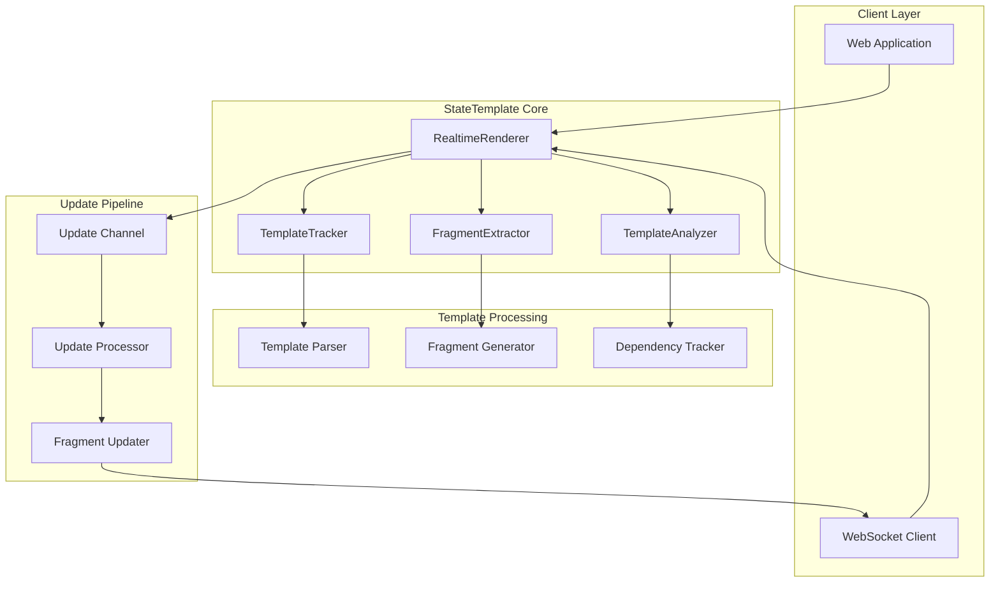
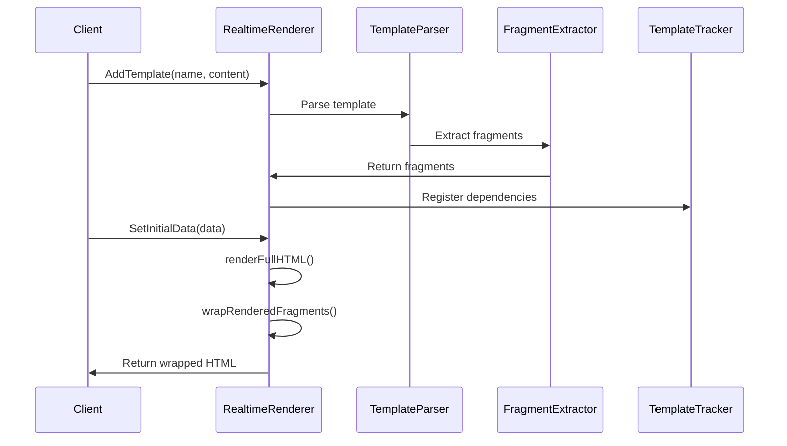
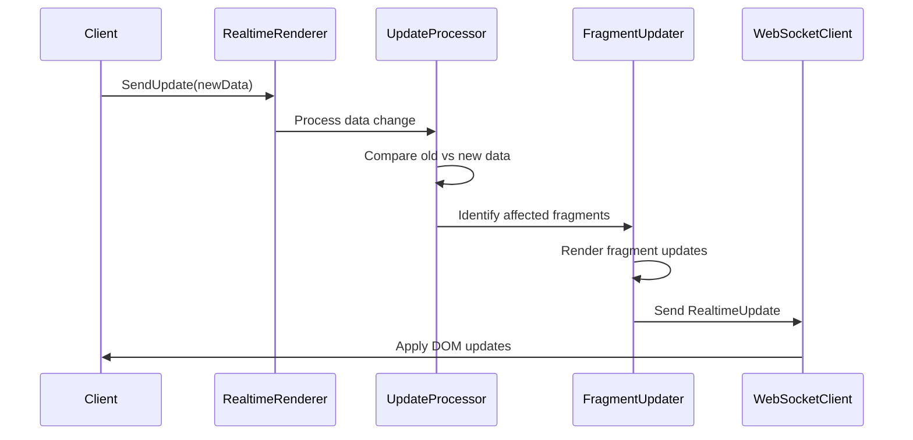
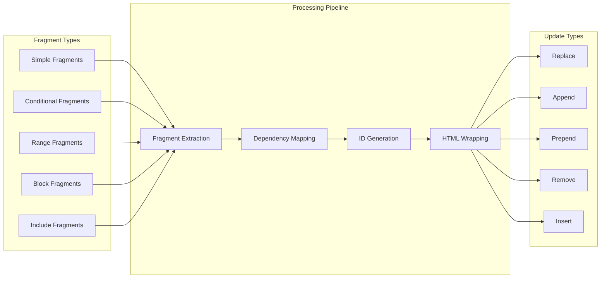
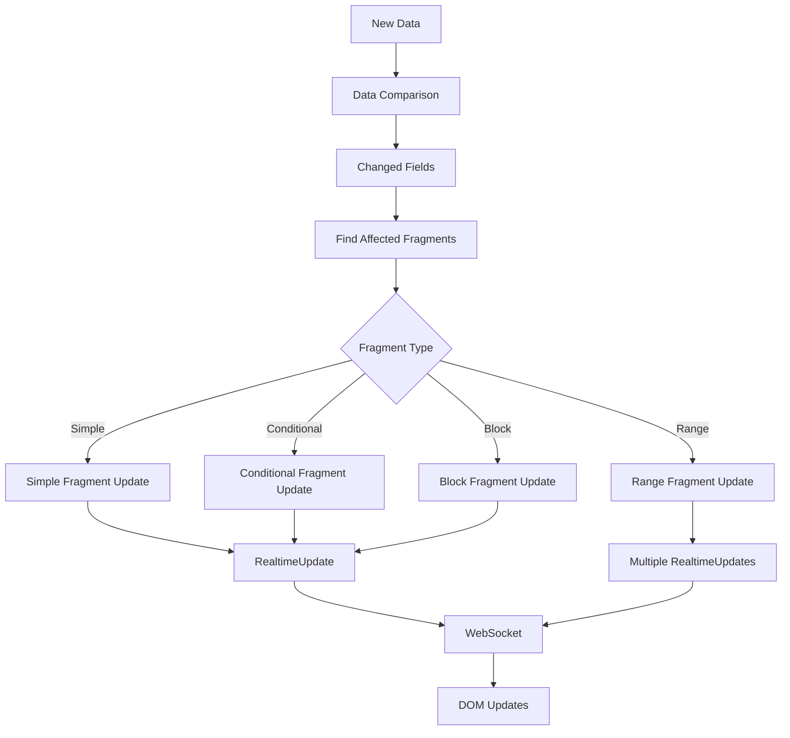
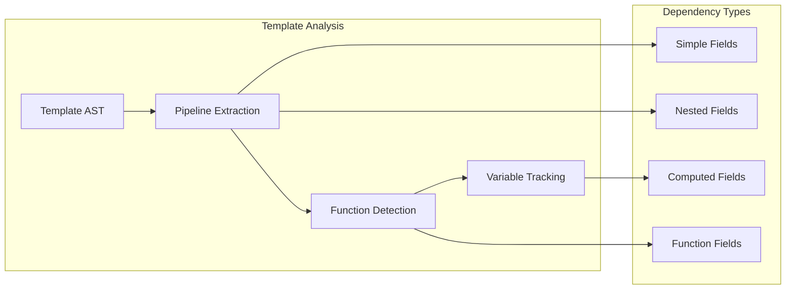

# StateTemplate Architecture

## Overview

StateTemplate is a real-time template rendering library for Go that enables granular, fragment-based updates for web applications. It extends Go's standard `html/template` package with advanced fragment extraction, dependency tracking, and real-time update capabilities.

## Core Architecture



## Core Components

### 1. RealtimeRenderer

**Location**: `realtime_renderer.go`
**Purpose**: Main orchestrator for real-time template rendering

**Key Responsibilities**:

- Template management and parsing
- Fragment creation and tracking
- Real-time update processing
- WebSocket-compatible output generation

```go
type RealtimeRenderer struct {
    templates       map[string]*template.Template
    fragmentTracker *FragmentExtractor
    tracker         *TemplateTracker
    currentData     interface{}
    updateChan      chan interface{}
    outputChan      chan RealtimeUpdate
    fragmentStore   map[string][]*TemplateFragment
    rangeFragments  map[string][]*RangeFragment
}
```

### 2. TemplateTracker

**Location**: `template_tracker.go`
**Purpose**: Tracks data dependencies and changes

**Key Features**:

- Deep field dependency analysis
- Change detection through reflection
- Dependency graph construction

### 3. FragmentExtractor

**Location**: `fragment_extractor.go`
**Purpose**: Extracts fragments from templates

**Fragment Types**:

- **Simple Fragments**: Single field outputs (`{{.Field}}`)
- **Conditional Fragments**: If/with blocks
- **Range Fragments**: Loop constructs with granular item tracking
- **Block Fragments**: Named template blocks

### 4. TemplateAnalyzer

**Location**: `template_analyzer.go`
**Purpose**: Advanced template analysis and optimization

## Data Flow Architecture

### Initial Rendering Flow



### Real-time Update Flow



## Fragment Architecture

### Fragment Types and Processing



### Range Fragment Architecture

Range fragments enable granular list operations:

```go
type RangeFragment struct {
    *TemplateFragment
    RangePath    string                // "Navigation.MainItems"
    ItemTemplate string                // Template for individual items
    Items        map[string]*RangeItem // Current items by key
    ContainerID  string                // Container element ID
}

type RangeItem struct {
    ID    string      // Unique fragment ID
    Index int         // Array position
    Key   string      // Unique key (URL, ID field)
    Data  interface{} // Item data
    HTML  string      // Rendered HTML
}
```

## Update System Architecture

### Update Processing Pipeline



### RealtimeUpdate Structure

```go
type RealtimeUpdate struct {
    FragmentID  string `json:"fragment_id"`
    HTML        string `json:"html"`
    Action      string `json:"action"` // replace, append, remove, etc.
    ItemIndex   int    `json:"item_index,omitempty"`
    ContainerID string `json:"container_id,omitempty"`
}
```

## Template Analysis Engine

### Dependency Detection



### Advanced Features

1. **Block Fragment Detection**: Identifies named template blocks
2. **Conditional Logic Analysis**: Tracks if/with/range dependencies
3. **Function Call Analysis**: Detects template functions (eq, gt, len, etc.)
4. **Variable Scope Tracking**: Handles template variable assignments
5. **Cross-Template Dependencies**: Tracks template inclusions

## File Structure

```text
statetemplate/
├── realtime_renderer.go     # Main renderer orchestrator
├── template_tracker.go      # Data change tracking
├── fragment_extractor.go    # Fragment extraction logic
├── template_analyzer.go     # Advanced template analysis
├── examples/                # Usage examples and demos
│   ├── simple/             # Basic usage examples
│   ├── realtime/           # Real-time update examples
│   ├── fragments/          # Fragment-specific examples
│   ├── range-demo/         # Range fragment demonstrations
│   └── e2e/               # End-to-end tests
└── scripts/                # Build and validation scripts
```

## Technical Debt Analysis

### High Priority Issues

1. **Fragment ID Generation**

   - **Issue**: Current ID generation is timestamp-based, may not be deterministic
   - **Impact**: Difficult to test, potential conflicts in high-concurrency scenarios
   - **Recommendation**: Implement content-based hashing for deterministic IDs

2. **Complex Fragment Detection Logic**

   - **Issue**: Multiple overlapping approaches for fragment detection
   - **Location**: `realtime_renderer.go:createSimpleFragments()`
   - **Impact**: Hard to maintain, potential for inconsistent behavior
   - **Recommendation**: Consolidate into unified fragment detection strategy

3. **Memory Management**

   - **Issue**: Fragment store and range fragments not cleaned up
   - **Impact**: Memory leaks in long-running applications
   - **Recommendation**: Implement fragment cleanup and lifecycle management

4. **Error Handling**
   - **Issue**: Inconsistent error handling across components
   - **Impact**: Hard to debug, potential for silent failures
   - **Recommendation**: Standardize error handling with structured logging

### Medium Priority Issues

1. **Concurrency Safety**

   - **Issue**: Some operations may not be fully thread-safe
   - **Location**: Fragment updates and template parsing
   - **Recommendation**: Comprehensive concurrency audit and mutex improvements

2. **Template Parsing Performance**

   - **Issue**: Templates re-parsed on each addition
   - **Impact**: Performance degradation with many templates
   - **Recommendation**: Implement template caching and parsing optimization

3. **Dependency Resolution Complexity**
   - **Issue**: Complex nested dependency resolution logic
   - **Location**: `template_analyzer.go`
   - **Recommendation**: Simplify with clearer algorithms and better testing

### Low Priority Issues

1. **Code Duplication**

   - **Issue**: Similar patterns repeated across fragment types
   - **Recommendation**: Extract common patterns into shared utilities

2. **Configuration Management**
   - **Issue**: Limited configuration options for advanced use cases
   - **Recommendation**: Expand configuration system for customization

## Test Coverage Gaps

### Critical Coverage Gaps

1. **Concurrency Testing**
   - **Missing**: Multi-threaded access to RealtimeRenderer
   - **Required**: Race condition detection, concurrent update handling
2. **Error Scenarios**

   - **Missing**: Malformed template handling, invalid data structures
   - **Required**: Comprehensive error path testing

3. **Performance Testing**

   - **Missing**: Large dataset handling, memory usage patterns
   - **Required**: Benchmark tests for scalability validation

4. **Fragment Edge Cases**
   - **Missing**: Deeply nested structures, circular references
   - **Required**: Complex data structure handling tests

### Moderate Coverage Gaps

1. **Cross-Template Dependencies**

   - **Missing**: Template inclusion and inheritance scenarios
   - **Required**: Template composition testing

2. **Range Fragment Operations**

   - **Missing**: Complex list operations (reordering, batch updates)
   - **Required**: Comprehensive range operation testing

3. **WebSocket Integration**
   - **Missing**: End-to-end WebSocket communication testing
   - **Required**: Integration tests with actual WebSocket clients

### Current Test Coverage

- **Template Actions**: ✅ Comprehensive (12 test suites, 50+ scenarios)
- **Fragment Extraction**: ✅ Good coverage
- **Real-time Updates**: ✅ Basic scenarios covered
- **Integration**: ✅ Core functionality tested
- **Performance**: ❌ No benchmarks
- **Concurrency**: ❌ Limited testing
- **Error Handling**: ❌ Insufficient coverage

## Performance Characteristics

### Scalability Considerations

1. **Fragment Count**: Performance degrades with >1000 fragments per template
2. **Update Frequency**: Optimized for <100 updates/second per renderer
3. **Data Size**: Efficient with objects <10MB, memory usage scales linearly
4. **Template Complexity**: Nested depth >5 levels may impact performance

### Optimization Opportunities

1. **Fragment Caching**: Cache rendered fragments to avoid re-computation
2. **Batch Updates**: Group multiple updates into single WebSocket message
3. **Differential Rendering**: Only render changed portions of fragments
4. **Memory Pooling**: Reuse buffers and data structures

## Security Considerations

### Template Security

- **HTML Escaping**: Relies on Go's template auto-escaping
- **XSS Prevention**: Automatic escaping prevents most XSS attacks
- **Template Injection**: Limited by Go template sandbox

### WebSocket Security

- **Authentication**: No built-in authentication (application responsibility)
- **Rate Limiting**: No built-in rate limiting for updates
- **Data Validation**: Minimal input validation on updates

## Future Architecture Enhancements

### Planned Go Library Improvements

1. **Plugin System**: Allow custom fragment processors
2. **Template Inheritance**: Support for template hierarchies
3. **Caching Layer**: Redis/Memcached integration for fragment caching
4. **Monitoring**: Built-in metrics and observability
5. **Template Validation**: Static analysis and validation tools

### Experimental Features

1. **Server-Sent Events**: Alternative to WebSocket for updates
2. **GraphQL Integration**: Fragment-based GraphQL subscriptions
3. **Template Compilation**: Compile templates to native Go code
4. **Performance Profiling**: Advanced template rendering profiling

## Conclusion

StateTemplate provides a solid foundation for real-time web applications with its fragment-based architecture. The main strengths are its granular update capabilities and comprehensive template action support. Key areas for improvement include error handling, performance optimization, and test coverage expansion.

The architecture is designed for extensibility and can accommodate future enhancements while maintaining backward compatibility.
