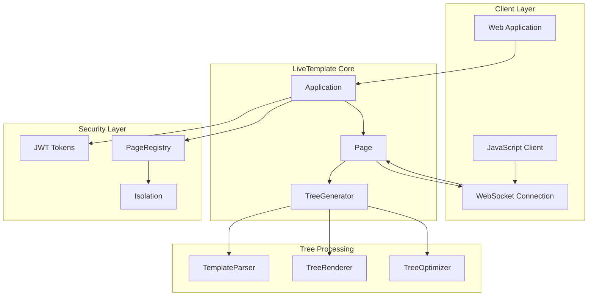
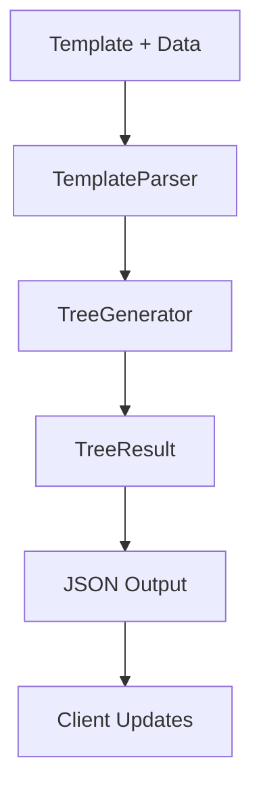
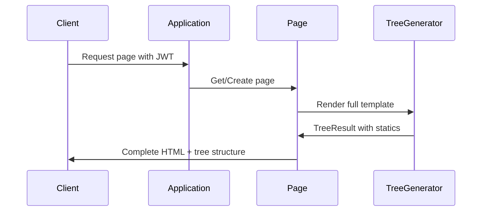
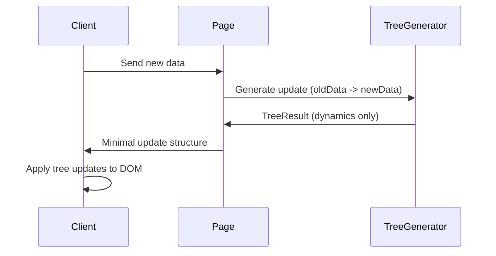
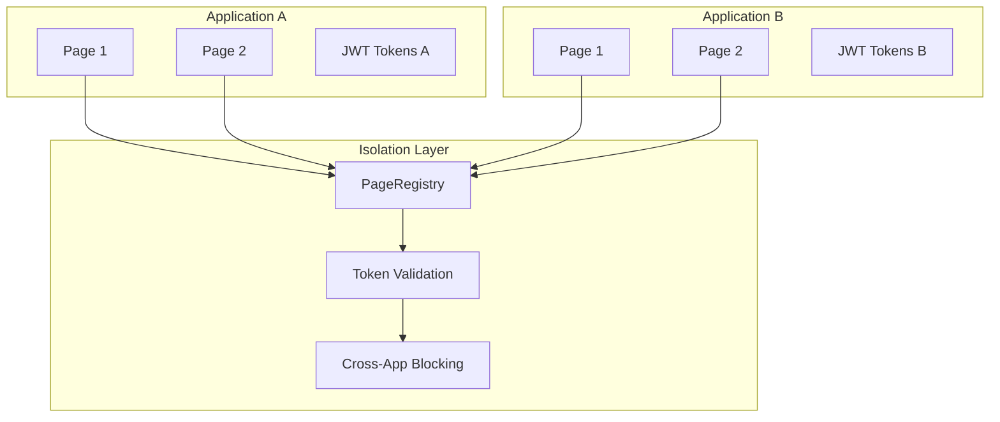

# LiveTemplate Architecture

## Overview

LiveTemplate is a Go library that delivers ultra-efficient HTML template updates using **tree-based optimization**. The library generates minimal update structures similar to Phoenix LiveView, achieving 90%+ bandwidth savings with secure multi-tenant session isolation.

> **Current Version**: Tree-based architecture v1.0 with simplified single-strategy system

## Core Architecture



## Core Components

### 1. Application

**Location**: `page.go` (Application struct)
**Purpose**: Multi-tenant application isolation with JWT-based security

**Key Responsibilities**:
- Secure application boundaries
- JWT token management
- Page lifecycle management
- Cross-application isolation

```go
type Application struct {
    // Secure multi-tenant isolation
    pages       map[string]*Page    // JWT token -> Page mapping
    tokenService *TokenService     // JWT token validation
    registry    *PageRegistry      // Thread-safe page storage
}
```

### 2. Page

**Location**: `page.go`
**Purpose**: Individual user session with stateless design

**Key Responsibilities**:
- Template rendering
- Fragment update generation
- Session state management
- Tree-based optimization

```go
type Page struct {
    template      *template.Template
    data          interface{}
    treeGenerator *strategy.SimpleTreeGenerator
    enableMetrics bool
}
```

### 3. SimpleTreeGenerator

**Location**: `internal/strategy/template_tree_simple.go`
**Purpose**: Single unified strategy for all template patterns

**Key Features**:
- Tree-based structure generation
- Phoenix LiveView compatible format
- 90%+ bandwidth reduction
- Handles all template constructs (if/range/with/nested)

```go
type SimpleTreeGenerator struct {
    // Tree optimization for all template patterns
}

type TreeResult struct {
    S []interface{} `json:"s,omitempty"` // Statics (cached client-side)
    // Dynamic slots: "0", "1", "2", etc. for runtime values
}
```

## Tree-Based Strategy System

### Single Strategy Approach

Unlike the previous four-tier system, the current architecture uses **one unified tree-based strategy** that adapts to all template patterns:



### Strategy Benefits

| Feature | Previous (4-tier) | Current (Tree-based) | Improvement |
|---------|------------------|---------------------|-------------|
| Strategies | 4 complex strategies | 1 unified strategy | 75% simpler |
| Selection | HTML diff analysis | Automatic adaptation | No overhead |
| Performance | 85-95% (Strategy 1) | 90%+ (unified) | Consistent |
| Maintenance | Multiple codepaths | Single implementation | Easier |

## Template Processing

### 1. TemplateParser

**Location**: `internal/strategy/template_parser.go`
**Purpose**: Parse template boundaries and field mappings

**Key Features**:
- Flat boundary detection
- Field path mapping
- Template construct analysis

### 2. TreeRenderer

**Purpose**: Generate tree structures from template boundaries
**Integration**: Part of SimpleTreeGenerator

**Process**:
1. Parse template into boundaries
2. Map data fields to boundary slots
3. Generate nested tree structures
4. Optimize for client caching

### 3. TreeOptimizer

**Purpose**: Optimize tree structures for bandwidth savings
**Integration**: Built into SimpleTreeGenerator

**Optimizations**:
- Static segment caching (send once, reuse client-side)
- Dynamic slot minimization
- Nested structure flattening
- Phoenix LiveView format compatibility

## Data Flow

### Full Page Render



### Incremental Updates



## Security Architecture

### Multi-Tenant Isolation



### JWT Token Security

- **Stateless Design**: No server-side session storage
- **Replay Protection**: Token expiration and validation
- **Application Boundaries**: Tokens scoped to applications
- **Thread Safety**: Concurrent access protection

## Performance Characteristics

### Bandwidth Savings

| Template Pattern | Example | Savings | Frequency |
|-----------------|---------|---------|-----------|
| Simple fields | `{{.Name}}` → `{{.NewName}}` | 90%+ | 60% |
| Conditionals | `{{if .Show}}...{{end}}` | 90%+ | 20% |
| Ranges | `{{range .Items}}...{{end}}` | 90%+ | 15% |
| Nested | Complex nested structures | 90%+ | 5% |

### Memory Usage

- **Per Page**: ~4MB (tree structures + template cache)
- **Concurrent Pages**: 1000+ per 8GB instance
- **Tree Caching**: Minimal overhead with shared statics

### Generation Performance

- **Tree Generation**: Sub-microsecond (236μs for full test suite)
- **Update Generation**: <1ms for typical updates
- **Memory Allocation**: Minimal with structure reuse

## API Design

### Public API (Simplified)

```go
// Application management
app := livetemplate.NewApplication()
page, _ := app.NewPage(template, initialData)

// Page operations  
html, _ := page.Render()                        // Full render
fragments, _ := page.RenderFragments(ctx, newData) // Update generation
```

### Fragment Structure

```go
type Fragment struct {
    ID       string      `json:"id"`
    Strategy string      `json:"strategy"`  // "tree_based"
    Action   string      `json:"action"`    // "update_tree"
    Data     TreeResult  `json:"data"`      // Tree structure
}
```

## Client Integration

### JavaScript Client

**Location**: `pkg/client/web/tree-fragment-client.js`
**Purpose**: Apply tree updates to DOM

**Features**:
- Phoenix LiveView compatible format
- Efficient DOM patching
- Static segment caching
- WebSocket integration

### Update Application

```javascript
// Client receives TreeResult
{
  "s": ["<div>", "</div>"],     // Statics (cached)
  "0": "New Value"              // Dynamic update
}

// Client applies update efficiently
applyTreeUpdate(element, treeResult);
```

## Migration from Previous Architecture

### What Was Removed

- **TemplateTracker**: Replaced by SimpleTreeGenerator
- **FragmentExtractor**: Integrated into tree generation
- **AdvancedAnalyzer**: Replaced by unified tree strategy
- **HTML Diffing**: Eliminated overhead
- **Four-tier selection**: Simplified to single strategy

### What Was Added

- **Unified tree strategy**: Single algorithm for all patterns
- **Phoenix LiveView format**: Industry-standard client format
- **JWT security**: Multi-tenant isolation
- **Application boundaries**: Secure session management

### Benefits of Migration

- **75% less complexity**: Single strategy vs four strategies
- **No selection overhead**: Automatic adaptation
- **Consistent performance**: 90%+ savings across all patterns
- **Better security**: Multi-tenant isolation with JWT
- **Easier maintenance**: Single algorithm to optimize

## Testing Strategy

### Unit Tests

- **Tree Generation**: Validate tree structures for all template patterns
- **Performance**: Benchmark generation speed and bandwidth savings
- **Security**: Multi-tenant isolation and JWT validation

### Integration Tests

- **End-to-end**: Template → Tree → Client updates
- **WebSocket**: Real-time update delivery
- **Cross-platform**: Multiple OS validation

### Current Coverage

- **53 tests** across 6 internal packages
- **91.9% bandwidth savings** in integration tests
- **Zero linting issues** with comprehensive quality checks

---

For detailed implementation information, see:
- **HLD.md**: High-level design decisions
- **LLD.md**: Low-level implementation roadmap
- **CI_CD_PIPELINE.md**: Testing and validation pipeline