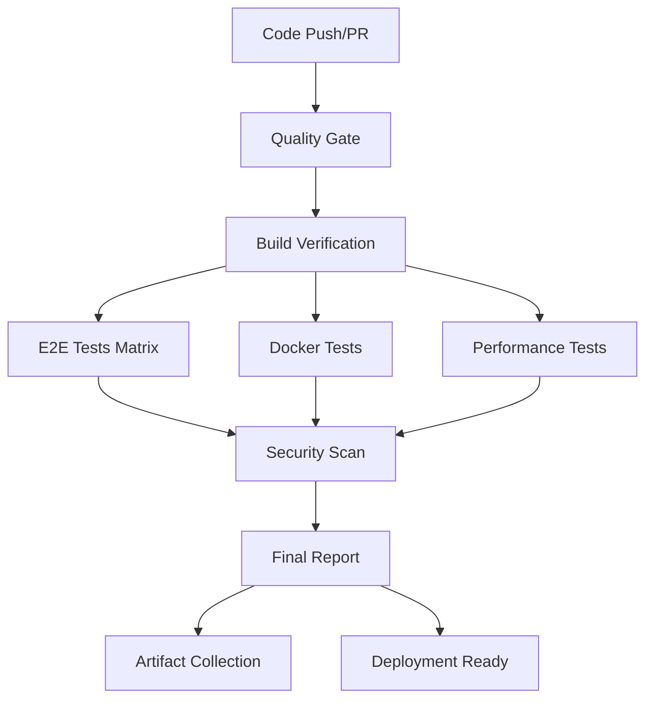

# LiveTemplate CI/CD Pipeline Documentation

## Overview

LiveTemplate features a comprehensive CI/CD pipeline that integrates traditional Go testing with advanced E2E browser automation, performance monitoring, and intelligent artifact collection. The pipeline is designed for reliability, observability, and developer productivity.

## Architecture

### Pipeline Stages



### Key Components

1. **Quality Gate**: Standard Go testing, formatting, linting
2. **E2E Test Matrix**: Cross-platform browser automation
3. **Performance Monitoring**: Real-time metrics and trend analysis  
4. **Artifact Collection**: Screenshots, logs, reports, metrics
5. **Flakiness Detection**: Automatic retry with intelligence
6. **Comprehensive Reporting**: Markdown reports with analytics

## GitHub Actions Workflows

### Main E2E Workflow (`.github/workflows/e2e-tests.yml`)

Comprehensive E2E testing workflow with the following jobs:

- **unit-tests**: Standard Go validation using existing `validate-ci.sh`
- **e2e-chrome**: Matrix-based E2E tests across multiple test groups
- **test-report**: Aggregated reporting and analytics

#### Test Groups

| Group | Description | Required | Timeout |
|-------|-------------|----------|---------|
| `infrastructure` | Browser setup and basic functionality | ✅ | 10m |
| `browser-lifecycle` | Full DOM manipulation and fragments | ✅ | 15m |
| `performance` | Benchmarks and timing validation | ❌ | 20m |
| `error-scenarios` | Error handling and edge cases | ❌ | 15m |
| `concurrent-users` | Multi-user simulation | ❌ | 25m |
| `cross-browser` | Browser compatibility | ❌ | 20m |

### Comprehensive CI Workflow (`.github/workflows/ci-comprehensive.yml`)

Full production pipeline with additional features:

- **Cross-platform builds** (Ubuntu, macOS, Windows)
- **Docker-based testing** with Selenium
- **Security scanning** with Gosec and Nancy
- **Performance benchmarking**
- **Multi-browser testing**

## Local Development

### Quick Start

```bash
# Run integrated CI pipeline locally
./scripts/integrated-ci.sh

# Run specific E2E test group
./scripts/run-e2e-tests.sh browser-lifecycle

# Run with custom Chrome binary
CHROME_BIN=/path/to/chrome ./scripts/run-e2e-tests.sh

# Enable screenshots and verbose output
LIVETEMPLATE_E2E_SCREENSHOTS=true ./scripts/run-e2e-tests.sh --verbose
```

### Scripts Overview

| Script | Purpose | Usage |
|--------|---------|-------|
| `validate-ci.sh` | Original Go testing pipeline | `./scripts/validate-ci.sh` |
| `run-e2e-tests.sh` | Enhanced E2E test runner | `./scripts/run-e2e-tests.sh [group]` |
| `integrated-ci.sh` | Combined pipeline | `./scripts/integrated-ci.sh` |

## Configuration

### E2E Configuration (`.github/e2e-config.yml`)

Centralized configuration for all E2E testing behavior:

```yaml
# Test execution settings
execution:
  timeout_minutes: 30
  retry_attempts: 3
  parallel_execution: true

# Browser configuration  
browsers:
  default: chrome
  chrome:
    flags:
      - --no-sandbox
      - --disable-gpu
      - --headless

# Screenshot configuration
screenshots:
  enabled: true
  quality: 90
  max_per_test: 10
```

### Environment Variables

| Variable | Description | Default |
|----------|-------------|---------|
| `CHROME_BIN` | Path to Chrome binary | Auto-detected |
| `LIVETEMPLATE_E2E_SCREENSHOTS` | Enable screenshot capture | `false` |
| `LIVETEMPLATE_E2E_ARTIFACTS` | Artifacts directory | `./test-artifacts` |
| `E2E_RETRY_ATTEMPTS` | Number of retry attempts | `3` |
| `E2E_TIMEOUT` | Test timeout | `10m` |

## Testing Features

### Screenshot Capture

Automatic screenshot capture on test failures and key test milestones:

- **Failure Screenshots**: Captured automatically on any test failure
- **Success Screenshots**: Optional capture of successful test states  
- **Custom Screenshots**: Programmatic capture during test execution

```go
// In test code
helper := NewE2ETestHelper("my-test")
helper.CaptureScreenshot(ctx, "checkpoint-1")
helper.CaptureFailureScreenshot(ctx, t, "validation failed")
```

### Performance Metrics

Real-time collection of detailed performance metrics:

```json
{
  "test_name": "browser-lifecycle",
  "duration": "15.3s",
  "fragment_metrics": [
    {
      "fragment_id": "header",
      "strategy": "static_dynamic",
      "generation_time": "2.3ms",
      "compression_ratio": 0.75
    }
  ],
  "browser_actions": [
    {
      "action": "navigate",
      "duration": "1.2s",
      "success": true
    }
  ]
}
```

### Flakiness Detection

Intelligent detection and handling of flaky tests:

- **Automatic Retry**: Failed tests retry up to 3 times with exponential backoff
- **Flakiness Reporting**: Tests requiring retries are flagged as potentially flaky
- **Trend Analysis**: Historical data tracks test stability over time
- **Retry Intelligence**: Different retry strategies for different failure types

### Artifact Collection

Comprehensive artifact preservation for debugging:

```
test-artifacts/
├── test-results-*.json     # Detailed test results
├── performance-metrics.json # Performance data
├── flakiness-report.json   # Flaky test analysis
├── ci-validation-metrics.json # Original CI results
└── test-report.md          # Human-readable summary

screenshots/
├── success-*.png           # Successful test states
├── failure-*.png           # Failure screenshots
└── checkpoint-*.png        # Custom test checkpoints
```

## Advanced Features

### Test Helper Integration

Enhanced test helper for CI/CD integration:

```go
func TestMyE2EFeature(t *testing.T) {
    E2ETestWithHelper(t, "my-feature", func(helper *E2ETestHelper) error {
        // Test implementation with automatic:
        // - Screenshot capture on failures
        // - Performance metric collection
        // - Retry logic with backoff
        // - Artifact preservation
        
        ctx, cancel := helper.CreateBrowserContext()
        defer cancel()
        
        // Your test logic here
        return nil
    })
}
```

### Parallel Test Execution

Tests run in parallel across multiple dimensions:

- **Test Groups**: Different test categories run simultaneously
- **Browser Matrix**: Multiple browsers tested in parallel
- **Platform Matrix**: Cross-platform execution
- **Strategy Matrix**: Different test strategies

### Integration with Existing Pipeline

Seamless integration with existing Go toolchain:

```bash
# The integrated pipeline automatically runs:
1. go test ./...           # Unit tests
2. go fmt ./...           # Code formatting
3. go vet ./...           # Static analysis  
4. golangci-lint run      # Advanced linting
5. Enhanced E2E tests     # Browser automation
6. Performance benchmarks # Timing validation
7. Artifact collection    # Debug preservation
```

## Monitoring and Analytics

### Performance Trending

Historical performance data collection for:

- Page load times
- Fragment generation performance
- Memory usage patterns
- Cache hit ratios
- Browser action timing

### Test Reliability Metrics

- Success/failure rates by test group
- Flakiness trends over time
- Retry pattern analysis
- Performance regression detection

### Reporting

Comprehensive reporting at multiple levels:

1. **Individual Test Reports**: Detailed test execution data
2. **Group Reports**: Test group summaries with metrics
3. **Pipeline Reports**: Overall pipeline health and trends
4. **PR Comments**: Automated feedback on pull requests

## Best Practices

### Writing E2E Tests

1. **Use Test Helpers**: Leverage `E2ETestWithHelper` for automatic features
2. **Capture Context**: Use meaningful screenshot names and custom metrics
3. **Handle Retries**: Design tests to be idempotent and retry-safe
4. **Performance Aware**: Set realistic timeouts and performance expectations

### CI/CD Configuration

1. **Environment-Specific Settings**: Use different configs for local/CI/PR
2. **Resource Management**: Configure appropriate timeouts and parallelism
3. **Artifact Strategy**: Balance debugging needs with storage costs
4. **Security**: Avoid exposing sensitive data in logs/screenshots

### Debugging Failed Tests

1. **Check Screenshots**: Visual debugging of test failures
2. **Review Performance Metrics**: Identify timing-related issues
3. **Analyze Retry Patterns**: Detect systematic vs random failures
4. **Cross-Reference Logs**: Correlate browser and application logs

## Troubleshooting

### Common Issues

| Issue | Symptoms | Solution |
|-------|----------|----------|
| Chrome not found | Tests fail with browser errors | Set `CHROME_BIN` environment variable |
| Screenshots missing | No failure screenshots captured | Enable `LIVETEMPLATE_E2E_SCREENSHOTS=true` |
| Tests timeout | Tests hang or timeout | Increase test timeout or check browser setup |
| Flaky tests | Intermittent failures | Review retry logic and test isolation |

### Debug Commands

```bash
# Check Chrome installation
google-chrome --version

# Verify test environment
./scripts/integrated-ci.sh --help

# Run single test with full debugging
LIVETEMPLATE_E2E_SCREENSHOTS=true \
LIVETEMPLATE_E2E_ARTIFACTS=./debug \
./scripts/run-e2e-tests.sh infrastructure

# View detailed test results
cat test-artifacts/test-report.md
```

## Future Enhancements

### Planned Features

1. **WebSocket Testing**: Real-time update validation
2. **Mobile Testing**: Mobile browser automation  
3. **Visual Regression**: Automated screenshot comparison
4. **Load Testing Integration**: High-concurrency test scenarios
5. **AI-Powered Analysis**: Intelligent failure categorization

### Integration Opportunities

1. **External Services**: Integration with monitoring services
2. **Notification Systems**: Slack/Teams integration for failures
3. **Deployment Gates**: Automatic deployment based on test results
4. **Performance Budgets**: Automated performance threshold enforcement

---

For questions or issues with the CI/CD pipeline, please check the troubleshooting section or open an issue in the repository.