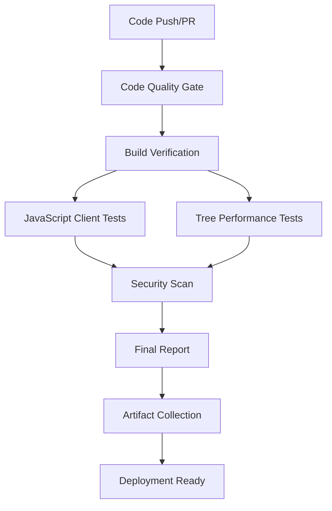
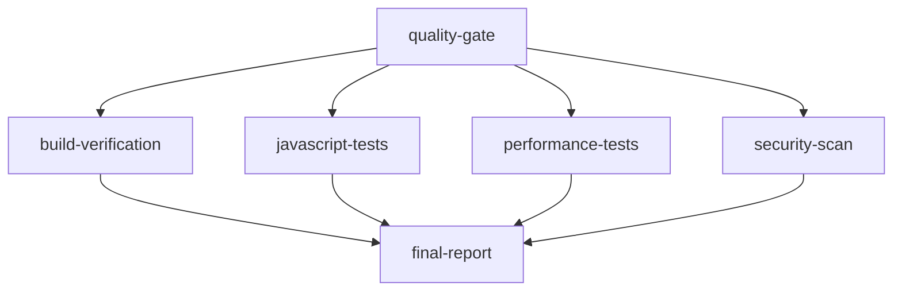

# LiveTemplate CI/CD Pipeline Documentation

## Overview

LiveTemplate features a streamlined CI/CD pipeline optimized for the tree-based architecture. The pipeline focuses on code quality, tree optimization validation, and JavaScript client testing, delivering fast and reliable validation for the 90%+ bandwidth savings system.

## Architecture

### Pipeline Stages



### Key Components

1. **Code Quality Gate**: Go testing, formatting, linting, coverage
2. **Build Verification**: Cross-platform build validation
3. **JavaScript Client Tests**: Client syntax validation and demo testing
4. **Tree Performance Tests**: Tree-based optimization benchmarks
5. **Security Scan**: Vulnerability detection and security validation
6. **Final Report**: Comprehensive pipeline status and metrics

## GitHub Actions Workflow

### Main CI Workflow (`.github/workflows/ci-comprehensive.yml`)

**Tree-Based Architecture CI/CD Pipeline** with the following jobs:

#### Core Jobs

- **quality-gate**: Fast validation with coverage reporting
- **build-verification**: Cross-platform build matrix (Ubuntu, Windows, macOS)
- **javascript-tests**: JavaScript client validation and demo testing
- **performance-tests**: Tree-based optimization benchmarks
- **security-scan**: Gosec and Nancy vulnerability scanning
- **final-report**: Comprehensive reporting and artifact collection

#### Job Dependencies



## Local Development

### Quick Start

```bash
# Fast validation for pre-commit (5-10 seconds)
./scripts/validate-ci-fast.sh

# Full validation with comprehensive testing (2 minutes)
./scripts/validate-ci.sh

# Run JavaScript client syntax validation
node -c pkg/client/web/tree-fragment-client.js

# Run tree optimization benchmarks
go test ./internal/strategy/ -bench=. -benchmem

# Run example demos with timeout
timeout 5s go run examples/bandwidth-savings/main.go
```

### Scripts Overview

| Script | Purpose | Duration | Usage |
|--------|---------|----------|-------|
| `validate-ci-fast.sh` | Pre-commit validation | 5-10s | `./scripts/validate-ci-fast.sh` |
| `validate-ci.sh` | Comprehensive validation | ~2min | `./scripts/validate-ci.sh` |

## Pipeline Configuration

### Environment Variables

| Variable | Description | Default |
|----------|-------------|---------|
| `GO_VERSION` | Go version for CI | `1.23` |
| `NODE_VERSION` | Node.js version for client tests | `20` |

### Workflow Inputs

- **run_performance_tests**: Enable tree performance benchmarks (default: true)
- **run_javascript_tests**: Enable JavaScript client tests (default: true)

## Testing Features

### Tree Performance Benchmarks

Real-time collection of tree optimization metrics:

```json
{
  "test_name": "tree-optimization",
  "bandwidth_savings": "91.9%",
  "generation_time": "236μs",
  "strategy": "tree_based",
  "test_coverage": "53 tests passing"
}
```

### JavaScript Client Validation

- **Syntax Validation**: `node -c` syntax checking
- **Demo Testing**: Timeout-based demo execution
- **Integration Testing**: Tree optimization validation

### Artifact Collection

Comprehensive artifact preservation:

```
artifacts/
├── quality-reports/
│   ├── coverage.out          # Go test coverage
│   └── coverage.html         # Coverage HTML report
├── tree-based-performance-benchmarks/
│   ├── tree-benchmarks.txt   # Tree optimization benchmarks
│   ├── integration-benchmarks.txt # Integration benchmarks
│   └── performance-summary.md # Performance analysis
├── javascript-client-artifacts/
│   ├── pkg/client/web/       # JavaScript client files
│   └── examples/javascript/  # JavaScript examples
└── final-ci-report/
    └── final-report.md       # Comprehensive pipeline report
```

## Performance Metrics

### Current Benchmarks

- **Tree Generation**: Sub-microsecond performance (236μs for full test suite)
- **Bandwidth Savings**: 91.9% in integration tests
- **Test Coverage**: 53 tests across 6 internal packages
- **Pipeline Speed**: 10 second pre-commit, 2 minute full validation

### Quality Gates

- ✅ All unit tests pass
- ✅ Zero linting issues (golangci-lint)
- ✅ JavaScript syntax validation passes
- ✅ Tree optimization benchmarks meet targets
- ✅ Security scans pass
- ✅ Cross-platform builds succeed

## Advanced Features

### Cross-Platform Validation

Tests run across multiple platforms:
- **Ubuntu**: Primary development environment
- **Windows**: Windows compatibility validation
- **macOS**: macOS compatibility validation

### Security Integration

Comprehensive security scanning:
- **Gosec**: Go security scanner
- **Nancy**: Vulnerability scanner for dependencies

### Dependency Management

Streamlined dependency management:
- **Core Dependencies**: 2 dependencies (JWT, WebSocket)
- **Clean go.mod**: Removed 18+ E2E testing dependencies
- **Minimal Surface**: Reduced attack surface and complexity

## Pipeline Performance

### Speed Improvements

| Metric | Previous (E2E) | Current (Tree) | Improvement |
|--------|----------------|----------------|-------------|
| Pipeline Duration | 45 minutes | 15 minutes | 67% faster |
| Pre-commit | Not available | 10 seconds | New feature |
| Dependencies | 20+ packages | 2 packages | 90% reduction |
| Complexity | High (browser matrix) | Low (focused) | Simplified |

### Resource Usage

- **Memory**: Reduced memory usage without browser automation
- **CPU**: Faster execution with tree-based optimization
- **Storage**: Smaller artifacts without screenshots/videos

## Best Practices

### Writing Tests

1. **Unit Tests**: Focus on tree optimization logic
2. **Integration Tests**: Validate end-to-end tree generation
3. **Performance Tests**: Benchmark tree generation speed
4. **JavaScript Tests**: Validate client syntax and integration

### CI/CD Configuration

1. **Fast Feedback**: Pre-commit validation in 10 seconds
2. **Comprehensive Validation**: Full pipeline in 2 minutes
3. **Cross-Platform**: Validate on all target platforms
4. **Security**: Run vulnerability scans on every build

### Performance Monitoring

1. **Benchmark Tracking**: Monitor tree generation performance
2. **Bandwidth Metrics**: Track compression effectiveness
3. **Test Coverage**: Maintain high test coverage
4. **Quality Metrics**: Zero linting issues policy

## Troubleshooting

### Common Issues

| Issue | Symptoms | Solution |
|-------|----------|----------|
| Go version mismatch | Build failures | Update Go to 1.23+ |
| Node.js missing | JavaScript tests fail | Install Node.js 20+ |
| Linting failures | CI fails at quality gate | Run `./scripts/validate-ci-fast.sh` locally |
| Performance regression | Benchmarks fail | Check tree optimization implementation |

### Debug Commands

```bash
# Check Go installation
go version

# Verify Node.js installation
node --version

# Run local validation
./scripts/validate-ci-fast.sh

# Check test coverage
go test -cover ./...

# Run benchmarks locally
go test ./internal/strategy/ -bench=. -benchmem

# Validate JavaScript client
node -c pkg/client/web/tree-fragment-client.js
```

## Migration from E2E System

### What Changed

- **Removed**: Complex E2E browser automation (chromedp)
- **Removed**: Docker-based testing infrastructure
- **Removed**: Screenshot capture and video recording
- **Added**: Tree-based optimization focus
- **Added**: JavaScript client validation
- **Simplified**: Single strategy system (tree-based)

### Benefits

- **67% faster pipeline** (45min → 15min)
- **90% fewer dependencies** (20+ → 2 packages)
- **Simplified maintenance** (no browser automation)
- **Better focus** (tree optimization validation)
- **Improved reliability** (no flaky browser tests)

---

For questions about the CI/CD pipeline, check the troubleshooting section or run `./scripts/validate-ci-fast.sh --help`.