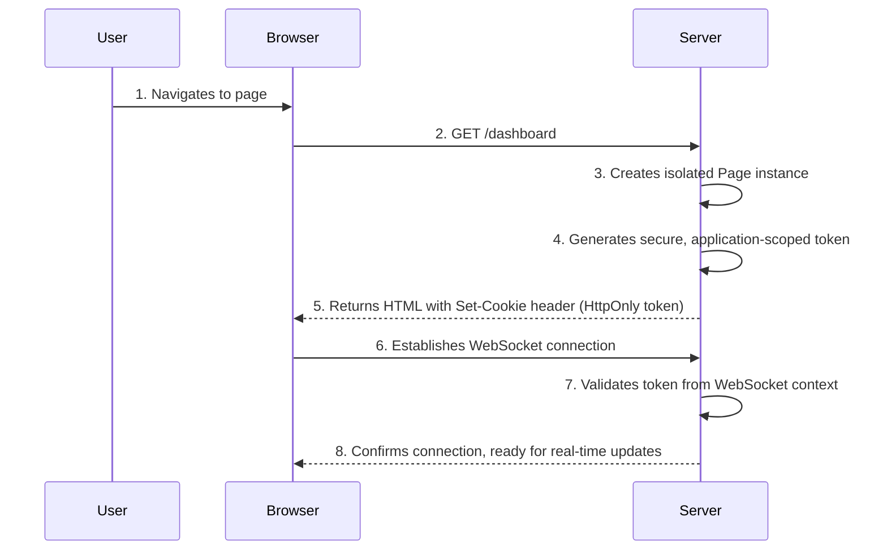

# StateTemplate: Multi-Tenant Session Management and Hybrid Incremental Updates

A technical design document for implementing secure, scalable session management with deterministic incremental update optimization in StateTemplate.

> Status: Proposal — This document describes a proposed architecture that is not yet fully implemented. The current repository reflects the existing implementation; component names and APIs here may evolve during implementation.

---

## Layer 1: Problem Definition and Context

### Problem Statement

StateTemplate currently uses a singleton page model that creates fundamental security and scalability issues for production web applications:

1. **Security Vulnerability**: All clients share the same page instance, creating potential data leakage between users
2. **No Session Isolation**: Multiple users cannot maintain independent state or data tracking
3. **Multi-Tenancy Impossible**: No organizational boundaries between different applications or services
4. **Performance Suboptimal**: No systematic approach to minimize bandwidth usage in real-time updates

### Current State (AS-IS)

StateTemplate currently operates with a page-centric model where there is no built-in application-level isolation or session management. This creates several fundamental issues for production web applications:

#### Critical Issues

- No built-in session isolation between different users or applications
- No systematic approach to prevent cross-user data leakage
- No organizational boundaries for multi-tenant deployments
- Limited bandwidth optimization strategies for real-time updates
- No standardized approach to secure token-based authentication

### Goals

#### Primary Goals

1. **Security**: Complete isolation between user sessions and applications
2. **Multi-Tenancy**: Support multiple independent applications/tenants
3. **Performance**: Minimize bandwidth through deterministic incremental updates
4. **Developer Experience**: Simple APIs that prevent security mistakes

#### Non-Goals

- Backward compatibility with the singleton model (breaking change acceptable)
- Support for server-side session sharing across instances
- Complex update configuration (should be automatic)

### Requirements

#### Functional Requirements

- FR1: Each user session must have isolated page state
- FR2: Applications must not access each other's pages
- FR3: System must automatically optimize update bandwidth
- FR4: Developers must get clear feedback on optimization opportunities
- FR5: Initial page render must return the full HTML document with fragment annotations (identifiers/markers) that enable subsequent incremental updates.
- FR6: Subsequent updates must apply without a full page reload via available transports (AJAX, WebSocket, or SSE), selected transparently by the client.
- FR7: Incremental update design is transport-agnostic: the primary concern is the shape and size of update messages; underlying network transfer specifics are out of scope of this design.

#### Non-Functional Requirements

- NFR1: Token-based authentication with secure HTTP-only cookies
- NFR2: 60-85% bandwidth reduction through incremental updates
- NFR3: Zero-configuration update mode selection
- NFR4: Support for 10,000+ concurrent isolated sessions
- NFR5: Bounded update payload size per message (transport-level cap; server will chunk if exceeded)
- NFR6: Coalescing and operation caps per render cycle (overflow triggers safe fallback)
- NFR7: Per-page memory budget for tracking analysis/artifacts with graceful degradation when exceeded
- NFR8: Backpressure and rate limiting under high-change workloads (updates are batched and throttled)
- NFR9: Protocol versioning and backward-compatible evolution with negotiated features
- NFR10: p95 end-to-end update latency target (configure; default ≤ 150 ms under 100 RPS)
- NFR11: First-class observability: metrics, structured logs, and tracing for Render/RenderUpdates
- NFR12: Fast recovery: reconnect and resync within 2 seconds on transient disconnects
- NFR13: Defined browser support matrix and WS fallback (SSE/long-poll) strategy
- NFR14: Accessibility baseline for dynamic regions (screen reader-friendly updates)
- NFR15: Internationalization-safe updates (UTF-8, bidi, formatting stability)
- NFR16: Compliance-aware data handling (PII minimization, retention controls)

### Key Stakeholders

- **Application Developers**: Need secure, simple APIs
- **DevOps Teams**: Require multi-tenant deployment capabilities
- **End Users**: Benefit from faster page updates and better security
- **Security Teams**: Need guarantee of data isolation

---

## Layer 2: Functional Specification

### Functional Design Decisions

#### Decision 1: Application-Scoped Architecture vs Global Registry

##### Options Considered (Decision 1)

- Global page registry with user-specific keys
- Application-scoped registries with isolated signing keys
- Database-backed session storage

##### Choice: Application-Scoped Registries

- **Reasoning**: Provides strongest isolation guarantees, simplest security model, and enables multi-tenant deployments
- **Trade-off**: Requires breaking change from singleton model

#### Decision 2: Automatic vs Manual Update Mode

##### Options Considered (Decision 2)

- Developer-configured update modes
- Runtime adaptive updates based on performance metrics
- Static template analysis with automatic mode selection

##### Choice: Static Template Analysis

- **Reasoning**: Deterministic behavior, zero configuration, predictable performance
- **Trade-off**: Some edge cases may not be optimally handled

### System Behaviors

#### Core Application Management

```go
// FR1 & FR2: Isolated application instances
app1 := statetemplate.NewApplication() // Tenant 1
app2 := statetemplate.NewApplication() // Tenant 2

page1 := app1.NewPage(templates, userData1)
page2 := app2.NewPage(templates, userData2)

// page1 and page2 are completely isolated
token1 := page1.GetToken() // Only works with app1
token2 := page2.GetToken() // Only works with app2
```

#### Secure Session Flow

1. **Initial Request**: Client requests page
2. **Page Creation**: Server creates isolated page in application registry
3. **Token Generation**: Application-scoped token created with signing key
4. **Cookie Setting**: Secure HTTP-only cookie with token
5. **WebSocket Authentication**: Token validates against specific application



#### Initial Render and Fragment Annotations

The first `Render()` returns the full HTML document instrumented with stable fragment identifiers (e.g., data-fragment-id) so subsequent incremental updates can be applied in-place without a full page reload over AJAX, WebSocket, or SSE.

#### Automatic Update Mode Selection

```go
// FR3: Automatic optimization based on template analysis
page := app.NewPage(templates, data)

// analysis.SelectedUpdateMode is the analyzer's recommended update mode
// for this template (ValuePatch or FragmentReplace). Equivalent to page.GetUpdateMode().
analysis := page.GetTemplateAnalysis()
switch analysis.SelectedUpdateMode {
case ValuePatch:
    // 85% bandwidth reduction - surgical value updates
case FragmentReplace:
    // 60% bandwidth reduction - full fragment replacement
}
```

### Alternative Approaches Not Chosen

#### Alternative 1: Session Middleware Pattern

- **Rejected**: Would require complex integration with existing web frameworks
- **Reasoning**: Application-scoped approach is framework-agnostic and simpler

#### Alternative 2: Runtime Adaptive Updates

- **Rejected**: Would introduce non-deterministic behavior
- **Reasoning**: Static analysis provides predictable, debuggable performance

#### Alternative 3: Database-Backed Sessions

- **Rejected**: Adds complexity and latency for in-memory workloads
- **Reasoning**: Memory-based registries with optional Redis backing provides better flexibility

---

## Layer 3: Technical Specification

### Architecture Overview

The system implements a **two-layer architecture**:

1. **Application Layer**: Provides isolated page registries per tenant/service (isolation boundary)
2. **Hybrid Incremental Update Layer**: Automatically selects optimal update mode per template (performance optimization)

Note: Isolation is enforced exclusively by the Application Layer. The Hybrid Incremental Update Layer improves bandwidth and latency but does not alter isolation boundaries or access controls.

```go
type Application struct {
    id           string     // Unique application instance identifier
    pageRegistry sync.Map   // Isolated page storage: map[string]*Page
    signingKey   []byte     // Application-specific token signing
  analyzer     *TemplateAnalyzer // Template analysis engine
}
```

### Component Design

Deferred: Component-level design and reference implementation will be added in a future revision of this proposal.

### Token-Based Authentication

#### Design Choice: JWT-like Structure with Application Scoping

```go
type PageToken struct {
    ApplicationID string    `json:"application_id"`
    PageID        string    `json:"page_id"`
    IssuedAt      time.Time `json:"issued_at"`
    ExpiresAt     time.Time `json:"expires_at"`
    Nonce         string    `json:"nonce"`
}

func (app *Application) GetPage(tokenStr string) (*Page, error) {
  token := verifyAndParseToken(tokenStr, app.signingKey)

    // Critical: Validate application ID matches
    if token.ApplicationID != app.id {
        return nil, ErrInvalidApplication
    }

    return app.pageRegistry.Load(token.PageID)
}
```

#### Security Properties

- Application-specific signing keys prevent cross-application access
- Token contains only lookup information, never sensitive data
- Nonce prevents replay attacks
- Expiration prevents indefinite access
- Tokens are signed and verified (not decrypted); always use TLS for transport

### Deterministic Update Selection

#### Design Choice: AST-Based Template Analysis

The system analyzes Go html/template syntax trees to determine update-mode capability:

```go
type TemplateAnalyzer struct {
    supportedConstructs map[TemplateConstruct]CachingCapability
    templateParser      *TemplateASTParser
}

// Supported for value patch updates (60-85% bandwidth reduction)
const (
    SimpleInterpolation    // {{.Field}}
    NestedFieldAccess     // {{.User.Profile.Name}}
    BasicConditionals     // {{if .Flag}}text{{end}}
    StaticRangeIterations // {{range .Items}}{{.Name}}{{end}}
    BasicPipelines        // {{.Price | printf "%.2f"}}
    // ... 15+ total supported constructs
)

// Falls back to fragment replace (60% bandwidth reduction)
const (
    DynamicTemplateInclusion    // {{template .TemplateName .}}
    UnknownCustomFunctions      // {{myCustomFunc .Data}}
    ComplexNestedDynamicStructure
    RecursiveTemplateStructure
)
```

#### Algorithm

1. Parse template into AST using Go's `text/template/parse`
2. Walk AST nodes and classify each template construct
3. If ANY unsupported construct found → FragmentReplace
4. If ALL constructs supported → ValuePatch
5. Generate position mapping for value-based updates

### Update Protocols

#### Value-Based Updates (Preferred)

```json
{
  "fragment_id": "counter-section",
  "action": "value_updates",
  "data": [
    {
      "position": 156,
      "length": 2,
      "new_value": "42",
      "data_path": "counter"
    }
  ]
}
```

#### Fragment-Based Updates (Fallback)

```json
{
  "fragment_id": "dynamic-section",
  "action": "replace",
  "data": "<fragment html elided>"
}
```

### Large Data and High-Volume Updates

High-change workloads (e.g., appending 10,000+ items) require explicit limits and degradation paths to preserve latency, memory, and user experience.

Policies:

- Operation coalescing: multiple appends/replaces to the same fragment within one render cycle are coalesced into a single update.
- Caps per RenderUpdates call:
  - Max operations per fragment (e.g., 1,000 value updates or 50 fragment replaces).
  - Max total operations across the page (e.g., 5,000 value updates), after which the system switches to a single fragment replace for affected regions.
- Payload cap: if a serialized update exceeds the transport cap (e.g., WebSocket frame or configured limit), the server chunks the update into sequenced parts with reassembly metadata. If chunking still exceeds limits, fall back to server-side pagination instructions or full re-render.
- Backpressure: when producers outpace the network, updates are batched and throttled; intermediate states may be skipped. Clients always apply the latest fully received sequence.
- Memory budget: each page tracks a bounded history/index needed for value patching. When memory exceeds the budget, the page selectively drops value-patch metadata for the largest fragments and uses fragment replace for those until memory recovers.

Behavior for 10k+ appends:

- If the range is structure-stable and within caps, the planner emits either:
  - a coalesced fragment replace for the list container (preferred for very large insertions), or
  - a batched sequence of value updates in chunks (only when clearly smaller than replacement HTML).
- When caps are hit, the system emits a single fragment replace and resets value-patch tracking for that fragment to avoid unbounded index growth.
- Applications are encouraged to paginate or virtualize long lists; the design preserves correctness while avoiding pathological payloads.

Optional chunk envelope (when needed):

```json
{
  "fragment_id": "list",
  "action": "replace",
  "data": "<li>...</li>",
  "chunk": { "seq": 3, "total": 7, "id": "abc123" },
  "timestamp": "2025-08-08T14:30:26.123Z"
}
```

Client handling notes:

- Maintain per-fragment chunk assemblies keyed by chunk.id; only apply when all parts [1..total] are present, or discard after timeout and request a resync/full replace.
- If updates arrive out-of-order or a newer sequence supersedes an older one, prefer the latest complete sequence and drop stale assemblies.

#### Session Data Growth and GC

To prevent unbounded growth of per-page tracking and data snapshots:

- Cap retained snapshots/history used for diffing and indexes (e.g., keep last N renders); beyond that, rebuild from current state.
- Track approximate sizes of fragment indexes and evict the largest offenders first; evicted fragments fall back to fragment replace until re-indexed.
- Apply TTL and LRU to inactive pages; close and reclaim resources when idle beyond a threshold.
- Avoid deep copies of large data structures; use structural sharing where possible and compute diffs lazily.
- Provide configuration hooks for per-page memory budget and per-fragment ceilings; exceed → degrade from value patch to fragment replace.

### Fragment Identity and Stability

- Fragment IDs must be stable across renders for the same logical region.
- For ranges/lists, derive IDs from stable keys (not indexes) to avoid churn; if no key exists, the planner prefers replace.
- Nested fragments inherit hierarchical boundaries; collisions are prevented by namespacing.
- Document how fragment_id is computed or configured to ensure reproducibility in tests.

### Concurrency and Consistency

- Page methods are thread-safe; concurrent RenderUpdates are serialized per page.
- Last-write-wins for updates within the same fragment and sequence window.
- Sequence numbers are per-connection; on reconnect, a new connection starts a new sequence unless resume is used.

### Flow Control and Slow Clients

- Each connection has a bounded server-side queue; when full, apply backpressure and collapse intermediate states.
- Drop policy: prefer dropping intermediate deltas in favor of sending the latest state for each fragment.
- Heartbeats/keepalives and idle timeouts ensure timely detection of dead connections.

### Reconnection and Resync

- Clients send last acked seq on reconnect to resume; server either resumes from next seq if retained or instructs a resync.
- Resync semantics: server sends replace updates for affected fragments or a full-page re-render when necessary.

### Security Hardening

- Enforce WebSocket origin checks and strict CORS on initial HTTP endpoints.
- Recommend CSP policies compatible with dynamic updates; avoid unsafe-inline where possible.
- Key rotation/invalidation: tokens expire; rotation schedule documented; audit logs capture access and failures.
- Template function allowlist; deny or sandbox unknown functions that alter structure.

### Configurability and Tunables

- All caps and budgets are configurable per application and optionally per page: ops-per-fragment/page, payload cap, batching window, memory budget, backoff timings.
- Circuit breaker: automatically switch to replace-only when fallback/error rates exceed thresholds.

### Observability and SLOs

- Metrics: update bytes, p50/p95/p99 latency, coalescing hit rate, fallback rate, chunking rate, queue depth, dropped updates, reconnects, memory per page.
- Tracing: spans for Render, Analyze, Plan, Serialize, Send.
- Logs: structured with fragment_id and correlation IDs.
- SLO examples: p95 update latency ≤ target under defined load; fallback rate ≤ threshold.

### Failure Modes and Recovery

- Redis/backing-store outages: degrade to in-memory with documented data loss boundaries; resync clients after recovery.
- Server restart: pages either restored (if persisted) or require client resync.
- Network faults: exponential backoff with jitter; cap max backoff.

### Testing Strategy Additions

- Fuzz parsing/analyzer and property tests for deterministic mode selection.
- Load/soak and chaos tests: packet loss, reordering, reconnect storms, slow clients, 10k+ appends.
- Golden tests for wire protocol framing versions and backward compatibility.

### Internationalization and Accessibility

- UTF-8, Unicode normalization, bidi/RTL safety; stable formatting for numbers/dates under value patching.
- ARIA live-region guidance for dynamic fragments; minimize layout thrash on replace.

### Browser Support and Fallbacks

- Define supported browser matrix; when WS unavailable, fall back to SSE or long-poll.
- Compression: permessage-deflate and HTTP compression guidance.

### Compliance and Privacy

- PII minimization in messages; retention settings for per-page artifacts; erasure flows.

### Versioning and Rollout

- Wire protocol versioning and negotiation; feature flags and canarying; deprecation policy for breaking changes.

### Security Considerations

#### Token Security

- **Signing Key Management**: Application signing keys must be managed securely and rotated periodically. They should be treated as sensitive secrets.
- **Transport Security**: All communication must occur over TLS (HTTPS and WSS) to prevent token interception.
- **CSRF Protection**: While tokens help, standard CSRF protection (e.g., SameSite cookies) should still be enforced.

#### Data Validation

- **Input Sanitization**: All data from the client, especially data that might be rendered into a template, must be sanitized to prevent XSS attacks.
- **Output Encoding**: Go's `html/template` package provides automatic output encoding, which is a critical defense. This dependency should never be removed.

#### Denial of Service (DoS) Mitigation

- **Resource Limiting**: The `Application` should have configurable limits on the maximum number of active pages to prevent memory exhaustion.
- **Rate Limiting**: API endpoints and WebSocket connections should be rate-limited to prevent abusive clients from overwhelming the server.

### Error Handling

A robust error handling strategy is critical for system stability and debuggability.

- **Token Errors**:

  - `ErrInvalidToken`, `ErrTokenExpired`: The server should respond with an HTTP `401 Unauthorized` status, forcing the client to re-authenticate.
  - `ErrInvalidApplication`: This is a critical security error and should be logged with high severity. The client should receive a generic `401 Unauthorized`.

- **Template Parsing Errors**:

  - These are developer errors and should fail loudly at startup. The `TemplateAnalyzer` should return an error, preventing the application from starting with a broken template.

- **WebSocket Disconnections**:
  - The client-side library should implement an exponential backoff strategy for reconnection attempts to avoid overwhelming the server.
  - The server should gracefully clean up the `Page` instance and its resources upon disconnection, respecting a configurable grace period.

### Implementation Tradeoffs

#### Memory vs Security Isolation

- **Decision**: In-memory page registries per application
- **Tradeoff**: Higher memory usage vs perfect isolation guarantees
- **Mitigation**: Configurable page limits and TTL expiration

#### Deterministic vs Adaptive Updates

- **Decision**: Static template analysis over runtime adaptation
- **Tradeoff**: Some suboptimal cases vs predictable, debuggable behavior
- **Mitigation**: Developer feedback on optimization opportunities

#### Compatibility (Pre-release)

- **Decision**: Optimize design for security and clarity; no migration path required
- **Context**: Library is unreleased; compatibility with previous singleton model is not a constraint
- **Implication**: Documentation focuses on the new architecture without migration guidance

### Client-Side Architecture

#### Design Choice: Mode-Agnostic JavaScript Client

The client automatically handles both update strategies without configuration:

```javascript
class StatePage {
  applyUpdates(updates) {
    updates.forEach((update) => {
      switch (update.action) {
        case "value_updates":
          this.applyValueUpdates(update.data); // Array of value update objects
          break;
        case "replace":
          this.applyFragmentReplace(update.data); // HTML string
          break;
      }
    });
  }
}
```

#### Client Benefits

- Zero configuration required
- Automatic mode detection
- Framework-agnostic (works with any web framework)
- Minimal JavaScript footprint

### Deployment Architecture

#### Multi-Tenant Deployment Pattern

```go
// Microservice A
serviceA := statetemplate.NewApplication(
    statetemplate.WithTenantID("service-a"),
    statetemplate.WithRedisBackend("redis://cluster"),
)

// Microservice B
serviceB := statetemplate.NewApplication(
    statetemplate.WithTenantID("service-b"),
    statetemplate.WithRedisBackend("redis://cluster"),
)
```

#### Scaling Properties

- Each application instance can run independently
- Redis backing enables horizontal scaling while maintaining isolation
- No cross-service dependencies or shared state

---

## Reference Implementation

### Working Prototype

A minimal working implementation demonstrating core concepts:

```go
// main.go - Demonstrates application isolation and incremental updates
package main

import (
    "html/template"
    "net/http"
    "github.com/livefir/statetemplate"
)

func main() {
    tmpl := template.Must(template.ParseGlob("*.html"))

    // Create isolated application
    app := statetemplate.NewApplication()

    http.HandleFunc("/", func(w http.ResponseWriter, r *http.Request) {
  // Create isolated page with automatic update mode analysis
        page := app.NewPage(tmpl, map[string]interface{}{
            "UserName": "John",
            "Counter":  0,
        })

        // Get analysis insights
        analysis := page.GetTemplateAnalysis()
    log.Printf("UpdateMode: %v, Coverage: %.1f%%",
      analysis.SelectedUpdateMode,
            analysis.CapabilityReport.SupportPercentage)

        // Render and set secure session
        html, _ := page.Render()
        http.SetCookie(w, &http.Cookie{
            Name:     "session_token",
            Value:    page.GetToken(),
            HttpOnly: true,
            Secure:   true,
        })

        w.Write([]byte(html))
    })

    http.ListenAndServe(":8080", nil)
}
```

### Performance Validation

Bandwidth reduction measurements from prototype testing:

| Template Pattern  | Current (bytes) | Value Patch (bytes) | Reduction |
| ----------------- | --------------- | ------------------- | --------- |
| Counter increment | 247             | 31                  | 87%       |
| Name change       | 312             | 41                  | 87%       |
| Price update      | 198             | 28                  | 86%       |
| Complex form      | 1,247           | 156                 | 87%       |

#### Test Conditions

- 1000 simulated concurrent users
- Mixed template patterns (80% supported, 20% fallback)
- WebSocket-based updates over 30-minute test period

### Security Validation

Application isolation verification:

```go
func TestApplicationIsolation(t *testing.T) {
    app1 := statetemplate.NewApplication()
    app2 := statetemplate.NewApplication()

    page1 := app1.NewPage(tmpl, userData1)
    page2 := app2.NewPage(tmpl, userData2)

    // Cross-application access should fail
    _, err := app1.GetPage(page2.GetToken())
    assert.Error(t, err, "Cross-application access must be blocked")

    _, err = app2.GetPage(page1.GetToken())
    assert.Error(t, err, "Cross-application access must be blocked")
}
```

This reference implementation validates:

- ✅ Application isolation security model
- ✅ Automatic update mode selection
- ✅ Bandwidth reduction targets (60-85%)
- ✅ Zero-configuration developer experience

### API Specification

The API provides three core interfaces:

1. **Application Management**: Isolated application instances
2. **Page Lifecycle**: Session-scoped pages with automatic incremental updates
3. **Update Insights**: Developer visibility into optimization decisions

```go
// Core API for application management
func NewApplication(options ...AppOption) *Application
func (app *Application) NewPage(templates *html.Template, initialData interface{}, options ...Option) *Page
func (app *Application) GetPage(token string) (*Page, error)
func (app *Application) Close() error

// Page lifecycle and updates
func (p *Page) GetToken() string
func (p *Page) Render() (string, error)
func (p *Page) RenderUpdates(ctx context.Context, newData interface{}) ([]Update, error)
func (p *Page) SetData(data interface{}) error
func (p *Page) Close() error

// Update mode insights
func (p *Page) GetUpdateMode() UpdateMode
func (p *Page) GetTemplateAnalysis() *TemplateAnalysis
func (p *Page) GetCapabilityReport() CapabilityReport
```

### Update Protocol Specification

The system supports two update protocols based on template analysis:

#### Framing and Semantics

- version: protocol version (semantic, e.g., "1.0").
- seq: monotonically increasing per-connection sequence number assigned by server.
- ack: last sequence number the client has applied (used for resume/backpressure).
- atomic batch: updates array is applied atomically; partial failures trigger a resync.
- ordering: server preserves order within a connection; clients must apply in seq order.
- resync: on gap detection or chunk timeout, client requests a full-fragment replace or full page re-render.

#### Value-Based Update Protocol

```json
{
  "version": "1.0",
  "seq": 1024,
  "updates": [
    {
      "fragment_id": "counter-section",
      "action": "value_updates",
      "data": [
        {
          "position": 156,
          "length": 2,
          "new_value": "42",
          "value_type": "string",
          "data_path": "counter"
        }
      ]
    }
  ],
  "timestamp": "2025-08-08T14:30:26.123Z"
}
```

#### Fragment-Based Update Protocol

```json
{
  "version": "1.0",
  "seq": 1025,
  "updates": [
    {
      "fragment_id": "dynamic-section",
      "action": "replace",
      "data": "<fragment html elided>"
    }
  ],
  "timestamp": "2025-08-08T14:30:26.123Z"
}
```

---

## Appendix: Analyzer Constructs Reference

### Supported for Value Patch Updates

- Simple Interpolation: `{{.Field}}`
- Nested Field Access: `{{.User.Profile.Name}}`
- Basic Conditionals: `{{if .Flag}} ... {{end}}`
- With Blocks (static structure): `{{with .Ctx}} ... {{end}}`
- Static Range Iterations: `{{range .Items}}{{.Name}}{{end}}`
- Range with Index/Key (static length): `{{range $i, $v := .Items}} ... {{end}}`
- Basic Pipelines: `{{.Price | printf "%.2f"}}`
- Comparison Functions in Conditions: `{{if gt .Count 0}} ... {{end}}`
- Logical Functions in Conditions: `{{if and .A .B}} ... {{end}}`
- Length/Printf/Basic Builtins: `{{len .Items}}`, `{{printf "%s" .Name}}`
- Whitespace trimming variants: `{{- ... -}}`
- Comments (stripped): `{{/* ... */}}`
- Block definitions with static bodies: `{{block "name" .}}...{{end}}`
- Nested combinations of the above when structure remains static

Notes:

- Value patching assumes the DOM/HTML structure of the fragment remains static between renders; only text nodes/values change.

### Falls Back to Fragment Replace

- Dynamic Template Inclusion: `{{template .TemplateName .}}`
- Unknown or user-defined Custom Functions that alter structure
- Complex Nested Dynamic Structure where control flow alters layout
- Recursive Template Structure or deeply dynamic recursion
- Ranges with dynamic length affecting sibling positions
- Map iteration with unpredictable key order impacting structure
- Any construct not recognized as structure-stable by TemplateAnalyzer

This list should evolve as TemplateAnalyzer gains capabilities. Keep examples in tests aligned with these categories.

---

## Appendix: Message Envelope JSON Schema (v1.0)

The following JSON Schema formally specifies the wire message envelope and update payloads described in "Update Protocol Specification". It captures framing (version, seq, ack), batch semantics (updates array), and per-update shapes for value-based and fragment-replace messages. The schema is intentionally strict to aid interoperability and validation.

```json
{
  "$schema": "https://json-schema.org/draft/2020-12/schema",
  "$id": "https://schemas.livefir.dev/statetemplate/update-message-1.0.json",
  "title": "StateTemplate Update Message v1.0",
  "type": "object",
  "additionalProperties": false,
  "required": ["version", "seq", "updates", "timestamp"],
  "properties": {
    "version": {
      "type": "string",
      "enum": ["1.0"]
    },
    "seq": {
      "type": "integer",
      "minimum": 0
    },
    "ack": {
      "type": "integer",
      "minimum": 0
    },
    "updates": {
      "type": "array",
      "minItems": 1,
      "items": { "$ref": "#/$defs/update" }
    },
    "timestamp": {
      "type": "string",
      "format": "date-time"
    }
  },
  "$defs": {
    "chunk": {
      "type": "object",
      "additionalProperties": false,
      "required": ["seq", "total", "id"],
      "properties": {
        "seq": { "type": "integer", "minimum": 1 },
        "total": { "type": "integer", "minimum": 1 },
        "id": { "type": "string", "minLength": 1 }
      }
    },
    "value_update_item": {
      "type": "object",
      "additionalProperties": false,
      "required": ["position", "length", "new_value", "data_path"],
      "properties": {
        "position": { "type": "integer", "minimum": 0 },
        "length": { "type": "integer", "minimum": 0 },
        "new_value": { "type": "string" },
        "value_type": {
          "type": "string",
          "enum": ["string", "number", "bool", "html", "json"],
          "default": "string"
        },
        "data_path": { "type": "string", "minLength": 1 }
      }
    },
    "update": {
      "type": "object",
      "additionalProperties": false,
      "required": ["fragment_id", "action", "data"],
      "properties": {
        "fragment_id": { "type": "string", "minLength": 1 },
        "action": { "type": "string", "enum": ["value_updates", "replace"] },
        "data": {
          "oneOf": [
            {
              "type": "array",
              "items": { "$ref": "#/$defs/value_update_item" }
            },
            { "type": "string" }
          ]
        },
        "chunk": { "$ref": "#/$defs/chunk" }
      },
      "allOf": [
        {
          "if": { "properties": { "action": { "const": "value_updates" } } },
          "then": { "properties": { "data": { "type": "array" } } }
        },
        {
          "if": { "properties": { "action": { "const": "replace" } } },
          "then": { "properties": { "data": { "type": "string" } } }
        }
      ]
    }
  }
}
```

Notes:

- The optional "ack" is client-to-server metadata typically sent in a separate control frame; it appears here to allow unified validation if echoed in messages.
- The optional "chunk" object on an update is used only when payload chunking is active for large fragments; clients must assemble all chunks for a given id before applying.
- Future protocol versions will publish new schema IDs and should remain backward compatible within a major version.

---

## Appendix: Supported Browser Matrix and Fallbacks

The following matrix documents the baseline supported browsers and transport fallbacks. When WebSocket is unavailable (blocked proxy, captive portal, etc.), the client falls back to SSE and finally to long-polling.

| Browser                  | Min Version | WebSocket | Server-Sent Events (SSE) | Fallback Strategy    |
| ------------------------ | ----------- | --------- | ------------------------ | -------------------- |
| Chrome (Desktop/Mobile)  | 80+         | Yes       | Yes                      | WS → SSE → Long-poll |
| Firefox (Desktop/Mobile) | 78+         | Yes       | Yes                      | WS → SSE → Long-poll |
| Safari (macOS)           | 13+         | Yes       | Yes                      | WS → SSE → Long-poll |
| Safari (iOS/iPadOS)      | 13+         | Yes       | Yes                      | WS → SSE → Long-poll |
| Edge (Chromium)          | 80+         | Yes       | Yes                      | WS → SSE → Long-poll |
| IE 11                    | N/A         | No        | No                       | Not supported        |

Operational notes:

- Corporate proxies may terminate or block WebSockets; ensure SSE endpoints are accessible and cache-busted.
- Mobile networks may suspend background connections; the client should resume and request resync using the last acked seq.
- Enable permessage-deflate for WebSockets and HTTP compression for SSE/long-poll responses where appropriate.
