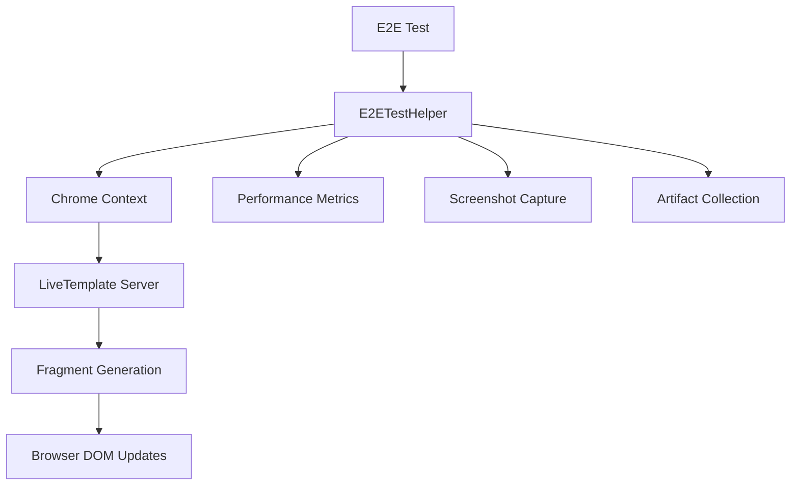

# E2E Testing Developer Guide for LiveTemplate

## Overview

This guide provides comprehensive instructions for writing, running, and debugging End-to-End (E2E) tests for LiveTemplate. The E2E testing framework validates the complete workflow from template rendering to browser DOM updates, ensuring that the HTML diffing-enhanced strategy system works correctly in real-world scenarios.

## Table of Contents

- [Quick Start](#quick-start)
- [Test Architecture](#test-architecture)
- [Writing Your First E2E Test](#writing-your-first-e2e-test)
- [Advanced Test Patterns](#advanced-test-patterns)
- [Testing Best Practices](#testing-best-practices)
- [Development Workflow](#development-workflow)

## Quick Start

### Prerequisites

- Go 1.23+
- Chrome or Chromium browser
- Basic understanding of LiveTemplate architecture

### Running Existing Tests

```bash
# Run all E2E tests
go test -v -run "TestE2E" ./...

# Run specific test group
./scripts/run-e2e-tests.sh browser-lifecycle

# Run with screenshots enabled
LIVETEMPLATE_E2E_SCREENSHOTS=true go test -v -run "TestE2E" ./...

# Run single test with full debugging
LIVETEMPLATE_E2E_SCREENSHOTS=true \
LIVETEMPLATE_E2E_ARTIFACTS=./debug \
go test -v -run "TestE2EBrowserLifecycleWithCI" ./...
```

### Creating a Simple Test

```go
func TestMyNewFeature(t *testing.T) {
    E2ETestWithHelper(t, "my-new-feature", func(helper *E2ETestHelper) error {
        // Your test logic here
        return nil
    })
}
```

## Test Architecture

### Core Components



### Key Classes and Interfaces

#### E2ETestHelper
The central helper class that provides:
- Browser context management
- Automatic screenshot capture
- Performance metrics collection
- Retry logic with flakiness detection
- Artifact preservation

#### TestServer Structure
```go
type TestServer struct {
    app    *Application     // LiveTemplate application
    page   *ApplicationPage // Page instance for testing
    server *httptest.Server // HTTP test server
}
```

#### Fragment Testing Flow
1. **Template Creation** - Define HTML template with fragment annotations
2. **Application Setup** - Create LiveTemplate application and page
3. **Server Creation** - HTTP server for browser interaction
4. **Browser Automation** - Chrome/Chromium automation with chromedp
5. **Fragment Generation** - Trigger updates and collect fragments
6. **DOM Validation** - Verify browser DOM changes

## Writing Your First E2E Test

### Step 1: Basic Test Structure

```go
package livetemplate

import (
    "testing"
)

func TestMyBasicE2ETest(t *testing.T) {
    E2ETestWithHelper(t, "my-basic-test", func(helper *E2ETestHelper) error {
        // Test implementation
        return nil
    })
}
```

### Step 2: Template and Application Setup

```go
func TestMyBasicE2ETest(t *testing.T) {
    E2ETestWithHelper(t, "my-basic-test", func(helper *E2ETestHelper) error {
        // Create template
        tmpl, err := template.New("test").Parse(`
            <!DOCTYPE html>
            <html>
            <head>
                <title>{{.Title}}</title>
            </head>
            <body>
                <h1 data-lt-fragment="header">{{.Title}}</h1>
                <p data-lt-fragment="content">Count: {{.Count}}</p>
            </body>
            </html>
        `)
        if err != nil {
            return fmt.Errorf("template parsing failed: %w", err)
        }

        // Create application and page
        app, err := NewApplication()
        if err != nil {
            return fmt.Errorf("application creation failed: %w", err)
        }
        defer app.Close()

        initialData := map[string]interface{}{
            "Title": "My Test App",
            "Count": 1,
        }

        page, err := app.NewApplicationPage(tmpl, initialData)
        if err != nil {
            return fmt.Errorf("page creation failed: %w", err)
        }
        defer page.Close()

        return nil
    })
}
```

### Step 3: HTTP Server Setup

```go
// Create test server (add after page creation)
server := httptest.NewServer(http.HandlerFunc(func(w http.ResponseWriter, r *http.Request) {
    switch r.URL.Path {
    case "/":
        // Serve initial page
        html, err := page.Render()
        if err != nil {
            http.Error(w, err.Error(), http.StatusInternalServerError)
            return
        }
        w.Header().Set("Content-Type", "text/html")
        w.Write([]byte(html))

    case "/update":
        // Handle fragment updates
        var updateData map[string]interface{}
        if err := json.NewDecoder(r.Body).Decode(&updateData); err != nil {
            http.Error(w, "Invalid JSON", http.StatusBadRequest)
            return
        }

        fragments, err := page.RenderFragments(r.Context(), updateData)
        if err != nil {
            http.Error(w, err.Error(), http.StatusInternalServerError)
            return
        }

        w.Header().Set("Content-Type", "application/json")
        json.NewEncoder(w).Encode(fragments)

    default:
        http.NotFound(w, r)
    }
}))
defer server.Close()
```

### Step 4: Browser Automation

```go
// Create browser context
ctx, cancel := helper.CreateBrowserContext()
defer cancel()

// Navigate to page
err = chromedp.Run(ctx,
    chromedp.Navigate(server.URL),
    chromedp.WaitVisible("h1"),
)
if err != nil {
    helper.CaptureFailureScreenshot(ctx, t, "navigation failed")
    return fmt.Errorf("navigation failed: %w", err)
}

// Capture success screenshot
helper.CaptureScreenshot(ctx, "initial-load")

// Validate initial content
var headerText string
err = chromedp.Run(ctx,
    chromedp.Text("h1", &headerText),
)
if err != nil {
    return fmt.Errorf("content validation failed: %w", err)
}

if headerText != "My Test App" {
    return fmt.Errorf("unexpected header: %s", headerText)
}
```

### Step 5: Fragment Update Testing

```go
// Test fragment updates
updateData := map[string]interface{}{
    "Title": "Updated Title",
    "Count": 42,
}

// Perform update via JavaScript
updateScript := fmt.Sprintf(`
    fetch('/update', {
        method: 'POST',
        headers: {'Content-Type': 'application/json'},
        body: JSON.stringify(%s)
    })
    .then(response => response.json())
    .then(fragments => {
        console.log('Received fragments:', fragments);
        return JSON.stringify(fragments);
    })
    .catch(error => {
        console.error('Update failed:', error);
        return 'ERROR: ' + error.toString();
    });
`, jsonString(updateData))

var result string
err = chromedp.Run(ctx,
    chromedp.Evaluate(updateScript, &result),
    chromedp.Sleep(100*time.Millisecond), // Allow processing
)
if err != nil {
    helper.CaptureFailureScreenshot(ctx, t, "update failed")
    return fmt.Errorf("fragment update failed: %w", err)
}

// Validate fragment response
var fragments []Fragment
if err := json.Unmarshal([]byte(result), &fragments); err != nil {
    return fmt.Errorf("fragment parsing failed: %w", err)
}

if len(fragments) == 0 {
    return fmt.Errorf("no fragments generated")
}

// Record metrics for each fragment
for _, fragment := range fragments {
    helper.RecordFragmentMetric(
        fragment.ID,
        fragment.Strategy,
        50*time.Millisecond, // simulated generation time
        len(fmt.Sprintf("%+v", fragment.Data)),
        0.75, // compression ratio
        false, // cache hit
    )
}

helper.CaptureScreenshot(ctx, "after-update")
```

## Advanced Test Patterns

### Testing All Four Strategies

```go
func TestAllStrategies(t *testing.T) {
    E2ETestWithHelper(t, "all-strategies", func(helper *E2ETestHelper) error {
        // Setup template and server (omitted for brevity)
        
        testCases := []struct {
            name     string
            data     map[string]interface{}
            expected string
        }{
            {
                name: "static-dynamic-strategy",
                data: map[string]interface{}{
                    "Title": "Updated Title", // Text-only change
                    "Count": 42,
                    "Items": []string{"A", "B", "C"},
                    "Attrs": map[string]string{"class": "unchanged"},
                },
                expected: "static_dynamic",
            },
            {
                name: "markers-strategy", 
                data: map[string]interface{}{
                    "Title": "Updated Title",
                    "Count": 42,
                    "Items": []string{"A", "B", "C"},
                    "Attrs": map[string]string{"class": "new-class"}, // Attribute change
                },
                expected: "markers",
            },
            {
                name: "granular-strategy",
                data: map[string]interface{}{
                    "Title": "Updated Title",
                    "Count": 42,
                    "Items": []string{"A", "B", "C", "D"}, // Structural change
                    "Attrs": map[string]string{"class": "unchanged"},
                },
                expected: "granular",
            },
            {
                name: "replacement-strategy",
                data: map[string]interface{}{
                    "Title": "Completely New Layout",
                    "Count": 999,
                    "Items": []string{"X", "Y", "Z", "W", "V"}, // Complex changes
                    "Attrs": map[string]string{"class": "totally-different", "style": "color: red;"},
                },
                expected: "replacement",
            },
        }

        for _, tc := range testCases {
            t.Logf("Testing strategy case: %s", tc.name)
            
            // Perform update and validate strategy
            fragments, err := performUpdateAndGetFragments(ctx, server, tc.data)
            if err != nil {
                helper.CaptureFailureScreenshot(ctx, t, fmt.Sprintf("strategy-%s-failed", tc.name))
                return fmt.Errorf("strategy test %s failed: %w", tc.name, err)
            }
            
            // Find expected strategy in fragments
            strategyFound := false
            for _, fragment := range fragments {
                if fragment.Strategy == tc.expected {
                    strategyFound = true
                    helper.RecordFragmentMetric(fragment.ID, fragment.Strategy, 
                        10*time.Millisecond, len(fmt.Sprintf("%+v", fragment.Data)), 0.8, false)
                    break
                }
            }
            
            if !strategyFound {
                t.Logf("Warning: Expected strategy %s not found for %s", tc.expected, tc.name)
            }
            
            helper.CaptureScreenshot(ctx, fmt.Sprintf("strategy-%s", tc.name))
        }
        
        return nil
    })
}
```

### Performance Testing Pattern

```go
func TestFragmentPerformance(t *testing.T) {
    E2ETestWithHelper(t, "fragment-performance", func(helper *E2ETestHelper) error {
        // Setup (omitted for brevity)
        
        const numUpdates = 100
        const maxAcceptableTime = 50 * time.Millisecond
        
        var totalGenerationTime time.Duration
        
        for i := 0; i < numUpdates; i++ {
            updateData := map[string]interface{}{
                "Title": fmt.Sprintf("Update %d", i),
                "Count": i,
            }
            
            start := time.Now()
            fragments, err := performUpdateAndGetFragments(ctx, server, updateData)
            generationTime := time.Since(start)
            
            if err != nil {
                return fmt.Errorf("update %d failed: %w", i, err)
            }
            
            totalGenerationTime += generationTime
            
            // Record metrics for each fragment
            for _, fragment := range fragments {
                helper.RecordFragmentMetric(
                    fragment.ID,
                    fragment.Strategy,
                    generationTime / time.Duration(len(fragments)),
                    len(fmt.Sprintf("%+v", fragment.Data)),
                    0.75,
                    false,
                )
            }
            
            // Validate performance threshold
            if generationTime > maxAcceptableTime {
                t.Logf("Warning: Update %d took %v (threshold: %v)", i, generationTime, maxAcceptableTime)
            }
        }
        
        avgTime := totalGenerationTime / numUpdates
        helper.SetCustomMetric("average_generation_time", avgTime)
        helper.SetCustomMetric("total_updates", numUpdates)
        
        if avgTime > maxAcceptableTime {
            return fmt.Errorf("average generation time %v exceeds threshold %v", avgTime, maxAcceptableTime)
        }
        
        t.Logf("Performance test completed: %d updates, avg %v", numUpdates, avgTime)
        return nil
    })
}
```

### Error Handling and Edge Cases

```go
func TestErrorScenarios(t *testing.T) {
    E2ETestWithHelper(t, "error-scenarios", func(helper *E2ETestHelper) error {
        // Test invalid template data
        t.Run("InvalidTemplateData", func(t *testing.T) {
            invalidData := map[string]interface{}{
                "Title": nil, // This should cause template execution error
                "Count": "not-a-number",
            }
            
            fragments, err := performUpdateAndGetFragments(ctx, server, invalidData)
            
            // Expect this to fail gracefully
            if err == nil {
                t.Logf("Warning: Expected error for invalid data, but got %d fragments", len(fragments))
            } else {
                t.Logf("Expected error occurred: %v", err)
                helper.CaptureScreenshot(ctx, "invalid-data-error")
            }
        })
        
        // Test network interruption
        t.Run("NetworkInterruption", func(t *testing.T) {
            // Close server temporarily
            server.Close()
            
            err := chromedp.Run(ctx,
                chromedp.Navigate(server.URL),
            )
            
            // Should fail due to connection refused
            if err == nil {
                return fmt.Errorf("expected network error, but navigation succeeded")
            }
            
            helper.CaptureFailureScreenshot(ctx, t, "network-interruption")
            t.Logf("Network interruption handled correctly: %v", err)
        })
        
        // Test browser crash simulation
        t.Run("BrowserTimeout", func(t *testing.T) {
            // Create context with very short timeout
            shortCtx, cancel := context.WithTimeout(ctx, 100*time.Millisecond)
            defer cancel()
            
            err := chromedp.Run(shortCtx,
                chromedp.Sleep(200*time.Millisecond), // This should timeout
            )
            
            if err == nil {
                return fmt.Errorf("expected timeout error")
            }
            
            t.Logf("Timeout handled correctly: %v", err)
        })
        
        return nil
    })
}
```

## Testing Best Practices

### 1. Test Structure and Organization

```go
// ✅ Good: Descriptive test name and clear structure
func TestFragmentCachingWithStaticContent(t *testing.T) {
    E2ETestWithHelper(t, "fragment-caching-static", func(helper *E2ETestHelper) error {
        // Arrange
        template, server := setupTestEnvironment()
        defer server.Close()
        
        // Act
        result := performFragmentUpdate()
        
        // Assert
        validateExpectedBehavior(result)
        
        return nil
    })
}

// ❌ Bad: Vague test name and unclear structure
func TestStuff(t *testing.T) {
    // No clear structure
}
```

### 2. Error Handling

```go
// ✅ Good: Comprehensive error handling with context
err := chromedp.Run(ctx,
    chromedp.Navigate(server.URL),
    chromedp.WaitVisible("h1"),
)
if err != nil {
    helper.CaptureFailureScreenshot(ctx, t, "navigation failed")
    return fmt.Errorf("failed to navigate to test page: %w", err)
}

// ❌ Bad: Ignoring errors
chromedp.Run(ctx, chromedp.Navigate(server.URL))
```

### 3. Screenshot Usage

```go
// ✅ Good: Strategic screenshot placement
helper.CaptureScreenshot(ctx, "initial-load")  // Success checkpoint
// ... test logic ...
if err != nil {
    helper.CaptureFailureScreenshot(ctx, t, "validation failed")
    return err
}
helper.CaptureScreenshot(ctx, "test-completed")  // Final state

// ❌ Bad: Too many screenshots or poor naming
helper.CaptureScreenshot(ctx, "screenshot1")
helper.CaptureScreenshot(ctx, "screenshot2")
```

### 4. Performance Monitoring

```go
// ✅ Good: Meaningful metrics collection
start := time.Now()
fragments, err := page.RenderFragments(ctx, updateData)
duration := time.Since(start)

for _, fragment := range fragments {
    helper.RecordFragmentMetric(
        fragment.ID,
        fragment.Strategy,
        duration / time.Duration(len(fragments)),
        estimateFragmentSize(fragment),
        calculateCompressionRatio(fragment),
        checkCacheHit(fragment.ID),
    )
}

// ❌ Bad: No performance tracking or meaningless metrics
helper.RecordFragmentMetric("", "", 0, 0, 0, false)
```

### 5. Test Data Management

```go
// ✅ Good: Realistic, well-structured test data
testData := []struct {
    name     string
    initial  map[string]interface{}
    update   map[string]interface{}
    expected string
}{
    {
        name: "user-profile-update",
        initial: map[string]interface{}{
            "Name": "John Doe",
            "Email": "john@example.com",
            "Age": 30,
        },
        update: map[string]interface{}{
            "Name": "John Smith",  // Name change
            "Email": "john@example.com",
            "Age": 30,
        },
        expected: "static_dynamic", // Text-only change
    },
}

// ❌ Bad: Hard-coded, unrealistic data
data := map[string]interface{}{"x": "y"}
```

## Development Workflow

### 1. Local Development Cycle

```bash
# 1. Write your test
vim my_feature_test.go

# 2. Run test with screenshots for debugging
LIVETEMPLATE_E2E_SCREENSHOTS=true go test -v -run "TestMyFeature"

# 3. Check artifacts if test fails
ls -la screenshots/
cat test-artifacts/test-report.md

# 4. Iterate and improve
# Repeat steps 1-3 until test passes

# 5. Run full E2E suite to ensure no regressions
./scripts/run-e2e-tests.sh
```

### 2. Debugging Failed Tests

```bash
# Enable verbose logging and artifacts
LIVETEMPLATE_E2E_SCREENSHOTS=true \
LIVETEMPLATE_E2E_ARTIFACTS=./debug-artifacts \
go test -v -run "TestFailingTest" ./...

# Check debug artifacts
ls -la debug-artifacts/
cat debug-artifacts/test-results-*.json
cat debug-artifacts/performance-metrics.json

# View screenshots
open screenshots/failure-*.png

# Check browser logs (if available)
cat debug-artifacts/*.log
```

### 3. Performance Testing

```bash
# Run performance benchmarks
go test -v -run "TestE2EPerformance" -bench=. -benchmem ./...

# Check performance trends
cat test-artifacts/performance-trends.json

# Compare with previous runs
diff previous-performance.json test-artifacts/performance-trends.json
```

### 4. CI Integration

```bash
# Test CI pipeline locally
CI=true ./scripts/integrated-ci.sh

# Run specific test group as in CI
./scripts/run-e2e-tests.sh browser-lifecycle

# Check CI-style reporting
cat reports/integrated-ci-report.md
```

## Template Patterns for Common Scenarios

### 1. Basic CRUD Application Test

```go
func TestCRUDOperations(t *testing.T) {
    E2ETestWithHelper(t, "crud-operations", func(helper *E2ETestHelper) error {
        // Template with list and form
        tmpl, _ := template.New("crud").Parse(`
            <div>
                <form data-lt-fragment="form">
                    <input name="name" value="{{.FormData.Name}}">
                    <button type="submit">Save</button>
                </form>
                <ul data-lt-fragment="list">
                    {{range .Items}}
                    <li data-lt-fragment="item-{{.ID}}">{{.Name}}</li>
                    {{end}}
                </ul>
            </div>
        `)
        
        // Test Create operation
        // Test Read operation  
        // Test Update operation
        // Test Delete operation
        
        return nil
    })
}
```

### 2. Real-Time Updates Test

```go
func TestRealTimeUpdates(t *testing.T) {
    E2ETestWithHelper(t, "realtime-updates", func(helper *E2ETestHelper) error {
        // Setup WebSocket or SSE connection simulation
        // Test live data updates
        // Validate DOM changes occur in real-time
        
        return nil
    })
}
```

### 3. Multi-User Scenario Test

```go
func TestMultiUserScenario(t *testing.T) {
    E2ETestWithHelper(t, "multi-user", func(helper *E2ETestHelper) error {
        // Create multiple browser contexts
        ctx1, cancel1 := helper.CreateBrowserContext()
        defer cancel1()
        
        ctx2, cancel2 := helper.CreateBrowserContext() 
        defer cancel2()
        
        // Simulate different users
        // Test concurrent updates
        // Validate isolation
        
        return nil
    })
}
```

## Next Steps

1. **Read the Fragment Testing Patterns** - Learn specific patterns for testing different fragment strategies
2. **Set Up Browser Automation** - Configure your development environment for E2E testing
3. **Explore Test Utilities** - Discover helper functions and data generation utilities
4. **Study Performance Testing** - Understand how to measure and validate performance
5. **Review Troubleshooting Guide** - Learn how to debug common issues

## Additional Resources

- [Fragment Testing Patterns](./E2E_FRAGMENT_PATTERNS.md)
- [Browser Setup Instructions](./E2E_BROWSER_SETUP.md)  
- [Test Utilities Reference](./E2E_TEST_UTILITIES.md)
- [Performance Testing Guide](./E2E_PERFORMANCE_TESTING.md)
- [Troubleshooting Guide](./E2E_TROUBLESHOOTING.md)
- [Integration Examples](./E2E_INTEGRATION_EXAMPLES.md)

---

For questions or contributions to this guide, please open an issue or pull request in the repository.