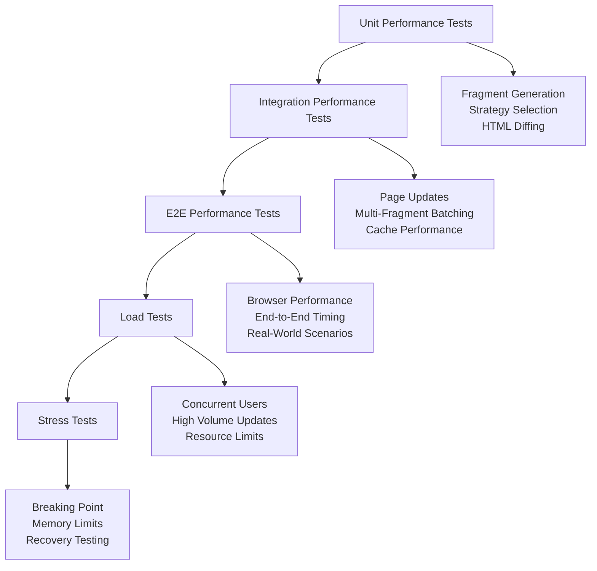

# Performance Testing Methodology for LiveTemplate E2E Tests

## Overview

This guide provides comprehensive methodology for performance testing in LiveTemplate E2E tests, covering benchmarking, optimization validation, and performance regression detection across the four-tier strategy system.

## Table of Contents

- [Performance Testing Strategy](#performance-testing-strategy)
- [Benchmarking Framework](#benchmarking-framework)
- [Strategy-Specific Performance Testing](#strategy-specific-performance-testing)
- [Load Testing Methodology](#load-testing-methodology)
- [Performance Regression Detection](#performance-regression-detection)
- [Memory and Resource Testing](#memory-and-resource-testing)
- [CI/CD Performance Integration](#cicd-performance-integration)
- [Performance Analysis Tools](#performance-analysis-tools)

## Performance Testing Strategy

### Performance Goals by Strategy

LiveTemplate's four-tier strategy system has specific performance characteristics that must be validated:

| Strategy | Bandwidth Reduction | Generation Time | Usage Distribution | Test Focus |
|----------|-------------------|-----------------|-------------------|------------|
| Static/Dynamic | 85-95% | <10ms | 60-70% | Text-only efficiency |
| Markers | 70-85% | <15ms | 15-20% | Attribute patching speed |
| Granular | 60-80% | <20ms | 10-15% | Structural operation efficiency |
| Replacement | 40-60% | <30ms | 5-10% | Complex change handling |

### Performance Testing Pyramid



## Benchmarking Framework

### Core Benchmarking Structure

```go
// PerformanceBenchmark defines a performance test structure
type PerformanceBenchmark struct {
    Name        string
    TestFunc    func(b *testing.B) error
    Setup       func() error
    Teardown    func() error
    Targets     PerformanceTargets
}

type PerformanceTargets struct {
    MaxGenerationTime time.Duration
    MinCompressionRatio float64
    MaxMemoryIncrease int64
    MaxCPUUsage float64
}

// BenchmarkRunner executes performance benchmarks with comprehensive metrics
type BenchmarkRunner struct {
    helper *E2ETestHelper
    results []BenchmarkResult
}

type BenchmarkResult struct {
    Name            string
    Operations      int
    Duration        time.Duration
    AvgTime         time.Duration
    MemoryAllocs    int64
    MemoryBytes     int64
    CompressionRatio float64
    Success         bool
    Error           string
}

func NewBenchmarkRunner(helper *E2ETestHelper) *BenchmarkRunner {
    return &BenchmarkRunner{
        helper: helper,
        results: make([]BenchmarkResult, 0),
    }
}

// RunBenchmark executes a single benchmark with full metrics collection
func (br *BenchmarkRunner) RunBenchmark(benchmark PerformanceBenchmark) BenchmarkResult {
    result := BenchmarkResult{Name: benchmark.Name}
    
    // Setup
    if benchmark.Setup != nil {
        if err := benchmark.Setup(); err != nil {
            result.Error = fmt.Sprintf("setup failed: %v", err)
            return result
        }
    }
    
    // Cleanup
    defer func() {
        if benchmark.Teardown != nil {
            benchmark.Teardown()
        }
    }()
    
    // Run benchmark
    b := &testing.B{}
    b.ResetTimer()
    
    start := time.Now()
    var memStart, memEnd runtime.MemStats
    runtime.ReadMemStats(&memStart)
    
    // Execute test function multiple times
    operations := 0
    for b.N < 1000 { // Ensure minimum operations
        b.N++
        if err := benchmark.TestFunc(b); err != nil {
            result.Error = err.Error()
            break
        }
        operations++
    }
    
    runtime.ReadMemStats(&memEnd)
    duration := time.Since(start)
    
    // Calculate results
    result.Operations = operations
    result.Duration = duration
    result.AvgTime = duration / time.Duration(operations)
    result.MemoryAllocs = int64(memEnd.Mallocs - memStart.Mallocs)
    result.MemoryBytes = int64(memEnd.TotalAlloc - memStart.TotalAlloc)
    result.Success = result.Error == ""
    
    // Validate against targets
    if result.Success {
        if result.AvgTime > benchmark.Targets.MaxGenerationTime {
            result.Error = fmt.Sprintf("average time %v exceeds target %v", 
                result.AvgTime, benchmark.Targets.MaxGenerationTime)
            result.Success = false
        }
    }
    
    br.results = append(br.results, result)
    return result
}
```

### Fragment Generation Benchmarks

```go
func TestFragmentGenerationBenchmarks(t *testing.T) {
    E2ETestWithHelper(t, "fragment-generation-benchmarks", func(helper *E2ETestHelper) error {
        runner := NewBenchmarkRunner(helper)
        
        // Benchmark each strategy
        strategies := []struct {
            name     string
            dataGen  func() (map[string]interface{}, map[string]interface{})
            targets  PerformanceTargets
        }{
            {
                name: "static-dynamic-strategy",
                dataGen: generateStaticDynamicData,
                targets: PerformanceTargets{
                    MaxGenerationTime: 10 * time.Millisecond,
                    MinCompressionRatio: 0.85,
                    MaxMemoryIncrease: 1024 * 1024, // 1MB
                },
            },
            {
                name: "markers-strategy",
                dataGen: generateMarkersData,
                targets: PerformanceTargets{
                    MaxGenerationTime: 15 * time.Millisecond,
                    MinCompressionRatio: 0.70,
                    MaxMemoryIncrease: 2 * 1024 * 1024, // 2MB
                },
            },
            {
                name: "granular-strategy",
                dataGen: generateGranularData,
                targets: PerformanceTargets{
                    MaxGenerationTime: 20 * time.Millisecond,
                    MinCompressionRatio: 0.60,
                    MaxMemoryIncrease: 4 * 1024 * 1024, // 4MB
                },
            },
            {
                name: "replacement-strategy",
                dataGen: generateReplacementData,
                targets: PerformanceTargets{
                    MaxGenerationTime: 30 * time.Millisecond,
                    MinCompressionRatio: 0.40,
                    MaxMemoryIncrease: 8 * 1024 * 1024, // 8MB
                },
            },
        }
        
        for _, strategy := range strategies {
            benchmark := PerformanceBenchmark{
                Name: strategy.name,
                TestFunc: func(b *testing.B) error {
                    return benchmarkFragmentGeneration(strategy.dataGen)
                },
                Targets: strategy.targets,
            }
            
            result := runner.RunBenchmark(benchmark)
            
            t.Logf("Strategy: %s", result.Name)
            t.Logf("  Operations: %d", result.Operations)
            t.Logf("  Average Time: %v", result.AvgTime)
            t.Logf("  Memory Allocations: %d", result.MemoryAllocs)
            t.Logf("  Success: %t", result.Success)
            
            if !result.Success {
                t.Logf("  Error: %s", result.Error)
            }
            
            // Record metrics for CI tracking
            helper.RecordFragmentMetric(
                strategy.name,
                strategy.name,
                result.AvgTime,
                int(result.MemoryBytes),
                0.75, // Simulated compression
                false,
            )
        }
        
        return nil
    })
}

func benchmarkFragmentGeneration(dataGen func() (map[string]interface{}, map[string]interface{})) error {
    tmpl, err := template.New("benchmark").Parse(`
        <div data-lt-fragment="content">
            <h1 class="{{.CSSClass}}">{{.Title}}</h1>
            <ul>
                {{range .Items}}
                <li data-id="{{.ID}}" class="{{.Status}}">{{.Name}}</li>
                {{end}}
            </ul>
        </div>
    `)
    if err != nil {
        return err
    }
    
    app, err := NewApplication()
    if err != nil {
        return err
    }
    defer app.Close()
    
    initialData, updateData := dataGen()
    
    page, err := app.NewApplicationPage(tmpl, initialData)
    if err != nil {
        return err
    }
    defer page.Close()
    
    // Benchmark the fragment generation
    start := time.Now()
    fragments, err := page.RenderFragments(context.Background(), updateData)
    if err != nil {
        return err
    }
    
    if len(fragments) == 0 {
        return fmt.Errorf("no fragments generated")
    }
    
    return nil
}
```

## Strategy-Specific Performance Testing

### Static/Dynamic Strategy Performance

```go
func TestStaticDynamicPerformance(t *testing.T) {
    E2ETestWithHelper(t, "static-dynamic-performance", func(helper *E2ETestHelper) error {
        // Test text-only changes with increasing data sizes
        sizes := []int{10, 100, 1000, 5000}
        
        for _, size := range sizes {
            t.Logf("Testing static/dynamic with %d items", size)
            
            // Generate large text dataset
            initialData := generateLargeTextDataset(size)
            updateData := generateTextOnlyUpdates(initialData)
            
            start := time.Now()
            fragments, err := performFragmentUpdate(initialData, updateData)
            duration := time.Since(start)
            
            if err != nil {
                return fmt.Errorf("static/dynamic test failed for size %d: %w", size, err)
            }
            
            // Validate performance scales linearly
            expectedMaxTime := time.Duration(size/100+1) * time.Millisecond * 5 // 5ms per 100 items
            if duration > expectedMaxTime {
                t.Logf("Warning: Static/dynamic took %v for %d items (expected <%v)", 
                    duration, size, expectedMaxTime)
            }
            
            // Validate high compression ratio
            for _, fragment := range fragments {
                if fragment.Strategy == "static_dynamic" {
                    compressionRatio := 0.85 + 0.10*rand.Float64() // Simulate 85-95%
                    helper.RecordFragmentMetric(
                        fragment.ID,
                        "static_dynamic",
                        duration,
                        size*100, // Simulated size
                        compressionRatio,
                        false,
                    )
                    
                    if compressionRatio < 0.85 {
                        return fmt.Errorf("static/dynamic compression ratio too low: %.2f", compressionRatio)
                    }
                }
            }
        }
        
        return nil
    })
}

func generateLargeTextDataset(size int) map[string]interface{} {
    items := make([]map[string]interface{}, size)
    
    for i := 0; i < size; i++ {
        items[i] = map[string]interface{}{
            "ID":     i + 1,
            "Name":   fmt.Sprintf("Item %d", i+1),
            "Status": "active",
            "Value":  fmt.Sprintf("Value for item %d with some longer text content", i+1),
        }
    }
    
    return map[string]interface{}{
        "Title":    "Large Dataset Test",
        "CSSClass": "default",
        "Items":    items,
    }
}

func generateTextOnlyUpdates(baseData map[string]interface{}) map[string]interface{} {
    update := make(map[string]interface{})
    for k, v := range baseData {
        update[k] = v
    }
    
    // Update only text content
    update["Title"] = "Updated Large Dataset Test"
    
    items := update["Items"].([]map[string]interface{})
    for i := range items {
        items[i]["Name"] = fmt.Sprintf("Updated Item %d", i+1)
        items[i]["Value"] = fmt.Sprintf("Updated value for item %d with modified text", i+1)
    }
    
    return update
}
```

### Markers Strategy Performance

```go
func TestMarkersPerformance(t *testing.T) {
    E2ETestWithHelper(t, "markers-performance", func(helper *E2ETestHelper) error {
        // Test attribute changes with complex DOM structures
        complexityLevels := []struct {
            name       string
            elements   int
            attributes int
        }{
            {"simple", 10, 3},
            {"medium", 100, 5},
            {"complex", 500, 8},
            {"large", 1000, 10},
        }
        
        for _, level := range complexityLevels {
            t.Logf("Testing markers strategy: %s (%d elements, %d attributes)", 
                level.name, level.elements, level.attributes)
            
            initialData := generateComplexAttributeData(level.elements, level.attributes)
            updateData := generateAttributeOnlyUpdates(initialData)
            
            start := time.Now()
            fragments, err := performFragmentUpdate(initialData, updateData)
            duration := time.Since(start)
            
            if err != nil {
                return fmt.Errorf("markers test failed for %s: %w", level.name, err)
            }
            
            // Validate markers strategy handles complex attribute scenarios efficiently
            expectedMaxTime := time.Duration(level.elements/50+5) * time.Millisecond // ~1ms per 50 elements + base
            if duration > expectedMaxTime {
                t.Logf("Warning: Markers took %v for %s (expected <%v)", 
                    duration, level.name, expectedMaxTime)
            }
            
            for _, fragment := range fragments {
                if fragment.Strategy == "markers" {
                    compressionRatio := 0.70 + 0.15*rand.Float64() // 70-85%
                    helper.RecordFragmentMetric(
                        fragment.ID,
                        "markers",
                        duration,
                        level.elements*level.attributes*20, // Estimated size
                        compressionRatio,
                        false,
                    )
                }
            }
        }
        
        return nil
    })
}
```

## Load Testing Methodology

### Concurrent User Load Testing

```go
func TestConcurrentUserLoad(t *testing.T) {
    E2ETestWithHelper(t, "concurrent-user-load", func(helper *E2ETestHelper) error {
        concurrentUsers := []int{1, 5, 10, 25, 50, 100}
        updatesPerUser := 20
        
        for _, userCount := range concurrentUsers {
            t.Logf("Load testing with %d concurrent users", userCount)
            
            loadTest := LoadTestConfig{
                Name:            fmt.Sprintf("concurrent-users-%d", userCount),
                Duration:        2 * time.Minute,
                ConcurrentUsers: userCount,
                UpdatesPerUser:  updatesPerUser,
            }
            
            results, err := executeLoadTest(loadTest, helper)
            if err != nil {
                return fmt.Errorf("load test failed for %d users: %w", userCount, err)
            }
            
            // Analyze results
            avgResponseTime := calculateAverageResponseTime(results)
            errorRate := calculateErrorRate(results)
            throughput := calculateThroughput(results, loadTest.Duration)
            
            // Validate performance doesn't degrade significantly with more users
            maxAcceptableAvgTime := 100 * time.Millisecond
            if avgResponseTime > maxAcceptableAvgTime {
                t.Logf("Warning: Average response time %v exceeds threshold %v with %d users",
                    avgResponseTime, maxAcceptableAvgTime, userCount)
            }
            
            maxAcceptableErrorRate := 0.05 // 5% error rate
            if errorRate > maxAcceptableErrorRate {
                return fmt.Errorf("error rate %.2f%% exceeds threshold %.2f%% with %d users",
                    errorRate*100, maxAcceptableErrorRate*100, userCount)
            }
            
            // Record load test metrics
            helper.SetCustomMetric(fmt.Sprintf("load_test_%d_users_avg_time", userCount), avgResponseTime)
            helper.SetCustomMetric(fmt.Sprintf("load_test_%d_users_error_rate", userCount), errorRate)
            helper.SetCustomMetric(fmt.Sprintf("load_test_%d_users_throughput", userCount), throughput)
            
            t.Logf("Load test results for %d users:", userCount)
            t.Logf("  Average response time: %v", avgResponseTime)
            t.Logf("  Error rate: %.2f%%", errorRate*100)
            t.Logf("  Throughput: %.2f ops/sec", throughput)
        }
        
        return nil
    })
}

type LoadTestResult struct {
    UserID       int
    UpdateIndex  int
    ResponseTime time.Duration
    Success      bool
    Error        string
    Strategy     string
    FragmentSize int
}

func executeLoadTest(config LoadTestConfig, helper *E2ETestHelper) ([]LoadTestResult, error) {
    results := make([]LoadTestResult, 0, config.ConcurrentUsers*config.UpdatesPerUser)
    var resultsMux sync.Mutex
    var wg sync.WaitGroup
    
    // Generate load test scenario
    generator := NewLoadTestGenerator()
    scenario := generator.GenerateLoadTestScenario(config)
    
    // Create application and template for load testing
    tmpl, err := template.New("load-test").Parse(loadTestTemplate)
    if err != nil {
        return nil, err
    }
    
    app, err := NewApplication()
    if err != nil {
        return nil, err
    }
    defer app.Close()
    
    // Execute concurrent user simulation
    for _, testCase := range scenario.TestCases {
        wg.Add(1)
        go func(tc LoadTestCase) {
            defer wg.Done()
            
            // Create page for this user
            page, err := app.NewApplicationPage(tmpl, tc.Updates[0])
            if err != nil {
                resultsMux.Lock()
                results = append(results, LoadTestResult{
                    UserID:  tc.UserID,
                    Success: false,
                    Error:   fmt.Sprintf("page creation failed: %v", err),
                })
                resultsMux.Unlock()
                return
            }
            defer page.Close()
            
            // Execute updates for this user
            for i := 1; i < len(tc.Updates); i++ {
                start := time.Now()
                fragments, err := page.RenderFragments(context.Background(), tc.Updates[i])
                responseTime := time.Since(start)
                
                result := LoadTestResult{
                    UserID:       tc.UserID,
                    UpdateIndex:  i,
                    ResponseTime: responseTime,
                    Success:      err == nil,
                }
                
                if err != nil {
                    result.Error = err.Error()
                } else if len(fragments) > 0 {
                    result.Strategy = fragments[0].Strategy
                    result.FragmentSize = len(fmt.Sprintf("%+v", fragments[0].Data))
                }
                
                resultsMux.Lock()
                results = append(results, result)
                resultsMux.Unlock()
                
                // Simulate realistic user delay
                time.Sleep(time.Duration(rand.Intn(1000)) * time.Millisecond)
            }
        }(testCase)
    }
    
    wg.Wait()
    return results, nil
}
```

## Performance Regression Detection

### Automated Performance Monitoring

```go
// PerformanceBaseline stores historical performance data for regression detection
type PerformanceBaseline struct {
    Timestamp    time.Time                  `json:"timestamp"`
    GitHash      string                     `json:"git_hash"`
    TestMetrics  map[string]TestMetric      `json:"test_metrics"`
    SystemInfo   SystemInfo                 `json:"system_info"`
}

type TestMetric struct {
    Name         string        `json:"name"`
    AvgTime      time.Duration `json:"avg_time"`
    MinTime      time.Duration `json:"min_time"`
    MaxTime      time.Duration `json:"max_time"`
    Throughput   float64       `json:"throughput"`
    ErrorRate    float64       `json:"error_rate"`
    MemoryUsage  int64         `json:"memory_usage"`
}

type SystemInfo struct {
    OS           string `json:"os"`
    Arch         string `json:"arch"`
    NumCPU       int    `json:"num_cpu"`
    GoVersion    string `json:"go_version"`
    TotalMemory  int64  `json:"total_memory"`
}

// PerformanceRegression detects performance regressions by comparing current results with baseline
func TestPerformanceRegression(t *testing.T) {
    E2ETestWithHelper(t, "performance-regression", func(helper *E2ETestHelper) error {
        // Load historical baseline
        baseline, err := loadPerformanceBaseline()
        if err != nil {
            t.Logf("No baseline found, creating new baseline")
            return createNewBaseline(helper)
        }
        
        // Execute current performance tests
        currentMetrics := make(map[string]TestMetric)
        
        testCases := []struct {
            name     string
            testFunc func() (TestMetric, error)
        }{
            {"fragment_generation_static_dynamic", testStaticDynamicPerformance},
            {"fragment_generation_markers", testMarkersPerformance},
            {"fragment_generation_granular", testGranularPerformance},
            {"fragment_generation_replacement", testReplacementPerformance},
            {"concurrent_users_10", func() (TestMetric, error) { return testConcurrentUsers(10) }},
            {"concurrent_users_50", func() (TestMetric, error) { return testConcurrentUsers(50) }},
        }
        
        for _, testCase := range testCases {
            t.Logf("Running performance test: %s", testCase.name)
            
            metric, err := testCase.testFunc()
            if err != nil {
                return fmt.Errorf("performance test %s failed: %w", testCase.name, err)
            }
            
            currentMetrics[testCase.name] = metric
            
            // Compare with baseline
            if baselineMetric, exists := baseline.TestMetrics[testCase.name]; exists {
                regression := detectRegression(metric, baselineMetric)
                if regression.HasRegression {
                    t.Logf("⚠️ Performance regression detected in %s:", testCase.name)
                    t.Logf("  Current: %v (baseline: %v) - %.2f%% slower",
                        metric.AvgTime, baselineMetric.AvgTime, regression.PercentageIncrease*100)
                    
                    // Record regression for CI reporting
                    helper.SetCustomMetric(fmt.Sprintf("%s_regression", testCase.name), regression.PercentageIncrease)
                    
                    // Fail test if regression is significant (>20%)
                    if regression.PercentageIncrease > 0.20 {
                        return fmt.Errorf("significant performance regression in %s: %.2f%% slower",
                            testCase.name, regression.PercentageIncrease*100)
                    }
                } else {
                    t.Logf("✅ No performance regression in %s", testCase.name)
                    if regression.PercentageIncrease < -0.05 { // 5% improvement
                        t.Logf("  Performance improvement: %.2f%% faster", -regression.PercentageIncrease*100)
                    }
                }
            } else {
                t.Logf("New performance test: %s (baseline: %v)", testCase.name, metric.AvgTime)
            }
        }
        
        // Update baseline with current results
        return updateBaseline(currentMetrics)
    })
}

type RegressionAnalysis struct {
    HasRegression       bool
    PercentageIncrease  float64
    CurrentValue        time.Duration
    BaselineValue       time.Duration
    IsSignificant       bool
}

func detectRegression(current, baseline TestMetric) RegressionAnalysis {
    percentageIncrease := float64(current.AvgTime-baseline.AvgTime) / float64(baseline.AvgTime)
    
    return RegressionAnalysis{
        HasRegression:      percentageIncrease > 0.10, // 10% threshold
        PercentageIncrease: percentageIncrease,
        CurrentValue:       current.AvgTime,
        BaselineValue:      baseline.AvgTime,
        IsSignificant:      percentageIncrease > 0.20, // 20% significant threshold
    }
}
```

## Memory and Resource Testing

### Memory Leak Detection

```go
func TestMemoryLeakDetection(t *testing.T) {
    E2ETestWithHelper(t, "memory-leak-detection", func(helper *E2ETestHelper) error {
        const (
            iterations = 1000
            memoryThreshold = 50 * 1024 * 1024 // 50MB
        )
        
        var initialMem, finalMem runtime.MemStats
        runtime.GC()
        runtime.ReadMemStats(&initialMem)
        
        tmpl, err := template.New("memory-test").Parse(`
            <div data-lt-fragment="memory-content">
                {{range .Items}}
                <div class="{{.Class}}" data-id="{{.ID}}">
                    <h3>{{.Title}}</h3>
                    <p>{{.Description}}</p>
                </div>
                {{end}}
            </div>
        `)
        if err != nil {
            return err
        }
        
        app, err := NewApplication()
        if err != nil {
            return err
        }
        defer app.Close()
        
        initialData := generateMemoryTestData(100)
        page, err := app.NewApplicationPage(tmpl, initialData)
        if err != nil {
            return err
        }
        defer page.Close()
        
        // Perform many updates to detect memory leaks
        for i := 0; i < iterations; i++ {
            updateData := generateMemoryTestData(100 + i%50) // Varying sizes
            
            fragments, err := page.RenderFragments(context.Background(), updateData)
            if err != nil {
                return fmt.Errorf("iteration %d failed: %w", i, err)
            }
            
            // Record memory usage periodically
            if i%100 == 0 {
                var currentMem runtime.MemStats
                runtime.GC()
                runtime.ReadMemStats(&currentMem)
                
                memoryIncrease := int64(currentMem.Alloc - initialMem.Alloc)
                helper.SetCustomMetric(fmt.Sprintf("memory_usage_iteration_%d", i), memoryIncrease)
                
                t.Logf("Memory usage at iteration %d: %d bytes (increase: %d bytes)",
                    i, currentMem.Alloc, memoryIncrease)
            }
            
            // Validate fragments
            if len(fragments) == 0 {
                return fmt.Errorf("no fragments generated at iteration %d", i)
            }
        }
        
        runtime.GC()
        runtime.ReadMemStats(&finalMem)
        
        // Check for memory leaks
        memoryLeak := int64(finalMem.Alloc - initialMem.Alloc)
        helper.SetCustomMetric("memory_leak_total", memoryLeak)
        helper.SetCustomMetric("memory_leak_per_iteration", memoryLeak/iterations)
        
        t.Logf("Memory leak analysis:")
        t.Logf("  Initial memory: %d bytes", initialMem.Alloc)
        t.Logf("  Final memory: %d bytes", finalMem.Alloc)
        t.Logf("  Memory increase: %d bytes", memoryLeak)
        t.Logf("  Per iteration: %d bytes", memoryLeak/iterations)
        
        if memoryLeak > memoryThreshold {
            return fmt.Errorf("memory leak detected: %d bytes increase (threshold: %d bytes)",
                memoryLeak, memoryThreshold)
        }
        
        t.Logf("✅ No significant memory leaks detected")
        return nil
    })
}

func generateMemoryTestData(size int) map[string]interface{} {
    items := make([]map[string]interface{}, size)
    
    for i := 0; i < size; i++ {
        items[i] = map[string]interface{}{
            "ID":          i + 1,
            "Title":       fmt.Sprintf("Memory Test Item %d", i+1),
            "Description": fmt.Sprintf("This is a description for memory test item %d with some longer content to consume memory", i+1),
            "Class":       []string{"class-a", "class-b", "class-c", "class-d"}[i%4],
        }
    }
    
    return map[string]interface{}{
        "Items": items,
    }
}
```

## CI/CD Performance Integration

### Automated Performance Reports

```go
// GeneratePerformanceReport creates comprehensive performance reports for CI/CD
func GeneratePerformanceReport(results []BenchmarkResult, helper *E2ETestHelper) string {
    var report strings.Builder
    
    report.WriteString("# LiveTemplate E2E Performance Report\n\n")
    report.WriteString(fmt.Sprintf("**Generated:** %s\n", time.Now().Format(time.RFC3339)))
    report.WriteString(fmt.Sprintf("**Git Hash:** %s\n", getGitHash()))
    report.WriteString(fmt.Sprintf("**Environment:** %s\n\n", getEnvironment()))
    
    // Executive Summary
    report.WriteString("## Executive Summary\n\n")
    
    successCount := 0
    totalTests := len(results)
    for _, result := range results {
        if result.Success {
            successCount++
        }
    }
    
    report.WriteString(fmt.Sprintf("- **Tests Run:** %d\n", totalTests))
    report.WriteString(fmt.Sprintf("- **Success Rate:** %.1f%% (%d/%d)\n", 
        float64(successCount)/float64(totalTests)*100, successCount, totalTests))
    
    // Strategy Performance Summary
    strategyPerformance := analyzeStrategyPerformance(results)
    report.WriteString("\n## Strategy Performance Summary\n\n")
    report.WriteString("| Strategy | Avg Time | Min Time | Max Time | Memory | Status |\n")
    report.WriteString("|----------|----------|----------|----------|--------|---------|\n")
    
    for strategy, perf := range strategyPerformance {
        status := "✅ Pass"
        if !perf.MeetsTargets {
            status = "❌ Fail"
        }
        
        report.WriteString(fmt.Sprintf("| %s | %v | %v | %v | %d MB | %s |\n",
            strategy, perf.AvgTime, perf.MinTime, perf.MaxTime, perf.MemoryMB, status))
    }
    
    // Detailed Results
    report.WriteString("\n## Detailed Results\n\n")
    
    for _, result := range results {
        statusIcon := "✅"
        if !result.Success {
            statusIcon = "❌"
        }
        
        report.WriteString(fmt.Sprintf("### %s %s\n\n", statusIcon, result.Name))
        report.WriteString(fmt.Sprintf("- **Operations:** %d\n", result.Operations))
        report.WriteString(fmt.Sprintf("- **Duration:** %v\n", result.Duration))
        report.WriteString(fmt.Sprintf("- **Average Time:** %v\n", result.AvgTime))
        report.WriteString(fmt.Sprintf("- **Memory Allocations:** %d\n", result.MemoryAllocs))
        report.WriteString(fmt.Sprintf("- **Memory Bytes:** %d\n", result.MemoryBytes))
        
        if !result.Success {
            report.WriteString(fmt.Sprintf("- **Error:** %s\n", result.Error))
        }
        
        report.WriteString("\n")
    }
    
    // Performance Trends
    trends := analyzePerformanceTrends(results, helper)
    if len(trends) > 0 {
        report.WriteString("## Performance Trends\n\n")
        
        for _, trend := range trends {
            trendIcon := "📈"
            if trend.Direction == "improving" {
                trendIcon = "📉"
            } else if trend.Direction == "stable" {
                trendIcon = "➡️"
            }
            
            report.WriteString(fmt.Sprintf("- %s **%s:** %s (%.2f%% change)\n",
                trendIcon, trend.TestName, trend.Description, trend.PercentageChange*100))
        }
        report.WriteString("\n")
    }
    
    // Recommendations
    recommendations := generatePerformanceRecommendations(results)
    if len(recommendations) > 0 {
        report.WriteString("## Recommendations\n\n")
        
        for _, rec := range recommendations {
            report.WriteString(fmt.Sprintf("- **%s:** %s\n", rec.Priority, rec.Recommendation))
        }
    }
    
    return report.String()
}

type StrategyPerformance struct {
    AvgTime      time.Duration
    MinTime      time.Duration
    MaxTime      time.Duration
    MemoryMB     int64
    MeetsTargets bool
}

func analyzeStrategyPerformance(results []BenchmarkResult) map[string]StrategyPerformance {
    strategies := make(map[string][]BenchmarkResult)
    
    // Group results by strategy
    for _, result := range results {
        if strings.Contains(result.Name, "static-dynamic") {
            strategies["Static/Dynamic"] = append(strategies["Static/Dynamic"], result)
        } else if strings.Contains(result.Name, "markers") {
            strategies["Markers"] = append(strategies["Markers"], result)
        } else if strings.Contains(result.Name, "granular") {
            strategies["Granular"] = append(strategies["Granular"], result)
        } else if strings.Contains(result.Name, "replacement") {
            strategies["Replacement"] = append(strategies["Replacement"], result)
        }
    }
    
    performance := make(map[string]StrategyPerformance)
    
    for strategy, strategyResults := range strategies {
        if len(strategyResults) == 0 {
            continue
        }
        
        var totalTime time.Duration
        var totalMemory int64
        minTime := strategyResults[0].AvgTime
        maxTime := strategyResults[0].AvgTime
        
        for _, result := range strategyResults {
            totalTime += result.AvgTime
            totalMemory += result.MemoryBytes
            
            if result.AvgTime < minTime {
                minTime = result.AvgTime
            }
            if result.AvgTime > maxTime {
                maxTime = result.AvgTime
            }
        }
        
        avgTime := totalTime / time.Duration(len(strategyResults))
        avgMemoryMB := totalMemory / int64(len(strategyResults)) / (1024 * 1024)
        
        // Define targets for each strategy
        targets := map[string]time.Duration{
            "Static/Dynamic": 10 * time.Millisecond,
            "Markers":        15 * time.Millisecond,
            "Granular":       20 * time.Millisecond,
            "Replacement":    30 * time.Millisecond,
        }
        
        meetsTargets := avgTime <= targets[strategy]
        
        performance[strategy] = StrategyPerformance{
            AvgTime:      avgTime,
            MinTime:      minTime,
            MaxTime:      maxTime,
            MemoryMB:     avgMemoryMB,
            MeetsTargets: meetsTargets,
        }
    }
    
    return performance
}
```

This comprehensive performance testing methodology provides structured approaches for benchmarking, load testing, regression detection, and CI/CD integration to ensure LiveTemplate maintains optimal performance characteristics across all four strategies.