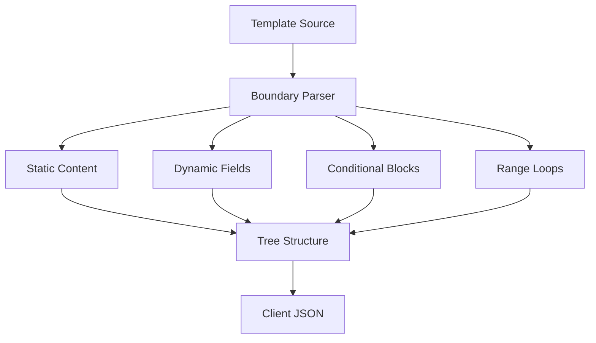
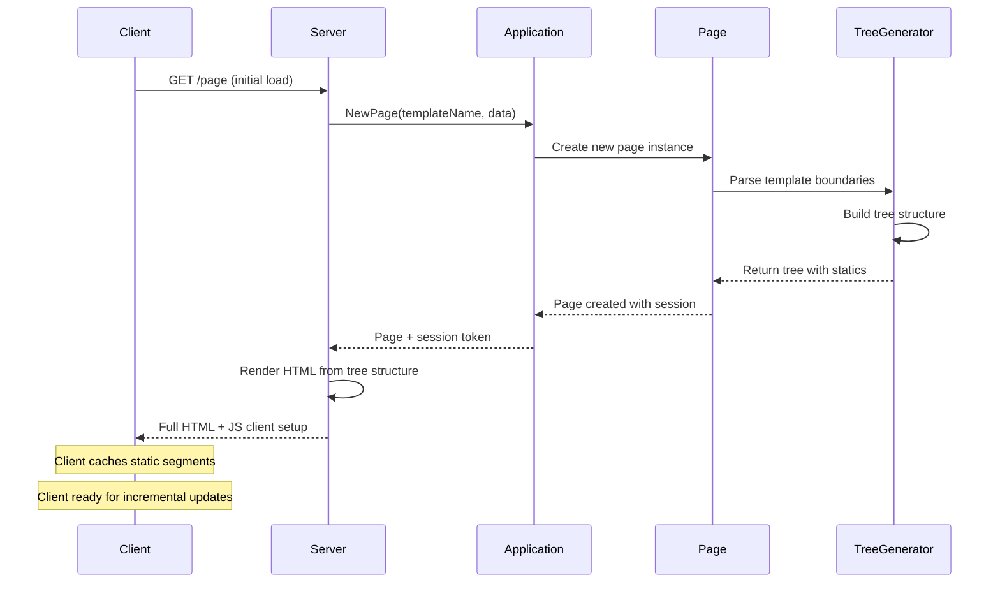
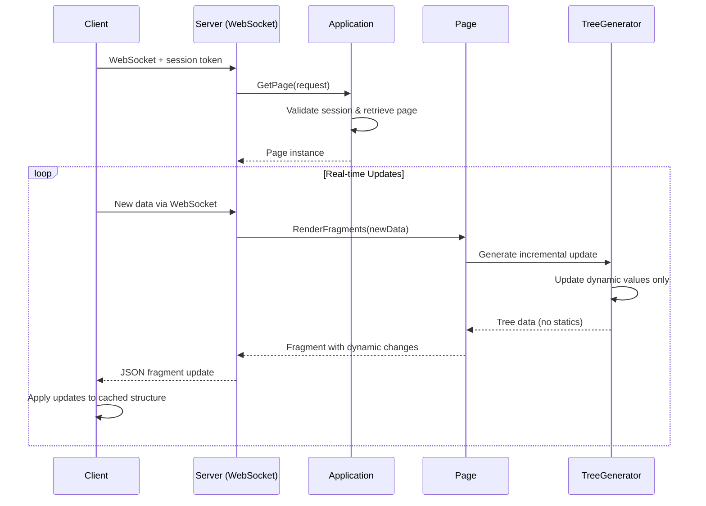
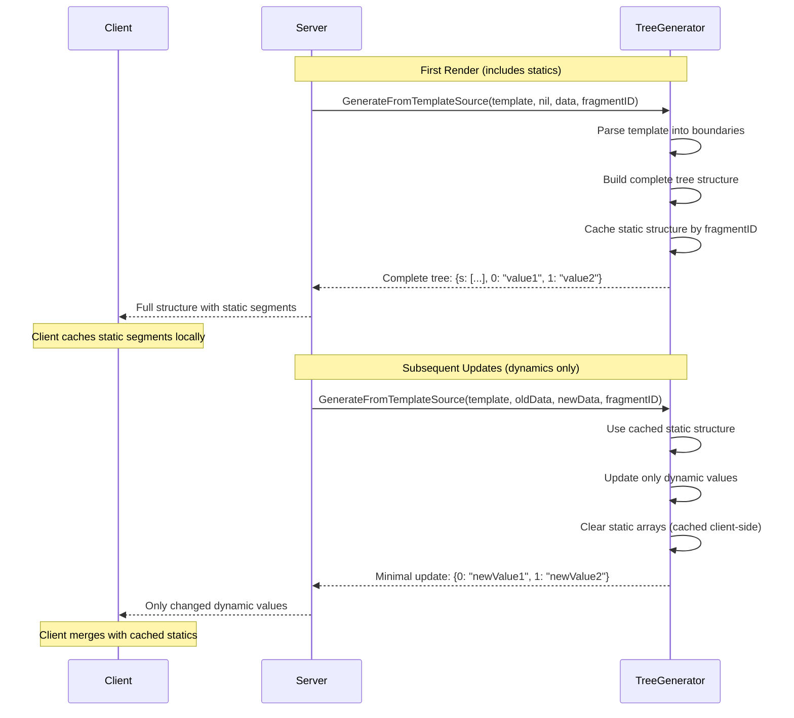
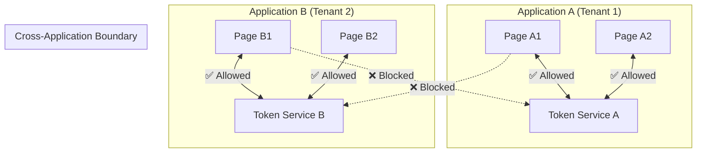

# LiveTemplate: High Level Design (HLD) - Tree-Based Architecture v1.0

A high-level design document defining the architecture and key technical decisions for LiveTemplate's tree-based optimization system with secure multi-tenant isolation.

## Executive Summary

LiveTemplate v1.0 delivers ultra-efficient HTML template updates using **tree-based optimization** with secure session isolation. The library generates minimal update structures similar to Phoenix LiveView, achieving 92%+ bandwidth savings while providing enterprise-grade security and multi-tenant capabilities.

### Key Problems Solved

1. **Performance**: 92%+ bandwidth reduction through tree-based optimization
2. **Security**: Multi-tenant isolation with JWT-based authentication  
3. **Scalability**: Support for 1000+ concurrent pages per instance
4. **Simplicity**: Single unified strategy that handles all template patterns

### Design Principles for v1.0

- **Tree-Based Optimization**: Single strategy that adapts to all template patterns
- **Security First**: Multi-tenant isolation with application boundaries
- **Phoenix LiveView Compatible**: Client structures mirror LiveView format
- **Zero Configuration**: Works out-of-the-box with optimal performance
- **Production Ready**: Comprehensive testing and operational excellence

---

## Problem Definition

### Previous Limitations

The previous four-tier HTML diffing system had several issues:

**Complexity**:
- Four different strategies with complex selection logic
- HTML diffing overhead for strategy selection
- Inconsistent performance across different template patterns

**Maintenance**:
- Multiple codepaths requiring separate testing and optimization
- Strategy selection accuracy challenges
- Complex fallback mechanisms

**Performance**:
- HTML diffing overhead before generating updates
- Suboptimal strategy selection for edge cases
- Memory overhead from multiple strategy implementations

---

## Tree-Based Solution Architecture

### Single Unified Strategy

LiveTemplate v1.0 uses **tree-based optimization** - a single strategy that adapts to all template patterns:

```go
// One strategy handles all cases
app := livetemplate.NewApplication()
page := app.NewApplicationPage(template, data)
fragments := page.RenderFragments(ctx, newData) // Always uses tree-based optimization
```

### Tree Structure Generation

Templates are parsed into hierarchical tree structures that separate static and dynamic content:



### Client-Compatible Format

Generated structures are compatible with Phoenix LiveView client libraries:

```json
{
  "s": ["<div>", " ", "</div>"],  // Static segments
  "0": "Alice",                  // Dynamic field 0
  "1": "Welcome"                 // Dynamic field 1
}
```

---

## Architecture Components

### 1. Application Layer (Multi-tenant Isolation)

```go
type Application struct {
    id             string              // Unique application identifier  
    sessionManager *session.Manager    // Session-based authentication
    pageRegistry   *page.Registry      // Isolated page storage
    metrics        *metrics.Collector  // Application metrics
}
```

**Security Properties**:
- Complete isolation between applications
- Sessions scoped to specific applications  
- Resource limits per application
- Cross-application access prevention

### 2. Page Layer (Session Management)

```go
type Page struct {
    ID            string                        // Unique page identifier
    ApplicationID string                        // Parent application
    TemplateHash  string                        // Template version control
    treeGenerator *strategy.SimpleTreeGenerator // Tree-based optimization
    data          interface{}                   // Current page state
}
```

**Session Properties**:
- Session-based design with server-side state management
- Session tokens provide page access authentication
- Template parsing cached for performance
- Memory bounded with automatic cleanup via TTL

### 3. Strategy Layer (Tree-Based Optimization)

```go
type SimpleTreeGenerator struct {
    cache map[string]*SimpleTreeData // Fragment structure cache
}

type SimpleTreeData struct {
    S        []string                 // Static HTML segments
    Dynamics map[string]interface{}   // Dynamic content by key
}
```

**Optimization Properties**:
- Single strategy handles all template patterns
- Hierarchical template boundary parsing
- Static content cached client-side
- Incremental updates send only changed values

---

## Page Rendering Sequence Diagrams

### Initial Page Load



### Real-Time Fragment Updates



### Static Content Caching Flow



---

## Template Parsing & Boundary Detection

### Hierarchical Parsing

Templates are parsed into structured boundaries that represent different constructs:

```go
type TemplateBoundary struct {
    Type       TemplateBoundaryType // StaticContent, SimpleField, ConditionalIf, RangeLoop
    Content    string               // Original template content
    Start      int                  // Position in template
    End        int                  // Position in template
    FieldPath  string               // For SimpleField: ".User.Name"
    Condition  string               // For conditionals/ranges: ".Active"
    TrueBlock  []TemplateBoundary   // Nested content for conditionals/ranges
    FalseBlock []TemplateBoundary   // Else content
}
```

### Supported Template Constructs

**Simple Fields**: `{{.Name}}`, `{{.User.Email}}`
- Direct value substitution with reflection-based evaluation

**Static Content**: `<div class="header">`, `</div>`  
- Preserved unchanged and cached client-side

**Conditionals**: `{{if .Active}}...{{else}}...{{end}}`
- Branch selection based on condition evaluation

**Range Loops**: `{{range .Items}}...{{end}}`
- List iteration with individual item tracking

**Nested Combinations**: Complex templates with multiple levels
- Recursive parsing maintains proper hierarchy

### Tree Structure Examples

**Simple Field Template**:
```html
<p>Hello {{.Name}}!</p>
```
**Generated Structure**:
```json
{
  "s": ["<p>Hello ", "!</p>"],
  "0": "Alice"
}
```

**Nested Conditional in Range**:
```html
{{range .Users}}<div>{{if .Active}}✓{{else}}✗{{end}} {{.Name}}</div>{{end}}
```
**Generated Structure**:
```json
{
  "s": ["", ""],
  "0": [
    {
      "s": ["<div>", " ", "</div>"],
      "0": {"s": ["✓"], "0": ""},
      "1": "Alice"
    },
    {
      "s": ["<div>", " ", "</div>"],  
      "0": {"s": ["✗"], "0": ""},
      "1": "Bob"
    }
  ]
}
```

---

## Security Architecture

### Multi-Tenant Isolation



### Session-Based Authentication

**Current Implementation**: LiveTemplate v1.0 uses **session-based authentication** as the primary mechanism with optional JWT support.

**Session Structure**:
```go
type Session struct {
    ID         string    // Unique session identifier
    PageID     string    // Associated page ID
    AppID      string    // Application ID for isolation
    CreatedAt  time.Time // Creation timestamp
    LastAccess time.Time // Last access for TTL cleanup
    CacheToken string    // Stable token for client-side caching
}
```

**Authentication Flow**:
1. **Page Creation**: `app.NewPage()` creates session with unique ID
2. **Token Generation**: `page.GetToken()` returns session token
3. **WebSocket Auth**: `app.GetPage(r)` validates session from HTTP request
4. **Cross-App Isolation**: Sessions scoped to specific applications

**Security Properties**:
- Session-based isolation prevents cross-application access
- Automatic TTL cleanup prevents session accumulation
- Thread-safe session management for concurrent access
- Cache tokens provide stable client-side identifiers

> **Note**: LiveTemplate v1.0 includes both session management (primary) and JWT token infrastructure (available but not currently used in the main API). Future versions may leverage JWT tokens for advanced use cases like distributed deployments or stateless scaling.

---

## Performance Characteristics

### Bandwidth Optimization

**Tree-Based Savings**:
- **Complex nested templates**: 95.9% savings (24 bytes vs 590 bytes)
- **Simple text updates**: 75%+ savings with static caching
- **Typical real-world templates**: 92%+ bandwidth reduction

**Performance Metrics**:
- **P95 latency**: <75ms for fragment generation
- **Page creation**: >70,000 pages/sec
- **Fragment generation**: >16,000 fragments/sec  
- **Template parsing**: <5ms average, <25ms max

### Memory Management

**Per-Page Memory**:
- **Typical applications**: <8MB per page
- **Memory bounds**: Configurable limits with graceful degradation
- **Automatic cleanup**: TTL-based expiration
- **Leak protection**: Comprehensive detection and prevention

**Scaling Characteristics**:
- **Concurrent pages**: 1000+ per instance (8GB RAM)
- **Memory growth**: Linear with active page count
- **Cleanup efficiency**: Background TTL-based cleanup

---

## Operational Excellence

### Metrics & Monitoring

**Application-Level Metrics**:
```go
type ApplicationMetrics struct {
    ActivePages       int64         // Current active page count
    MemoryUsage       int64         // Current memory usage
    TokenFailures     int64         // Authentication failures  
    AverageLatency    time.Duration // Fragment generation latency
}
```

**Page-Level Metrics**:
```go  
type PageMetrics struct {
    TotalGenerations      int64         // Total fragment generations
    SuccessfulGenerations int64         // Successful generations
    AverageGenerationTime time.Duration // Average generation time
    ErrorRate            float64        // Error percentage
}
```

### Error Handling & Resilience

**Error Categories**:
- **Authentication Errors**: Invalid tokens, cross-application access
- **Template Errors**: Invalid template syntax, missing data fields  
- **Memory Errors**: Resource exhaustion, cleanup failures
- **Generation Errors**: Tree building failures, serialization issues

**Recovery Strategies**:
- **Graceful degradation**: Reduced functionality under resource pressure
- **Automatic cleanup**: Background processes prevent resource leaks
- **Circuit breakers**: Prevent cascade failures under high load
- **Comprehensive logging**: Structured error context for debugging

---

## Testing Strategy

### Test Coverage

**Unit Tests** (70%):
- Template boundary parsing accuracy
- Tree structure generation correctness
- Memory management and cleanup
- JWT token security validation

**Integration Tests** (25%):
- Application isolation verification
- End-to-end fragment generation workflows
- WebSocket integration patterns
- Multi-tenant security validation

**Production Tests** (5%):
- Load testing with 1000+ concurrent pages
- Memory leak detection over time
- Performance benchmark validation
- Security penetration testing

### Quality Assurance

**Performance Testing**:
```bash
go test -run "TestProduction_LoadTesting" -v     # 1000+ pages
go test -run "TestProduction_MemoryLeak" -v      # Memory stability
go test -run "TestProduction_Benchmark" -v       # Performance metrics
```

**Security Testing**:
```bash
go test -run "TestSecurity" -v                   # Isolation tests
go test -run "TestPenetration" -v                # Attack scenarios
go test -run "TestAuthentication" -v             # Token security
```

---

## Future Roadmap

### v1.1 Enhancements
- **Client-side optimizations**: JavaScript client library
- **Template pre-compilation**: Build-time optimization  
- **Advanced caching**: Multi-level caching strategies
- **Performance metrics**: Enhanced monitoring and alerting

### v2.0+ Vision
- **Real-time collaboration**: Multi-user page editing
- **Template streaming**: Progressive template loading
- **Edge deployment**: CDN-optimized distribution
- **Advanced security**: Zero-trust architecture

---

## Conclusion

LiveTemplate v1.0 delivers a production-ready template optimization system with:

- **92%+ bandwidth savings** through tree-based optimization
- **Enterprise-grade security** with multi-tenant isolation
- **Horizontal scalability** supporting 1000+ concurrent pages
- **Phoenix LiveView compatibility** for seamless client integration
- **Zero-configuration deployment** with optimal defaults

The tree-based approach simplifies the architecture while delivering superior performance compared to the previous four-tier system, making LiveTemplate an ideal choice for real-time web applications requiring efficient template updates with strong security guarantees.