# LiveTemplate: Low Level Design (LLD)

A comprehensive technical specification for implementing secure session isolation with hybrid incremental updates for LiveTemplate as defined in [DESIGN.md](./DESIGN.md).

> **Implementation Ready**: This document provides concrete component specifications, interfaces, and test requirements for production implementation following zero-configuration design principles with automatic optimization.

---

## API Boundary and Package Structure

### Public API Surface

LiveTemplate exposes a minimal, zero-configuration public API. **Only the following types are exported**:

```go
// Core public types - exported from main package
type Application struct { /* private fields */ }
type Page struct { /* private fields */ }
type Fragment struct { /* public fields */ }
type TemplateAnalysis struct { /* public fields */ }
type PerformanceMetrics struct { /* public fields */ }
type MemoryStats struct { /* public fields */ }

// Configuration options - exported for customization
type ApplicationOption func(*Application) error
type PageOption func(*Page) error
```

**Public API Functions**:

```go
// Application management
func NewApplication(options ...ApplicationOption) *Application
func (app *Application) NewPage(tmpl *html.Template, data interface{}, options ...PageOption) *Page
func (app *Application) GetPageByToken(token string) (*Page, error)
func (app *Application) Close() error

// Page lifecycle
func (p *Page) GetToken() string
func (p *Page) Render() (string, error)
func (p *Page) RenderFragments(ctx context.Context, newData interface{}) ([]Fragment, error)
func (p *Page) SetData(data interface{}) error
func (p *Page) Close() error

// Application management and observability
func NewApplication(options ...ApplicationOption) *Application
func (app *Application) NewPage(templates *html.Template, data interface{}, options ...PageOption) *Page
func (app *Application) GetPageByToken(token string) (*Page, error)
func (app *Application) Debug() *Debug

// Debug provides application-scoped observability
type Debug struct {
    // Application-scoped debugging and metrics
}

func (d *Debug) GetTemplateAnalysis(pageID string) (*TemplateAnalysis, error)
func (d *Debug) GetPerformanceMetrics() PerformanceMetrics
func (d *Debug) GetMemoryStats() MemoryStats
```

### Internal Package Structure

**All implementation details are internal and not exposed**:

```
livetemplate/
├── livetemplate.go           // Public API only
├── types.go                  // Public types only
├── options.go                // Public configuration options
└── internal/                 // All implementation details
    ├── application/          // Application management
    ├── security/             // TokenService, authentication
    ├── analysis/             // TemplateAnalyzer, FragmentTracker
    ├── planning/             // UpdatePlanner, DiffEngine
    ├── memory/               // MemoryManager, budgets
    ├── messaging/            // MessageFormatter, delivery
    ├── observability/        // Metrics, tracing, logging
    └── config/               // Internal configuration
```

**Key Design Principle**: The public API is intentionally minimal to:

- Prevent breaking changes as internal implementation evolves
- Maintain zero-configuration philosophy
- Enable comprehensive testing of internal components without exposing them
- Allow optimization and refactoring without API changes

---

## Executive Summary

This LLD transforms LiveTemplate from a singleton page model into a production-ready library with:

- **Complete Session Isolation**: Application-scoped registries with token-based authentication prevent cross-user data leakage
- **Zero-Configuration Optimization**: Automatic template analysis selects optimal update modes (85% bandwidth reduction via value patches, 60% via fragment replacement)
- **High-Performance Updates**: Sub-200ms latency supporting 10,000+ concurrent sessions with intelligent batching and coalescing
- **Production-Ready Security**: Token rotation, memory management, and comprehensive observability

### Key Design Principles

1. **Zero-Configuration Operation**: Intelligent defaults with automatic mode selection
2. **Security-First Architecture**: Complete isolation with no shared state between sessions
3. **Performance by Default**: Automatic bandwidth optimization without developer configuration
4. **Test-Driven Implementation**: Comprehensive test coverage from unit to end-to-end scenarios

---

## Table of Contents

1. [Architecture Overview](#architecture-overview)
2. [Security Foundation Components](#security-foundation-components)
3. [Performance Optimization Components](#performance-optimization-components)
4. [Production Components](#production-components)
5. [Test-Driven Development Strategy](#test-driven-development-strategy)
6. [Implementation Roadmap](#implementation-roadmap)
7. [Integration Patterns](#integration-patterns)

---

## Architecture Overview

### Two-Layer Architecture

LiveTemplate implements a **two-layer architecture** that provides both security and performance optimization:

```
┌─────────────────────────────────────────────────────────────┐
│                 Page Isolation Layer                        │
│                 (Security & Session Management)             │
│                                                             │
│  ┌─────────────────┐    ┌──────────────────────────────────┐ │
│  │   Application   │◄──►│        TokenService              │ │
│  │   (Multi-tenant)│    │    (Secure Authentication)       │ │
│  └─────────────────┘    └──────────────────────────────────┘ │
│           │                                                  │
│           ▼                                                  │
│  ┌─────────────────┐    ┌──────────────────────────────────┐ │
│  │   PageRegistry  │◄──►│         Page                     │ │
│  │   (Isolation)   │    │     (Session State)              │ │
│  └─────────────────┘    └──────────────────────────────────┘ │
└─────────────────────────────────────────────────────────────┘
                            │
                            ▼
┌─────────────────────────────────────────────────────────────┐
│           Hybrid Incremental Update Layer                  │
│           (Performance & Bandwidth Optimization)           │
│                                                             │
│  ┌─────────────────┐    ┌──────────────────────────────────┐ │
│  │ TemplateAnalyzer│◄──►│      AnalysisCache               │ │
│  │  (AST Parser)   │    │     (LRU Cache)                  │ │
│  └─────────────────┘    └──────────────────────────────────┘ │
│           │                                                  │
│           ▼                                                  │
│  ┌─────────────────┐    ┌──────────────────────────────────┐ │
│  │ FragmentTracker │◄──►│      UpdatePlanner               │ │
│  │ (Position Data) │    │   (Mode Selection)               │ │
│  └─────────────────┘    └──────────────────────────────────┘ │
│           │                                                  │
│           ▼                                                  │
│  ┌─────────────────┐    ┌──────────────────────────────────┐ │
│  │ MessageFormatter│◄──►│      MemoryManager               │ │
│  │  (Wire Protocol)│    │   (Resource Control)             │ │
│  └─────────────────┘    └──────────────────────────────────┘ │
└─────────────────────────────────────────────────────────────┘
```

### Core Design Principles

#### 1. Zero-Configuration Operation

All optimization decisions are made automatically without developer configuration:

```go
// Simple API with automatic optimization
page := livetemplate.NewPage(template, data)
fragments, err := page.RenderFragments(ctx, newData)

// Library automatically:
// - Analyzes template for update mode capability
// - Selects optimal update strategy (value patches vs fragment replacement)
// - Applies intelligent batching and coalescing
// - Manages memory budgets and cleanup
```

#### 2. Security-First Isolation

Complete isolation between sessions with no shared state:

```go
// Each application has isolated registry
appA := livetemplate.NewApplication(
    livetemplate.WithApplicationID("service-a"),
)
appB := livetemplate.NewApplication(
    livetemplate.WithApplicationID("service-b"),
)

// Pages within applications are completely isolated
pageA1 := appA.NewPage(template, userDataA1)
pageA2 := appA.NewPage(template, userDataA2)

// Cross-application access is blocked
invalidPage := appA.GetPageByToken(pageB1.GetToken()) // Returns ErrInvalidApplication
```

#### 3. Automatic Performance Optimization

The system automatically optimizes bandwidth based on template analysis:

- **Value Patch Mode**: 85% bandwidth reduction for supported templates
- **Fragment Replace Mode**: 60% bandwidth reduction for complex templates
- **Automatic Fallback**: Graceful degradation when memory or complexity limits exceeded

### Component Responsibilities

#### Page Isolation Layer Components

1. **Application**: Multi-tenant container with isolated page registries
2. **TokenService**: Secure authentication with automatic key rotation
3. **PageRegistry**: Thread-safe page storage with automatic cleanup
4. **Page**: Session-scoped state management with lifecycle control

#### Hybrid Incremental Update Layer Components

5. **TemplateAnalyzer**: AST-based template analysis with capability detection
6. **FragmentTracker**: Deterministic fragment ID generation and position tracking
7. **UpdatePlanner**: Intelligent update strategy selection and optimization
8. **MessageFormatter**: Wire protocol formatting with compression and chunking
9. **MemoryManager**: Resource budgets with graceful degradation
10. **DiffEngine**: Efficient data change detection and computation

### Key Architectural Decisions

#### Decision 1: Application-Scoped vs Global Architecture

**Chosen**: Application-scoped registries with isolated signing keys

**Rationale**:

- Strongest isolation guarantees between applications
- Simplest security model with no cross-tenant concerns
- Enables multi-application deployments on single instance

**Trade-offs**:

- Breaking change from singleton model (acceptable for unreleased library)
- Slightly higher memory usage per application

#### Decision 2: Static Analysis vs Runtime Adaptation

**Chosen**: Static template analysis with automatic mode selection

**Rationale**:

- Deterministic behavior makes debugging and optimization predictable
- Zero configuration required from developers
- Cache-friendly with high hit rates (90%+)

**Trade-offs**:

- Some edge cases may not be optimally handled
- Template changes require analysis cache invalidation

#### Decision 3: Memory-Based vs Persistent Sessions

**Chosen**: Memory-based with optional Redis backing

**Rationale**:

- Optimal performance for real-time applications
- Simplified deployment without external dependencies
- Optional persistence for critical applications

**Trade-offs**:

- Session loss on restart (mitigated by client resync)

---

## Architecture Overview

### Two-Layer Architecture

LiveTemplate implements a **two-layer architecture** providing both security and performance optimization:

```
┌─────────────────────────────────────────────────────────────┐
│                 Page Isolation Layer                        │
│                 (Security & Session Management)             │
│                                                             │
│  ┌─────────────────┐    ┌──────────────────────────────────┐ │
│  │   Application   │◄──►│        TokenService              │ │
│  │   (Multi-tenant)│    │    (Secure Authentication)       │ │
│  └─────────────────┘    └──────────────────────────────────┘ │
│           │                                                  │
│           ▼                                                  │
│  ┌─────────────────┐    ┌──────────────────────────────────┐ │
│  │   PageRegistry  │◄──►│         Page                     │ │
│  │   (Isolation)   │    │     (Session State)              │ │
│  └─────────────────┘    └──────────────────────────────────┘ │
└─────────────────────────────────────────────────────────────┘
                            │
                            ▼
┌─────────────────────────────────────────────────────────────┐
│           Hybrid Incremental Update Layer                  │
│           (Performance & Bandwidth Optimization)           │
│                                                             │
│  ┌─────────────────┐    ┌──────────────────────────────────┐ │
│  │ TemplateAnalyzer│◄──►│      AnalysisCache               │ │
│  │  (AST Parser)   │    │     (LRU Cache)                  │ │
│  └─────────────────┘    └──────────────────────────────────┘ │
│           │                                                  │
│           ▼                                                  │
│  ┌─────────────────┐    ┌──────────────────────────────────┐ │
│  │ FragmentTracker │◄──►│      UpdatePlanner               │ │
│  │ (Position Data) │    │   (Mode Selection)               │ │
│  └─────────────────┘    └──────────────────────────────────┘ │
│           │                                                  │
│           ▼                                                  │
│  ┌─────────────────┐    ┌──────────────────────────────────┐ │
│  │ MessageFormatter│◄──►│      MemoryManager               │ │
│  │  (Wire Protocol)│    │   (Resource Control)             │ │
│  └─────────────────┘    └──────────────────────────────────┘ │
└─────────────────────────────────────────────────────────────┘
```

### Zero-Configuration Design Principles

#### 1. Automatic Optimization

```go
// No configuration required - library makes optimal decisions
page := livetemplate.NewPage(template, data)
fragments, err := page.RenderFragments(ctx, newData)

// Automatic behaviors:
// - Template analysis determines update mode capability
// - Value patches preferred (85% bandwidth reduction)
// - Fragment replacement fallback (60% bandwidth reduction)
// - Intelligent batching and coalescing
// - Memory management with graceful degradation
```

#### 2. Security-First Architecture

```go
// Complete isolation between applications and sessions
appA := livetemplate.NewApplication(livetemplate.WithApplicationID("service-a"))
appB := livetemplate.NewApplication(livetemplate.WithApplicationID("service-b"))

// Cross-application access automatically blocked
pageA := appA.NewPage(template, userData1)
pageB := appB.NewPage(template, userData2)

// This returns ErrInvalidApplication - complete isolation guaranteed
invalidAccess := appA.GetPageByToken(pageB.GetToken())
```

---

## Security Foundation Components (Internal)

> **Note**: All components in this section are internal implementation details in the `internal/` package and are not exposed in the public API.

### 1. Application Component (internal/application)

**Purpose**: Multi-tenant container providing application-level isolation with secure page registry management.

**Internal Interface** (not exported):

```go
// internal/application/application.go
// All fields and methods are unexported
type application struct {
    id           string
    pageRegistry *pageRegistry
    tokenService *security.TokenService
    config       *config.ApplicationConfig
    metrics      *observability.ApplicationMetrics
    mu           sync.RWMutex
}

type applicationConfig struct {
    applicationID    string            // Unique application identifier
    maxPages         int               // Default: 10,000 pages per application
    pageTTL          time.Duration     // Default: 1 hour
    signingKey       []byte            // For token generation/validation
    enableMetrics    bool              // Default: true
    sessionStore     SessionStore      // Optional Redis backing
}

type AppMetrics struct {
    ActivePages      int64
    TotalPages       int64
    TokenGenerations int64
    TokenValidations int64
    MemoryUsage      int64
    LastActivity     time.Time
}

// Core operations
func NewApplication(options ...AppOption) *Application
func (app *Application) NewPage(tmpl *html.Template, data interface{}, options ...PageOption) (*Page, error)
func (app *Application) GetPageByToken(token string) (*Page, error)
func (app *Application) GetMetrics() *AppMetrics
func (app *Application) Close() error

// Configuration options
type AppOption func(*Application) error

func WithApplicationID(id string) AppOption
func WithMaxPages(max int) AppOption
func WithSessionStore(store SessionStore) AppOption
func WithSigningKey(key []byte) AppOption
```

#### Implementation Strategy

```go
func NewApplication(options ...AppOption) *Application {
    app := &Application{
        id:           generateApplicationID(),
        pageRegistry: NewPageRegistry(),
        tokenService: NewTokenService(),
        config:       DefaultAppConfig(),
        metrics:      &AppMetrics{},
    }

    // Apply functional options
    for _, option := range options {
        if err := option(app); err != nil {
            log.Fatal("Failed to configure application", "error", err)
        }
    }

    // Initialize token service with application context
    app.tokenService.Initialize(app.config.SigningKey, app.id)

    // Start background cleanup if TTL configured
    if app.config.PageTTL > 0 {
        go app.startCleanupLoop()
    }

    return app
}

func (app *Application) NewPage(tmpl *html.Template, data interface{}, options ...PageOption) (*Page, error) {
    app.mu.Lock()
    defer app.mu.Unlock()

    // Check page limits
    if app.pageRegistry.Count() >= app.config.MaxPages {
        return nil, ErrMaxPagesExceeded
    }

    // Create page with application context
    page := &Page{
        id:            generatePageID(),
        applicationID: app.id,
        template:      tmpl,
        data:          data,
        createdAt:     time.Now(),
        config:        DefaultPageConfig(),
    }

    // Apply page options
    for _, option := range options {
        if err := option(page); err != nil {
            return nil, fmt.Errorf("page configuration failed: %w", err)
        }
    }

    // Generate secure token
    token, err := app.tokenService.GenerateToken(page.id, app.id)
    if err != nil {
        return nil, fmt.Errorf("token generation failed: %w", err)
    }
    page.token = token

    // Register page
    app.pageRegistry.Store(page.id, page)

    // Update metrics
    app.metrics.ActivePages++
    app.metrics.TotalPages++
    app.metrics.LastActivity = time.Now()

    return page, nil
}

func (app *Application) GetPageByToken(tokenStr string) (*Page, error) {
    // Validate token and extract page ID
    pageToken, err := app.tokenService.ValidateToken(tokenStr)
    if err != nil {
        app.metrics.TokenValidations++
        return nil, fmt.Errorf("invalid token: %w", err)
    }

    // Security check: ensure token belongs to this application
    if pageToken.ApplicationID != app.id {
        log.Warn("Cross-application token access attempted",
            "token_app_id", pageToken.ApplicationID,
            "current_app_id", app.id)
        return nil, ErrInvalidApplication
    }

    // Retrieve page
    page, exists := app.pageRegistry.Load(pageToken.PageID)
    if !exists {
        return nil, ErrPageNotFound
    }

    app.metrics.TokenValidations++
    return page, nil
}
```

#### Test Requirements

```go
// Test file: application_test.go
func TestApplicationIsolation(t *testing.T) {
    appA := NewApplication(WithApplicationID("app-a"))
    appB := NewApplication(WithApplicationID("app-b"))
    defer appA.Close()
    defer appB.Close()

    template := template.Must(template.New("test").Parse("{{.Name}}"))

    // Create pages in different applications
    pageA, err := appA.NewPage(template, map[string]interface{}{"Name": "Alice"})
    require.NoError(t, err)

    pageB, err := appB.NewPage(template, map[string]interface{}{"Name": "Bob"})
    require.NoError(t, err)

    // Cross-application access should be blocked
    _, err = appA.GetPageByToken(pageB.GetToken())
    assert.Equal(t, ErrInvalidApplication, err)

    _, err = appB.GetPageByToken(pageA.GetToken())
    assert.Equal(t, ErrInvalidApplication, err)

    // Same-application access should work
    retrievedA, err := appA.GetPageByToken(pageA.GetToken())
    assert.NoError(t, err)
    assert.Equal(t, pageA.id, retrievedA.id)
}

func TestPageLimits(t *testing.T) {
    app := NewApplication(WithMaxPages(2))
    defer app.Close()

    template := template.Must(template.New("test").Parse("{{.Name}}"))

    // Create pages up to limit
    page1, err := app.NewPage(template, map[string]interface{}{"Name": "User1"})
    assert.NoError(t, err)
    assert.NotNil(t, page1)

    page2, err := app.NewPage(template, map[string]interface{}{"Name": "User2"})
    assert.NoError(t, err)
    assert.NotNil(t, page2)

    // Third page should fail
    page3, err := app.NewPage(template, map[string]interface{}{"Name": "User3"})
    assert.Equal(t, ErrMaxPagesExceeded, err)
    assert.Nil(t, page3)
}
```

### 2. Page Component

**Purpose**: Isolated session state management with automatic update generation and zero-configuration optimization.

#### Component Interface

```go
// Page represents an isolated session with template and data
type Page struct {
    id            string
    applicationID string
    token         string
    template      *html.Template
    data          interface{}
    createdAt     time.Time
    lastAccess    time.Time

    // Analysis and optimization
    analyzer      *TemplateAnalyzer
    analysis      *TemplateAnalysis
    fragmentMap   map[string]*Fragment
    positionTracker *PositionTracker

    // Configuration and metrics
    config        *PageConfig
    metrics       *PageMetrics

    // Synchronization
    mu            sync.RWMutex
    renderMu      sync.Mutex
}

type PageConfig struct {
    MemoryBudgetMB  int           // Default: 10MB per page
    EnableCaching   bool          // Default: true
    BatchingWindow  time.Duration // Default: 16ms (60fps)
    MaxOperations   int           // Default: 1000 per update
}

type PageMetrics struct {
    RenderCount      int64
    UpdateCount      int64
    BandwidthSaved   int64
    LastUpdateMode   UpdateMode
    FragmentCount    int
    MemoryUsage      int64
}

// Core operations
func (p *Page) Render() (string, error)
func (p *Page) RenderFragments(ctx context.Context, newData interface{}) ([]Fragment, error)
func (p *Page) SetData(data interface{}) error
func (p *Page) GetToken() string
func (p *Page) Close() error

// Application-level debugging (accessed via app.Debug())
type Debug struct {
    app *Application
}

func (d *Debug) GetTemplateAnalysis(pageID string) (*TemplateAnalysis, error)
func (d *Debug) GetPageMetrics(pageID string) (*PageMetrics, error)
func (d *Debug) GetPerformanceMetrics() PerformanceMetrics
func (d *Debug) GetMemoryStats() MemoryStats
func (d *Debug) ListActivePages() []PageSummary
```

#### Implementation Strategy

```go
func (p *Page) Render() (string, error) {
    p.mu.RLock()
    defer p.mu.RUnlock()

    start := time.Now()

    // Perform template analysis if not cached
    if p.analysis == nil {
        analysis, err := p.analyzer.AnalyzeTemplate(p.template)
        if err != nil {
            return "", fmt.Errorf("template analysis failed: %w", err)
        }
        p.analysis = analysis
        p.fragmentMap = analysis.Fragments
    }

    // Render template with current data
    var buf bytes.Buffer
    if err := p.template.Execute(&buf, p.data); err != nil {
        return "", fmt.Errorf("template execution failed: %w", err)
    }

    html := buf.String()

    // Annotate with stable fragment IDs for subsequent updates
    annotatedHTML, err := p.annotateFragments(html)
    if err != nil {
        return "", fmt.Errorf("fragment annotation failed: %w", err)
    }

    // Initialize position tracking for value patches
    if p.analysis.Mode == ValuePatch {
        p.positionTracker = NewPositionTracker(annotatedHTML, p.fragmentMap)
    }

    // Update metrics
    p.metrics.RenderCount++
    p.metrics.LastUpdateMode = p.analysis.Mode
    p.metrics.FragmentCount = len(p.fragmentMap)

    return annotatedHTML, nil
}

func (p *Page) RenderFragments(ctx context.Context, newData interface{}) ([]Fragment, error) {
    // Serialize update generation per page to prevent race conditions
    p.renderMu.Lock()
    defer p.renderMu.Unlock()

    start := time.Now()

    // Compute data differences
    diff, err := p.computeDataDiff(p.data, newData)
    if err != nil {
        return nil, fmt.Errorf("diff computation failed: %w", err)
    }

    if len(diff.Changes) == 0 {
        return []Fragment{}, nil // No changes
    }

    var updates []Fragment

    // Generate updates based on analysis mode
    switch p.analysis.Mode {
    case ValuePatch:
        updates, err = p.generateValueUpdates(diff)
        if err != nil {
            // Fallback to fragment replacement on value patch failure
            log.Warn("Value patch failed, falling back to fragment replacement",
                "page_id", p.id, "error", err)
            updates, err = p.generateFragmentUpdates(diff)
        }
    case FragmentReplace:
        updates, err = p.generateFragmentUpdates(diff)
    default:
        return nil, fmt.Errorf("unsupported update mode: %v", p.analysis.Mode)
    }

    if err != nil {
        return nil, fmt.Errorf("update generation failed: %w", err)
    }

    // Apply batching and coalescing
    updates = p.coalesceUpdates(updates)

    // Update page state
    p.mu.Lock()
    p.data = newData
    p.lastAccess = time.Now()
    p.metrics.UpdateCount++
    p.mu.Unlock()

    return updates, nil
}

func (p *Page) generateValueUpdates(diff *DataDiff) ([]Fragment, error) {
    var updates []Fragment

    for _, change := range diff.Changes {
        // Find fragment containing this data path
        fragmentID := p.findFragmentByDataPath(change.Path)
        if fragmentID == "" {
            continue
        }

        // Get value position in rendered HTML
        position, err := p.positionTracker.GetValuePosition(fragmentID, change.Path)
        if err != nil {
            return nil, fmt.Errorf("position tracking failed for %s: %w", change.Path, err)
        }

        // Create value update
        fragment := Fragment{
            ID:     fragmentID,
            Action: "value_updates",
            Data: []ValueUpdate{{
                Position:  position.Start,
                Length:    position.Length,
                NewValue:  fmt.Sprintf("%v", change.NewValue),
                DataPath:  change.Path,
                ValueType: inferValueType(change.NewValue),
            }},
        }

        updates = append(updates, fragment)
    }

    return updates, nil
}

func (p *Page) generateFragmentUpdates(diff *DataDiff) ([]Fragment, error) {
    fragmentsToUpdate := make(map[string]bool)

    // Identify fragments affected by changes
    for _, change := range diff.Changes {
        fragmentID := p.findFragmentByDataPath(change.Path)
        if fragmentID != "" {
            fragmentsToUpdate[fragmentID] = true
        }
    }

    var updates []Fragment
    for fragmentID := range fragmentsToUpdate {
        // Re-render fragment with new data
        fragmentHTML, err := p.renderFragment(fragmentID, p.data)
        if err != nil {
            return nil, fmt.Errorf("fragment render failed for %s: %w", fragmentID, err)
        }

        fragment := Fragment{
            ID:     fragmentID,
            Action: "replace",
            Data:   fragmentHTML,
        }

        updates = append(updates, fragment)
    }

    return updates, nil
}
```

#### Test Requirements

```go
// Test file: page_test.go
func TestPageRender(t *testing.T) {
    template := template.Must(template.New("test").Parse(`
        <div>Hello {{.Name}}!</div>
        <div>Count: {{.Count}}</div>
    `))

    page := &Page{
        id:       "test-page",
        template: template,
        data: map[string]interface{}{
            "Name":  "Alice",
            "Count": 42,
        },
        analyzer: NewTemplateAnalyzer(DefaultConfig()),
    }

    html, err := page.Render()
    assert.NoError(t, err)
    assert.Contains(t, html, "Hello Alice!")
    assert.Contains(t, html, "Count: 42")
    assert.Contains(t, html, `data-fragment-id=`)
}

func TestZeroConfigurationUpdates(t *testing.T) {
    template := template.Must(template.New("test").Parse(`
        <div>{{.Name}} is {{.Age}} years old</div>
    `))

    page := &Page{
        id:       "test-page",
        template: template,
        data: map[string]interface{}{
            "Name": "Alice",
            "Age":  25,
        },
        analyzer: NewTemplateAnalyzer(DefaultConfig()),
    }

    // Initial render - automatic analysis
    _, err := page.Render()
    assert.NoError(t, err)

    // Should automatically select value patch mode for simple interpolation
    assert.Equal(t, ValuePatch, page.GetUpdateMode())

    // Update data - automatic optimization
    newData := map[string]interface{}{
        "Name": "Alice",  // Unchanged
        "Age":  26,       // Changed
    }

    fragments, err := page.RenderFragments(context.Background(), newData)
    assert.NoError(t, err)
    assert.Len(t, fragments, 1)

    fragment := fragments[0]
    assert.Equal(t, ValueUpdatesAction, fragment.Action)

    valueUpdates := update.Data.([]ValueUpdate)
    assert.Len(t, valueUpdates, 1)
    assert.Equal(t, "26", valueUpdates[0].NewValue)
}

func TestAutomaticFallback(t *testing.T) {
    // Template with dynamic structure (unsupported for value patches)
    template := template.Must(template.New("test").Parse(`
        {{if .ShowDetails}}
            <div>Details: {{.Details}}</div>
        {{else}}
            <div>No details</div>
        {{end}}
    `))

    page := &Page{
        id:       "test-page",
        template: template,
        data: map[string]interface{}{
            "ShowDetails": true,
            "Details":     "Some info",
        },
        analyzer: NewTemplateAnalyzer(DefaultConfig()),
    }

    _, err := page.Render()
    assert.NoError(t, err)

    // Should automatically fall back to fragment replacement
    assert.Equal(t, FragmentReplace, page.GetUpdateMode())

    newData := map[string]interface{}{
        "ShowDetails": false, // Structure change
        "Details":     "Different info",
    }

    fragments, err := page.RenderFragments(context.Background(), newData)
    assert.NoError(t, err)
    assert.Len(t, fragments, 1)
    assert.Equal(t, ReplaceAction, fragments[0].Action)
}
```

---

## Performance Optimization Components

### 3. TemplateAnalyzer Component

**Purpose**: AST-based analysis of Go html/template to automatically determine optimal update mode capabilities.

#### Component Interface

```go
// TemplateAnalyzer performs automatic template analysis for optimization
type TemplateAnalyzer struct {
    parser         *TemplateParser
    cache          *AnalysisCache
    config         *AnalyzerConfig
}

type AnalyzerConfig struct {
    CacheSize      int           // Default: 1000 analyses
    AnalysisTimeout time.Duration // Default: 5 seconds
    EnableMetrics  bool          // Default: true
}

type TemplateAnalysis struct {
    TemplateHash    string
    Mode            UpdateMode
    Fragments       map[string]*FragmentAnalysis
    Capabilities    *CapabilityReport
    ComputedAt      time.Time
    CacheHit        bool
}

type FragmentAnalysis struct {
    ID             string
    DataPaths      []string
    EstimatedSize  int
    Complexity     ComplexityLevel
}

type CapabilityReport struct {
    SupportedNodes      int
    UnsupportedNodes    int
    SupportPercentage   float64
    Reasons             []string
    Recommendations     []string
}

type UpdateMode int

const (
    ValuePatch UpdateMode = iota    // 85% bandwidth reduction
    FragmentReplace                 // 60% bandwidth reduction
)

// Core operations
func NewTemplateAnalyzer(config *AnalyzerConfig) *TemplateAnalyzer
func (ta *TemplateAnalyzer) AnalyzeTemplate(tmpl *html.Template) (*TemplateAnalysis, error)
func (ta *TemplateAnalyzer) GetCacheStats() *CacheStats
func (ta *TemplateAnalyzer) InvalidateCache(templateHash string)
func (ta *TemplateAnalyzer) Close() error
```

#### Implementation Strategy

```go
func NewTemplateAnalyzer(config *AnalyzerConfig) *TemplateAnalyzer {
    if config == nil {
        config = DefaultAnalyzerConfig()
    }

    ta := &TemplateAnalyzer{
        parser: NewTemplateParser(),
        cache:  NewAnalysisCache(config.CacheSize),
        config: config,
    }

    return ta
}

func (ta *TemplateAnalyzer) AnalyzeTemplate(tmpl *html.Template) (*TemplateAnalysis, error) {
    start := time.Now()

    // Generate content hash for cache lookup
    templateHash := ta.computeTemplateHash(tmpl)

    // Check cache first
    if analysis := ta.cache.Get(templateHash); analysis != nil {
        analysis.CacheHit = true
        return analysis, nil
    }

    // Perform analysis
    analysis, err := ta.performAnalysis(tmpl, templateHash)
    if err != nil {
        return nil, err
    }

    analysis.ComputedAt = time.Now()
    analysis.CacheHit = false

    // Cache result
    ta.cache.Put(templateHash, analysis)

    return analysis, nil
}

func (ta *TemplateAnalyzer) performAnalysis(tmpl *html.Template, hash string) (*TemplateAnalysis, error) {
    analysis := &TemplateAnalysis{
        TemplateHash: hash,
        Fragments:    make(map[string]*FragmentAnalysis),
        Capabilities: &CapabilityReport{},
    }

    // Parse template AST
    for _, t := range tmpl.Templates() {
        if t.Tree == nil || t.Tree.Root == nil {
            continue
        }

        // Walk AST nodes and classify constructs
        supported := 0
        unsupported := 0
        var reasons []string

        err := ta.walkNode(t.Tree.Root, analysis, &supported, &unsupported, &reasons)
        if err != nil {
            return nil, fmt.Errorf("AST analysis failed: %w", err)
        }

        analysis.Capabilities.SupportedNodes += supported
        analysis.Capabilities.UnsupportedNodes += unsupported
        analysis.Capabilities.Reasons = append(analysis.Capabilities.Reasons, reasons...)
    }

    // Determine update mode based on analysis
    if analysis.Capabilities.UnsupportedNodes > 0 {
        analysis.Mode = FragmentReplace
        analysis.Capabilities.Recommendations = append(analysis.Capabilities.Recommendations,
            "Template contains dynamic structure - using fragment replacement (60% bandwidth reduction)")
    } else {
        analysis.Mode = ValuePatch
        analysis.Capabilities.Recommendations = append(analysis.Capabilities.Recommendations,
            "Template supports value patching (85% bandwidth reduction)")
    }

    // Calculate support percentage
    total := analysis.Capabilities.SupportedNodes + analysis.Capabilities.UnsupportedNodes
    if total > 0 {
        analysis.Capabilities.SupportPercentage = float64(analysis.Capabilities.SupportedNodes) / float64(total) * 100
    }

    return analysis, nil
}

func (ta *TemplateAnalyzer) walkNode(node parse.Node, analysis *TemplateAnalysis,
    supported, unsupported *int, reasons *[]string) error {

    if node == nil {
        return nil
    }

    switch n := node.(type) {
    case *parse.ActionNode:
        // {{.Field}} - supported for value patching
        *supported++

    case *parse.IfNode:
        // {{if .Condition}} - check if structure is static
        if ta.isStaticConditional(n) {
            *supported++
        } else {
            *unsupported++
            *reasons = append(*reasons, "Dynamic conditional affects HTML structure")
        }

    case *parse.RangeNode:
        // {{range .Items}} - check if stable
        if ta.hasStableKeys(n) {
            *supported++
        } else {
            *unsupported++
            *reasons = append(*reasons, "Range without stable keys affects fragment stability")
        }

    case *parse.TemplateNode:
        // {{template .Name .}} - dynamic template inclusion
        if ta.isDynamicTemplate(n) {
            *unsupported++
            *reasons = append(*reasons, "Dynamic template inclusion not supported for value patches")
        } else {
            *supported++
        }

    case *parse.WithNode:
        // {{with .Context}} - usually static structure
        *supported++

    default:
        // Text nodes and other static content
        *supported++
    }

    // Recursively analyze child nodes
    if listNode, ok := node.(interface{ Copy() parse.Node }); ok {
        // Handle nodes with children
        return ta.walkChildNodes(listNode, analysis, supported, unsupported, reasons)
    }

    return nil
}

func (ta *TemplateAnalyzer) computeTemplateHash(tmpl *html.Template) string {
    hasher := sha256.New()

    // Hash all associated templates for complete cache key
    for _, t := range tmpl.Templates() {
        hasher.Write([]byte(t.Name()))
        if t.Tree != nil && t.Tree.Root != nil {
            hasher.Write([]byte(t.Tree.Root.String()))
        }
    }

    return fmt.Sprintf("%x", hasher.Sum(nil))
}
```

#### Test Requirements

```go
// Test file: template_analyzer_test.go
func TestAutomaticModeSelection(t *testing.T) {
    analyzer := NewTemplateAnalyzer(&AnalyzerConfig{})
    defer analyzer.Close()

    tests := []struct {
        name         string
        template     string
        expectedMode UpdateMode
        reason       string
    }{
        {
            name:         "Simple interpolation",
            template:     "<div>{{.Name}}</div>",
            expectedMode: ValuePatch,
            reason:       "Simple value interpolation supports value patching",
        },
        {
            name:         "Dynamic conditional",
            template:     "{{if .Show}}<div>{{.Content}}</div>{{else}}<span>Hidden</span>{{end}}",
            expectedMode: FragmentReplace,
            reason:       "Dynamic structure requires fragment replacement",
        },
        {
            name:         "Static range",
            template:     "{{range .Items}}<li>{{.Name}}</li>{{end}}",
            expectedMode: ValuePatch,
            reason:       "Static range structure supports value patching",
        },
    }

    for _, tt := range tests {
        t.Run(tt.name, func(t *testing.T) {
            tmpl := template.Must(template.New("test").Parse(tt.template))

            analysis, err := analyzer.AnalyzeTemplate(tmpl)
            require.NoError(t, err)

            assert.Equal(t, tt.expectedMode, analysis.Mode, tt.reason)
            assert.NotEmpty(t, analysis.Capabilities.Recommendations)
        })
    }
}

func TestAnalysisCache(t *testing.T) {
    analyzer := NewTemplateAnalyzer(&AnalyzerConfig{CacheSize: 2})
    defer analyzer.Close()

    tmpl1 := template.Must(template.New("test1").Parse("{{.Name}}"))
    tmpl2 := template.Must(template.New("test2").Parse("{{.Email}}"))
    tmpl3 := template.Must(template.New("test3").Parse("{{.Phone}}"))

    // First analysis - cache miss
    analysis1, err := analyzer.AnalyzeTemplate(tmpl1)
    require.NoError(t, err)
    assert.False(t, analysis1.CacheHit)

    // Second analysis of same template - cache hit
    analysis1b, err := analyzer.AnalyzeTemplate(tmpl1)
    require.NoError(t, err)
    assert.True(t, analysis1b.CacheHit)

    // Fill cache
    analyzer.AnalyzeTemplate(tmpl2)
    analyzer.AnalyzeTemplate(tmpl3) // Should evict tmpl1

    // tmpl1 should be cache miss again
    analysis1c, err := analyzer.AnalyzeTemplate(tmpl1)
    require.NoError(t, err)
    assert.False(t, analysis1c.CacheHit)
}
```

### 4. UpdatePlanner Component

**Purpose**: Intelligent update strategy selection and optimization with automatic batching and coalescing.

#### Component Interface

```go
// UpdatePlanner determines optimal update strategy automatically
type UpdatePlanner struct {
    diffEngine    *DiffEngine
    coalescer     *OperationCoalescer
    memBudget     *MemoryBudget
    config        *PlannerConfig
}

type PlannerConfig struct {
    MaxValueUpdates    int           // Default: 1000 per fragment
    MaxFragmentUpdates int           // Default: 50 per page
    PayloadSizeLimit   int           // Default: 1MB
    CoalescingWindow   time.Duration // Default: 16ms (60fps)
    EnableOptimization bool          // Default: true
}

type UpdatePlan struct {
    Mode           UpdateMode
    Operations     []UpdateOperation
    EstimatedSize  int
    Complexity     ComplexityLevel
    OptimizedOps   int
    GeneratedAt    time.Time
}

type UpdateOperation struct {
    Type          OperationType
    FragmentID    string
    Position      int
    Length        int
    NewValue      string
    DataPath      string
    Priority      int
    EstimatedSize int
}

type OperationType int

const (
    ValueUpdate OperationType = iota
    FragmentReplace
    FragmentInsert
    FragmentDelete
)

// Core operations
func NewUpdatePlanner(config *PlannerConfig) *UpdatePlanner
func (up *UpdatePlanner) PlanUpdates(oldData, newData interface{}, analysis *TemplateAnalysis) (*UpdatePlan, error)
func (up *UpdatePlanner) OptimizePlan(plan *UpdatePlan) (*UpdatePlan, error)
func (up *UpdatePlanner) ValidatePlan(plan *UpdatePlan) error
```

#### Implementation Strategy

```go
func NewUpdatePlanner(config *PlannerConfig) *UpdatePlanner {
    if config == nil {
        config = DefaultPlannerConfig()
    }

    up := &UpdatePlanner{
        diffEngine: NewDiffEngine(),
        coalescer:  NewOperationCoalescer(),
        config:     config,
    }

    return up
}

func (up *UpdatePlanner) PlanUpdates(oldData, newData interface{}, analysis *TemplateAnalysis) (*UpdatePlan, error) {
    start := time.Now()

    // Compute data differences automatically
    diff, err := up.diffEngine.ComputeDiff(oldData, newData)
    if err != nil {
        return nil, fmt.Errorf("diff computation failed: %w", err)
    }

    // Initialize plan
    plan := &UpdatePlan{
        Mode:        analysis.Mode,
        Operations:  []UpdateOperation{},
        GeneratedAt: start,
    }

    // Automatically choose strategy based on analysis
    switch analysis.Mode {
    case ValuePatch:
        err = up.planValueUpdates(plan, diff, analysis)
    case FragmentReplace:
        err = up.planFragmentReplacement(plan, diff, analysis)
    default:
        return nil, fmt.Errorf("unsupported update mode: %v", analysis.Mode)
    }

    if err != nil {
        return nil, err
    }

    // Automatic optimization if enabled
    if up.config.EnableOptimization {
        plan, err = up.OptimizePlan(plan)
        if err != nil {
            return nil, err
        }
    }

    // Validate against constraints
    if err := up.ValidatePlan(plan); err != nil {
        // Apply automatic fallbacks
        plan = up.applyAutomaticFallbacks(plan, err)
    }

    plan.EstimatedSize = up.estimatePayloadSize(plan)
    plan.Complexity = up.calculateComplexity(plan)

    return plan, nil
}

func (up *UpdatePlanner) planValueUpdates(plan *UpdatePlan, diff *DataDiff, analysis *TemplateAnalysis) error {
    operationCount := 0

    for _, change := range diff.Changes {
        // Find corresponding fragment
        fragmentID := up.findFragmentForPath(change.Path, analysis.Fragments)
        if fragmentID == "" {
            continue
        }

        // Check automatic operation limits
        if operationCount >= up.config.MaxValueUpdates {
            log.Info("Value update limit reached, applying automatic fallback",
                "limit", up.config.MaxValueUpdates,
                "operations", operationCount)
            return up.fallbackToFragmentReplace(plan, diff, analysis)
        }

        // Create value update operation
        operation := UpdateOperation{
            Type:          ValueUpdate,
            FragmentID:    fragmentID,
            DataPath:      change.Path,
            NewValue:      fmt.Sprintf("%v", change.NewValue),
            EstimatedSize: len(fmt.Sprintf("%v", change.NewValue)),
            Priority:      up.calculatePriority(change),
        }

        plan.Operations = append(plan.Operations, operation)
        operationCount++
    }

    return nil
}

func (up *UpdatePlanner) OptimizePlan(plan *UpdatePlan) (*UpdatePlan, error) {
    originalOps := len(plan.Operations)

    // Automatic operation coalescing
    plan.Operations = up.coalescer.CoalesceOperations(plan.Operations)

    // Sort by priority for optimal application order
    sort.Slice(plan.Operations, func(i, j int) bool {
        return plan.Operations[i].Priority > plan.Operations[j].Priority
    })

    plan.OptimizedOps = originalOps - len(plan.Operations)

    return plan, nil
}
```

---

## Production Components

### 5. MessageFormatter Component

**Purpose**: Wire protocol formatting with automatic compression and chunking for optimal bandwidth usage.

#### Component Interface

```go
// MessageFormatter handles automatic message optimization
type MessageFormatter struct {
    encoder    *UpdateEncoder
    compressor *PayloadCompressor
    chunker    *MessageChunker
    config     *FormatterConfig
}

type FormatterConfig struct {
    PayloadSizeLimit   int  // Default: 1MB
    EnableCompression  bool // Default: true
    EnableChunking     bool // Default: true
    ChunkSize          int  // Default: 256KB
}

type UpdateMessage struct {
    Version   string            `json:"version"`
    Seq       uint64            `json:"seq"`
    Updates   []FragmentUpdate  `json:"updates"`
    Timestamp time.Time         `json:"timestamp"`
    Chunk     *ChunkInfo        `json:"chunk,omitempty"`
}

// Core operations
func NewMessageFormatter(config *FormatterConfig) *MessageFormatter
func (mf *MessageFormatter) FormatUpdates(updates []UpdateOperation, seq uint64) (*UpdateMessage, error)
func (mf *MessageFormatter) OptimizeForSize(message *UpdateMessage) (*UpdateMessage, error)
```

### 6. MemoryManager Component

**Purpose**: Automatic memory management with graceful degradation and zero-configuration budgets.

#### Component Interface

```go
// MemoryManager enforces automatic memory budgets
type MemoryManager struct {
    budget      *MemoryBudget
    tracker     *UsageTracker
    evictor     *EvictionManager
    config      *MemoryConfig
}

type MemoryConfig struct {
    PerPageMB       int     // Default: 10MB
    PerApplicationMB int     // Default: 100MB
    GlobalLimitMB   int     // Default: 1GB
    EvictionRatio   float64 // Default: 0.8
}

// Core operations
func NewMemoryManager(config *MemoryConfig) *MemoryManager
func (mm *MemoryManager) AllocateMemory(category string, size int64) error
func (mm *MemoryManager) GetUsage() *MemoryUsage
func (mm *MemoryManager) TriggerAutomaticEviction() (int64, error)
```

---

## Test-Driven Development Strategy

### Testing Philosophy

LiveTemplate follows a comprehensive TDD approach with failing tests driving implementation:

```
                ┌─────────────────────┐
                │   Integration Tests │ 20%
                │   (E2E Scenarios)   │
                └─────────────────────┘
              ┌───────────────────────────┐
              │     Component Tests       │ 30%
              │  (Inter-component APIs)   │
              └───────────────────────────┘
          ┌─────────────────────────────────────┐
          │           Unit Tests                │ 50%
          │     (Individual Components)         │
          └─────────────────────────────────────┘
```

### TDD Implementation Process

#### Red-Green-Refactor Cycle

```go
// 1. RED: Write failing test first
func TestZeroConfigurationOptimization(t *testing.T) {
    app := livetemplate.NewApplication()
    page := app.NewPage(template, data)

    // Should automatically select optimal mode via Debug interface
    debug := app.Debug()
    analysis, err := debug.GetTemplateAnalysis(page.GetToken())
    assert.NoError(t, err)
    assert.Equal(t, ValuePatch, analysis.SelectedUpdateMode) // FAILS - not implemented

    // Should automatically optimize bandwidth
    fragments, err := page.RenderFragments(ctx, newData)
    assert.NoError(t, err)
    assert.Greater(t, len(fragments), 0) // FAILS - not implemented
}

// 2. GREEN: Minimal implementation to pass
func (p *Page) GetTemplateAnalysis() *TemplateAnalysis {
    if p.analysis == nil {
        // Minimal analysis implementation
        p.analysis = &TemplateAnalysis{Mode: ValuePatch}
    }
    return p.analysis
}

// 3. REFACTOR: Improve implementation while keeping tests green
func (p *Page) GetTemplateAnalysis() *TemplateAnalysis {
    if p.analysis == nil {
        analyzer := NewTemplateAnalyzer(DefaultConfig())
        analysis, err := analyzer.AnalyzeTemplate(p.template)
        if err != nil {
            // Fallback to fragment replace
            p.analysis = &TemplateAnalysis{Mode: FragmentReplace}
        } else {
            p.analysis = analysis
        }
    }
    return p.analysis
}
```

### Test Categories

#### Unit Tests (50% effort)

Focus on individual component behavior and zero-configuration features:

```go
func TestAutomaticModeSelection(t *testing.T) {
    tests := []struct {
        template     string
        expectedMode UpdateMode
        description  string
    }{
        {
            template:     "{{.Name}}",
            expectedMode: ValuePatch,
            description:  "Simple interpolation should use value patches",
        },
        {
            template:     "{{if .Dynamic}}{{.Content}}{{end}}",
            expectedMode: FragmentReplace,
            description:  "Dynamic structure should use fragment replacement",
        },
    }

    for _, tt := range tests {
        t.Run(tt.description, func(t *testing.T) {
            analyzer := NewTemplateAnalyzer(DefaultConfig())
            tmpl := template.Must(template.New("test").Parse(tt.template))

            analysis, err := analyzer.AnalyzeTemplate(tmpl)
            require.NoError(t, err)
            assert.Equal(t, tt.expectedMode, analysis.Mode)
        })
    }
}
```

#### Integration Tests (30% effort)

Test component interactions and security boundaries:

```go
func TestApplicationIsolationIntegration(t *testing.T) {
    appA := NewApplication(WithApplicationID("app-a"))
    appB := NewApplication(WithApplicationID("app-b"))
    defer appA.Close()
    defer appB.Close()

    // Create pages in different applications
    pageA, _ := appA.NewPage(template, userData1)
    pageB, _ := appB.NewPage(template, userData2)

    // Cross-application access should be automatically blocked
    _, err := appA.GetPageByToken(pageB.GetToken())
    assert.Equal(t, ErrInvalidApplication, err)
}
```

#### End-to-End Tests (20% effort)

Complete workflow validation:

```go
func TestZeroConfigurationEndToEnd(t *testing.T) {
    // Setup complete system
    app := NewApplication()
    defer app.Close()

    // Create page with automatic optimization
    page, err := app.NewPage(template, initialData)
    require.NoError(t, err)

    // Initial render should work automatically
    html, err := page.Render()
    require.NoError(t, err)
    assert.Contains(t, html, "data-fragment-id")

    // Updates should be automatically optimized
    updates, err := page.RenderFragments(context.Background(), newData)
    require.NoError(t, err)

    // Verify automatic bandwidth optimization via Debug interface
    debug := app.Debug()
    analysis, err := debug.GetTemplateAnalysis(page.GetToken())
    require.NoError(t, err)

    expectedReduction := 0.85 // 85% for value patches
    if analysis.SelectedUpdateMode == FragmentReplace {
        expectedReduction = 0.60 // 60% for fragment replacement
    }

    assert.Greater(t, analysis.BandwidthReduction, expectedReduction)
}
```

---

## Implementation Roadmap

The implementation follows a priority-based approach focusing on security foundation, performance optimization, and production readiness.

### Priority 1: Security Foundation (Tasks 1-20)

**Objective**: Establish secure, isolated architecture with zero-configuration basics.

#### Phase 1A: Core Security (Tasks 1-8)

1. **Application Component** - Multi-tenant isolation with automatic configuration
2. **TokenService Component** - Secure authentication with automatic key rotation
3. **PageRegistry Component** - Thread-safe storage with automatic cleanup
4. **Page Component** - Session state with automatic lifecycle management
5. **Basic Error Handling** - Comprehensive error types and automatic recovery
6. **Configuration System** - Zero-configuration defaults with optional overrides
7. **Logging Framework** - Automatic structured logging with correlation IDs
8. **Security Tests** - Complete isolation and authentication validation

**Acceptance Criteria for Phase 1A**:

- ✅ Cross-application access automatically blocked
- ✅ Token validation automatically enforces application boundaries
- ✅ Memory usage automatically managed with default budgets
- ✅ 100+ concurrent pages supported with complete isolation

#### Phase 1B: Basic Optimization (Tasks 9-14)

9. **TemplateAnalyzer Foundation** - Basic AST parsing with mode detection
10. **Automatic Mode Selection** - Zero-configuration optimization choices
11. **Fragment ID Generation** - Deterministic stable identifiers
12. **Basic Update Generation** - Fragment replacement updates
13. **Wire Protocol** - JSON message format with versioning
14. **End-to-End Integration** - Complete workflow validation

#### Phase 1C: Performance Foundation (Tasks 15-20)

15. **Position Tracking** - Value position detection for patches
16. **Diff Engine** - Efficient data change computation
17. **Update Optimization** - Basic coalescing and batching
18. **Memory Management** - Automatic budgets with graceful degradation
19. **Basic Metrics** - Essential performance and error tracking
20. **Performance Tests** - Latency and throughput validation

### Priority 2: Performance Optimization (Tasks 21-35)

**Objective**: Implement intelligent bandwidth optimization with automatic decision-making.

#### Phase 2A: Advanced Analysis (Tasks 21-26)

21. **Template Analysis Cache** - LRU caching with automatic invalidation
22. **Advanced AST Analysis** - Complex construct detection and categorization
23. **Fragment Boundary Detection** - Accurate HTML fragment identification
24. **Position Tracking Enhancement** - Robust value position management
25. **Analysis Optimization** - Performance tuning and cache efficiency
26. **Analysis Testing** - Comprehensive template pattern validation

#### Phase 2B: Update Optimization (Tasks 27-32)

27. **Value Patch Generation** - Surgical value updates with position tracking
28. **Update Coalescing** - Automatic operation batching and optimization
29. **Fallback Logic** - Graceful degradation when limits exceeded
30. **Memory-Aware Planning** - Budget-conscious update strategy selection
31. **Load Balancing** - High-frequency update handling
32. **Optimization Testing** - Bandwidth reduction and performance validation

#### Phase 2C: Advanced Features (Tasks 33-35)

33. **Advanced Memory Management** - Intelligent eviction and cleanup
34. **Performance Metrics** - Comprehensive observability and monitoring
35. **Load Testing** - High-concurrency and stress testing

**Acceptance Criteria for Priority 2**:

- ✅ 70%+ average bandwidth reduction achieved automatically
- ✅ Value patch mode working for 85%+ of simple templates
- ✅ Template analysis cache hit rate >90%
- ✅ P95 update latency <200ms under normal load
- ✅ Automatic fallback working reliably under stress

### Priority 3: Production Features (Tasks 36-50)

**Objective**: Production-ready system with comprehensive features and monitoring.

#### Phase 3A: Message Protocol (Tasks 36-40)

36. **Message Compression** - Automatic payload compression
37. **Message Chunking** - Large payload handling with reassembly
38. **Protocol Versioning** - Backward compatibility and evolution
39. **Message Validation** - Schema validation and error handling
40. **Protocol Testing** - Wire format and compatibility validation

#### Phase 3B: Advanced Production (Tasks 41-45)

41. **Session Persistence** - Optional Redis-backed storage
42. **Rate Limiting** - Automatic DoS protection and throttling
43. **Security Hardening** - Enhanced security features and audit logging
44. **Health Monitoring** - System health checks and alerting
45. **Chaos Testing** - Failure injection and recovery validation

#### Phase 3C: Observability (Tasks 46-50)

46. **Metrics Collection** - Prometheus-compatible metrics
47. **Distributed Tracing** - OpenTelemetry integration
48. **Performance Dashboard** - Real-time monitoring and alerting
49. **Documentation** - Complete API documentation and examples
50. **Production Validation** - Final load testing and certification

**Acceptance Criteria for Priority 3**:

- ✅ Message compression and chunking working automatically
- ✅ Complete observability with zero-configuration monitoring
- ✅ Security hardening complete with comprehensive audit trails
- ✅ System validated under production load (10k+ sessions)
- ✅ Zero-downtime deployment capability demonstrated

### Delivery Milestones

#### Milestone 1: Zero-Configuration MVP (End of Priority 1)

- **Deliverable**: Secure multi-tenant LiveTemplate with automatic optimization
- **Key Features**: Complete isolation, automatic mode selection, basic bandwidth optimization
- **Success Metrics**: All security tests passing, 100+ concurrent sessions, automatic fallbacks working

#### Milestone 2: Performance Optimized (End of Priority 2)

- **Deliverable**: Intelligent bandwidth optimization with zero configuration
- **Key Features**: Automatic template analysis, value patching, intelligent coalescing
- **Success Metrics**: 70%+ bandwidth reduction, sub-200ms latency, cache hit rates >90%

#### Milestone 3: Production Ready (End of Priority 3)

- **Deliverable**: Production-ready system with comprehensive monitoring
- **Key Features**: Complete observability, security hardening, scalability features
- **Success Metrics**: 10k+ concurrent sessions, comprehensive monitoring, zero-downtime deployments

This roadmap ensures LiveTemplate delivers a truly zero-configuration experience while maintaining production-grade security, performance, and observability.
MaxPages: 10000,
PageTTL: time.Hour,
TokenExpiration: 24 \* time.Hour,
MemoryBudgetMB: 100,
EnableMetrics: true,
}

    for _, opt := range opts {
        opt(config)
    }

    app := &Application{
        id:           generateApplicationID(),
        config:       config,
        pageRegistry: NewPageRegistry(config),
        tokenService: NewTokenService(config),
        analyzer:     NewTemplateAnalyzer(config),
        memManager:   NewMemoryManager(config),
    }

    // Start background cleanup
    go app.startCleanupRoutine()

    return app

}

// GetPage retrieves a page by token with application isolation
func (a *Application) GetPage(token string) (*Page, error) {
pageToken, err := a.tokenService.VerifyToken(token)
if err != nil {
return nil, fmt.Errorf("invalid token: %w", err)
}

    // Critical: Ensure application ID matches
    if pageToken.ApplicationID != a.id {
        return nil, ErrInvalidApplication
    }

    page, exists := a.pageRegistry.Load(pageToken.PageID)
    if !exists {
        return nil, ErrPageNotFound
    }

    // Update last access time
    page.updateLastAccess()

    return page, nil

}

````

#### Test Requirements

```go
// Test file: application_test.go
func TestApplicationIsolation(t *testing.T) {
    app1 := NewApplication()
    app2 := NewApplication()
    defer app1.Close()
    defer app2.Close()

    page1 := app1.NewPage(testTemplate, testData)
    page2 := app2.NewPage(testTemplate, testData)

    // Cross-application access should fail
    _, err := app1.GetPage(page2.GetToken())
    assert.ErrorIs(t, err, ErrInvalidApplication)

    _, err = app2.GetPage(page1.GetToken())
    assert.ErrorIs(t, err, ErrInvalidApplication)
}

func TestApplicationPageManagement(t *testing.T) {
    app := NewApplication(WithMaxPages(2))
    defer app.Close()

    // Create pages up to limit
    page1 := app.NewPage(testTemplate, testData)
    page2 := app.NewPage(testTemplate, testData)

    // Third page should fail
    _, err := app.NewPage(testTemplate, testData)
    assert.ErrorIs(t, err, ErrMaxPagesExceeded)

    // Close a page and try again
    page1.Close()
    page3, err := app.NewPage(testTemplate, testData)
    assert.NoError(t, err)
    assert.NotNil(t, page3)
}

func TestApplicationConfiguration(t *testing.T) {
    tests := []struct {
        name     string
        opts     []ApplicationOption
        validate func(*testing.T, *Application)
    }{
        {
            name: "custom max pages",
            opts: []ApplicationOption{WithMaxPages(5000)},
            validate: func(t *testing.T, app *Application) {
                assert.Equal(t, 5000, app.config.MaxPages)
            },
        },
        {
            name: "custom TTL",
            opts: []ApplicationOption{WithPageTTL(30 * time.Minute)},
            validate: func(t *testing.T, app *Application) {
                assert.Equal(t, 30*time.Minute, app.config.PageTTL)
            },
        },
    }

    for _, tt := range tests {
        t.Run(tt.name, func(t *testing.T) {
            app := NewApplication(tt.opts...)
            defer app.Close()
            tt.validate(t, app)
        })
    }
}
````

### 2. PageRegistry Component

**Purpose**: Thread-safe storage and lifecycle management for pages within an application.

#### Interface Definition

```go
// PageRegistry manages page storage with isolation guarantees
type PageRegistry struct {
    pages    sync.Map          // map[string]*Page
    index    sync.Map          // map[string]*PageIndex
    cleanup  *CleanupManager
    metrics  *RegistryMetrics
    config   *RegistryConfig
}

type RegistryConfig struct {
    MaxPages        int
    CleanupInterval time.Duration
    TTL             time.Duration
}

type PageIndex struct {
    ID          string
    CreatedAt   time.Time
    LastAccess  time.Time
    Size        int64
    ActiveClients int
}

type CleanupManager struct {
    ticker   *time.Ticker
    registry *PageRegistry
    stop     chan struct{}
}

type RegistryMetrics struct {
    PagesCreated  int64
    PagesExpired  int64
    PagesEvicted  int64
    MemoryUsage   int64
    ActivePages   int64
}

// Core operations
func NewPageRegistry(config *RegistryConfig) *PageRegistry
func (pr *PageRegistry) Store(page *Page) error
func (pr *PageRegistry) Load(pageID string) (*Page, bool)
func (pr *PageRegistry) Delete(pageID string) error
func (pr *PageRegistry) List() []*PageIndex
func (pr *PageRegistry) Cleanup() int
func (pr *PageRegistry) Close() error

// Lifecycle management
func (pr *PageRegistry) UpdateAccess(pageID string)
func (pr *PageRegistry) GetSize() int
func (pr *PageRegistry) GetMemoryUsage() int64
func (pr *PageRegistry) GetMetrics() *RegistryMetrics
```

#### Implementation Details

```go
func NewPageRegistry(config *RegistryConfig) *PageRegistry {
    pr := &PageRegistry{
        config:  config,
        metrics: &RegistryMetrics{},
        cleanup: &CleanupManager{
            stop: make(chan struct{}),
        },
    }

    pr.cleanup.registry = pr
    pr.cleanup.ticker = time.NewTicker(config.CleanupInterval)

    // Start cleanup routine
    go pr.cleanup.run()

    return pr
}

func (pr *PageRegistry) Store(page *Page) error {
    // Check capacity
    if pr.GetSize() >= pr.config.MaxPages {
        // Try cleanup first
        cleaned := pr.Cleanup()
        if cleaned == 0 && pr.GetSize() >= pr.config.MaxPages {
            return ErrMaxPagesExceeded
        }
    }

    // Create index entry
    index := &PageIndex{
        ID:        page.id,
        CreatedAt: time.Now(),
        Size:      page.EstimateSize(),
    }

    pr.pages.Store(page.id, page)
    pr.index.Store(page.id, index)

    atomic.AddInt64(&pr.metrics.PagesCreated, 1)
    atomic.AddInt64(&pr.metrics.ActivePages, 1)

    return nil
}

func (pr *PageRegistry) Load(pageID string) (*Page, bool) {
    value, exists := pr.pages.Load(pageID)
    if !exists {
        return nil, false
    }

    page := value.(*Page)
    pr.UpdateAccess(pageID)

    return page, true
}
```

#### Test Requirements

```go
// Test file: page_registry_test.go
func TestPageRegistryStorage(t *testing.T) {
    registry := NewPageRegistry(&RegistryConfig{
        MaxPages:        100,
        CleanupInterval: time.Minute,
        TTL:            time.Hour,
    })
    defer registry.Close()

    page := createTestPage()

    // Test store
    err := registry.Store(page)
    assert.NoError(t, err)

    // Test load
    loaded, exists := registry.Load(page.id)
    assert.True(t, exists)
    assert.Equal(t, page.id, loaded.id)

    // Test delete
    err = registry.Delete(page.id)
    assert.NoError(t, err)

    _, exists = registry.Load(page.id)
    assert.False(t, exists)
}

func TestPageRegistryCleanup(t *testing.T) {
    registry := NewPageRegistry(&RegistryConfig{
        MaxPages:        10,
        CleanupInterval: 100 * time.Millisecond,
        TTL:            200 * time.Millisecond,
    })
    defer registry.Close()

    // Create expired page
    page := createTestPage()
    registry.Store(page)

    // Wait for expiration
    time.Sleep(300 * time.Millisecond)

    // Trigger cleanup
    cleaned := registry.Cleanup()
    assert.Equal(t, 1, cleaned)

    // Verify page removed
    _, exists := registry.Load(page.id)
    assert.False(t, exists)
}

func TestPageRegistryLimits(t *testing.T) {
    registry := NewPageRegistry(&RegistryConfig{
        MaxPages:        2,
        CleanupInterval: time.Hour, // Disable automatic cleanup
        TTL:            time.Hour,
    })
    defer registry.Close()

    // Fill to capacity
    page1 := createTestPage()
    page2 := createTestPage()

    assert.NoError(t, registry.Store(page1))
    assert.NoError(t, registry.Store(page2))

    // Third page should fail
    page3 := createTestPage()
    err := registry.Store(page3)
    assert.ErrorIs(t, err, ErrMaxPagesExceeded)
}
```

### 3. Page Component

**Purpose**: Represents an isolated user session with template rendering and update generation capabilities.

#### Interface Definition

```go
// Page represents an isolated user session
type Page struct {
    id           string
    applicationID string
    template     *html.Template
    data         interface{}
    lastHTML     []byte
    tracker      *FragmentTracker
    analyzer     *TemplateAnalyzer
    planner      *UpdatePlanner
    delivery     *MessageDelivery
    memManager   *MemoryManager

    // Concurrency control
    mu           sync.RWMutex // Protects page state
    renderMu     sync.Mutex   // Serializes renders

    // Lifecycle
    createdAt    time.Time
    lastAccess   time.Time
    closed       atomic.Bool

    // Configuration
    config       *PageConfig
}

type PageConfig struct {
    EnableValuePatching bool // Default: true
    MaxFragments       int  // Default: 1000
    MemoryBudgetMB     int  // Default: 10MB
    EnableMetrics      bool // Default: true
    TokenTTL           time.Duration // Default: 24 hours
}

type PageOption func(*PageConfig)

type PageStats struct {
    ID              string
    CreatedAt       time.Time
    LastAccess      time.Time
    RenderCount     int64
    UpdateCount     int64
    MemoryUsage     int64
    FragmentCount   int
    DeliveryChannels int
    UpdateMode      UpdateMode
}

// Core API
func NewPage(id, appID string, tmpl *html.Template, data interface{}, opts ...PageOption) *Page
func (p *Page) GetToken() string
func (p *Page) Render() (string, error)
func (p *Page) RenderFragments(ctx context.Context, newData interface{}) ([]Fragment, error)
func (p *Page) SetData(data interface{}) error
func (p *Page) GetData() interface{}
func (p *Page) Close() error

// Analysis and insights
func (p *Page) GetTemplateAnalysis() *TemplateAnalysis
func (p *Page) GetUpdateMode() UpdateMode
func (p *Page) GetFragments() []*Fragment
func (p *Page) GetStats() *PageStats

// Message delivery management
func (p *Page) AddDeliveryChannel(channelID string) error
func (p *Page) RemoveDeliveryChannel(channelID string) error
func (p *Page) BroadcastUpdate(update []Fragment) error

// Configuration options
func WithValuePatching(enabled bool) PageOption
func WithMaxFragments(max int) PageOption
func WithMemoryBudget(mb int) PageOption
```

#### Implementation Details

```go
func NewPage(id, appID string, tmpl *html.Template, data interface{}, opts ...PageOption) *Page {
    config := &PageConfig{
        EnableValuePatching: true,
        MaxFragments:       1000,
        MemoryBudgetMB:     10,
        EnableMetrics:      true,
        TokenTTL:           24 * time.Hour,
    }

    for _, opt := range opts {
        opt(config)
    }

    page := &Page{
        id:            id,
        applicationID: appID,
        template:      tmpl,
        data:          data,
        delivery:      NewMessageDelivery(config),
        createdAt:     time.Now(),
        lastAccess:    time.Now(),
        config:        config,
    }

    // Initialize components
    page.tracker = NewFragmentTracker(config)
    page.memManager = NewMemoryManager(config)
    page.planner = NewUpdatePlanner(config)

    return page
}

func (p *Page) Render() (string, error) {
    p.renderMu.Lock()
    defer p.renderMu.Unlock()

    if p.closed.Load() {
        return "", ErrPageClosed
    }

    // Render template
    var buf bytes.Buffer
    if err := p.template.Execute(&buf, p.data); err != nil {
        return "", fmt.Errorf("template execution failed: %w", err)
    }

    html := buf.String()

    // Extract and annotate fragments
    annotatedHTML, err := p.tracker.AnnotateFragments(html)
    if err != nil {
        return "", fmt.Errorf("fragment annotation failed: %w", err)
    }

    p.mu.Lock()
    p.lastHTML = []byte(annotatedHTML)
    p.mu.Unlock()

    return annotatedHTML, nil
}

func (p *Page) RenderFragments(ctx context.Context, newData interface{}) ([]Fragment, error) {
    p.renderMu.Lock()
    defer p.renderMu.Unlock()

    if p.closed.Load() {
        return nil, ErrPageClosed
    }

    // Get current state
    p.mu.RLock()
    oldData := p.data
    p.mu.RUnlock()

    // Check if data actually changed
    if reflect.DeepEqual(oldData, newData) {
        return []Fragment{}, nil
    }

    // Get template analysis (internal implementation - different from public Debug API)
    analysis := p.getInternalTemplateAnalysis()

    // Plan updates
    updates, err := p.planner.PlanUpdates(oldData, newData, analysis)
    if err != nil {
        return nil, fmt.Errorf("update planning failed: %w", err)
    }

    // Update page state
    p.mu.Lock()
    p.data = newData
    p.mu.Unlock()

    // Broadcast to delivery channels
    if len(updates) > 0 {
        go p.BroadcastUpdate(updates)
    }

    return updates, nil
}
```

#### Test Requirements

```go
// Test file: page_test.go
func TestPageRendering(t *testing.T) {
    page := NewPage("test", "app", testTemplate, testData)
    defer page.Close()

    // Test initial render
    html, err := page.Render()
    assert.NoError(t, err)
    assert.Contains(t, html, "data-fragment-id")

    // Test update generation
    newData := modifyTestData(testData)
    fragments, err := page.RenderFragments(context.Background(), newData)
    assert.NoError(t, err)
    assert.NotEmpty(t, fragments)
}

func TestPageConcurrency(t *testing.T) {
    page := NewPage("test", "app", testTemplate, testData)
    defer page.Close()

    var wg sync.WaitGroup
    errors := make(chan error, 100)

    // Concurrent renders
    for i := 0; i < 50; i++ {
        wg.Add(1)
        go func(i int) {
            defer wg.Done()
            newData := generateTestData(i)
            _, err := page.RenderFragments(context.Background(), newData)
            if err != nil {
                errors <- err
            }
        }(i)
    }

    wg.Wait()
    close(errors)

    // Check for errors
    for err := range errors {
        t.Errorf("Concurrent render error: %v", err)
    }
}

func TestPageMemoryManagement(t *testing.T) {
    page := NewPage("test", "app", testTemplate, testData,
        WithMemoryBudget(1)) // 1MB limit
    defer page.Close()

    // Generate large data that exceeds budget
    largeData := generateLargeTestData(2 * 1024 * 1024) // 2MB

    fragments, err := page.RenderFragments(context.Background(), largeData)
    assert.NoError(t, err)

    // Should fall back to fragment replace due to memory pressure
    hasFragmentReplace := false
    for _, fragment := range fragments {
        if fragment.Action == "replace" {
            hasFragmentReplace = true
            break
        }
    }
    assert.True(t, hasFragmentReplace)
}
```

### 4. TokenService Component

**Purpose**: Secure token generation, validation, and rotation for application-scoped authentication.

#### Interface Definition

```go
// TokenService handles secure token operations
type TokenService struct {
    currentKey   []byte
    previousKey  []byte
    keyRotation  time.Duration
    gracePeriod  time.Duration
    issuer       string
    mu           sync.RWMutex
    rotationStop chan struct{}
}

type PageToken struct {
    ApplicationID string    `json:"application_id"`
    PageID        string    `json:"page_id"`
    IssuedAt      time.Time `json:"issued_at"`
    ExpiresAt     time.Time `json:"expires_at"`
    Nonce         string    `json:"nonce"`
}

type TokenConfig struct {
    KeyRotationInterval time.Duration // Default: 24 hours
    GracePeriod        time.Duration // Default: 1 hour
    TokenTTL           time.Duration // Default: 24 hours
    Issuer             string        // Application identifier
}

// Core operations
func NewTokenService(config *TokenConfig) *TokenService
func (ts *TokenService) GenerateToken(applicationID, pageID string) (string, error)
func (ts *TokenService) VerifyToken(tokenStr string) (*PageToken, error)
func (ts *TokenService) RotateKey() error
func (ts *TokenService) Close() error

// Key management
func (ts *TokenService) GetCurrentKeyFingerprint() string
func (ts *TokenService) GetKeyRotationSchedule() time.Time
func (ts *TokenService) ForceRotation() error
```

#### Implementation Details

```go
func NewTokenService(config *TokenConfig) *TokenService {
    ts := &TokenService{
        keyRotation:  config.KeyRotationInterval,
        gracePeriod:  config.GracePeriod,
        issuer:       config.Issuer,
        rotationStop: make(chan struct{}),
    }

    // Generate initial key
    ts.generateNewKey()

    // Start automatic rotation
    go ts.startRotationSchedule()

    return ts
}

func (ts *TokenService) GenerateToken(applicationID, pageID string) (string, error) {
    now := time.Now()
    token := &PageToken{
        ApplicationID: applicationID,
        PageID:        pageID,
        IssuedAt:      now,
        ExpiresAt:     now.Add(24 * time.Hour),
        Nonce:         generateNonce(),
    }

    // Serialize token
    tokenBytes, err := json.Marshal(token)
    if err != nil {
        return "", fmt.Errorf("token serialization failed: %w", err)
    }

    // Sign with current key
    ts.mu.RLock()
    signature := ts.signData(tokenBytes, ts.currentKey)
    ts.mu.RUnlock()

    // Encode as base64
    tokenStr := base64.URLEncoding.EncodeToString(tokenBytes)
    signatureStr := base64.URLEncoding.EncodeToString(signature)

    return fmt.Sprintf("%s.%s", tokenStr, signatureStr), nil
}

func (ts *TokenService) VerifyToken(tokenStr string) (*PageToken, error) {
    parts := strings.Split(tokenStr, ".")
    if len(parts) != 2 {
        return nil, ErrInvalidTokenFormat
    }

    tokenBytes, err := base64.URLEncoding.DecodeString(parts[0])
    if err != nil {
        return nil, ErrInvalidTokenEncoding
    }

    signature, err := base64.URLEncoding.DecodeString(parts[1])
    if err != nil {
        return nil, ErrInvalidSignature
    }

    // Try current key first
    ts.mu.RLock()
    valid := ts.verifySignature(tokenBytes, signature, ts.currentKey)
    if !valid && ts.previousKey != nil {
        // Fallback to previous key during rotation
        valid = ts.verifySignature(tokenBytes, signature, ts.previousKey)
    }
    ts.mu.RUnlock()

    if !valid {
        return nil, ErrInvalidSignature
    }

    // Parse token
    var token PageToken
    if err := json.Unmarshal(tokenBytes, &token); err != nil {
        return nil, ErrInvalidTokenFormat
    }

    // Check expiration
    if time.Now().After(token.ExpiresAt) {
        return nil, ErrTokenExpired
    }

    return &token, nil
}
```

#### Test Requirements

````go
// Test file: token_service_test.go
func TestTokenGeneration(t *testing.T) {
    service := NewTokenService(&TokenConfig{
        KeyRotationInterval: time.Hour,
        GracePeriod:        10 * time.Minute,
        TokenTTL:           time.Hour,
        Issuer:            "test-app",
    })
    defer service.Close()

    token, err := service.GenerateToken("app-123", "page-456")
    assert.NoError(t, err)
    assert.NotEmpty(t, token)

    // Verify token structure
    parts := strings.Split(token, ".")
    assert.Len(t, parts, 2)
}

func TestTokenValidation(t *testing.T) {
    service := NewTokenService(&TokenConfig{
        TokenTTL: time.Hour,
        Issuer:   "test-app",
    })
    defer service.Close()

    // Generate valid token
    tokenStr, err := service.GenerateToken("app-123", "page-456")
    require.NoError(t, err)

    // Verify token
    token, err := service.VerifyToken(tokenStr)
    assert.NoError(t, err)
    assert.Equal(t, "app-123", token.ApplicationID)
    assert.Equal(t, "page-456", token.PageID)
}

---

## Performance Components (Internal)

> **Note**: All components in this section are internal implementation details in the `internal/` package and are not exposed in the public API.

### 5. TemplateAnalyzer Component (internal/analysis)

**Purpose**: AST-based analysis of Go html/template to determine update optimization capabilities.

#### Component Interface

```go
// TemplateAnalyzer performs AST analysis for update optimization
type TemplateAnalyzer struct {
    parser         *TemplateParser
    cache          *AnalysisCache
    supportedNodes map[parse.NodeType]bool
    metrics        *AnalyzerMetrics
    config         *AnalyzerConfig
}

type AnalyzerConfig struct {
    CacheSize      int           // Default: 1000
    CacheMemoryMB  int           // Default: 50MB
    EnableMetrics  bool          // Default: true
    AnalysisTimeout time.Duration // Default: 5 seconds
}

type TemplateAnalysis struct {
    TemplateHash    string
    Mode           UpdateMode
    Fragments      []*FragmentAnalysis
    Capabilities   *CapabilityReport
    CacheHit       bool
    AnalysisTime   time.Duration
    ComputedAt     time.Time
}

type FragmentAnalysis struct {
    ID             string
    StartPos       int
    EndPos         int
    ValuePositions []ValuePosition
    Complexity     ComplexityLevel
    SupportedOps   []OperationType
    EstimatedSize  int
}

type ValuePosition struct {
    Position  int
    Length    int
    DataPath  string
    ValueType ValueType
}

type CapabilityReport struct {
    SupportedNodes    int
    UnsupportedNodes  int
    SupportPercentage float64
    Reasons          []string
    Recommendations  []string
}

type UpdateMode int

const (
    FragmentReplace UpdateMode = iota
    ValuePatch
)

// Core operations
func NewTemplateAnalyzer(config *AnalyzerConfig) *TemplateAnalyzer
func (ta *TemplateAnalyzer) AnalyzeTemplate(tmpl *html.Template) (*TemplateAnalysis, error)
func (ta *TemplateAnalyzer) GetCacheStats() *CacheStats
func (ta *TemplateAnalyzer) InvalidateCache(templateHash string)
func (ta *TemplateAnalyzer) Close() error

// Analysis utilities
func (ta *TemplateAnalyzer) ComputeTemplateHash(tmpl *html.Template) string
func (ta *TemplateAnalyzer) IsNodeSupported(node parse.Node) bool
func (ta *TemplateAnalyzer) GetComplexity(node parse.Node) ComplexityLevel
````

#### Component Implementation

```go
func NewTemplateAnalyzer(config *AnalyzerConfig) *TemplateAnalyzer {
    ta := &TemplateAnalyzer{
        parser:  NewTemplateParser(),
        cache:   NewAnalysisCache(config.CacheSize, config.CacheMemoryMB),
        config:  config,
        metrics: NewAnalyzerMetrics(),
    }

    ta.initializeSupportedNodes()
    return ta
}

func (ta *TemplateAnalyzer) AnalyzeTemplate(tmpl *html.Template) (*TemplateAnalysis, error) {
    start := time.Now()

    // Compute template hash for caching
    templateHash := ta.ComputeTemplateHash(tmpl)

    // Check cache first
    if cached, hit := ta.cache.Get(templateHash); hit {
        cached.CacheHit = true
        ta.metrics.RecordCacheHit()
        return cached, nil
    }

    ta.metrics.RecordCacheMiss()

    // Perform analysis
    analysis, err := ta.performAnalysis(tmpl, templateHash)
    if err != nil {
        return nil, err
    }

    analysis.AnalysisTime = time.Since(start)
    analysis.ComputedAt = time.Now()

    // Cache result
    ta.cache.Put(templateHash, analysis)

    return analysis, nil
}

func (ta *TemplateAnalyzer) performAnalysis(tmpl *html.Template, hash string) (*TemplateAnalysis, error) {
    analysis := &TemplateAnalysis{
        TemplateHash: hash,
        Fragments:    []*FragmentAnalysis{},
        Capabilities: &CapabilityReport{},
    }

    // Walk template AST
    supportedCount := 0
    unsupportedCount := 0
    unsupportedReasons := []string{}

    for _, t := range tmpl.Templates() {
        if t.Tree == nil || t.Tree.Root == nil {
            continue
        }

        err := ta.walkNode(t.Tree.Root, analysis, &supportedCount, &unsupportedCount, &unsupportedReasons)
        if err != nil {
            return nil, err
        }
    }

    // Determine update mode
    if unsupportedCount == 0 && supportedCount > 0 {
        analysis.Mode = ValuePatch
    } else {
        analysis.Mode = FragmentReplace
    }

    // Build capability report
    total := supportedCount + unsupportedCount
    if total > 0 {
        analysis.Capabilities.SupportPercentage = float64(supportedCount) / float64(total) * 100
    }
    analysis.Capabilities.SupportedNodes = supportedCount
    analysis.Capabilities.UnsupportedNodes = unsupportedCount
    analysis.Capabilities.Reasons = unsupportedReasons

    return analysis, nil
}

func (ta *TemplateAnalyzer) walkNode(node parse.Node, analysis *TemplateAnalysis,
    supported, unsupported *int, reasons *[]string) error {

    if node == nil {
        return nil
    }

    switch n := node.(type) {
    case *parse.ActionNode:
        if ta.IsNodeSupported(n) {
            *supported++
            ta.analyzeActionNode(n, analysis)
        } else {
            *unsupported++
            *reasons = append(*reasons, fmt.Sprintf("Unsupported action: %s", n.String()))
        }

    case *parse.IfNode:
        if ta.IsNodeSupported(n) {
            *supported++
        } else {
            *unsupported++
            *reasons = append(*reasons, "Complex conditional logic")
        }

        // Recurse into child nodes
        ta.walkNode(n.Pipe, analysis, supported, unsupported, reasons)
        ta.walkNode(n.List, analysis, supported, unsupported, reasons)
        ta.walkNode(n.ElseList, analysis, supported, unsupported, reasons)

    case *parse.RangeNode:
        if ta.IsNodeSupported(n) {
            *supported++
            ta.analyzeRangeNode(n, analysis)
        } else {
            *unsupported++
            *reasons = append(*reasons, "Dynamic range iteration")
        }

        ta.walkNode(n.Pipe, analysis, supported, unsupported, reasons)
        ta.walkNode(n.List, analysis, supported, unsupported, reasons)
        ta.walkNode(n.ElseList, analysis, supported, unsupported, reasons)

    case *parse.ListNode:
        if n != nil {
            for _, child := range n.Nodes {
                ta.walkNode(child, analysis, supported, unsupported, reasons)
            }
        }

    default:
        // Handle other node types
        if ta.IsNodeSupported(n) {
            *supported++
        } else {
            *unsupported++
            *reasons = append(*reasons, fmt.Sprintf("Unsupported node type: %T", n))
        }
    }

    return nil
}
```

#### Component Tests

```go
// Test file: template_analyzer_test.go
func TestTemplateAnalysis(t *testing.T) {
    analyzer := NewTemplateAnalyzer(&AnalyzerConfig{
        CacheSize:     100,
        CacheMemoryMB: 10,
        EnableMetrics: true,
    })
    defer analyzer.Close()

    tests := []struct {
        name         string
        template     string
        expectedMode UpdateMode
        expectedSupport float64
    }{
        {
            name:         "simple interpolation",
            template:     "Hello {{.Name}}!",
            expectedMode: ValuePatch,
            expectedSupport: 100.0,
        },
        {
            name:         "basic conditional",
            template:     "{{if .Show}}Hello {{.Name}}{{end}}",
            expectedMode: ValuePatch,
            expectedSupport: 100.0,
        },
        {
            name:         "dynamic template inclusion",
            template:     "{{template .TemplateName .}}",
            expectedMode: FragmentReplace,
            expectedSupport: 0.0,
        },
    }

    for _, tt := range tests {
        t.Run(tt.name, func(t *testing.T) {
            tmpl := template.Must(template.New("test").Parse(tt.template))

            analysis, err := analyzer.AnalyzeTemplate(tmpl)
            require.NoError(t, err)

            assert.Equal(t, tt.expectedMode, analysis.Mode)
            assert.Equal(t, tt.expectedSupport, analysis.Capabilities.SupportPercentage)
        })
    }
}

func TestAnalysisCache(t *testing.T) {
    analyzer := NewTemplateAnalyzer(&AnalyzerConfig{CacheSize: 2})
    defer analyzer.Close()

    tmpl1 := template.Must(template.New("test1").Parse("{{.Name}}"))
    tmpl2 := template.Must(template.New("test2").Parse("{{.Email}}"))
    tmpl3 := template.Must(template.New("test3").Parse("{{.Phone}}"))

    // First analysis - cache miss
    analysis1, err := analyzer.AnalyzeTemplate(tmpl1)
    require.NoError(t, err)
    assert.False(t, analysis1.CacheHit)

    // Second analysis of same template - cache hit
    analysis1b, err := analyzer.AnalyzeTemplate(tmpl1)
    require.NoError(t, err)
    assert.True(t, analysis1b.CacheHit)

    // Fill cache
    analyzer.AnalyzeTemplate(tmpl2)
    analyzer.AnalyzeTemplate(tmpl3) // Should evict tmpl1

    // tmpl1 should be cache miss again
    analysis1c, err := analyzer.AnalyzeTemplate(tmpl1)
    require.NoError(t, err)
    assert.False(t, analysis1c.CacheHit)
}

func TestCapabilityReporting(t *testing.T) {
    analyzer := NewTemplateAnalyzer(&AnalyzerConfig{})
    defer analyzer.Close()

    // Template with mixed supported/unsupported constructs
    tmpl := template.Must(template.New("test").Parse(`
        <div>{{.Name}}</div>
        {{template .DynamicTemplate .}}
        <p>{{if .Show}}{{.Message}}{{end}}</p>
    `))

    analysis, err := analyzer.AnalyzeTemplate(tmpl)
    require.NoError(t, err)

    assert.Greater(t, analysis.Capabilities.SupportedNodes, 0)
    assert.Greater(t, analysis.Capabilities.UnsupportedNodes, 0)
    assert.Less(t, analysis.Capabilities.SupportPercentage, 100.0)
    assert.NotEmpty(t, analysis.Capabilities.Reasons)
}
```

### 6. FragmentTracker Component

**Purpose**: Generates stable fragment identifiers and tracks fragment boundaries across renders.

#### Component Interface

```go
// FragmentTracker manages fragment identity and boundaries
type FragmentTracker struct {
    fragments      map[string]*Fragment
    positions      *PositionTracker
    idGenerator    *FragmentIDGenerator
    boundaryCache  *BoundaryCache
    mu            sync.RWMutex
    config        *TrackerConfig
}

type TrackerConfig struct {
    MaxFragments    int           // Default: 1000
    CacheSize       int           // Default: 500
    EnableMetrics   bool          // Default: true
    PositionTimeout time.Duration // Default: 1 minute
}

type Fragment struct {
    ID           string
    TemplateNode parse.Node
    StartPos     int
    EndPos       int
    DataPath     string
    Checksum     string
    LastRender   time.Time
    UpdateCount  int64
    IsStale      bool
}

type FragmentIDGenerator struct {
    hasher hash.Hash
    salt   []byte
}

type BoundaryCache struct {
    cache   map[string]*FragmentBoundary
    maxSize int
    lru     *list.List
    mu      sync.RWMutex
}

type FragmentBoundary struct {
    StartMarker string
    EndMarker   string
    StartPos    int
    EndPos      int
    LastUpdate  time.Time
}

// Core operations
func NewFragmentTracker(config *TrackerConfig) *FragmentTracker
func (ft *FragmentTracker) TrackFragment(node parse.Node, templatePath string, keyPath []string) (*Fragment, error)
func (ft *FragmentTracker) GetFragment(id string) (*Fragment, bool)
func (ft *FragmentTracker) UpdatePositions(fragmentID string, html []byte) error
func (ft *FragmentTracker) GetBoundaries(html []byte) (map[string]*FragmentBoundary, error)
func (ft *FragmentTracker) AnnotateFragments(html string) (string, error)
func (ft *FragmentTracker) Close() error

// ID generation and validation
func (ft *FragmentTracker) ComputeFragmentID(node parse.Node, templatePath string, keyPath []string) string
func (ft *FragmentTracker) ValidateID(id string) bool
func (ft *FragmentTracker) RegenerateIDs(templatePath string) error
```

#### Component Implementation

```go
func NewFragmentTracker(config *TrackerConfig) *FragmentTracker {
    ft := &FragmentTracker{
        fragments:     make(map[string]*Fragment),
        positions:     NewPositionTracker(),
        idGenerator:   NewFragmentIDGenerator(),
        boundaryCache: NewBoundaryCache(config.CacheSize),
        config:        config,
    }

    return ft
}

func (ft *FragmentTracker) ComputeFragmentID(node parse.Node, templatePath string, keyPath []string) string {
    // Base components for deterministic ID generation
    components := []string{
        templatePath,                           // Template file path
        fmt.Sprintf("%d", node.Position()),     // AST node position
        strings.Join(keyPath, "."),             // Data path (e.g., "user.profile.name")
    }

    // Special handling for range nodes
    if rangeNode, ok := node.(*parse.RangeNode); ok {
        if stableKey := ft.extractStableKey(rangeNode); stableKey != "" {
            components = append(components, stableKey)
        } else {
            // No stable key available - return empty to signal fallback
            return ""
        }
    }

    // Generate deterministic hash
    ft.idGenerator.hasher.Reset()
    ft.idGenerator.hasher.Write([]byte(strings.Join(components, "|")))
    ft.idGenerator.hasher.Write(ft.idGenerator.salt)

    hash := ft.idGenerator.hasher.Sum(nil)
    return fmt.Sprintf("f-%x", hash[:4]) // 8-character hex prefix
}

func (ft *FragmentTracker) AnnotateFragments(html string) (string, error) {
    ft.mu.Lock()
    defer ft.mu.Unlock()

    // Find fragment boundaries in HTML
    boundaries, err := ft.extractBoundaries(html)
    if err != nil {
        return "", err
    }

    // Insert fragment markers
    var result strings.Builder
    result.Grow(len(html) + len(boundaries)*50) // Estimate additional space needed

    lastPos := 0
    for _, boundary := range boundaries {
        // Write content before fragment
        result.WriteString(html[lastPos:boundary.StartPos])

        // Insert start marker
        result.WriteString(fmt.Sprintf(`<div data-fragment-id="%s">`, boundary.ID))

        // Write fragment content
        result.WriteString(html[boundary.StartPos:boundary.EndPos])

        // Insert end marker
        result.WriteString("</div>")

        lastPos = boundary.EndPos
    }

    // Write remaining content
    result.WriteString(html[lastPos:])

    return result.String(), nil
}

func (ft *FragmentTracker) extractStableKey(rangeNode *parse.RangeNode) string {
    // Try to extract stable key from range variable
    if rangeNode.Pipe != nil && len(rangeNode.Pipe.Cmds) > 0 {
        cmd := rangeNode.Pipe.Cmds[0]
        if len(cmd.Args) > 0 {
            if field, ok := cmd.Args[0].(*parse.FieldNode); ok {
                // Check if field represents a stable key (e.g., .ID, .Key)
                for _, ident := range field.Ident {
                    if strings.ToLower(ident) == "id" || strings.ToLower(ident) == "key" {
                        return ident
                    }
                }
            }
        }
    }
    return ""
}
```

#### Component Tests

```go
// Test file: fragment_tracker_test.go
func TestFragmentIDGeneration(t *testing.T) {
    tracker := NewFragmentTracker(&TrackerConfig{})
    defer tracker.Close()

    // Create mock AST node
    node := &parse.ActionNode{
        NodeType: parse.NodeAction,
        Pos:      42,
    }

    // Test ID stability
    id1 := tracker.ComputeFragmentID(node, "template.html", []string{"user", "name"})
    id2 := tracker.ComputeFragmentID(node, "template.html", []string{"user", "name"})

    assert.Equal(t, id1, id2, "Fragment IDs should be stable for same inputs")
    assert.NotEmpty(t, id1, "Fragment ID should not be empty")
    assert.True(t, strings.HasPrefix(id1, "f-"), "Fragment ID should have correct prefix")
}

func TestBoundaryDetection(t *testing.T) {
    tracker := NewFragmentTracker(&TrackerConfig{})
    defer tracker.Close()

    html := `<div>Hello <span>{{.Name}}</span>!</div>`

    annotated, err := tracker.AnnotateFragments(html)
    require.NoError(t, err)

    assert.Contains(t, annotated, `data-fragment-id=`)
    assert.Contains(t, annotated, `<div data-fragment-id=`)
    assert.Contains(t, annotated, `</div>`)
}

func TestFragmentLifecycle(t *testing.T) {
    tracker := NewFragmentTracker(&TrackerConfig{MaxFragments: 2})
    defer tracker.Close()

    node1 := &parse.ActionNode{Pos: 1}
    node2 := &parse.ActionNode{Pos: 2}
    node3 := &parse.ActionNode{Pos: 3}

    // Track fragments up to limit
    fragment1, err := tracker.TrackFragment(node1, "template.html", []string{"field1"})
    assert.NoError(t, err)
    assert.NotNil(t, fragment1)

    fragment2, err := tracker.TrackFragment(node2, "template.html", []string{"field2"})
    assert.NoError(t, err)
    assert.NotNil(t, fragment2)

    // Third fragment should trigger eviction
    fragment3, err := tracker.TrackFragment(node3, "template.html", []string{"field3"})
    assert.NoError(t, err)
    assert.NotNil(t, fragment3)

    // First fragment should be evicted
    _, exists := tracker.GetFragment(fragment1.ID)
    assert.False(t, exists, "First fragment should be evicted")
}
```

### 7. UpdatePlanner Component

**Purpose**: Determines optimal update strategy and generates update instructions based on template analysis.

#### Component Interface

```go
// UpdatePlanner determines update strategy and generates instructions
type UpdatePlanner struct {
    analyzer      *TemplateAnalyzer
    diffEngine    *DiffEngine
    renderer      *UpdateRenderer
    memBudget     *MemoryBudget
    capabilities  *PlannerCapabilities
    config        *PlannerConfig
}

type PlannerConfig struct {
    MaxValueUpdates    int           // Default: 1000 per fragment
    MaxFragmentUpdates int           // Default: 50 per page
    PayloadSizeLimit   int           // Default: 1MB
    CoalescingWindow   time.Duration // Default: 100ms
    EnableOptimization bool          // Default: true
}

type PlannerCapabilities struct {
    MaxValueUpdates    int
    MaxFragmentUpdates int
    PayloadSizeLimit   int
    CoalescingWindow   time.Duration
}

type UpdatePlan struct {
    Mode           UpdateMode
    Operations     []UpdateOperation
    EstimatedSize  int
    Complexity     ComplexityLevel
    Fallbacks      []FallbackReason
    GeneratedAt    time.Time
    OptimizedOps   int
}

type UpdateOperation struct {
    Type       OperationType
    FragmentID string
    Position   int
    Length     int
    NewValue   string
    DataPath   string
    Priority   int
    EstimatedSize int
}

type OperationType int

const (
    ValueUpdate OperationType = iota
    FragmentReplace
    FragmentInsert
    FragmentDelete
)

type ComplexityLevel int

const (
    Simple ComplexityLevel = iota
    Moderate
    Complex
    VeryComplex
)

// Core operations
func NewUpdatePlanner(config *PlannerConfig) *UpdatePlanner
func (up *UpdatePlanner) PlanUpdates(oldData, newData interface{}, analysis *TemplateAnalysis) (*UpdatePlan, error)
func (up *UpdatePlanner) OptimizePlan(plan *UpdatePlan) (*UpdatePlan, error)
func (up *UpdatePlanner) ValidatePlan(plan *UpdatePlan) error
func (up *UpdatePlanner) GetCapabilities() *PlannerCapabilities

// Planning strategies
func (up *UpdatePlanner) PlanValueUpdates(diff *DataDiff, analysis *TemplateAnalysis) (*UpdatePlan, error)
func (up *UpdatePlanner) PlanFragmentReplacement(fragmentID string, newHTML string) (*UpdatePlan, error)
func (up *UpdatePlanner) CoalesceOperations(ops []UpdateOperation) []UpdateOperation
```

#### Component Implementation

```go
func NewUpdatePlanner(config *PlannerConfig) *UpdatePlanner {
    up := &UpdatePlanner{
        diffEngine: NewDiffEngine(),
        renderer:   NewUpdateRenderer(),
        config:     config,
        capabilities: &PlannerCapabilities{
            MaxValueUpdates:    config.MaxValueUpdates,
            MaxFragmentUpdates: config.MaxFragmentUpdates,
            PayloadSizeLimit:   config.PayloadSizeLimit,
            CoalescingWindow:   config.CoalescingWindow,
        },
    }

    return up
}

func (up *UpdatePlanner) PlanUpdates(oldData, newData interface{}, analysis *TemplateAnalysis) (*UpdatePlan, error) {
    start := time.Now()

    // Compute data differences
    diff, err := up.diffEngine.ComputeDiff(oldData, newData)
    if err != nil {
        return nil, fmt.Errorf("diff computation failed: %w", err)
    }

    // Initialize plan
    plan := &UpdatePlan{
        Mode:        analysis.Mode,
        Operations:  []UpdateOperation{},
        GeneratedAt: start,
        Fallbacks:   []FallbackReason{},
    }

    // Choose planning strategy based on analysis mode
    switch analysis.Mode {
    case ValuePatch:
        err = up.planValueUpdates(plan, diff, analysis)
    case FragmentReplace:
        err = up.planFragmentReplacement(plan, diff, analysis)
    default:
        return nil, fmt.Errorf("unsupported update mode: %v", analysis.Mode)
    }

    if err != nil {
        return nil, err
    }

    // Optimize plan if enabled
    if up.config.EnableOptimization {
        plan, err = up.OptimizePlan(plan)
        if err != nil {
            return nil, err
        }
    }

    // Validate plan constraints
    if err := up.ValidatePlan(plan); err != nil {
        // Plan exceeds constraints - apply fallbacks
        plan = up.applyFallbacks(plan, err)
    }

    // Calculate complexity and estimated size
    plan.Complexity = up.calculateComplexity(plan)
    plan.EstimatedSize = up.estimateSize(plan)

    return plan, nil
}

func (up *UpdatePlanner) planValueUpdates(plan *UpdatePlan, diff *DataDiff, analysis *TemplateAnalysis) error {
    operationCount := 0

    for _, change := range diff.Changes {
        // Find corresponding fragment and position
        fragment := up.findFragmentForPath(change.Path, analysis.Fragments)
        if fragment == nil {
            continue
        }

        // Check operation limits
        if operationCount >= up.config.MaxValueUpdates {
            plan.Fallbacks = append(plan.Fallbacks, FallbackReason{
                Reason: "MaxValueUpdatesExceeded",
                Detail: fmt.Sprintf("Exceeded limit of %d value updates", up.config.MaxValueUpdates),
            })
            break
        }

        // Create value update operation
        operation := UpdateOperation{
            Type:       ValueUpdate,
            FragmentID: fragment.ID,
            Position:   up.findValuePosition(change.Path, fragment),
            Length:     len(fmt.Sprintf("%v", change.OldValue)),
            NewValue:   fmt.Sprintf("%v", change.NewValue),
            DataPath:   change.Path,
            Priority:   up.calculatePriority(change),
            EstimatedSize: len(fmt.Sprintf("%v", change.NewValue)),
        }

        plan.Operations = append(plan.Operations, operation)
        operationCount++
    }

    return nil
}

func (up *UpdatePlanner) CoalesceOperations(ops []UpdateOperation) []UpdateOperation {
    // Group operations by fragment
    fragmentOps := make(map[string][]UpdateOperation)
    for _, op := range ops {
        fragmentOps[op.FragmentID] = append(fragmentOps[op.FragmentID], op)
    }

    var coalesced []UpdateOperation

    for fragmentID, fragOps := range fragmentOps {
        if len(fragOps) <= 1 {
            // No coalescing needed
            coalesced = append(coalesced, fragOps...)
            continue
        }

        // Sort operations by position
        sort.Slice(fragOps, func(i, j int) bool {
            return fragOps[i].Position < fragOps[j].Position
        })

        // Merge adjacent operations
        var merged []UpdateOperation
        current := fragOps[0]

        for i := 1; i < len(fragOps); i++ {
            next := fragOps[i]

            // Check if operations can be merged
            if up.canMergeOperations(current, next) {
                current = up.mergeOperations(current, next)
            } else {
                merged = append(merged, current)
                current = next
            }
        }
        merged = append(merged, current)

        coalesced = append(coalesced, merged...)
    }

    return coalesced
}
```

#### Component Tests

````go
// Test file: update_planner_test.go
func TestUpdatePlanGeneration(t *testing.T) {
    planner := NewUpdatePlanner(&PlannerConfig{
        MaxValueUpdates:    100,
        MaxFragmentUpdates: 10,
        PayloadSizeLimit:   1024 * 1024,
        EnableOptimization: true,
    })

    oldData := map[string]interface{}{
        "name":  "John",
        "email": "john@example.com",
        "count": 42,
    }

    newData := map[string]interface{}{
        "name":  "Jane", // Changed
        "email": "john@example.com", // Unchanged
        "count": 43, // Changed
    }

    analysis := &TemplateAnalysis{
        Mode: ValuePatch,
        Fragments: []*FragmentAnalysis{
            {
                ID: "name-fragment",
                ValuePositions: []ValuePosition{
                    {Position: 10, Length: 4, DataPath: "name"},
                },
            },
            {
                ID: "count-fragment",
                ValuePositions: []ValuePosition{
                    {Position: 25, Length: 2, DataPath: "count"},
                },
            },
        },
    }

    plan, err := planner.PlanUpdates(oldData, newData, analysis)
    require.NoError(t, err)

    assert.Equal(t, ValuePatch, plan.Mode)
    assert.Len(t, plan.Operations, 2) // name and count changed
    assert.Equal(t, Simple, plan.Complexity)
}

func TestOperationCoalescing(t *testing.T) {
    planner := NewUpdatePlanner(&PlannerConfig{})

    ops := []UpdateOperation{
        {FragmentID: "frag1", Position: 10, Length: 4, NewValue: "test1"},
        {FragmentID: "frag1", Position: 15, Length: 4, NewValue: "test2"},
        {FragmentID: "frag2", Position: 5, Length: 3, NewValue: "abc"},
    }

    coalesced := planner.CoalesceOperations(ops)

    // Should have fewer operations due to coalescing
    assert.LessOrEqual(t, len(coalesced), len(ops))

    // Verify all fragments are represented
    fragmentCounts := make(map[string]int)
    for _, op := range coalesced {
        fragmentCounts[op.FragmentID]++
    }
    assert.Len(t, fragmentCounts, 2) // Two unique fragments
}

func TestPlanValidation(t *testing.T) {
    planner := NewUpdatePlanner(&PlannerConfig{
        MaxValueUpdates:  5,
        PayloadSizeLimit: 100, // Small limit to trigger fallback
    })

    // Create plan that exceeds limits
    plan := &UpdatePlan{
        Operations: make([]UpdateOperation, 10), // Exceeds MaxValueUpdates
    }

    err := planner.ValidatePlan(plan)
    ---

## Production Components (Internal)

> **Note**: All components in this section are internal implementation details in the `internal/` package and are not exposed in the public API.

### 8. MessageFormatter Component (internal/messaging)

**Purpose**: Formats update messages according to the wire protocol specification, focusing on data shape and size optimization rather than transport details.

#### Message Formatting Interface

```go
// MessageFormatter handles update message serialization and optimization
type MessageFormatter struct {
    encoder    *UpdateEncoder
    compressor *PayloadCompressor
    chunker    *MessageChunker
    validator  *SchemaValidator
    config     *FormatterConfig
    metrics    *FormatterMetrics
}

type FormatterConfig struct {
    PayloadSizeLimit   int           // Default: 1MB
    EnableCompression  bool          // Default: true
    EnableChunking     bool          // Default: true
    ChunkSize          int           // Default: 256KB
    EnableValidation   bool          // Default: true
    MaxValueUpdates    int           // Default: 1000 per fragment
}

type UpdateMessage struct {
    Version   string          `json:"version"`
    Seq       uint64          `json:"seq"`
    Updates   []FragmentUpdate `json:"updates"`
    Timestamp time.Time       `json:"timestamp"`
    Chunk     *ChunkInfo      `json:"chunk,omitempty"`
}

type FragmentUpdate struct {
    FragmentID string          `json:"fragment_id"`
    Action     UpdateAction    `json:"action"`
    Data       interface{}     `json:"data"`
}

type UpdateAction string

const (
    ValueUpdatesAction UpdateAction = "value_updates"
    ReplaceAction     UpdateAction = "replace"
)

type ValueUpdate struct {
    Position  int    `json:"position"`
    Length    int    `json:"length"`
    NewValue  string `json:"new_value"`
    ValueType string `json:"value_type,omitempty"`
    DataPath  string `json:"data_path"`
}

type ChunkInfo struct {
    Seq   int    `json:"seq"`
    Total int    `json:"total"`
    ID    string `json:"id"`
}

type MessageMetrics struct {
    BytesTotal       int64
    CompressionRatio float64
    ChunkedMessages  int64
    ValidationErrors int64
    ProcessingTime   time.Duration
}

// Core operations
func NewMessageFormatter(config *FormatterConfig) *MessageFormatter
func (mf *MessageFormatter) FormatUpdates(updates []UpdateOperation, seq uint64) (*UpdateMessage, error)
func (mf *MessageFormatter) ValidateMessage(message *UpdateMessage) error
func (mf *MessageFormatter) CompressPayload(data []byte) ([]byte, error)
func (mf *MessageFormatter) ChunkMessage(message *UpdateMessage) ([]*UpdateMessage, error)
func (mf *MessageFormatter) GetMessageSize(message *UpdateMessage) (int, error)
func (mf *MessageFormatter) OptimizeForSize(message *UpdateMessage) (*UpdateMessage, error)
func (mf *MessageFormatter) GetMetrics() *MessageMetrics
````

### 9. MemoryManager Component

**Purpose**: Enforces memory budgets, tracks usage, and implements graceful degradation strategies.

#### Memory Management Interface

```go
// MemoryManager enforces memory budgets and degradation policies
type MemoryManager struct {
    budget      *MemoryBudget
    tracker     *UsageTracker
    evictor     *EvictionManager
    monitor     *MemoryMonitor
    degradation *DegradationManager
    config      *MemoryConfig
}

type MemoryConfig struct {
    PerPageMB       int     // Default: 10MB
    PerApplicationMB int     // Default: 100MB
    GlobalLimitMB   int     // Default: 1GB
    EvictionRatio   float64 // Default: 0.8
    MonitorInterval time.Duration // Default: 30 seconds
}

type MemoryBudget struct {
    PerPageMB       int
    PerApplicationMB int
    GlobalLimitMB   int
    EvictionRatio   float64
}

type UsageTracker struct {
    current     int64
    peak        int64
    allocations map[string]int64
    mu          sync.RWMutex
}

type EvictionManager struct {
    policies []EvictionPolicy
    priority *PriorityQueue
    stats    *EvictionStats
}

type DegradationManager struct {
    levels     []DegradationLevel
    current    DegradationLevel
    triggers   map[string]float64
    recovery   *RecoveryStrategy
}

type DegradationLevel int

const (
    None DegradationLevel = iota
    Light
    Moderate
    Aggressive
)

// Core operations
func NewMemoryManager(config *MemoryConfig) *MemoryManager
func (mm *MemoryManager) AllocateMemory(category string, size int64) error
func (mm *MemoryManager) FreeMemory(category string, size int64)
func (mm *MemoryManager) GetUsage() *MemoryUsage
func (mm *MemoryManager) TriggerEviction() (int64, error)
func (mm *MemoryManager) CheckBudget() *BudgetStatus
func (mm *MemoryManager) GetDegradationLevel() DegradationLevel
func (mm *MemoryManager) TriggerDegradation(level DegradationLevel) error
func (mm *MemoryManager) AttemptRecovery() error
```

### 10. DiffEngine Component

**Purpose**: Efficiently computes differences between data states to identify changes requiring updates.

#### Diff Computing Interface

```go
// DiffEngine computes data differences for update generation
type DiffEngine struct {
    comparator *DataComparator
    cache      *DiffCache
    config     *DiffConfig
    metrics    *DiffMetrics
}

type DiffConfig struct {
    MaxDepth        int           // Default: 10
    CacheSize       int           // Default: 1000
    ComputeTimeout  time.Duration // Default: 5 seconds
    EnableCaching   bool          // Default: true
}

type DataDiff struct {
    Changes    []FieldChange
    Additions  []FieldAddition
    Deletions  []FieldDeletion
    Metadata   *DiffMetadata
}

type FieldChange struct {
    Path     string
    OldValue interface{}
    NewValue interface{}
    Type     ChangeType
}

type ChangeType int

const (
    ValueChange ChangeType = iota
    TypeChange
    StructuralChange
)

type DiffMetadata struct {
    ChangeCount     int
    ComplexityScore float64
    EstimatedSize   int
    ComputeTime     time.Duration
}

// Core operations
func NewDiffEngine(config *DiffConfig) *DiffEngine
func (de *DiffEngine) ComputeDiff(oldData, newData interface{}) (*DataDiff, error)
func (de *DiffEngine) ComputePartialDiff(oldData, newData interface{}, paths []string) (*DataDiff, error)
func (de *DiffEngine) GetChangeImpact(diff *DataDiff) *ChangeImpact
func (de *DiffEngine) OptimizeDiff(diff *DataDiff) (*DataDiff, error)
```

---

## Test-Driven Development Strategy

### Testing Pyramid

```
                ┌─────────────────────┐
                │   Integration Tests │ 20%
                │   (E2E Scenarios)   │
                └─────────────────────┘
              ┌───────────────────────────┐
              │     Component Tests       │ 30%
              │  (Inter-component APIs)   │
              └───────────────────────────┘
          ┌─────────────────────────────────────┐
          │           Unit Tests                │ 50%
          │     (Individual Components)         │
          └─────────────────────────────────────┘
```

### Test Categories and Requirements

#### Unit Tests (50% of test effort)

**Focus**: Individual component logic, algorithms, and data structures.

```go
// Example test structure for each component
func TestComponent_CoreFunctionality(t *testing.T) {
    // Test basic operations
    // Test edge cases
    // Test error conditions
}

func TestComponent_Concurrency(t *testing.T) {
    // Test thread safety
    // Test race conditions
    // Test deadlock prevention
}

func TestComponent_Performance(t *testing.T) {
    // Benchmark critical paths
    // Test memory usage
    // Test scalability
}

func TestComponent_Configuration(t *testing.T) {
    // Test configuration validation
    // Test default values
    // Test runtime configuration changes
}
```

#### Component Tests (30% of test effort)

**Focus**: Inter-component interactions and API contracts.

```go
// Example integration test patterns
func TestApplicationPageIntegration(t *testing.T) {
    app := NewApplication()
    defer app.Close()

    // Test page creation and isolation
    page := app.NewPage(template, data)

    // Test token-based retrieval
    retrievedPage, err := app.GetPage(page.GetToken())
    assert.NoError(t, err)
    assert.Equal(t, page.ID, retrievedPage.ID)
}

func TestAnalyzerPlannerIntegration(t *testing.T) {
    analyzer := NewTemplateAnalyzer(config)
    planner := NewUpdatePlanner(config)

    // Test analysis feeding into planning
    analysis, err := analyzer.AnalyzeTemplate(template)
    require.NoError(t, err)

    plan, err := planner.PlanUpdates(oldData, newData, analysis)
    require.NoError(t, err)

    // Verify plan matches analysis capabilities
    if analysis.Mode == ValuePatch {
        assert.Contains(t, plan.Operations, ValueUpdate)
    }
}
```

#### Integration Tests (20% of test effort)

**Focus**: End-to-end workflows and system behavior.

```go
// Complete system integration test
func TestEndToEndUpdateFlow(t *testing.T) {
    // Setup complete system
    app := NewApplication(ProductionConfig())
    defer app.Close()

    server := httptest.NewServer(createTestHandler(app))
    defer server.Close()

    // Test full workflow
    client := &http.Client{}

    // 1. Initial page load
    resp, err := client.Get(server.URL + "/dashboard")
    require.NoError(t, err)

    // 2. Extract session token
    token := extractTokenFromCookies(resp.Cookies())

    // 3. Establish message delivery channel
    msgChannel := establishMessageChannel(server.URL, token)
    defer msgChannel.Close()

    // 4. Trigger data update
    updateResp, err := client.Post(server.URL + "/update",
        "application/json", strings.NewReader(`{"name": "Jane"}`))
    require.NoError(t, err)
    assert.Equal(t, http.StatusOK, updateResp.StatusCode)

    // 5. Verify update received via message channel
    var message UpdateMessage
    err = msgChannel.ReadMessage(&message)
    require.NoError(t, err)

    assert.Equal(t, "1.0", message.Version)
    assert.NotEmpty(t, message.Updates)
    assert.Equal(t, "value_updates", message.Updates[0].Action)
}
```

### Performance Testing

#### Benchmark Requirements

```go
func BenchmarkTemplateAnalysis(b *testing.B) {
    analyzer := NewTemplateAnalyzer(DefaultConfig())
    template := parseComplexTemplate()

    b.ResetTimer()
    for i := 0; i < b.N; i++ {
        _, err := analyzer.AnalyzeTemplate(template)
        if err != nil {
            b.Fatal(err)
        }
    }
}

func BenchmarkUpdateGeneration(b *testing.B) {
    page := createTestPage()
    oldData := generateTestData(1000)
    newData := modifyTestData(oldData, 0.1) // 10% changes

    b.ResetTimer()
    for i := 0; i < b.N; i++ {
        _, err := page.RenderFragments(context.Background(), newData)
        if err != nil {
            b.Fatal(err)
        }
    }
}
```

#### Load Testing Requirements

```go
func TestConcurrentPageUpdates(t *testing.T) {
    const (
        numPages   = 1000
        numUpdates = 100
        maxMemoryMB = 100
    )

    app := NewApplication(WithMaxPages(numPages))
    defer app.Close()

    // Create pages concurrently
    pages := make([]*Page, numPages)
    var wg sync.WaitGroup

    for i := 0; i < numPages; i++ {
        wg.Add(1)
        go func(i int) {
            defer wg.Done()
            pages[i] = app.NewPage(testTemplate, generateTestData(i))
        }(i)
    }
    wg.Wait()

    // Update pages concurrently
    for update := 0; update < numUpdates; update++ {
        for i := 0; i < numPages; i++ {
            wg.Add(1)
            go func(i int) {
                defer wg.Done()
                newData := generateTestData(i + update)
                _, err := pages[i].RenderFragments(context.Background(), newData)
                assert.NoError(t, err)
            }(i)
        }
        wg.Wait()
    }

    // Verify system health
    stats := app.GetStats()
    assert.Less(t, stats.MemoryUsage, int64(maxMemoryMB*1024*1024))
    assert.Equal(t, numPages, stats.ActivePages)
}
```

---

## Implementation Roadmap

### Priority 1: Core Security Foundation (Tasks 1-20)

**Objective**: Establish secure, isolated multi-tenant architecture with basic functionality.

#### Phase 1A: Foundation Components (Tasks 1-8)

1. **Application Structure** - Implement basic Application with configuration
2. **Token Service** - JWT-like token generation and validation
3. **Page Registry** - Thread-safe page storage with TTL cleanup
4. **Page Lifecycle** - Basic Page creation, data management, and cleanup
5. **Error Handling** - Define error types and handling patterns
6. **Configuration** - Hierarchical configuration system with validation
7. **Logging Framework** - Structured logging with correlation IDs
8. **Basic Tests** - Unit tests for core components

#### Phase 1B: Security Implementation (Tasks 9-14)

9. **Application Isolation** - Enforce cross-application access prevention
10. **Token Validation** - Application-scoped token verification
11. **Memory Limits** - Basic per-page memory tracking and limits
12. **Message Delivery** - Basic message queuing and delivery handling
13. **Security Tests** - Isolation and authentication testing
14. **Integration Tests** - Cross-component security validation

#### Phase 1C: Basic Rendering (Tasks 15-20)

15. **Template Rendering** - HTML rendering with fragment annotations
16. **Fragment Extraction** - Basic fragment boundary detection
17. **Update Structure** - Define Update data structures and JSON schema
18. **Fragment Replace** - Basic fragment replacement updates
19. **Message Protocol** - Update message format and serialization
20. **End-to-End Test** - Complete workflow from render to update delivery

**Acceptance Criteria for Priority 1**:

- ✅ Cross-application page access blocked and returns `ErrInvalidApplication`
- ✅ Token validation enforces application ID matching
- ✅ Fragment replace updates work reliably via message delivery
- ✅ Memory usage bounded per page with automatic cleanup
- ✅ 100+ concurrent pages supported with isolated state

### Priority 2: Performance Optimization (Tasks 21-35)

**Objective**: Implement intelligent update modes and bandwidth optimization.

#### Phase 2A: Template Analysis (Tasks 21-26)

21. **AST Parser** - Go template AST parsing and node classification
22. **Template Analyzer** - Capability analysis and mode selection
23. **Analysis Cache** - LRU cache for template analysis results
24. **Fragment Tracker** - Deterministic fragment ID generation
25. **Position Tracking** - Value position tracking for patches
26. **Analyzer Tests** - Comprehensive analysis and caching tests

#### Phase 2B: Update Planning (Tasks 27-32)

27. **Diff Engine** - Efficient data difference computation
28. **Update Planner** - Mode selection and operation planning
29. **Value Patching** - Position-based value update generation
30. **Operation Coalescing** - Optimization and batching of operations
31. **Fallback Logic** - Graceful degradation when limits exceeded
32. **Planning Tests** - Update planning and optimization tests

#### Phase 2C: Performance Features (Tasks 33-35)

33. **Memory Management** - Advanced memory budgets and eviction
34. **Performance Metrics** - Comprehensive metrics collection
35. **Performance Tests** - Benchmark and load testing

**Acceptance Criteria for Priority 2**:

- ✅ 70% average bandwidth reduction achieved
- ✅ Value patch mode working for supported templates
- ✅ Template analysis cache hit rate >90%
- ✅ P95 update latency <200ms
- ✅ Memory usage optimized with graceful degradation

### Priority 3: Production Features (Tasks 36-50)

**Objective**: Production-ready system with comprehensive features.

#### Phase 3A: Message Protocol Enhancements (Tasks 36-40)

36. **Message Compression** - Payload compression for bandwidth optimization
37. **Message Chunking** - Large payload chunking and reassembly
38. **Protocol Versioning** - Wire protocol versioning and backward compatibility
39. **Message Validation** - JSON Schema validation and error handling
40. **Protocol Tests** - Comprehensive message format and protocol testing

#### Phase 3B: Advanced Features (Tasks 41-45)

41. **Message Chunking** - Large payload chunking and reassembly
42. **Message Recovery** - Automatic message recovery with state synchronization
43. **Session Persistence** - Optional Redis-backed session storage
44. **Rate Limiting** - Request rate limiting and DoS protection
45. **Security Hardening** - Enhanced security features and audit logging

#### Phase 3C: Observability (Tasks 46-50)

46. **Metrics Collection** - Prometheus-style metrics for all components
47. **Distributed Tracing** - OpenTelemetry integration for request tracing
48. **Health Checks** - System health monitoring and alerting
49. **Performance Dashboard** - Grafana dashboard for system monitoring
50. **Production Validation** - Load testing and chaos engineering

**Acceptance Criteria for Priority 3**:

- ✅ Message compression and chunking working reliably
- ✅ Comprehensive observability implemented
- ✅ Security hardening complete with audit trails
- ✅ System validated under load (10k+ concurrent sessions)
- ✅ Production deployment ready with monitoring

### Task Dependencies and Parallelization

```mermaid
gantt
    title Implementation Timeline
    dateFormat X
    axisFormat %d

    section Priority 1
    Foundation      :p1a, 0, 8
    Security        :p1b, after p1a, 6
    Basic Rendering :p1c, after p1b, 6

    section Priority 2
    Template Analysis :p2a, after p1c, 6
    Update Planning   :p2b, after p2a, 6
    Performance       :p2c, after p2b, 3

    section Priority 3
    Message Protocol  :p3a, after p2c, 5
    Advanced Features :p3b, after p3a, 5
    Observability     :p3c, after p3b, 5
```



### Delivery Milestones

#### Milestone 1: MVP Security (End of Priority 1)

- **Deliverable**: Secure multi-tenant LiveTemplate with basic updates
- **Success Metrics**:
  - All security tests passing
  - 100+ concurrent isolated sessions
  - Fragment replace updates working
  - Memory usage bounded and predictable

#### Milestone 2: Performance Optimization (End of Priority 2)

- **Deliverable**: Intelligent update optimization with significant bandwidth reduction
- **Success Metrics**:
  - 70%+ average bandwidth reduction
  - Value patching working for supported templates
  - Sub-200ms P95 update latency
  - Template analysis cache >90% hit rate

#### Milestone 3: Production Ready (End of Priority 3)

- **Deliverable**: Production-ready system with optimized message protocols
- **Success Metrics**:
  - All transport fallbacks operational
  - 10k+ concurrent sessions supported
  - Comprehensive monitoring and alerting
  - Security audit complete
  - Zero-downtime deployment capability

---

## Integration Patterns

### Dependency Injection Architecture

```go
// ServiceContainer manages component dependencies
type ServiceContainer struct {
    config     *SystemConfig
    components map[string]interface{}
    lifecycle  []string
    mu         sync.RWMutex
}

func NewServiceContainer(config *SystemConfig) *ServiceContainer {
    container := &ServiceContainer{
        config:     config,
        components: make(map[string]interface{}),
        lifecycle:  []string{},
    }

    container.registerServices()
    return container
}

func (sc *ServiceContainer) registerServices() {
    // Register services in dependency order
    sc.Register("memoryManager", func() interface{} {
        return NewMemoryManager(sc.config.Memory)
    })

    sc.Register("tokenService", func() interface{} {
        return NewTokenService(sc.config.Token)
    })

    sc.Register("analysisCache", func() interface{} {
        memManager := sc.Get("memoryManager").(*MemoryManager)
        return NewAnalysisCache(sc.config.Cache, memManager)
    })

    sc.Register("templateAnalyzer", func() interface{} {
        cache := sc.Get("analysisCache").(*AnalysisCache)
        return NewTemplateAnalyzer(sc.config.Analyzer, cache)
    })

    sc.Register("application", func() interface{} {
        tokenService := sc.Get("tokenService").(*TokenService)
        analyzer := sc.Get("templateAnalyzer").(*TemplateAnalyzer)
        memManager := sc.Get("memoryManager").(*MemoryManager)

        return NewApplication(sc.config.Application, tokenService, analyzer, memManager)
    })
}
```

### Event-Driven Component Communication

```go
// EventBus facilitates loose coupling between components
type EventBus struct {
    subscribers map[EventType][]EventHandler
    mu          sync.RWMutex
    buffer      chan Event
    workers     int
}

type Event struct {
    Type      EventType
    Source    string
    Data      interface{}
    Timestamp time.Time
    TraceID   string
}

type EventType string

const (
    PageCreatedEvent     EventType = "page.created"
    PageUpdatedEvent     EventType = "page.updated"
    PageClosedEvent      EventType = "page.closed"
    MemoryPressureEvent  EventType = "memory.pressure"
    AnalysisCacheEvent   EventType = "analysis.cache"
    MessageDeliveryEvent EventType = "message.delivery"
)

type EventHandler func(event Event) error

func (eb *EventBus) Subscribe(eventType EventType, handler EventHandler) {
    eb.mu.Lock()
    defer eb.mu.Unlock()

    if eb.subscribers == nil {
        eb.subscribers = make(map[EventType][]EventHandler)
    }

    eb.subscribers[eventType] = append(eb.subscribers[eventType], handler)
}

func (eb *EventBus) Publish(event Event) {
    select {
    case eb.buffer <- event:
        // Event queued successfully
    default:
        // Buffer full - could implement overflow strategy
        log.Warn("Event buffer full, dropping event",
            "type", event.Type, "source", event.Source)
    }
}

// Component integration example
func (p *Page) publishUpdateEvent(oldData, newData interface{}) {
    event := Event{
        Type:      PageUpdatedEvent,
        Source:    p.id,
        Data:      UpdateEventPayload{Page: p.id, OldData: oldData, NewData: newData},
        Timestamp: time.Now(),
        TraceID:   p.getCurrentTraceID(),
    }

    p.eventBus.Publish(event)
}
```

### Configuration Management System

```go
// Hierarchical configuration with validation and hot-reloading
type ConfigManager struct {
    config    *SystemConfig
    watchers  []ConfigWatcher
    validator *ConfigValidator
    mu        sync.RWMutex
}

type SystemConfig struct {
    Application *ApplicationConfig `yaml:"application" validate:"required"`
    Token       *TokenConfig       `yaml:"token" validate:"required"`
    Memory      *MemoryConfig      `yaml:"memory" validate:"required"`
    Formatter   *FormatterConfig   `yaml:"formatter" validate:"required"`
    Cache       *CacheConfig       `yaml:"cache" validate:"required"`
    Analyzer    *AnalyzerConfig    `yaml:"analyzer" validate:"required"`

    // Environment-specific overrides
    Development *EnvConfig `yaml:"development,omitempty"`
    Production  *EnvConfig `yaml:"production,omitempty"`
}

func LoadConfig(path string, env string) (*SystemConfig, error) {
    data, err := os.ReadFile(path)
    if err != nil {
        return nil, fmt.Errorf("failed to read config file: %w", err)
    }

    var config SystemConfig
    if err := yaml.Unmarshal(data, &config); err != nil {
        return nil, fmt.Errorf("failed to parse config: %w", err)
    }

    // Apply environment-specific overrides
    if err := config.applyEnvironment(env); err != nil {
        return nil, err
    }

    // Apply defaults
    config.setDefaults()

    // Validate configuration
    if err := config.validate(); err != nil {
        return nil, fmt.Errorf("config validation failed: %w", err)
    }

    return &config, nil
}

func (sc *SystemConfig) validate() error {
    validate := validator.New()

    if err := validate.Struct(sc); err != nil {
        return err
    }

    // Custom validation rules
    if sc.Application.MaxPages <= 0 {
        return errors.New("application.max_pages must be positive")
    }

    if sc.Memory.PerPageMB > sc.Memory.PerApplicationMB {
        return errors.New("per-page memory budget cannot exceed per-application budget")
    }

    return nil
}
```

This comprehensive Low Level Design provides a complete blueprint for implementing the LiveTemplate system with:

1. **Detailed Component Specifications**: Each component has complete interface definitions, implementation guidance, and test requirements
2. **Test-Driven Development Strategy**: Comprehensive testing approach with unit, component, and integration tests
3. **Clear Implementation Roadmap**: 50 specific tasks organized into 3 priorities with clear acceptance criteria
4. **Production-Ready Patterns**: Dependency injection, event-driven architecture, and configuration management
5. **Performance Considerations**: Memory management, caching strategies, and optimization techniques
6. **Security Implementation**: Token-based authentication, isolation guarantees, and audit logging

The document is structured to enable an AI development agent to create a production-ready implementation by following the detailed specifications, test requirements, and implementation roadmap.

---

## API Boundary Summary

### What's Exported (Public API)

```go
package livetemplate

// Core types - minimal surface area
type Application struct { /* private fields */ }
type Page struct { /* private fields */ }
type Fragment struct {
    ID     string      `json:"id"`
    Action string      `json:"action"`
    Data   interface{} `json:"data"`
}
type TemplateAnalysis struct {
    Mode             string   `json:"mode"`
    BandwidthReduction float64 `json:"bandwidth_reduction"`
    Capabilities     []string `json:"capabilities"`
}
type PerformanceMetrics struct {
    UpdateLatencyP95   time.Duration `json:"update_latency_p95"`
    BandwidthReduction float64       `json:"bandwidth_reduction"`
    ValuePatchSuccess  float64       `json:"value_patch_success"`
}
type MemoryStats struct {
    FragmentCount int   `json:"fragment_count"`
    MemoryUsed    int64 `json:"memory_used"`
    MemoryBudget  int64 `json:"memory_budget"`
}

// Configuration functions
type ApplicationOption func(*Application) error
type PageOption func(*Page) error

// Core API functions - zero configuration by default
func NewApplication(options ...ApplicationOption) *Application
func (app *Application) NewPage(tmpl *html.Template, data interface{}, options ...PageOption) *Page
func (app *Application) GetPageByToken(token string) (*Page, error)
func (app *Application) Close() error

func (p *Page) GetToken() string
func (p *Page) Render() (string, error)
func (p *Page) RenderFragments(ctx context.Context, newData interface{}) ([]Fragment, error)
func (p *Page) SetData(data interface{}) error
func (p *Page) Close() error

// Application-scoped debugging and observability
func (app *Application) Debug() *Debug

type Debug struct {
    app *Application
}

func (d *Debug) GetTemplateAnalysis(pageID string) (*TemplateAnalysis, error)
func (d *Debug) GetPerformanceMetrics() PerformanceMetrics
func (d *Debug) GetMemoryStats() MemoryStats
func (d *Debug) GetPageMetrics(pageID string) (*PageMetrics, error)
func (d *Debug) ListActivePages() []PageSummary
```

### What's Internal (Not Exported)

**Everything else is in the `internal/` package and cannot be imported**:

- `internal/application/` - Application implementation and registry
- `internal/security/` - TokenService and authentication
- `internal/analysis/` - TemplateAnalyzer and FragmentTracker
- `internal/planning/` - UpdatePlanner and DiffEngine
- `internal/memory/` - MemoryManager and budget enforcement
- `internal/messaging/` - MessageFormatter and delivery
- `internal/observability/` - Metrics, tracing, and logging
- `internal/config/` - Internal configuration structures

**Benefits of this approach**:

1. **Prevents breaking changes** - Internal implementation can evolve without affecting users
2. **Maintains zero-configuration philosophy** - Simple API with intelligent defaults
3. **Enables comprehensive testing** - Internal components can be thoroughly tested
4. **Allows optimization** - Performance improvements don't require API changes
5. **Enforces design principles** - Prevents misuse of internal APIs

---

## Public API to Internal Wiring

- `NewApplication(options ...AppOption) *Application`

  - Creates `Application` with `AppConfig`, `TemplateAnalyzer`, `Observability`, and `TokenService`.

- `(*Application) NewPage(tmpl *html.Template, initialData any, options ...Option) *Page`

  - Constructs `Page` with `PageConfig` and initializes `TemplateTracker`, `MemoryManager`, `MessageDelivery`.

- `(*Page) Render() (string, error)`

  - Renders full HTML; `FragmentExtractor` annotates with stable IDs; `TemplateTracker` initializes index.

- `(*Page) RenderFragments(ctx context.Context, newData any) ([]Fragment, error)`

  - Runs `TemplateAnalyzer` (if not cached), then `UpdatePlanner`, then returns `[]Fragment` for client delivery via `MessageDelivery`.

- `(*Page) GetTemplateAnalysis() *TemplateAnalysis` and `GetUpdateMode() UpdateMode`
  - Surfaces analyzer’s decision and capability report.

Contracts (critical calls):

- RenderFragments inputs: ctx, newData (interface{}); outputs: []Fragment (wire-shape), error.
- Error modes: budget exceeded (degrade to replace and continue), caps exceeded (coalesce/fallback), transport backpressure (batch, skip intermediates), analyzer unsupported (FragmentReplace).

---

## Data Models (Internal)

- `type UpdateAction string` → {"value_updates", "replace"}
- `type ValueUpdateItem struct { Position int; Length int; NewValue string; ValueType string; DataPath string }`
- `type PlannedUpdate struct { FragmentID string; Action UpdateAction; Data any; Chunk *ChunkMeta }`
- `type MessageEnvelope struct { Version string; Seq uint64; Updates []PlannedUpdate; Timestamp time.Time }`
- `type TemplateAnalysis struct { SelectedUpdateMode UpdateMode; CapabilityReport CapabilityReport; Unsupported []TemplateConstruct }`

Note: Wire-level schema is defined in DESIGN.md’s JSON Schema appendix.

---

## Detailed Component Design

### 1) Application

- Fields:
  - `id string`
  - `pageRegistry sync.Map // map[string]*Page`
  - `signingKey []byte`
  - `analyzer *TemplateAnalyzer`
  - `cfg AppConfig`
  - `obs Observability`
- Key Methods:
  - `NewPage`, `GetPage`, `Close`.
- Concurrency: `sync.Map` for pages; per-page synchronization handled by Page.
- Errors: `ErrInvalidApplication`, `ErrPageNotFound`.

### 2) Page

- Fields:
  - `id string`
  - `tmpl *html.Template`
  - `mu sync.RWMutex` (serialize updates and state transitions)
  - `state PageState { data any; lastHTML []byte; lastEnvSeq uint64 }`
  - `tracker *TemplateTracker`
  - `analysis *TemplateAnalysis`
  - `planner *UpdatePlanner`
  - `delivery *MessageDelivery`
  - `mem *MemoryManager`
  - `cfg PageConfig`
- Key Methods:
  - `Render`, `RenderFragments`, `SetData`, `GetToken`, `Close`.
- Concurrency: `RenderFragments` serialized per page; last-write-wins within fragment window; message sequencing via `MessageDelivery`.
- Budgets: memory budget (NFR7) enforced via `MemoryManager` hooks; degrade to replace when exceeded.

### 3) TemplateAnalyzer

- Inputs: `*html.Template` AST from `text/template/parse`.
- Outputs: `TemplateAnalysis` with `SelectedUpdateMode` and `CapabilityReport`.
- Algorithm outline:
  - Walk nodes, classify constructs.
  - If any unsupported → FragmentReplace; else ValuePatch.
  - Build mapping hints for `TemplateTracker`.

### 4) FragmentExtractor (existing)

- Extracts fragment boundaries and assigns stable IDs (derived from names/keys); ensures IDs are reproducible.
- Edge cases: lists keyed by stable identifiers; if no key, prefer container replace.

### 5) TemplateTracker (existing)

- Maintains per-fragment position index and last rendered bytes to enable textual value patching when structure is stable.
- Evicts indexes for largest fragments when budgets trigger.

### 6) UpdatePlanner

- Inputs: previous snapshot (from `PageState`), `newData`, `TemplateAnalysis`, `TemplateTracker`, caps from `PlannerConfig`.
- Steps:
  1. Compute diff hints (values changed at tracked positions).
  2. Coalesce operations per fragment; apply per-fragment and per-page caps.
  3. Decide action: ValuePatch when smaller and within caps; else FragmentReplace.
  4. Chunk large replace payloads if size exceeds payload cap; attach `ChunkMeta`.
  5. Reset or rebuild indexes when falling back to replace due to caps/budgets.
- Outputs: `[]PlannedUpdate`.

### 7) Serializer / MessageEnveloper

- Wrap `[]PlannedUpdate` into `MessageEnvelope{Version:"1.0", Seq, Timestamp}`.
- Ensure atomic batch semantics and ordering; validate against JSON Schema in tests.
- Optional `ack` handled by control frames or envelope field depending on adapter.

### 8) MessageDelivery

- Abstraction: `Send([]Fragment) error`; handles message formatting, sequencing, and delivery abstraction.
- Responsibilities:
  - Monotonic `seq` per delivery channel; ensure ordered message delivery.
  - Queue bounds and backpressure; collapse intermediate states by fragment.
  - Resume: accept last acked seq; decide resume vs resync.

### 9) TokenService

- `SignToken(appID, pageID string, expires time.Time) (string, error)`.
- `VerifyAndParseToken(token string, signingKey []byte) (PageToken, error)`; ensures `ApplicationID` match.

### 10) MemoryManager

- Track estimated sizes for page snapshots and indexes.
- Policies: keep last N renders; evict largest fragments first; TTL/LRU for idle pages.

### 11) BackpressureController

- Configure queue depth, batching window, throttling.
- Drop policy: keep latest state per fragment; skip intermediate deltas.

### 12) Observability

- Metrics: bytes, p50/p95/p99 latency, coalescing hit rate, fallback rate, chunking rate, queue depth, drops, recoveries, memory.
- Tracing: spans for Render → Analyze → Plan → Serialize → Send.
- Logs: structured with fragment_id and correlation IDs.

### 13) Config

- `AppConfig`: signing keys, limits, defaults, observability sinks.
- `PageConfig`: per-page overrides; memory budget; caps.
- `PlannerConfig`: ops-per-fragment/page; payload cap; chunking thresholds.
- `EnvelopeConfig`: version; timestamp source.

---

## Interactions and Flows

### First Render

- Page.Render():
  - Render full HTML → FragmentExtractor annotates → TemplateTracker builds indexes → Persist `lastHTML`.
  - Return HTML to caller; MessageDelivery handles realtime update delivery when available.

### Incremental Update Cycle (RenderFragments)

- Input: `newData`.
- Steps:
  - Acquire page lock; run TemplateAnalyzer if stale.
  - UpdatePlanner computes `[]PlannedUpdate` using tracker and analysis.
  - Serializer wraps into `MessageEnvelope` with `seq` from MessageDelivery.
  - MessageDelivery handles message queuing and delivery; backpressure may batch; chunking applied when needed.
  - Update `PageState` (snapshots/indexes) and release lock.

### Reconnect/Resume

- Client sends last acked `seq`; MessageDelivery resumes if retained; else instructs resync (replace updates or full page).

---

## Concurrency Model

- Per-page `RenderFragments` serialized with `mu` to avoid concurrent diff against evolving snapshots.
- MessageDelivery uses ordered message queues; bounded queue with drop/collapse strategy for slow clients.
- Analyzer caches results per template; safe for concurrent reads.

---

## Failure Handling

- Analyzer parse errors: fail fast at page creation or app start.
- Oversized payload: chunk; if still too large, degrade to pagination instructions or full re-render.
- Budget exceeded: evict indexes and degrade to replace for affected fragments until memory recovers.
- Message delivery errors: exponential backoff with jitter; resume or resync on reconnect.

---

## Security

- Token bound to ApplicationID; reject cross-application tokens.
- TLS required; message validation and CSP guidance per DESIGN.md.
- Function allowlist in templates; deny unknown structure-altering functions.

---

## TDD Strategy

For each component, write tests first (unit/property/fuzz), then implement minimal code to pass, iterating until integration tests and e2e pass.

- Application

  - Unit: page isolation; token validation; max active pages limit.
  - Integration: cross-app access denied.

- Page

  - Unit: initial Render returns annotated HTML with stable fragment IDs.
  - Unit: RenderFragments serializes; last-write-wins.
  - Property: idempotent RenderFragments with identical data produces no updates.

- TemplateAnalyzer

  - Unit: mode selection for supported/unsupported constructs.
  - Fuzz: parser robustness on random templates.

- FragmentExtractor / TemplateTracker

  - Unit: stable IDs for lists keyed by provided keys; fall back to replace when keys absent.
  - Property: tracker index remains consistent across no-structural-change templates.

- UpdatePlanner

  - Unit: coalescing and caps; fallback behavior when caps exceeded.
  - Property: value patches are smaller than or equal to replace under configured thresholds.

- Serializer

  - Unit: envelope conforms to JSON Schema (use a schema validator in tests).
  - Unit: chunking metadata correctness and reassembly semantics.

- MessageDelivery

  - Unit: sequencing and ordering; bounded queues; drop/collapse policy.
  - Integration: resume vs resync based on retained seq.

- Backpressure & Memory

  - Integration: simulate slow client; verify batching, dropped intermediates, and latest-state delivery.
  - Soak: growth of session data triggers evictions and replace degradation.

- E2E
  - Initial full render → series of updates (if/with/range) → verify client applies without reload.
  - Large update (10k appends) → verify coalescing/chunking/fallback behavior.

Test Artifacts:

- Reuse `testdata/` templates; add golden files for envelopes and updates.
- Add load/chaos tests under `examples/e2e` as needed.

---

## Backlog-Ready Task Breakdown (Atomic, Independent)

1. AppConfig and Application skeleton

   - AC: Create `Application` with id, registry, signingKey; unit tests for construction.

2. TokenService (sign/verify)

   - AC: Tokens sign/verify; invalid ApplicationID rejected; tests cover expiry and nonce.

3. Page skeleton and Render() baseline

   - AC: Render returns full HTML; tests assert presence of fragment annotations.

4. FragmentExtractor implementation

   - AC: Extracts and annotates stable fragment IDs; tests for lists with keys and fallback behavior.

5. TemplateTracker baseline

   - AC: Builds initial index; persists across no-structural-change renders; unit tests.

6. TemplateAnalyzer v1

   - AC: Classify constructs; produce `SelectedUpdateMode`; property tests for determinism; fuzz parser.

7. UpdatePlanner v1 (value patch + replace)

   - AC: Generates updates; coalescing; caps; fallback; unit tests for thresholds.

8. Serializer and Envelope v1

   - AC: Produce spec-compliant envelope; JSON Schema validation tests; timestamp/seq present.

9. Message Formatting

   - AC: Produce spec-compliant envelope; JSON Schema validation tests; timestamp/seq present.

10. Message Delivery abstraction

    - AC: Sequencing, ordering, queue bounds, drop policy; unit/integration tests with simulated slow clients.

11. BackpressureController

    - AC: Batching window; throttling; collapse intermediates; tests for queue full behavior.

12. MemoryManager & Budgets

    - AC: Enforce per-page memory budgets; evict largest indexes; degrade to replace; tests.

13. Reconnect/Resume/Resync

    - AC: Resume from last acked seq if retained; otherwise resync; tests.

14. Circuit Breaker for fallback rates

    - AC: Switch to replace-only when thresholds exceeded; tests.

15. Observability

    - AC: Metrics/logs/traces with fragment_id and correlation; tests assert emitted metrics.

16. Security hardening checks

    - AC: Message validation and security checks; function allowlist enforcement; tests.

17. Large payload chunking end-to-end

    - AC: Chunk envelope assembly; client-side reassembly test harness; timeout/resync behavior.

18. Load/soak tests and performance SLOs

    - AC: P95 latency within target at configured RPS; fallback rate below threshold; automated report.

19. Browser fallback matrix validation (smoke)

    - AC: WS blocked → SSE works; SSE blocked → AJAX long-poll works; minimal harness.

20. Documentation and examples
    - AC: README and examples updated; DESIGN.md/LLD.md aligned; quickstart demo.

Each task should include unit tests and, where applicable, integration/E2E tests; all tasks must keep CI green.

---

## Configuration (Defaults)

- Ops caps: max 1,000 value updates/fragment; 5,000/page; 50 fragment replaces/fragment per cycle.
- Payload cap: 256 KiB per envelope (configurable); chunk when exceeded.
- Memory budget/page: 10 MiB default (configurable); keep last 3 renders.
- Batching window: 25 ms (configurable) under load for coalescing.
- Reconnect resume window: retain last 100 envelopes or 30 seconds, whichever first.

---

## Deliverables and Done Criteria

- Build: `go build` succeeds; no lints; `go vet` clean.
- Tests: unit + integration + e2e passing; schema validations included.
- Docs: Public API docstrings; DESIGN.md and LLD up to date.
- Security/Compliance: token checks, CSP/origin guidance, PII minimization.
- Observability: minimal dashboards and logs in place; counters visible.

This LLD is intended to be actionable for immediate implementation with TDD, aligning with the requirements and non-functional constraints in DESIGN.md.
