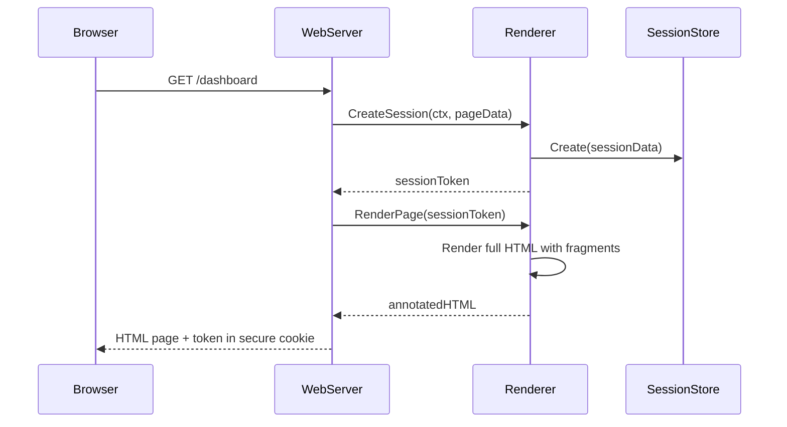
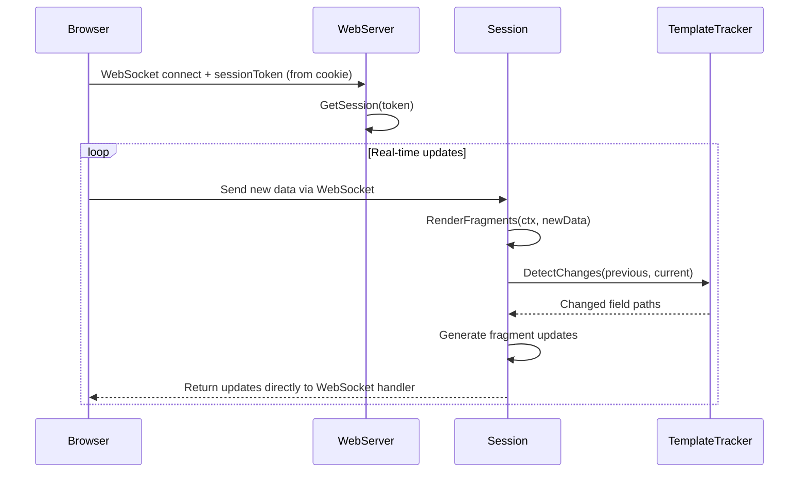
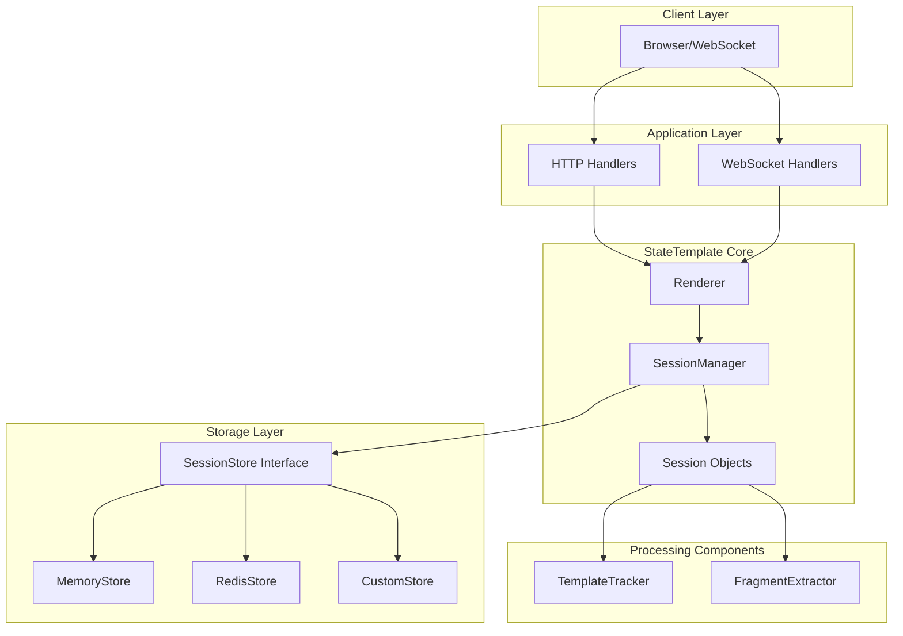

# StateTemplate Session-Based Architecture Design

A technical design document for implementing secure, scalable multi-session rendering in StateTemplate.

---

# Layer 1: Problem Definition and Context

## Problem Statement

StateTemplate currently uses a singleton renderer model that creates security vulnerabilities, scaling bottlenecks, and operational complexity for multi-client web applications.

**Core Issues:**

1. **Global State Vulnerability**: All clients share the same renderer instance, creating potential data leakage between users
2. **No Session Isolation**: Multiple users cannot have independent data tracking and fragment updates
3. **Scalability Bottleneck**: Single renderer cannot efficiently handle thousands of concurrent sessions
4. **Security Risk**: No mechanism to prevent cross-client data access or validate client identity
5. **API Confusion**: Current APIs like `SetInitialData()` suggest global state management rather than session-specific operations

## Current State (AS-IS)

```go
// Current problematic singleton API
type Renderer struct {
    // Global state shared across all clients
    currentData interface{}
    templates   *template.Template
}

func (r *Renderer) SetInitialData(data interface{}) (string, error)  // GLOBAL
func (r *Renderer) SendUpdate(newData interface{})                   // GLOBAL
func (r *Renderer) GetUpdateChannel() <-chan Update                  // GLOBAL
```

**Problems with Current Design:**

- User A's data updates are visible to User B
- No way to isolate WebSocket connections by user
- No authentication or authorization mechanism
- Cannot scale beyond single-server deployments
- Memory leaks from accumulated global state

## Goals and Requirements

### Functional Requirements

1. **Session Isolation**: Each client must have completely isolated data tracking and fragment generation
2. **Multi-User Support**: Support 10,000+ concurrent sessions per server instance
3. **Authentication**: Cryptographically secure session tokens to prevent unauthorized access
4. **Session Lifecycle**: Automatic session creation, expiration, and cleanup
5. **Data Persistence**: Pluggable session storage (memory, Redis, custom implementations)
6. **Fragment Updates**: Maintain current fragment-based update system with enhanced range operations

### Non-Functional Requirements

1. **Performance**: <1ms session creation, <10ms fragment update latency, <1MB memory per session
2. **Security**: Zero cross-session data leakage, encrypted session tokens, secure key rotation
3. **Scalability**: Horizontal scaling support via external session stores
4. **Reliability**: Graceful degradation when session stores fail, automatic cleanup of expired sessions
5. **Developer Experience**: Clear API boundaries, self-documenting method names, comprehensive error handling

### Non-Goals

- Real-time collaboration features (conflict resolution, operational transforms)
- Client-side session management or state synchronization
- Custom authentication systems (library users control session identity)
- WebSocket/transport implementation (library provides fragments, users handle delivery)

## Key Stakeholders

- **Library Users**: Web application developers using StateTemplate for real-time UIs
- **End Users**: Web application users requiring isolated, secure sessions
- **Infrastructure Teams**: Operations teams deploying and scaling StateTemplate applications
- **Security Teams**: Teams requiring audit trails and secure session management

---

# Layer 2: Functional Specification

## System Behavior Overview

The session-based architecture provides two distinct operational modes with clear functional boundaries:

### Mode 1: Initial Page Load (Server-Side Rendering)

**Function**: Generate complete HTML page with embedded session credentials
**Input**: Session ID + initial data
**Output**: Full annotated HTML + session token
**Use Case**: First page request, page refresh, new user sessions

### Mode 2: Real-Time Updates (Incremental Rendering)

**Function**: Process data changes and generate fragment updates
**Input**: Session token + new data
**Output**: Stream of fragment updates with range operations
**Use Case**: WebSocket connections, live data updates, user interactions

## Core API Design

### Public Interface - Clean Token-Only Approach

```go
// Main renderer type - avoids redundant statetemplate.StateTemplate naming
type Renderer struct {
    // internal fields unexported
}

// Session represents an isolated rendering context
type Session struct {
    // internal fields unexported
}

// Constructor explicitly accepts html/template.Template for clarity
func New(templates *html.Template, options ...Option) *Renderer

// Two-step API for optimal developer experience:

// Step 1: Create session with data, returns secure token
func (r *Renderer) CreateSession(ctx context.Context, data interface{}) (token string, err error)

// Step 2: Render complete page HTML using token
func (r *Renderer) RenderPage(token string) (html string, err error)

// Real-time updates: get session for incremental updates using token only
func (r *Renderer) GetSession(token string) (*Session, error)

// Data processing: pushes data AND returns fragment updates directly
func (s *Session) RenderFragments(ctx context.Context, data interface{}) ([]Update, error)

// Cleanup: release session resources
func (s *Session) Close() error

// Session management utilities
func (r *Renderer) InvalidateSession(token string) error
func (r *Renderer) ValidateToken(token string) bool
```

### Update Model with Built-in Cache Intelligence

```go
// Single update model with built-in optimization intelligence
type Update struct {
    FragmentID  string    `json:"fragment_id"`
    HTML        string    `json:"html,omitempty"`        // Only sent if HTML changed
    Action      string    `json:"action"`                // "replace", "append", "remove", "insertAfter", "insertBefore"
    TargetID    string    `json:"target_id,omitempty"`   // For insertAfter/insertBefore operations
    Timestamp   time.Time `json:"timestamp"`

    // Automatic optimization fields (managed by library)
    IsNoOp      bool      `json:"is_noop,omitempty"`     // True if no changes detected
    HTMLHash    string    `json:"html_hash,omitempty"`   // For client-side validation
    DataChanged []string  `json:"data_changed,omitempty"` // What data properties changed
}
```

**Cache Control via HTML Annotations:**

```html
<!-- Default: cache enabled automatically -->
<div id="user-stats">{{.UserStats}}</div>

<!-- Disable optimization for always-fresh content -->
<div id="live-time" data-cache="false">{{.CurrentTime}}</div>

<!-- Automatically optimized notifications -->
<div id="notifications">{{.Notifications}}</div>

<!-- Automatically optimized weather widget -->
<div id="weather-widget">{{.Weather}}</div>

<!-- Real-time counter (optimization disabled) -->
<div id="live-counter" data-cache="false">{{.Counter}}</div>
<div id="user-profile">{{.UserProfile}}</div>
```

**Range Operations Support:**

- **Standard Operations**: replace, append, remove for basic updates
- **Positioning Operations**: insertAfter, insertBefore for sorted lists and dynamic positioning
- **Cache-Aware Operations**: All operations include automatic cache benefits
- **Use Cases**: Real-time collaboration, live sorting, paginated content insertion with automatic bandwidth savings

## User Flows

### Flow 1: HTTP Page Request (Two-Step Process)



### Flow 2: WebSocket Real-Time Updates



## Alternative Functional Approaches Considered

### Option 1: Stateless Token-Only Sessions

**Approach**: Embed all session state in encrypted client tokens
**Pros**: Perfect horizontal scaling, no server-side state
**Cons**: Token size limits (~4KB), complex encryption/decryption overhead, limited session data capacity
**Decision**: Rejected due to token size constraints for complex data structures

### Option 2: Process-Per-Session Model

**Approach**: Dedicated goroutine/process per session
**Pros**: Perfect isolation, simple programming model
**Cons**: Resource overhead (10K sessions = 10K goroutines), complex lifecycle management
**Decision**: Rejected due to resource inefficiency at scale

### Option 3: Event-Sourcing Based Sessions

**Approach**: Store session state as event streams, replay for updates  
**Pros**: Audit trail, time-travel debugging, easy state recovery
**Cons**: Complex implementation, storage overhead, replay performance issues
**Decision**: Rejected as over-engineered for the use case

### Chosen Approach: Hybrid Session Management

**Approach**: Server-side session objects with pluggable storage + cryptographic tokens for security
**Pros**: Balances performance, security, and implementation complexity
**Implementation**: SessionManager coordinates session lifecycle, SessionStore provides persistence, encrypted tokens prevent unauthorized access

## Session Lifecycle Management

### Session Creation

1. Library user provides sessionID (supports both authenticated users and anonymous sessions)
2. Library user provides context.Context (typically http.Request.Context() from the HTTP request)
3. Renderer creates session object with cryptographic token
4. Session data persisted to SessionStore (memory/Redis/custom)
5. Full HTML rendered and returned with session token
6. Session monitors the provided context for cancellation

### Context-Based Session Termination

**Smart Session Lifecycle Management:**

Sessions have independent lifecycles that don't interfere with each other. Multiple sessions per user are fully supported:

1. **Session Creation Context**: The context passed to `NewSession(ctx, sessionID, data)` is used only for:

   - **Resource allocation timeout**: Prevents hanging during session creation
   - **Store operation timeout**: Limits time for Redis/store operations
   - **Initial rendering timeout**: Bounds template rendering time
   - **NOT for session lifecycle control**: Session remains active after HTTP request completes

2. **Session Termination Triggers**:

   - **Explicit closure**: `session.Close()` called by application
   - **WebSocket disconnection**: Connection context cancelled (browser tab closed, network failure)
   - **Session expiration**: Configured TTL reached (default: 24 hours)
   - **Store failure**: Session store becomes permanently unavailable
   - **Maximum sessions reached**: LRU eviction when limits exceeded

3. **Multi-Session Architecture**:

   - **Per-Browser-Tab**: Each tab creates independent session with unique session ID
   - **Per-User-Device**: Multiple devices create separate sessions for same user
   - **Session Isolation**: One session termination doesn't affect others
   - **WebSocket Independence**: Each WebSocket connection manages its own lifecycle

4. **Implementation Details**:

   ```go
   func (r *Renderer) CreateSession(ctx context.Context, data interface{}) (string, error) {
       // Create session with timeout context for initial operations only
       createCtx, cancel := context.WithTimeout(ctx, 30*time.Second)
       defer cancel()

       // Generate unique session ID internally
       sessionID := r.generateSessionID()

       session := &Session{
           id:         sessionID,
           data:       data,
           created:    time.Now(),
           updates:    make(chan Update, 100),
           closed:     make(chan struct{}),
           // Session has independent lifecycle - NOT tied to HTTP request context
       }

       // Store session (with timeout for store operations)
       if err := r.store.Set(createCtx, sessionID, session); err != nil {
           return "", fmt.Errorf("failed to store session: %w", err)
       }

       // Generate secure token that contains session ID
       token, err := r.generateToken(sessionID)
       if err != nil {
           r.store.Delete(createCtx, sessionID) // Cleanup on failure
           return "", fmt.Errorf("failed to generate token: %w", err)
       }

       // Session remains active independent of HTTP request completion
       return token, nil
   }

   func (r *Renderer) RenderPage(token string) (string, error) {
       // Extract session ID from token
       sessionID, err := r.extractSessionID(token)
       if err != nil {
           return "", fmt.Errorf("invalid token: %w", err)
       }

       // Get session from store
       session, err := r.store.Get(sessionID)
       if err != nil {
           return "", fmt.Errorf("session not found: %w", err)
       }

       // Render HTML with current session data
       html, err := r.renderInitial(session)
       if err != nil {
           return "", fmt.Errorf("failed to render: %w", err)
       }

       return html, nil
   }

   // WebSocket connections manage their own lifecycle
   func (r *Renderer) HandleWebSocket(w http.ResponseWriter, req *http.Request) {
       // Get token from cookie or query param
       token := getSessionTokenFromCookie(req)
       if token == "" {
           token = req.URL.Query().Get("token")
       }

       session, err := r.GetSession(token)
       if err != nil {
           http.Error(w, "Invalid session", 401)
           return
       }

       conn, err := upgrader.Upgrade(w, req, nil)
       if err != nil {
           return
       }

       // WebSocket context - independent of initial page load
       wsCtx, wsCancel := context.WithCancel(context.Background())
       defer wsCancel()

       // Process WebSocket messages - no channels needed
       for {
           var newData interface{} // Receive data from client
           if err := conn.ReadJSON(&newData); err != nil {
               wsCancel() // Connection broken, cancel context
               break
           }

           // Get updates directly from RenderFragments
           updates, err := session.RenderFragments(wsCtx, newData)
           if err != nil {
               wsCancel() // Error occurred, cancel context
               break
           }

           // Send updates to this specific connection
           for _, update := range updates {
               if err := conn.WriteJSON(update); err != nil {
                   wsCancel() // This connection is broken, cancel its context
                   break
               }
           }
       }
   }
   ```

### Session Operations

1. Client provides sessionID + token for session retrieval
2. Token validation ensures session ownership and prevents replay attacks
3. RenderFragments() triggers fragment comparison and update generation
4. Updates returned directly from RenderFragments() to client via WebSocket
5. Context cancellation immediately terminates all session operations

### Session Expiration

1. **Context Cancellation**: Immediate termination when http.Request.Context() is cancelled
2. **Configurable Timeouts**: Default 24-hour expiration for long-lived sessions
3. **Background Cleanup**: Periodic removal of expired sessions every 5 minutes
4. **Graceful Degradation**: Session operations fail gracefully when sessions expire
5. **Store Failover**: Automatic fallback to memory-only mode if SessionStore fails

---

# Layer 3: Technical Specification

## Architecture Overview

### Component Architecture



### Data Flow Architecture

**Session Creation Flow:**

1. HTTP handler calls `renderer.NewSession(sessionID, data)`
2. SessionManager creates session object and generates cryptographic token
3. Session data persisted to SessionStore (atomic operation)
4. Templates rendered to full HTML with fragment annotations
5. HTML + session token returned to client

**Real-Time Update Flow:**

1. WebSocket handler calls `renderer.GetSession(sessionID, token)`
2. Token validation and session retrieval from SessionStore
3. Client sends new data via WebSocket
4. `session.RenderFragments(data)` triggers change detection via TemplateTracker
5. FragmentExtractor generates incremental updates
6. Updates returned directly to client via WebSocket handler

## Core Implementation

### Main Types

```go
// Public API types
type Renderer struct {
    sessionManager *sessionManager
    templates      *html.Template
    config        Config
}

type Session struct {
    id          string
    sessionID   string
    token       string

    // Context management for automatic cleanup
    ctx         context.Context  // Context from NewSession (e.g., http.Request.Context())
    cancelFunc  context.CancelFunc

    // Thread-safe data access
    dataMutex    sync.RWMutex
    currentData  interface{}
    lastSnapshot map[string]interface{}

    // Template processing (stateless components)
    tracker      *TemplateTracker
    extractor    *FragmentExtractor
}

// Internal session management
type sessionManager struct {
    sessions    sync.Map                // map[string]*Session for concurrent access
    store       SessionStore           // Pluggable storage interface
    templates   *html.Template
    config      Config
    cleanup     *time.Ticker
}
```

### SessionStore Interface Design

**Public Interface for Custom Implementations:**

```go
// SessionStore - public interface for custom store implementations
type SessionStore interface {
    Create(session *SessionData) error
    Get(sessionID string) (*SessionData, error)
    Update(session *SessionData) error
    Delete(sessionID string) error
    GetExpired(before time.Time) ([]*SessionData, error)

    // Health and metrics
    HealthCheck() error
    IsAvailable() bool
    GetSessionCount() (int, error)
}

// SessionData - simplified data structure for store implementations
// Contains only persistent fields, excludes runtime state
type SessionData struct {
    ID           string                 `json:"id"`
    SessionID    string                 `json:"session_id"`
    Token        string                 `json:"token"`
    LastSnapshot map[string]interface{} `json:"last_snapshot"`
    Created      time.Time              `json:"created"`
    LastAccess   time.Time              `json:"last_access"`
    ExpiresAt    time.Time              `json:"expires_at"`
    Closed       bool                   `json:"closed"`
}
```

**Built-in Implementations:**

```go
// MemoryStore - development and testing
type MemoryStore struct {
    sessions sync.Map // map[string]*SessionData
    mutex    sync.RWMutex
}

// RedisStore - production horizontal scaling
type RedisStore struct {
    client redis.UniversalClient
    prefix string
    ttl    time.Duration
}
```

### Security Implementation

**Token-Based Authentication:**

```go
type SessionToken struct {
    SessionID  string    `json:"session_id"`
    IssuedAt   time.Time `json:"issued_at"`
    ExpiresAt  time.Time `json:"expires_at"`
    Nonce      string    `json:"nonce"`  // Prevents replay attacks
}

func (sm *sessionManager) generateToken(sessionID string) (string, error) {
    token := SessionToken{
        SessionID: sessionID,
        IssuedAt:  time.Now(),
        ExpiresAt: time.Now().Add(sm.config.Expiration),
        Nonce:     generateSecureNonce(),
    }

    // Encrypt token with AES-GCM using configured signing key
    return encryptToken(token, sm.config.SigningKey)
}

func (sm *sessionManager) validateToken(tokenStr string) (*SessionToken, error) {
    // Decrypt and validate token signature, expiration, nonce
    token, err := decryptToken(tokenStr, sm.config.SigningKey)
    if err != nil {
        return nil, ErrInvalidToken
    }

    if time.Now().After(token.ExpiresAt) {
        return nil, ErrSessionExpired
    }

    return token, nil
}
```

**Thread Safety Design:**

- **Session-Level**: Each session uses `sync.RWMutex` for data access, allowing concurrent reads
- **Manager-Level**: `sync.Map` for session storage enables lock-free concurrent session access
- **Store-Level**: All SessionStore implementations must be thread-safe
- **Processing Components**: TemplateTracker and FragmentExtractor are completely stateless

**Session Lifecycle and Context Integration:**

- Session operations are automatically terminated when:
  - **Context cancellation**: The context passed to `CreateSession()` is cancelled (e.g., HTTP request context when client disconnects)
  - **Explicit closure**: `session.Close()` is called manually
  - **Session expiration**: Session reaches configured timeout
  - **Store failure**: Session store becomes permanently unavailable
- **Goroutine Management**: Context cancellation terminates all session-related goroutines to prevent leaks
- **Client Handling**: Applications handle updates directly from RenderFragments:

  ```go
  updates, err := session.RenderFragments(ctx, newData)
  if err != nil {
      // Handle error (session expired, context cancelled, etc.)
      return err
  }

  for _, update := range updates {
      if err := sendToClient(update); err != nil {
          // Client disconnected, return error to terminate session
          return err
      }
  }
  ```

### Performance Optimizations

**Scalability Strategy:**

```go
// Current design handles <10K sessions efficiently
// Future optimization: Sharded SessionManager for 10K+ sessions
type ShardedSessionManager struct {
    shards    []*SessionManagerShard
    shardMask int  // Power of 2 for fast modulo via bitwise AND
}

func (sm *ShardedSessionManager) getShard(sessionID string) *SessionManagerShard {
    hash := fnv.New32a()
    hash.Write([]byte(sessionID))
    return sm.shards[hash.Sum32()&uint32(sm.shardMask)]
}
```

**Memory Management:**

- Background cleanup goroutine removes expired sessions every 5 minutes
- Aggressive garbage collection of session channels and tracking data
- Session data compressed in Redis store using gzip
- Fragment caching shared across sessions for identical template outputs

### Simple Automatic Optimization (Livewire-Inspired)

**Zero-Configuration Approach**: Following Livewire's philosophy, StateTemplate implements smart optimizations automatically without requiring any configuration from developers.

**Core Optimization Strategy:**

```go
type Session struct {
    // ... existing fields ...

    // Simple optimization state (internal only)
    lastDataHash     string    // Hash of last data payload
    lastHTML         string    // HTML from previous render
    htmlHash         string    // Hash of current HTML
}

// Single Update structure - always optimized by default, no library user decisions needed
type Update struct {
    FragmentID  string    `json:"fragment_id"`
    HTML        string    `json:"html,omitempty"`        // Only sent if HTML changed
    Action      string    `json:"action"`                // "replace", "append", etc.
    TargetID    string    `json:"target_id,omitempty"`   // For positioning operations
    Timestamp   time.Time `json:"timestamp"`

    // Automatic optimization fields (managed by library, transparent to users)
    IsNoOp      bool      `json:"is_noop,omitempty"`     // True if no changes detected
    HTMLHash    string    `json:"html_hash,omitempty"`   // For client-side validation
    DataChanged []string  `json:"data_changed,omitempty"` // What data properties changed
}
```

**Cache Control via HTML Annotations:**

```html
<!-- Default: cache enabled automatically for all fragments -->
<div id="user-stats">{{.UserStats}}</div>

<!-- Disable cache for real-time content -->
<div id="live-timestamp" data-cache="false">
  {{.CurrentTime.Format "15:04:05"}}
</div>

<!-- Everything else automatically optimized - no configuration needed -->
<div id="notifications">{{range .Notifications}}...{{end}}</div>
```

**Automatic Optimizations (No Configuration Required):**

1. **Data Change Detection**: Hash incoming data - if identical to last update, skip processing entirely
2. **HTML Change Detection**: Hash rendered HTML - only send to client if HTML actually changed
3. **Fragment-Level Intelligence**: Each fragment independently checked for changes
4. **Client-Side Morphing**: Use morphdom to update only changed DOM elements
5. **Dirty Detection**: Only send data properties that actually changed (like Livewire)

**Implementation - Zero Configuration:**

```go
func (s *Session) RenderFragments(ctx context.Context, data interface{}) ([]Update, error) {
    // 1. Quick data change detection
    newDataHash := s.hashData(data)
    if newDataHash == s.lastDataHash {
        // Data hasn't changed - return no-op update
        return []Update{{IsNoOp: true, Timestamp: time.Now()}}, nil
    }
    s.lastDataHash = newDataHash

    // 2. Render new HTML
    newHTML, err := s.renderHTML(data)
    if err != nil {
        return nil, err
    }

    // 3. HTML change detection
    newHTMLHash := s.hashHTML(newHTML)
    if newHTMLHash == s.htmlHash {
        // HTML hasn't changed despite data change - return no-op
        return []Update{{IsNoOp: true, Timestamp: time.Now()}}, nil
    }

    // 4. Generate and return fragment updates directly
    updates := s.generateFragmentUpdates(newHTML, newHTMLHash)

    // 5. Update internal state
    s.lastHTML = newHTML
    s.htmlHash = newHTMLHash
    s.currentData = data

    return updates, nil
}

func (s *Session) generateFragmentUpdates(newHTML, htmlHash string) []Update {
    fragments := s.extractFragments(newHTML)
    var updates []Update

    for fragmentID, fragmentHTML := range fragments {
        // Check if this specific fragment changed
        if !s.fragmentChanged(fragmentID, fragmentHTML) {
            continue // Skip unchanged fragments
        }

        update := Update{
            FragmentID: fragmentID,
            HTML:       fragmentHTML,
            Action:     "replace",
            HTMLHash:   s.hashFragment(fragmentHTML),
            Timestamp:  time.Now(),
        }

        updates = append(updates, update)
    }

    return updates
}

```

**Client-Side Auto-Intelligence (JavaScript):**

```javascript
class StateTemplateClient {
  constructor(token) {
    this.token = token;
    this.fragmentCache = new Map(); // Simple fragment cache
    this.ws = null;
  }

  connect() {
    this.ws = new WebSocket(`ws://localhost:8080/ws?token=${this.token}`);
    this.ws.onmessage = (event) => {
      const update = JSON.parse(event.data);
      this.handleUpdate(update);
    };
  }

  handleUpdate(update) {
    // Handle no-op updates (no DOM changes needed)
    if (update.is_noop) {
      return; // Nothing to do - perfect cache intelligence
    }

    // Check client-side cache
    const cachedHash = this.fragmentCache.get(update.fragment_id);
    if (cachedHash === update.html_hash) {
      return; // Already have this HTML cached
    }

    // Update DOM using morphdom (only changes what's different)
    const element = document.getElementById(update.fragment_id);
    if (element) {
      // Use morphdom to intelligently update only changed parts
      morphdom(element, update.html);

      // Update cache
      this.fragmentCache.set(update.fragment_id, update.html_hash);
    }
  }

  sendUpdate(action, data) {
    if (this.ws && this.ws.readyState === WebSocket.OPEN) {
      this.ws.send(JSON.stringify({ action, ...data }));
    }
  }
}

// Usage is dead simple - no configuration needed
const client = new StateTemplateClient(sessionToken);
client.connect();

// All cache intelligence happens automatically
function incrementCounter() {
  client.sendUpdate("increment_counter", {});
}
```

**Benefits of Simple Approach:**

✅ **Zero Configuration**: No knobs to tune, just works optimally by default  
✅ **Automatic Detection**: Data and HTML change detection built-in  
✅ **Bandwidth Efficient**: Only sends fragments that actually changed  
✅ **Client-Side Smart**: Morphdom updates only changed DOM elements  
✅ **Developer Friendly**: Same simple API, maximum performance underneath  
✅ **Livewire-Inspired**: Proven approach used by thousands of applications

**What Happens Automatically:**

- **Duplicate Data**: Same data sent twice = no-op update
- **Unchanged HTML**: Data changed but HTML identical = no-op update
- **Fragment-Level**: Only fragments with changes sent to client
- **DOM Updates**: Only changed DOM elements are updated (via morphdom)
- **Network Traffic**: Minimum possible bandwidth usage
- **Rendering**: Skip template processing for identical data

**Developer Experience:**

```go
// Developers write simple code
updates, err := session.RenderFragments(ctx, newData)
if err != nil {
    return err
}

// Send updates directly to client
for _, update := range updates {
    if err := sendToClient(update); err != nil {
        return err
    }
}

// Library automatically handles:
// ✅ Detects if data actually changed
// ✅ Skips rendering if HTML would be identical
// ✅ Returns only changed fragments
// ✅ Enables efficient DOM morphing on client
// ✅ Optimizes everything intelligently
```

This approach provides all the performance benefits of complex caching with zero configuration required from developers.

### Implementation of Cache Control via HTML Attributes

**Automatic Fragment Optimization:**

```go
// Simplified fragment processing with automatic optimization
func (s *Session) sendFragmentUpdates(newHTML, htmlHash string) {
    fragments := s.extractFragments(newHTML)

    for fragmentID, fragmentHTML := range fragments {
        // Check if optimization is disabled for this fragment
        if s.isOptimizationDisabled(fragmentHTML) {
            // Force update regardless of cache
            s.sendFragmentUpdate(fragmentID, fragmentHTML)
            continue
        }

        // Automatic optimization: skip if fragment hasn't changed
        if !s.fragmentChanged(fragmentID, fragmentHTML) {
            continue // Skip unchanged fragments
        }

        // Send optimized update
        update := Update{
            FragmentID: fragmentID,
            HTML:       fragmentHTML,
            Action:     "replace",
            HTMLHash:   s.hashFragment(fragmentHTML),
            Timestamp:  time.Now(),
        }

        s.updates <- update
    }
}

// Simple optimization control check
func (s *Session) isOptimizationDisabled(fragmentHTML string) bool {
    return strings.Contains(fragmentHTML, `data-cache="false"`)
}
```

**Benefits for Library Users:**

✅ **Zero Configuration**: Automatic optimization works out of the box  
✅ **Minimal API Surface**: Only `data-cache="false"` escape hatch when needed  
✅ **Template-Level Control**: Optimization behavior defined where content is defined  
✅ **Granular Control**: Per-fragment optimization settings without affecting others  
✅ **Backwards Compatible**: All existing templates get optimization by default  
✅ **Self-Documenting**: Optimization behavior visible in template source code  
✅ **Runtime Flexibility**: Optimization settings can be dynamic based on template data  
✅ **Ecosystem Compatibility**: Works with htmx, Alpine.js, and other frameworks

### Error Handling Strategy

```go
// Exported errors for proper client error handling
var (
    ErrSessionExpired     = errors.New("session has expired")
    ErrSessionNotFound    = errors.New("session not found")
    ErrInvalidToken       = errors.New("invalid session token")
    ErrStoreUnavailable   = errors.New("session store unavailable")
    ErrSessionClosed      = errors.New("session is closed")
    ErrMaxSessionsReached = errors.New("maximum sessions reached")
    ErrInvalidSessionID   = errors.New("invalid session ID")
    ErrSessionIDExists    = errors.New("session ID already exists")
)

// Resilient store wrapper for graceful degradation
type resilientStore struct {
    primary   SessionStore
    fallback  *MemoryStore  // Local fallback when primary fails
    circuit   *CircuitBreaker
}
```

## Alternative Implementation Approaches

### Option 1: Single Global SessionManager

**Current Choice**: Simple implementation with single SessionManager instance
**Scalability**: Sufficient for <1K concurrent sessions
**Future Migration**: Upgrade to sharded approach when load testing reveals bottlenecks

### Option 2: Database-Backed Sessions

**Considered**: SQL database as SessionStore backend
**Trade-offs**: Better durability vs. higher latency and complexity
**Decision**: Provide as optional implementation, default to Redis for production

### Option 3: gRPC-Based Session Service

**Considered**: Separate microservice for session management
**Trade-offs**: Better horizontal scaling vs. network overhead and complexity
**Decision**: Keep as library component, provide clear interfaces for future extraction

## Configuration and Deployment

### Configuration Options

```go
type Config struct {
    Expiration      time.Duration     // Default: 24 hours
    Store           SessionStore      // Default: MemoryStore
    SigningKey      []byte           // Required for production
    MaxSessions     int              // Default: 10000
    CleanupInterval time.Duration    // Default: 5 minutes

    // Performance tuning
    ShardCount      int              // Default: 1 (no sharding)
    CompressStore   bool             // Default: true for Redis
    FragmentCache   bool             // Default: true
}

// Configuration helpers
func WithRedisStore(addr string) Option
func WithMemoryStore() Option
func WithCustomStore(store SessionStore) Option
func WithExpiration(d time.Duration) Option
func WithSecurity(signingKey []byte) Option
func WithMaxSessions(max int) Option
```

### Development vs Production Setup

**Development Configuration:**

```go
renderer := statetemplate.New(templates,
    statetemplate.WithMemoryStore(),
    statetemplate.WithExpiration(1*time.Hour),
    statetemplate.WithSecurity([]byte("dev-key-32-chars-long")),
)
```

**Production Configuration:**

```go
renderer := statetemplate.New(templates,
    statetemplate.WithRedisStore("redis://cluster.prod:6379"),
    statetemplate.WithExpiration(24*time.Hour),
    statetemplate.WithSecurity(getSecretKey()), // From secure key management
    statetemplate.WithMaxSessions(10000),
)
```

## Developer Notes and Assumptions

### Critical Design Assumptions

1. **Stateless Processing Components**: TemplateTracker and FragmentExtractor must never maintain state between operations to prevent cross-session data leakage
2. **Token Security**: Signing keys must be at least 32 bytes and stored securely in production environments
3. **Session ID Ownership**: Library users are responsible for session ID generation and validation - library provides isolation, not authentication
4. **Template Immutability**: Templates are assumed to be immutable after renderer creation for thread safety

### Edge Cases and Trade-offs

**SessionStore Failures:**

- **Trade-off**: Availability vs. Consistency
- **Implementation**: Graceful degradation to memory-only mode, eventual consistency on recovery

**Memory Pressure:**

- **Trade-off**: Memory usage vs. Performance
- **Implementation**: Configurable session limits, aggressive cleanup, LRU eviction for fragment cache

**Token Rotation:**

- **Trade-off**: Security vs. Complexity
- **Implementation**: Support for previous signing key during rotation period

**Cross-Session Data Leakage Prevention:**

- **Trade-off**: Performance vs. Security
- **Implementation**: Comprehensive stateless design, extensive security testing

---

# Reference Implementation

## Working Example

This reference implementation demonstrates the core session-based architecture in action:

```go
package main

import (
    "context"
    "encoding/json"
    "errors"
    "html/template"
    "log"
    "net/http"
    "time"

    "github.com/gorilla/websocket"
    "github.com/livefir/statetemplate"
)

// Example data structure
type DashboardData struct {
    UserName string   `json:"user_name"`
    Counter  int      `json:"counter"`
    Items    []string `json:"items"`
}

func main() {
    // Parse HTML templates
    tmpl := template.Must(template.ParseGlob("templates/*.html"))

    // Create renderer with production-ready configuration
    renderer := statetemplate.New(tmpl,
        statetemplate.WithExpiration(24*time.Hour),
        statetemplate.WithMaxSessions(10000),
        statetemplate.WithSecurity([]byte("your-32-byte-secret-key-here123")),
        statetemplate.WithRedisStore("redis://localhost:6379"),
    )

    // HTTP handler for initial page load
    http.HandleFunc("/dashboard", func(w http.ResponseWriter, r *http.Request) {
        initialData := &DashboardData{
            UserName: getUserName(r),
            Counter:  0,
            Items:    []string{"apple", "banana"},
        }

        // Step 1: Create session with data
        token, err := renderer.CreateSession(r.Context(), initialData)
        if err != nil {
            http.Error(w, err.Error(), 500)
            return
        }

        // Step 2: Render page HTML using token
        html, err := renderer.RenderPage(token)
        if err != nil {
            http.Error(w, err.Error(), 500)
            return
        }

        // Set secure session cookie
        http.SetCookie(w, &http.Cookie{
            Name:     "session_token",
            Value:    token,
            HttpOnly: true,
            Secure:   true,
            SameSite: http.SameSiteStrictMode,
            MaxAge:   int(24 * time.Hour.Seconds()),
            Path:     "/",
        })

        // Return HTML (no need to embed token)
        w.Header().Set("Content-Type", "text/html")
        w.Write([]byte(html))
    })

    // WebSocket handler for real-time updates
    upgrader := websocket.Upgrader{CheckOrigin: func(r *http.Request) bool { return true }}

    http.HandleFunc("/ws", func(w http.ResponseWriter, r *http.Request) {
        // Get token from cookie
        cookie, err := r.Cookie("session_token")
        if err != nil {
            http.Error(w, "No session token", 401)
            return
        }

        // Get session using token only
        session, err := renderer.GetSession(cookie.Value)
        if err != nil {
            http.Error(w, "Invalid session", 401)
            return
        }
        defer session.Close()

        conn, err := upgrader.Upgrade(w, r, nil)
        if err != nil {
            return
        }
        defer conn.Close()

        // Direct fragment processing - much simpler than channel-based approach
        for {
            var newData DashboardData
            if err := conn.ReadJSON(&newData); err != nil {
                log.Printf("WebSocket read error: %v", err)
                break
            }

            // Get fragment updates directly from RenderFragments
            updates, err := session.RenderFragments(r.Context(), &newData)
            if err != nil {
                log.Printf("RenderFragments error: %v", err)
                if errors.Is(err, statetemplate.ErrSessionExpired) {
                    conn.WriteJSON(map[string]string{"error": "session_expired"})
                    break
                }
                continue
            }

            // Send each update to client
            for _, update := range updates {
                if err := conn.WriteJSON(update); err != nil {
                    log.Printf("WebSocket write error: %v", err)
                    return
                }
            }
        }
    })

    log.Println("Server starting on :8080")
    log.Fatal(http.ListenAndServe(":8080", nil))
}

// Session ID generation strategies
func getSessionID(r *http.Request) string {
    // For authenticated users: use stable user identifier
    if userID := getUserID(r); userID != "" {
        return "user_" + userID
    }

    // For anonymous users: generate unique session identifier
    return "anon_" + generateUUID()
}

func getUserID(r *http.Request) string {
    // Extract from JWT, session cookie, etc.
    // Implementation depends on your authentication system
    return ""
}

func getUserName(r *http.Request) string {
    // Extract user name from request context
    return "Anonymous"
}

func generateNewSessionID() string {
    return "session_" + generateUUID()
}

func generateUUID() string {
    // Use crypto/rand for production
    return "uuid-placeholder"
}

func renderPageWithSession(w http.ResponseWriter, html, sessionID, token string) {
    // Embed session credentials for JavaScript WebSocket connection
    page := `<!DOCTYPE html>
<html>
<head><title>Dashboard</title></head>
<body>
` + html + `
<script>
    const sessionID = "` + sessionID + `";
    const sessionToken = "` + token + `";

    // Connect WebSocket for real-time updates
    const ws = new WebSocket("ws://localhost:8080/ws?session_id=" + sessionID + "&token=" + sessionToken);

    ws.onmessage = function(event) {
        const update = JSON.parse(event.data);
        // Apply fragment update to DOM based on update.Action
        handleFragmentUpdate(update);
    };

    function handleFragmentUpdate(update) {
        const element = document.getElementById(update.FragmentID);
        if (!element) return;

        switch(update.Action) {
            case "replace":
                element.outerHTML = update.HTML;
                break;
            case "append":
                element.insertAdjacentHTML("beforeend", update.HTML);
                break;
            case "insertAfter":
                const target = document.getElementById(update.TargetID);
                if (target) target.insertAdjacentHTML("afterend", update.HTML);
                break;
            // Handle other actions...
        }
    }
</script>
</body>
</html>`

    w.Header().Set("Content-Type", "text/html")
    w.Write([]byte(page))
}
```

## Clean Token-Only API Design

**Single Path: Token-Only Approach**

The cleanest design uses tokens as the single source of truth for session management:

### **Core API Methods**

```go
type Renderer interface {
    // Session lifecycle
    CreateSession(ctx context.Context, data interface{}) (token string, err error)
    RenderPage(token string) (html string, err error)
    GetSession(token string) (Session, error)
    InvalidateSession(token string) error

    // Utility methods
    ValidateToken(token string) bool
    RefreshToken(oldToken string) (newToken string, err error)
}

// Enhanced session creation with options
func (r *Renderer) CreateSession(ctx context.Context, data interface{}, opts ...SessionOption) (string, error) {
    // Generate unique internal session ID
    sessionID := r.generateSessionID()

    session := &Session{
        id:      sessionID,
        data:    data,
        created: time.Now(),
        updates: make(chan Update, 100),
        closed:  make(chan struct{}),
    }

    // Apply options
    for _, opt := range opts {
        opt(session)
    }

    // Store session
    if err := r.store.Set(ctx, sessionID, session); err != nil {
        return "", fmt.Errorf("failed to store session: %w", err)
    }

    // Generate secure token that contains session ID
    token, err := r.generateToken(sessionID)
    if err != nil {
        r.store.Delete(ctx, sessionID) // Cleanup on token generation failure
        return "", fmt.Errorf("failed to generate token: %w", err)
    }

    return token, nil
}

// Session options for flexibility
type SessionOption func(*Session)

func WithExpiration(duration time.Duration) SessionOption {
    return func(s *Session) {
        s.expiresAt = time.Now().Add(duration)
    }
}

func WithUserContext(userID string) SessionOption {
    return func(s *Session) {
        s.userID = userID
    }
}
```

### **Middleware Integration**

```go
// Middleware creates session and sets secure cookie
func SessionMiddleware(renderer *statetemplate.Renderer) func(http.Handler) http.Handler {
    return func(next http.Handler) http.Handler {
        return http.HandlerFunc(func(w http.ResponseWriter, r *http.Request) {
            // Check for existing session token
            if token := getSessionTokenFromCookie(r); token != "" {
                if renderer.ValidateToken(token) {
                    // Session exists, continue to handler
                    ctx := context.WithValue(r.Context(), "sessionToken", token)
                    next.ServeHTTP(w, r.WithContext(ctx))
                    return
                }
            }

            // Create new session with empty data (will be populated in handler)
            token, err := renderer.CreateSession(r.Context(), nil)
            if err != nil {
                http.Error(w, "Failed to create session", 500)
                return
            }

            // Set secure, httpOnly cookie
            http.SetCookie(w, &http.Cookie{
                Name:     "session_token",
                Value:    token,
                HttpOnly: true,
                Secure:   true,
                SameSite: http.SameSiteStrictMode,
                MaxAge:   int(24 * time.Hour.Seconds()),
                Path:     "/",
            })

            // Add session token to request context for handlers
            ctx := context.WithValue(r.Context(), "sessionToken", token)
            next.ServeHTTP(w, r.WithContext(ctx))
        })
    }
}
```

### **Handler Implementation**

```go
// HTTP handler for initial page load - extremely clean
http.HandleFunc("/dashboard", func(w http.ResponseWriter, r *http.Request) {
    // Get token from middleware
    token := r.Context().Value("sessionToken").(string)

    initialData := &DashboardData{
        UserName: getUserName(r),
        Counter:  0,
        Items:    []string{"apple", "banana"},
    }

    // Update session with initial data
    session, err := renderer.GetSession(token)
    if err != nil {
        http.Error(w, "Invalid session", 500)
        return
    }
    defer session.Close()

    // Render fragments with data (though for initial load we just get HTML)
    _, err = session.RenderFragments(r.Context(), initialData)
    if err != nil {
        http.Error(w, err.Error(), 500)
        return
    }

    // Get rendered HTML page
    html, err := renderer.RenderPage(token)
    if err != nil {
        http.Error(w, err.Error(), 500)
        return
    }

    // Token already in cookie, no need to embed
    w.Header().Set("Content-Type", "text/html")
    w.Write([]byte(html))
})

// WebSocket handler - same token from cookie
http.HandleFunc("/ws", func(w http.ResponseWriter, r *http.Request) {
    // Get token from cookie (automatic)
    token := getSessionTokenFromCookie(r)

    session, err := renderer.GetSession(token)
    if err != nil {
        http.Error(w, "Invalid session", 401)
        return
    }
    defer session.Close()

    conn, err := upgrader.Upgrade(w, r, nil)
    if err != nil {
        return
    }
    defer conn.Close()

    // Clean, direct update handling - no channels or goroutines needed
    for {
        var newData DashboardData
        if err := conn.ReadJSON(&newData); err != nil {
            log.Printf("WebSocket read error: %v", err)
            break
        }

        // Get updates directly
        updates, err := session.RenderFragments(r.Context(), &newData)
        if err != nil {
            log.Printf("RenderFragments error: %v", err)
            break
        }

        // Send updates to client
        for _, update := range updates {
            if err := conn.WriteJSON(update); err != nil {
                log.Printf("WebSocket write error: %v", err)
                return
            }
        }
    }
})
```

### **Developer Experience Benefits**

**✅ Clean Single-Path Design:**

1. **One Credential**: Token contains all necessary information
2. **Security Built-In**: Tokens are inherently secure, no separate authentication
3. **Simpler API**: No confusion between sessionID and token
4. **Standard Practice**: Follows JWT/OAuth patterns developers know
5. **Middleware Integration**: Perfect fit for standard HTTP middleware patterns
6. **Automatic Cookie Management**: Secure, httpOnly cookies handled by library
7. **No Token Embedding**: Clean HTML without embedded credentials

**✅ Benefits Over SessionID + Token Approach:**

1. **Reduced Complexity**: One parameter instead of two
2. **Better Security**: Tokens can contain encrypted session metadata
3. **Self-Contained**: Tokens can be stateless (future enhancement)
4. **Standard Patterns**: Developers familiar with JWT patterns
5. **Cleaner URLs**: No need to pass session IDs in query params
6. **Future-Proof**: Easy to enhance tokens with additional metadata

## Template Example

This comprehensive example demonstrates StateTemplate's fragment annotation system with real Go template features:

**templates/dashboard.html:**

```html
<!-- 
Template demonstrating simplified optimization control.
Only data-cache="false" disables optimization - everything else is optimized automatically.
-->
<!DOCTYPE html>
<html lang="en">
  <head>
    <meta charset="UTF-8" />
    <meta name="viewport" content="width=device-width, initial-scale=1.0" />
    <title>{{.Title}} - Dashboard</title>
    <style>
      .dashboard {
        max-width: 1200px;
        margin: 0 auto;
        padding: 20px;
      }
      .header {
        border-bottom: 1px solid #ddd;
        padding-bottom: 20px;
        margin-bottom: 20px;
      }
      .stats-grid {
        display: grid;
        grid-template-columns: repeat(auto-fit, minmax(250px, 1fr));
        gap: 20px;
        margin-bottom: 30px;
      }
      .stat-card {
        background: #f5f5f5;
        padding: 20px;
        border-radius: 8px;
      }
      .notification {
        padding: 10px;
        margin: 10px 0;
        border-radius: 4px;
      }
      .notification.error {
        background: #fee;
        border-left: 4px solid #f44;
      }
      .notification.success {
        background: #efe;
        border-left: 4px solid #4f4;
      }
      .item-list {
        margin: 20px 0;
      }
      .item {
        padding: 10px;
        border: 1px solid #ddd;
        margin: 5px 0;
        border-radius: 4px;
      }
      .item.completed {
        background: #f0f8f0;
        text-decoration: line-through;
      }
      .loading {
        opacity: 0.6;
        pointer-events: none;
      }
      .hidden {
        display: none;
      }
    </style>
  </head>
  <body>
    <!-- Main Dashboard Container - Annotated for full page updates -->
    <div id="dashboard" class="dashboard">
      <!-- Header Section - Fragment for user info updates -->
      <header id="header-section" class="header">
        <h1>Welcome, {{.User.Name}}!</h1>
        {{if .User.IsAdmin}}
        <div id="admin-badge">
          <span
            style="background: #f44; color: white; padding: 2px 8px; border-radius: 4px;"
          >
            Admin User
          </span>
        </div>
        {{end}}
        <p>Last login: {{.User.LastLogin.Format "Jan 2, 2006 3:04 PM"}}</p>
        {{if .User.HasNotifications}}
        <div
          id="notification-count"
          style="background: #44f; color: white; padding: 4px 12px; border-radius: 12px;"
        >
          {{.User.NotificationCount}} new notifications
        </div>
        {{end}}
      </header>

      <!-- Statistics Grid - Fragment for real-time metrics -->
      <section id="stats-section" class="stats-grid">
        {{range $key, $stat := .Statistics}}
        <div id="stat-{{$key}}" class="stat-card">
          <h3>{{$stat.Label}}</h3>
          <div
            style="font-size: 2em; font-weight: bold; color: {{$stat.Color}};"
          >
            {{if eq $stat.Type "currency"}}${{printf "%.2f"
            $stat.Value}}{{else}}{{$stat.Value}}{{end}}
          </div>
          <small style="color: #666;">
            {{if gt $stat.Change 0}}↗{{else if lt $stat.Change
            0}}↘{{else}}→{{end}} {{printf "%.1f" $stat.Change}}% from last
            period
          </small>
        </div>
        {{end}}
      </section>

      <!-- Notifications Panel - Fragment for dynamic messages -->
      <section id="notifications-panel" data-cache="false">
        {{if .Notifications}} {{range $notification := .Notifications}}
        <div
          id="notification-{{$notification.ID}}"
          class="notification {{$notification.Type}}"
        >
          <strong>{{$notification.Title}}</strong>
          {{if $notification.Message}}
          <p>{{$notification.Message}}</p>
          {{end}}
          <small>{{$notification.CreatedAt.Format "3:04 PM"}}</small>
          <button
            onclick="dismissNotification('{{$notification.ID}}')"
            style="float: right;"
          >
            ×
          </button>
        </div>
        {{end}} {{else}}
        <div id="no-notifications" class="notification">
          <p>No notifications at this time.</p>
        </div>
        {{end}}
      </section>

      <!-- Interactive Counter - Fragment for real-time updates -->
      <section
        id="counter-section"
        style="margin: 30px 0; padding: 20px; border: 1px solid #ddd; border-radius: 8px;"
        data-cache="false"
      >
        <h2>Live Counter</h2>
        <div style="display: flex; align-items: center; gap: 20px;">
          <span style="font-size: 3em; font-weight: bold;" id="counter-display"
            >{{.Counter}}</span
          >
          <div>
            <button
              onclick="incrementCounter()"
              {{if
              ge
              .Counter
              .MaxCounter}}disabled{{end}}
            >
              Increment {{if ge .Counter .MaxCounter}}(Max Reached){{end}}
            </button>
            <button
              onclick="decrementCounter()"
              {{if
              le
              .Counter
              0}}disabled{{end}}
            >
              Decrement {{if le .Counter 0}}(Min Reached){{end}}
            </button>
            <button onclick="resetCounter()">Reset</button>
          </div>
        </div>
        {{if .CounterHistory}}
        <div id="counter-history" style="margin-top: 15px;">
          <h4>Recent Changes:</h4>
          <ul style="max-height: 100px; overflow-y: auto;">
            {{range $change := .CounterHistory}}
            <li>
              {{$change.Action}} at {{$change.Timestamp.Format "3:04:05 PM"}}
              ({{$change.Value}})
            </li>
            {{end}}
          </ul>
        </div>
        {{end}}
      </section>

      <!-- Dynamic Task List - Fragment with range operations -->
      <section id="tasks-section" style="margin: 30px 0;">
        <div
          style="display: flex; justify-content: space-between; align-items: center;"
        >
          <h2>Tasks ({{len .Tasks}} total)</h2>
          <div>
            <button onclick="addTask()">Add Task</button>
            <button onclick="toggleFilter()">
              {{if .ShowCompleted}}Hide Completed{{else}}Show All{{end}}
            </button>
          </div>
        </div>

        <!-- Task List Container - Supports insertAfter/insertBefore operations -->
        <div id="task-list" class="item-list">
          {{if .Tasks}} {{range $index, $task := .Tasks}} {{if or
          $.ShowCompleted (not $task.Completed)}}
          <div
            id="task-{{$task.ID}}"
            class="item {{if $task.Completed}}completed{{end}}"
            data-priority="{{$task.Priority}}"
            data-created="{{$task.CreatedAt.Unix}}"
          >
            <div
              style="display: flex; justify-content: space-between; align-items: center;"
            >
              <div style="flex: 1;">
                <input
                  type="checkbox"
                  id="task-check-{{$task.ID}}"
                  {{if
                  $task.Completed}}checked{{end}}
                  onchange="toggleTask('{{$task.ID}}')"
                />
                <label for="task-check-{{$task.ID}}" style="margin-left: 10px;">
                  {{$task.Title}}
                </label>
                {{if $task.DueDate}}
                <small
                  style="color: {{if $task.IsOverdue}}#f44{{else}}#666{{end}};"
                >
                  Due: {{$task.DueDate.Format "Jan 2"}} {{if
                  $task.IsOverdue}}(Overdue!){{end}}
                </small>
                {{end}}
              </div>
              <div>
                {{if eq $task.Priority "high"}}
                <span
                  style="background: #f44; color: white; padding: 2px 6px; border-radius: 3px; font-size: 0.8em;"
                  >HIGH</span
                >
                {{else if eq $task.Priority "medium"}}
                <span
                  style="background: #fa4; color: white; padding: 2px 6px; border-radius: 3px; font-size: 0.8em;"
                  >MED</span
                >
                {{end}}
                <button
                  onclick="editTask('{{$task.ID}}')"
                  style="margin-left: 10px;"
                >
                  Edit
                </button>
                <button
                  onclick="deleteTask('{{$task.ID}}')"
                  style="margin-left: 5px;"
                >
                  Delete
                </button>
              </div>
            </div>
            {{if $task.Description}}
            <p style="margin: 10px 0 0 30px; color: #666; font-size: 0.9em;">
              {{$task.Description}}
            </p>
            {{end}}
          </div>
          {{end}} {{end}} {{else}}
          <div id="no-tasks" class="item">
            <p style="text-align: center; color: #666;">
              No tasks yet. Add one to get started!
            </p>
          </div>
          {{end}}
        </div>
      </section>

      <!-- Loading States - Fragment for operation feedback -->
      <div
        id="loading-overlay"
        class="{{if not .IsLoading}}hidden{{end}}"
        style="position: fixed; top: 0; left: 0; right: 0; bottom: 0; background: rgba(0,0,0,0.3); display: flex; align-items: center; justify-content: center;"
      >
        <div style="background: white; padding: 20px; border-radius: 8px;">
          <p>{{.LoadingMessage | default "Processing..."}}</p>
        </div>
      </div>

      <!-- Footer with Real-time Status - Fragment for connection status -->
      <footer
        id="status-footer"
        style="margin-top: 50px; padding: 20px; border-top: 1px solid #ddd; font-size: 0.9em; color: #666;"
        data-cache="false"
      >
        <div style="display: flex; justify-content: space-between;">
          <span
            >Connection:
            <span
              id="connection-status"
              style="color: {{if .IsConnected}}green{{else}}red{{end}};"
            >
              {{if .IsConnected}}Connected{{else}}Disconnected{{end}}
            </span></span
          >
          <span
            >Last Update:
            <span id="last-update"
              >{{.LastUpdateTime.Format "3:04:05 PM"}}</span
            ></span
          >
          <span>Session: <span id="session-info">{{.SessionID}}</span></span>
        </div>
      </footer>
    </div>

    <!-- Client-side JavaScript for interactions -->
    <script>
      // WebSocket connection and fragment update handling
      let ws = null;

      function connectWebSocket() {
        const sessionID = "{{.SessionID}}";
        const sessionToken = "{{.SessionToken}}";

        ws = new WebSocket(
          `ws://localhost:8080/ws?session_id=${sessionID}&token=${sessionToken}`
        );

        ws.onopen = function () {
          updateConnectionStatus(true);
        };

        ws.onmessage = function (event) {
          const update = JSON.parse(event.data);
          handleFragmentUpdate(update);
        };

        ws.onclose = function () {
          updateConnectionStatus(false);
          // Attempt reconnection after 5 seconds
          setTimeout(connectWebSocket, 5000);
        };
      }

      function handleFragmentUpdate(update) {
        const element = document.getElementById(update.FragmentID);
        if (!element) return;

        switch (update.Action) {
          case "replace":
            element.outerHTML = update.HTML;
            break;
          case "append":
            element.insertAdjacentHTML("beforeend", update.HTML);
            break;
          case "insertAfter":
            const target = document.getElementById(update.TargetID);
            if (target) target.insertAdjacentHTML("afterend", update.HTML);
            break;
          case "insertBefore":
            const beforeTarget = document.getElementById(update.TargetID);
            if (beforeTarget)
              beforeTarget.insertAdjacentHTML("beforebegin", update.HTML);
            break;
          case "remove":
            element.remove();
            break;
        }

        // Update last update time
        document.getElementById("last-update").textContent =
          new Date().toLocaleTimeString();
      }

      function sendUpdate(action, data) {
        if (ws && ws.readyState === WebSocket.OPEN) {
          ws.send(JSON.stringify({ action, ...data }));
        }
      }

      // UI Interaction Functions
      function incrementCounter() {
        sendUpdate("increment_counter", {});
      }

      function decrementCounter() {
        sendUpdate("decrement_counter", {});
      }

      function resetCounter() {
        sendUpdate("reset_counter", {});
      }

      function addTask() {
        const title = prompt("Enter task title:");
        if (title) {
          sendUpdate("add_task", { title, priority: "medium" });
        }
      }

      function toggleTask(taskId) {
        sendUpdate("toggle_task", { taskId });
      }

      function deleteTask(taskId) {
        if (confirm("Delete this task?")) {
          sendUpdate("delete_task", { taskId });
        }
      }

      function toggleFilter() {
        sendUpdate("toggle_show_completed", {});
      }

      function dismissNotification(notificationId) {
        sendUpdate("dismiss_notification", { notificationId });
      }

      function updateConnectionStatus(connected) {
        const status = document.getElementById("connection-status");
        status.textContent = connected ? "Connected" : "Disconnected";
        status.style.color = connected ? "green" : "red";
      }

      // Initialize WebSocket connection when page loads
      connectWebSocket();
    </script>
  </body>
</html>
<!-- 
Optimization Control Summary for this template:
- notification-count: Automatically optimized (standard behavior)
- stats-section: Automatically optimized (standard behavior)
- notifications-panel: data-cache="false" (always fresh for alerts)
- counter-section: data-cache="false" (real-time interactive)
- task-list: Automatically optimized (standard behavior)
- status-footer: data-cache="false" (real-time connection status)
All other fragments use automatic optimization with intelligent change detection
-->
```

**Data Structure for Template:**

```go
type DashboardData struct {
    Title                string                    `json:"title"`
    SessionID           string                    `json:"session_id"`
    SessionToken        string                    `json:"session_token"`
    User                UserInfo                  `json:"user"`
    Statistics          map[string]StatisticInfo  `json:"statistics"`
    Notifications       []NotificationInfo        `json:"notifications"`
    Counter             int                       `json:"counter"`
    MaxCounter          int                       `json:"max_counter"`
    CounterHistory      []CounterChange           `json:"counter_history"`
    Tasks               []TaskInfo                `json:"tasks"`
    ShowCompleted       bool                      `json:"show_completed"`
    IsLoading           bool                      `json:"is_loading"`
    LoadingMessage      string                    `json:"loading_message"`
    IsConnected         bool                      `json:"is_connected"`
    LastUpdateTime      time.Time                 `json:"last_update_time"`
}

type UserInfo struct {
    Name                string    `json:"name"`
    IsAdmin            bool      `json:"is_admin"`
    LastLogin          time.Time `json:"last_login"`
    HasNotifications   bool      `json:"has_notifications"`
    NotificationCount  int       `json:"notification_count"`
}

type StatisticInfo struct {
    Label  string  `json:"label"`
    Value  float64 `json:"value"`
    Type   string  `json:"type"`      // "currency", "number", "percentage"
    Color  string  `json:"color"`
    Change float64 `json:"change"`    // Percentage change
}

type NotificationInfo struct {
    ID        string    `json:"id"`
    Type      string    `json:"type"`        // "error", "success", "info"
    Title     string    `json:"title"`
    Message   string    `json:"message,omitempty"`
    CreatedAt time.Time `json:"created_at"`
}

type TaskInfo struct {
    ID          string    `json:"id"`
    Title       string    `json:"title"`
    Description string    `json:"description,omitempty"`
    Completed   bool      `json:"completed"`
    Priority    string    `json:"priority"`    // "high", "medium", "low"
    DueDate     *time.Time `json:"due_date,omitempty"`
    IsOverdue   bool      `json:"is_overdue"`
    CreatedAt   time.Time `json:"created_at"`
}

type CounterChange struct {
    Action    string    `json:"action"`     // "increment", "decrement", "reset"
    Value     int       `json:"value"`
    Timestamp time.Time `json:"timestamp"`
}
```

## Key Validation Points

This reference implementation validates the design's core principles:

1. **Session Isolation**: Multiple browser tabs create separate sessions with independent data
2. **Security**: Session tokens prevent unauthorized access to other users' sessions
3. **Context Integration**: Sessions automatically terminate when HTTP request context is cancelled (client disconnect)
4. **Performance**: Fragment updates minimize bandwidth usage vs. full page reloads
5. **Scalability**: Redis-backed sessions support horizontal scaling across server instances
6. **Developer Experience**: Clear API boundaries between initial renders and real-time updates

## Implementation Roadmap

### Phase 1: Core Infrastructure (Weeks 1-4)

- [ ] Implement `Renderer`, `Session`, and `SessionManager` types
- [ ] Create `MemoryStore` and `SessionStore` interface
- [ ] Add cryptographic token generation and validation
- [ ] Build session lifecycle management (create, get, expire, cleanup)
- [ ] Integrate with existing `TemplateTracker` and `FragmentExtractor`

### Phase 2: Advanced Features (Weeks 5-7)

- [ ] Implement `RedisStore` for production deployments
- [ ] Add comprehensive error handling and graceful degradation
- [ ] Create monitoring and health check interfaces
- [ ] Build configuration management and option patterns
- [ ] Optimize memory usage and garbage collection

### Phase 3: Production Readiness (Weeks 8-10)

- [ ] Comprehensive test suite (unit, integration, load testing)
- [ ] Security audit and penetration testing
- [ ] Performance benchmarking at 10K+ concurrent sessions
- [ ] Documentation and migration guides
- [ ] Reference implementations and examples

### Success Metrics

- **Security**: Zero cross-session data leakage in security testing
- **Performance**: Support 10,000+ concurrent sessions with <10ms update latency
- **Reliability**: 99.9% uptime with graceful session store failover
- **Developer Experience**: Clear, self-documenting APIs with comprehensive examples

---

This design provides a comprehensive foundation for secure, scalable session-based rendering that addresses all current limitations while maintaining StateTemplate's core strengths in real-time fragment updates.
