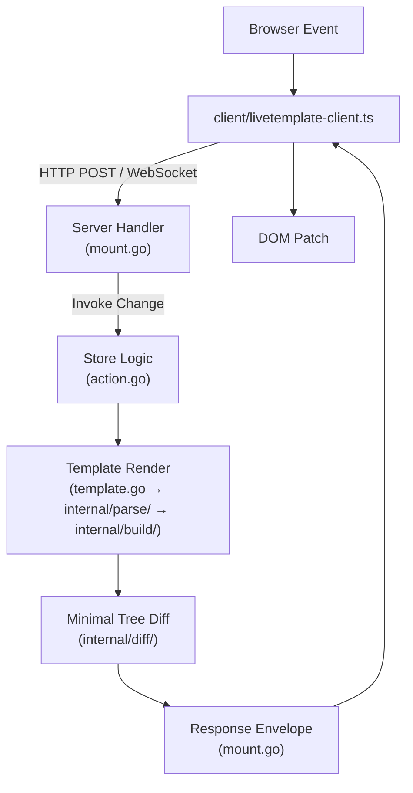

# LiveTemplate Contributor Walkthrough (v1.0 - ARCHIVED)

> **Note:** This is the v1.0 contributor walkthrough, archived for historical reference. For the current guide updated for v0.3.0's 5-phase architecture, see [docs/guides/new-contributor-walkthrough.md](../../guides/new-contributor-walkthrough.md).

Welcome aboard! This guide orients new contributors to the LiveTemplate codebase and walks through the end-to-end pipeline, from handling an HTTP request to delivering a minimal DOM update back to the browser. Keep this doc open while you explore the repo.

## 1. Local Development Setup

- **Go:** Install Go 1.22+ and enable modules (`GO111MODULE=on`).
- **Node (optional):** Required for the TypeScript client (`client/`) and when running `npm test`.
- **Docker:** Needed for end-to-end tests that spin up Chrome containers (see `cmd/lvt/e2e`).
- **Recommended Commands:**
  - `go test ./...` – run all Go tests.
  - `go test ./cmd/lvt/e2e -run TestTutorialE2E -count=1 -v` – CLI tutorial smoke test.
  - `cd client && npm install && npm test` – client unit tests.

## 2. Repository Map (Quick Reference - v1.0)

| Area                | Path                                                                                                               | Notes                                                                          |
| ------------------- | ------------------------------------------------------------------------------------------------------------------ | ------------------------------------------------------------------------------ |
| Public Go API       | [`template.go`](../../template.go), [`action.go`](../../action.go), [`mount.go`](../../mount.go)                   | Entry point for application developers.                                        |
| Template Processing | [`internal/parse/`](../../internal/parse/), [`internal/build/`](../../internal/build/), [`internal/diff/`](../../internal/diff/) | AST parsing, tree construction, tree comparison (v1.0 refactored).             |
| Observability       | [`internal/observe/`](../../internal/observe/)                                                                     | Structured logging (slog), operational metrics (v1.0 addition).                |
| Tree Operations     | [`tree.go`](../../tree.go), [`template_flatten.go`](../../template_flatten.go)                                    | Tree utilities, template composition.                                          |
| Session & Auth      | [`session.go`](../../session.go), [`auth.go`](../../auth.go)                                                       | Session grouping and authentication helpers.                                   |
| Web Client          | [`client/livetemplate-client.ts`](../../client/livetemplate-client.ts)                                             | TypeScript runtime (event delegation, WebSocket/HTTP transport, DOM patching). |
| CLI Tool            | [`cmd/lvt/`](../../cmd/lvt/)                                                                                       | App scaffolding, generators, hot-reload server.                                |
| Testing             | [`*_test.go`](../../), [`cmd/lvt/e2e/`](../../cmd/lvt/e2e/), [`internal/testing/`](../../internal/testing/)        | Unit, fuzz, e2e, CLI smoke tests.                                              |
| Docs                | [`docs/`](../)                                                                                                     | Architecture, code structure, design proposals.                                |

Supplementary docs that pair with this walkthrough:

- `docs/ARCHITECTURE.md` – High-level design.
- `docs/CODE_STRUCTURE.md` – File-by-file explanation.
- `docs/guides/user-guide.md` – CLI user journey.

## 3. End-to-End Pipeline Overview



### Phases at a Glance

1. **Request Handling:** `Template.Handle` builds an HTTP/WebSocket handler that authenticates the user, shares state within a session group, and spins up per-connection template state.
2. **Action Execution:** Actions are routed to user-defined stores; validation errors are captured and stored per connection.
3. **Tree Generation:** Templates are parsed to AST, hydrated with data, and converted to a tree structure that separates statics and dynamics.
4. **Diffing & Response:** Fingerprints detect unchanged trees; otherwise, a minimal JSON update is serialized and sent back to the client.
5. **Client Application:** The client runtime merges statics from cache with incoming dynamics and morphs the DOM.

Each phase maps to a cluster of files described below.

## 4. Guided Example: Counter App

Before diving into the internals, follow a concrete slice of the codebase: the Counter sample under `examples/counter`. It shows the full request → update → response loop with minimal code.

### Running the sample

```bash
go run ./examples/counter
# Visit http://localhost:8080 and click +1/-1/reset
```

### Files to keep open

- [`examples/counter/main.go`](../../examples/counter/main.go) – server setup, state struct, `Change` method.
- [`examples/counter/counter.tmpl`](../../examples/counter/counter.tmpl) – template with `lvt-*` bindings.
- [`examples/counter/counter_e2e_test.go`](../../examples/counter/counter_e2e_test.go) – verifies the emitted tree diff.

```go
// examples/counter/main.go
type CounterState struct {
   Title       string `json:"title"`
   Counter     int    `json:"counter"`
   LastUpdated string `json:"last_updated"`
}

func (s *CounterState) Change(ctx *livetemplate.ActionContext) error {
   switch ctx.Action {
   case "increment":
      s.Counter++
   case "decrement":
      s.Counter--
   case "reset":
      s.Counter = 0
   }
   s.LastUpdated = formatTime()
   return nil
}
```

```html
<!-- examples/counter/counter.tmpl -->
<div>
  <p>Counter: {{.Counter}}</p>
  <button lvt-click="increment">+1</button>
  <button lvt-click="decrement">-1</button>
  <button lvt-click="reset">Reset</button>
</div>
<footer>Last updated: {{.LastUpdated}}</footer>
```

### How the phases line up

1. **Initial GET** – `main.go` creates a `Template` and mounts it with `tmpl.Handle(state)`. When the browser loads `/`, Phase 1 code (`ServeHTTP` in `mount.go`) renders the initial HTML using `Template.ExecuteUpdates`.
2. **User action** – Clicking `lvt-click="increment"` posts an action. Phase 2 (`handleAction` in `mount.go`) calls `CounterState.Change`, which increments the counter and timestamps `LastUpdated`.
3. **Tree generation** – `Change` sets new data; Phase 3 (`template.go` → `tree_ast.go`/`tree.go`) turns `counter.tmpl` into statics + dynamics. You can log inside `Template.ExecuteUpdates` to see the JSON diff that the e2e test asserts.
4. **Diffing & response** – Phase 4 wraps the diff and sends it over WebSocket (`writeUpdateWebSocket`). The `counter_e2e_test.go` test opens the page, performs clicks, and checks the minimal JSON patch produced here.
5. **Client apply** – The bundled client script in the example (`livetemplate-client.js`, served by `internal/testing`) receives the update and patches the DOM, completing Phase 5.

With those files in view, the following sections show where the framework code plugs in at each step.

## 5. Phase 1 – Handler & Session Lifecycle (`template.go`, `mount.go`, `session.go`, `auth.go`)

1. `livtemplate.New(name, opts...)` ([`template.go`](../../template.go)):

   - Discovers template files (unless overridden).
   - Configures defaults: Gorilla WebSocket upgrader, in-memory session store, anonymous authenticator.
   - Generates a wrapper ID and key generator for tree rendering.

2. `Template.Handle(stores...)` ([`template.go`](../../template.go) → [`mount.go`](../../mount.go)):

   - Clones the incoming store(s) and packages them in a `MountConfig`.
   - Returns a `liveHandler`, which satisfies `http.Handler` and the `LiveHandler` broadcast interface.

3. `ServeHTTP` ([`mount.go`](../../mount.go)):

   - Adds the `X-LiveTemplate-WebSocket` header.
   - Dispatches to `handleHTTP` (initial document render) or `handleWebSocket` (long-lived session).

4. `handleWebSocket` highlights:
   - **Authentication:** `Authenticator.Identify` + `GetSessionGroup` (see `auth.go`). Default cookie-based anonymous grouping keeps tabs in the same browser synchronized.
   - **Session Store:** `SessionStore.Get/Set` ([`session.go`](../../session.go)) maintains shared stores per group. `StoreInitializer` implementations get `Init` calls here.
   - **Broadcast Hooks:** Stores implementing `BroadcastAware` receive a per-connection `Broadcaster` during `OnConnect` and are told when the socket closes.
   - **Connection Registry:** [`ConnectionRegistry`](../../registry.go) indexes active sockets by group and user for auto-sync and targeted broadcasts.

> **Counter example:** The call to `tmpl.Handle(state)` in `examples/counter/main.go` enters this phase. When you first load `http://localhost:8080`, `ServeHTTP` renders the full page and sets up the WebSocket connection used for subsequent updates.

## 6. Phase 2 – Action Dispatch (`action.go`, `mount.go`)

1. **Incoming Message:**

   - WebSocket payload parsed by `parseActionFromWebSocket` ([`action.go`](../../action.go)).
   - HTTP fallback uses `parseActionFromHTTP`.

2. **ActionContext:** `ActionContext` provides `Action` name, `ActionData` helpers (`GetString`, `Bind`, `BindAndValidate`), request metadata, and per-connection session data.

3. **Change Execution:**

   - `handleAction` (`mount.go`) resolves store namespace (`counter.increment` vs `increment`).
   - Calls `Store.Change(ctx)`; `StoreInitializer` and `BroadcastAware` were addressed earlier.
   - Validation errors turned into `MultiError` and stored in `connState` for inclusion in the next response.

4. **Auto-Sync:** After an action, sibling connections in the same session group are pushed updates (`GetByGroupExcept` + `sendUpdate`).

> **Counter example:** When you click `+1`, the browser sends `{"action":"increment"}`. `handleAction` routes it to `CounterState.Change` in `examples/counter/main.go`, which mutates the state and updates `LastUpdated`.

## 7. Phase 3 – Template Compilation & Tree Generation (`template.go`, `tree_ast.go`, `tree.go`, `template_flatten.go`)

This phase transforms Go template source plus store data into a structured tree that separates statics from dynamics. It happens on every render, but most work is cached or short-circuited after the initial run.

### 7.1 Preprocessing & Composition

- [`template.go`](../../template.go) normalizes whitespace (`normalizeTemplateSpacing`) so formatter changes do not break parsing.
- [`template_flatten.go`](../../template_flatten.go) detects `{{template}}`, `{{block}}`, and `{{define}}` usage. `flattenTemplate` recursively inlines referenced templates so the downstream AST walk sees a single, self-contained template string.
- `Template` maintains a [`ClientStructureRegistry`](../../client_structure_registry.go); on the first render it records statics signatures so they can be reused across updates.

### 7.2 AST Compilation

- `parseTemplateToTreeAST` ([`tree_ast.go`](../../tree_ast.go)) parses the flattened string with `html/template` to obtain the canonical Go parse tree.
- `buildTreeFromAST` walks the parse tree node-by-node, producing a hierarchy of `Construct` objects. Each construct knows how to hydrate itself with runtime data.
- Determinism matters: `orderedVars` preserves iteration order for range variables, avoiding non-deterministic diffs.
- During this pass we track context (e.g., whether statics should be emitted) and collect metadata needed for later phases (range keys, fingerprints).

### 7.3 Hydration & Evaluation

- `Hydrate` methods evaluate constructs against the live store data. Examples: `FieldConstruct` resolves `{{.Name}}`; `ConditionalConstruct` chooses the active branch; `RangeConstruct` iterates slices/arrays/maps while capturing positional keys.
- Evaluation is resilient to nils and missing fields; panics are recovered and converted into template errors so tests can assert on failure modes.
- Range hydration attaches bookkeeping (e.g., parent keys, positions) that powers range diff operations (`insert`, `remove`, `update`, `order`).

### 7.4 Tree Assembly & Normalization

- Hydrated constructs are stitched together into a `TreeNode` ([`tree_types.go`](../../tree_types.go)). Each node has an `"s"` slice for statics and numbered slots (`"0"`, `"1"`, …) for dynamics or nested subtrees.
- The key generator ([`tree.go`](../../tree.go)) issues deterministic keys for wrapper nodes, ranges, and fragments. These keys are embedded into the tree so range diffing can align stable items across renders.
- `calculateFingerprint` computes an MD5 hash of the entire node; this fingerprint becomes the fast-path for change detection during diffing.
- Before returning, `injectWrapperDiv` ensures the rendered HTML is wrapped with a stable element identified by the template’s random `wrapperID`. The client uses this as the DOM patch anchor.

### 7.5 Phase 1 vs Phase 2 Payloads

- The first render for a connection emits both the structure (Phase 1) and data (Phase 2). Structure packets describe statics so the client can cache them; they are sent only when a new signature appears.
- Subsequent renders typically contain only Phase 2 updates—dynamics that changed since the last fingerprint—and reference the cached statics by signature ID. [`ClientStructureRegistry`](../../client_structure_registry.go) prevents resending identical structures.

```mermaid
flowchart LR
   subgraph TreePipeline[Tree Generation Pipeline]
      A[Normalize Template\n(template.go)] --> B[Flatten Composition\n(template_flatten.go)]
      B --> C[Parse to AST\n(tree_ast.go)]
      C --> D[Hydrate Constructs\n(tree_ast.go)]
      D --> E[Assemble TreeNode\n(tree_types.go)]
      E --> F[Assign Keys & Fingerprint\n(tree.go)]
   end
   F --> G[Phase 1/2 Payload Split]
```

> **Counter example:** After `CounterState.Change` runs, the updated struct flows through this phase. The `<p>Counter: {{.Counter}}</p>` line from `examples/counter/counter.tmpl` becomes a dynamic slot (`"0"`) whose value changes from `0` to `1` in the diff that the e2e test inspects.

## 8. Phase 4 – Diffing & Response Serialization (`template.go`, `mount.go`)

This phase decides whether any output changed, produces the minimal JSON payload, and delivers it to each interested connection.

### 8.1 Change Detection

- `Template.ExecuteUpdates` compares the newly generated fingerprint against `Template.lastFingerprint` (per connection, thanks to `Clone`).
- If fingerprints match, the method emits a minimal no-op tree (`{"meta":{"success":...}}`) so the client can fire lifecycle events without touching the DOM.
- If they differ, the method walks the previous and current trees to determine which dynamics moved or mutated, including range operations (insert/update/remove/order).

### 8.2 Update Assembly

- Diff results are materialized as a new tree containing only changed slots. Keys make it possible to patch nested ranges without re-sending entire lists.
- Validation errors gathered in `connState` are injected into `ResponseMetadata.Errors`. The `Success` flag flips to `false` when errors are present.
- The active action name (`msg.Action`) is recorded so the client can dispatch `lvt:success`/`lvt:error` events with context.

### 8.3 Serialization & Transport

- `ExecuteUpdates` writes the diff tree to a buffer. [`mount.go`](../../mount.go) wraps it in `UpdateResponse` (tree + metadata) and marshals the whole structure to JSON.
- For WebSockets, `writeUpdateWebSocket` (in [`action.go`](../../action.go)) pushes the bytes directly. For HTTP fallback, `handleHTTPPost` writes the same JSON payload with appropriate headers.
- Auto-sync and manual broadcast paths (`Broadcast`, `BroadcastToUsers`, `BroadcastToGroup`) reuse `sendUpdate`, which clones the template per connection to keep fingerprints independent.

### 8.4 Post-Send Bookkeeping

- After a successful send, `connState.clearErrors` runs so validation messages do not leak into the next action.
- `Template` updates its cached tree and fingerprint so the next action can take the fast path when nothing changed.
- When broadcasts fail for a specific socket (e.g., connection closed), the handler logs the error and unregisters the connection from [`ConnectionRegistry`](../../registry.go).

> **Counter example:** The Chromedp flow in `counter_e2e_test.go` clicks the buttons, then asserts that the JSON response from this phase contains only the changed counter value and timestamp.

## 9. Phase 5 – Client Runtime (`client/livetemplate-client.ts`)

- **Transport:** Establishes WebSocket connection, falls back to HTTP POST when WebSockets are disabled/unavailable.
- **Event Delegation:** Listens for `lvt-click`, `lvt-submit`, `lvt-keyup`, etc., serializes `dataset` values into action payloads.
- **Statics Cache:** Maintains a map of structure signatures (Phase 1 payload) to static HTML segments.
- **DOM Patching:** Uses `morphdom` to update only changed nodes, preserving focus and scroll position.
- **Lifecycle Events:** Dispatches `lvt:pending`, `lvt:success`, `lvt:error`, `lvt:done` for forms.
- **Loading Indicator:** Optional progress bar; disable via `Template.WithLoadingDisabled` on the server.

Knowing the client is important when changing tree formats or metadata—any server-side change must stay compatible with this runtime.

## 10. Broadcast & Background Workflows (`mount.go`)

- **Per-Connection Broadcasts:** `BroadcastAware.OnConnect(ctx, Broadcaster)` gives access to `Send()` that re-renders the current connection. Ideal for background goroutines per user (e.g., live notifications).
- **Global Broadcasts:** `LiveHandler.Broadcast`, `BroadcastToUsers`, and `BroadcastToGroup` let server code push updates to everyone, specific users, or session groups. These run diffs per connection to respect each session’s state.

## 11. Testing Strategy

| Layer              | Command/Location                                                                                                                                                 | Notes                                                                              |
| ------------------ | ---------------------------------------------------------------------------------------------------------------------------------------------------------------- | ---------------------------------------------------------------------------------- |
| Unit & Integration | `go test ./...` ([`template_test.go`](../../template_test.go), [`mount_test.go`](../../mount_test.go), etc.)                                                     | Covers core tree generation, template execution, session handling.                 |
| Fuzz               | [`tree_fuzz_test.go`](../../tree_fuzz_test.go)                                                                                                                   | Exercises parser robustness.                                                       |
| Browser E2E        | `go test -tags=e2e ./...` (see [`focus_preservation_test.go`](../../focus_preservation_test.go), [`loading_indicator_test.go`](../../loading_indicator_test.go)) | Use Chromedp; requires Docker when invoked via [`cmd/lvt/e2e`](../../cmd/lvt/e2e). |
| CLI E2E            | `go test ./cmd/lvt/e2e` (e.g., [`tutorial_test.go`](../../cmd/lvt/e2e/tutorial_test.go))                                                                         | Generates an app, runs migrations, builds binary, automates Chrome via Docker.     |
| Client             | `cd client && npm test` ([`tests/test-reconstruction.test.ts`](../../client/tests/test-reconstruction.test.ts))                                                  | Jest tests for the TypeScript runtime.                                             |

When adding features, mirror this strategy: unit tests for the new logic, integration tests for request/response behavior, and CLI/client coverage if relevant.

## 12. Typical Contributor Tasks

1. **Add a New Template Construct**

   - Update `tree_ast.go` to recognize and hydrate the new construct.
   - Update client if tree format changes.
   - Add tests in `template_test.go`, `tree_*_test.go`.

2. **Modify Action Protocol**

   - Adjust `action.go` (parsers, `ActionData` helpers).
   - Update `mount.go` to surface metadata or alter routing.
   - Ensure client runtime understands new metadata fields.

3. **Extend CLI**

   - Add command in `cmd/lvt/commands/`.
   - Update code generation in `cmd/lvt/internal/generator`.
   - Add CLI E2E coverage in `cmd/lvt/e2e`.

4. **Improve Client Runtime**

   - Update `client/livetemplate-client.ts`.
   - Rebuild (`npm run build`) and update CDN reference if necessary.
   - Ensure server responses remain backward compatible or bump version appropriately.

5. **Docs & Examples**
   - Add walkthroughs under `docs/guides/` (like this one!), expand architecture notes, or update `examples/` to demonstrate new capabilities.

## 13. Debugging Tips

- **Log Configuration:** `template.go` logs dev mode and template parsing warnings; `mount.go` logs connection lifecycle and action errors.
- **Enable Dev Mode:** `livetemplate.WithDevMode(true)` makes the client script load from local assets instead of CDN, useful when iterating on the TypeScript client.
- **Inspect Trees:** Add temporary logging around `ExecuteUpdates` (before JSON marshal) to understand emitted trees; use `tree_test_helpers.go` for normalization when writing tests.
- **Chrome Containers:** The CLI E2E suite manages Dockerized Chrome via `internal/testing/docker_chrome.go`. Use `cleanupChromeContainers()` (see `cmd/lvt/e2e/shared_test.go`) if tests fail mid-run.

## 14. Suggested First Issues

- **Documentation Enhancements:** Expand `docs/guides/` with topic-specific walkthroughs (validation, broadcasting, multi-store patterns).
- **Additional Tests:** Port scenarios from existing examples into automated tests; add fuzz cases covering edge template constructs.
- **CLI UX:** Improve generated code comments, add new kit templates, or enhance scaffolding options.
- **Client Ergonomics:** Add more lifecycle events or improve error overlays.

## 15. Key Files & Their Roles (At-a-Glance)

| File                                                                   | Role                                                               |
| ---------------------------------------------------------------------- | ------------------------------------------------------------------ |
| [`template.go`](../../template.go)                                     | Public template API, ExecuteUpdates, handler factory.              |
| [`mount.go`](../../mount.go)                                           | HTTP/WebSocket handling, session lifecycle, broadcasting.          |
| [`action.go`](../../action.go)                                         | Store interface, action parsing, data binding, validation helpers. |
| [`tree_ast.go`](../../tree_ast.go)                                     | AST walker translating Go templates into tree structures.          |
| [`tree.go`](../../tree.go)                                             | Tree utilities (keys, fingerprints, wrapper injection).            |
| [`client/livetemplate-client.ts`](../../client/livetemplate-client.ts) | Browser runtime handling events, transport, DOM updates.           |
| [`cmd/lvt/*`](../../cmd/lvt/)                                          | CLI tool for generating/running LiveTemplate apps.                 |
| [`internal/testing/*`](../../internal/testing/)                        | Shared testing utilities (Chromedp, Docker Chrome, fixtures).      |

## 16. Further Reading

- `docs/ARCHITECTURE.md` – In-depth design rationale and diagrams.
- `docs/CODE_STRUCTURE.md` – Detailed file-by-file reference.
- `docs/BROADCASTING.md` – Broadcast patterns and examples.
- `docs/design/IMPLEMENTATION_STATUS.md` – Roadmap of planned features.
- `examples/` – Minimal working apps demonstrating patterns (counter, todos, chat).

---

This guide should help you navigate the pipeline with confidence. Pair it with the source files and tests for a hands-on understanding, and don’t hesitate to update this document as the architecture evolves.
