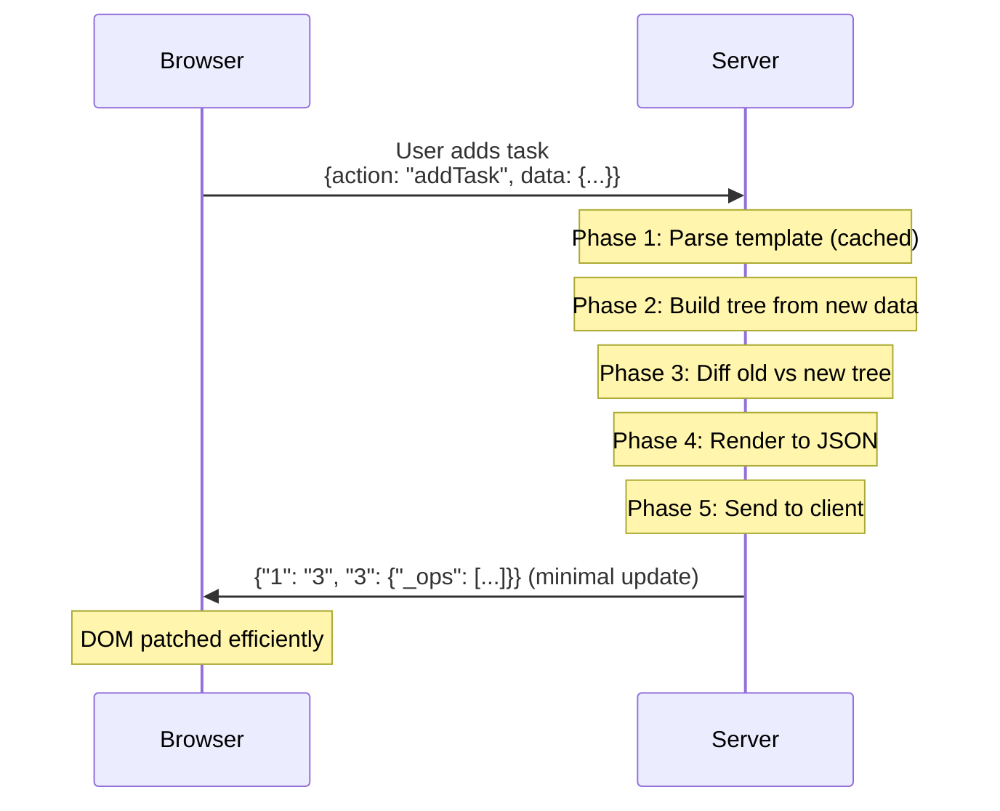

# LiveTemplate Contributor Walkthrough

Welcome! This guide introduces you to the LiveTemplate codebase through the lens of its **5-phase architecture**. By the end, you'll understand how a user action in the browser flows through the system and becomes a minimal DOM update.

## What Makes LiveTemplate Different

LiveTemplate is inspired by Phoenix LiveView - it lets you build reactive web applications by writing only server-side Go code. The key innovation is **tree-based diffing**: templates are parsed into tree structures that separate static HTML from dynamic values. When state changes, LiveTemplate calculates exactly what changed and sends only that data to the browser (typically 50-90% smaller than full HTML).



## The 5-Phase Architecture

The codebase is organized into 5 clear operational phases:

1. **[Parse](#phase-1-parse)** ([`internal/parse/`](../../internal/parse/)) - Convert Go templates to executable AST
2. **[Build](#phase-2-build)** ([`internal/build/`](../../internal/build/)) - Generate tree structures from AST + data
3. **[Diff](#phase-3-diff)** ([`internal/diff/`](../../internal/diff/)) - Calculate minimal changes between trees
4. **[Render](#phase-4-render)** ([`internal/render/`](../../internal/render/)) - Convert trees/changes to HTML/JSON
5. **[Send](#phase-5-send)** ([`internal/send/`](../../internal/send/)) - Deliver updates via HTTP/WebSocket

Each phase has a single responsibility, making the codebase easier to understand and modify.

## Quick Start: Running the Counter Example

Before diving into internals, let's see LiveTemplate in action with the simplest example:

```bash
# Clone and navigate to examples (separate repo)
git clone https://github.com/livetemplate/examples
cd examples/counter
go run main.go
# Open http://localhost:8080
```

**Key files to explore:**
- [`main.go`](https://github.com/livetemplate/examples/blob/main/counter/main.go) - Server setup and state management
- [`counter.tmpl`](https://github.com/livetemplate/examples/blob/main/counter/counter.tmpl) - Template with `lvt-*` bindings

Click the buttons and open your browser's Network tab. Watch how each action produces a tiny JSON payload like `{"0": "6"}` instead of full HTML. That's tree-based diffing at work.

## Local Development Setup

**Required:**
- Go 1.26.0+ with modules enabled
- Git

**Optional but recommended:**
- Node.js/npm (for client TypeScript development)
- Docker (for E2E browser tests)

**Essential commands:**
```bash
# Run all tests
GOWORK=off go test ./...

# Run specific package tests
GOWORK=off go test ./internal/parse -v
GOWORK=off go test ./internal/build -v
GOWORK=off go test ./internal/diff -v

# Run with race detector
GOWORK=off go test -race ./...

# Update golden test files (when intentionally changing output)
UPDATE_GOLDEN=1 GOWORK=off go test ./...
```

## Repository Structure

```
livetemplate/
├── *.go                          # Public API (template.go, mount.go, action.go, etc.)
├── internal/
│   ├── parse/                    # Phase 1: Template parsing
│   ├── build/                    # Phase 2: Tree construction + fingerprinting
│   ├── diff/                     # Phase 3: Tree comparison
│   ├── render/                   # Phase 4: HTML/JSON rendering
│   ├── send/                     # Phase 5: Message serialization
│   ├── keys/                     # Sequential key generation
│   ├── observe/                  # Metrics and Prometheus export
│   ├── session/                  # Connection tracking and WebSocket management
│   ├── context/                  # Template execution context
│   ├── discovery/                # Template discovery utilities
│   ├── fuzz/                     # Fuzz testing infrastructure
│   ├── testutil/                 # Test utilities (Redis helpers)
│   ├── upload/                   # File upload handling
│   ├── uploadtypes/              # Upload type definitions
│   └── util/                     # String utilities
├── pubsub/                       # Pub/sub broadcasting
├── docs/                         # Architecture and guides
├── testdata/                     # Test fixtures and golden files
└── scripts/                      # Release and build scripts
```

## The Public API (Entry Points)

Before diving into the 5 phases, understand the public API that applications use:

### [template.go](../../template.go)
Main entry point for creating and managing templates:
- `New(name string, opts ...Option) (*Template, error)` - Create a template
- `Template.Handle(controller, state, ...HandleOption) LiveHandler` - Mount template as HTTP handler
- `Template.ExecuteUpdates(w io.Writer, data interface{}, messages ...map[string]string) error` - Orchestrates all 5 phases

**Example with v0.7.0 Controller+State pattern:**
```go
// Controller holds dependencies (singleton, never cloned)
type TaskController struct {
    DB     *sql.DB
    Logger *slog.Logger
}

// State holds session data (cloned per session)
type TaskState struct {
    Title      string
    TotalTasks int
    Tasks      []Task
}

// Create template (returns error)
tmpl, err := livetemplate.New("tasks")
if err != nil {
    panic(err)
}
if _, err := tmpl.Parse(templateString); err != nil {
    panic(err)
}

// Mount handler with explicit Controller+State separation
handler := tmpl.Handle(
    &TaskController{DB: db, Logger: logger},
    livetemplate.AsState(&TaskState{}),
)
http.Handle("/", handler)
```

**Tests:** [`template_test.go`](../../template_test.go)

### [mount.go](../../mount.go)
HTTP/WebSocket handling and session lifecycle:
- `ServeHTTP(w, r)` - HTTP entry point (initial page load)
- `handleWebSocket(conn, req)` - WebSocket lifecycle management
- `handleAction(ctx, msg)` - Action dispatch to controller methods

**Lifecycle methods in your controller:**
```go
// Called once when session is created
func (c *TaskController) Mount(state TaskState, ctx *livetemplate.Context) (TaskState, error) {
    state.Tasks = c.DB.LoadTasks()
    state.TotalTasks = len(state.Tasks)
    return state, nil
}

// Called on each WebSocket connect (optional)
func (c *TaskController) OnConnect(state TaskState, ctx *livetemplate.Context) (TaskState, error) {
    c.Logger.Info("User connected", "userID", ctx.UserID())
    return state, nil
}

// Called on disconnect (optional)
func (c *TaskController) OnDisconnect() {
    // Cleanup if needed
}
```

**Tests:** [`handle_test.go`](../../handle_test.go), [`lifecycle_test.go`](../../lifecycle_test.go)

### [context.go](../../context.go)
Unified context for all lifecycle and action methods:
- `Context` - Provides action name, data, request metadata, session info
- `Context.Action()` - Get current action name
- `Context.UserID()` - Get authenticated user ID
- `Context.GetString(key)`, `GetInt(key)`, `GetBool(key)` - Type-safe data access
- `Context.BindAndValidate(dest, validator)` - Parse and validate form/JSON data

**Example action method:**
```go
func (c *TaskController) AddTask(state TaskState, ctx *livetemplate.Context) (TaskState, error) {
    name := ctx.GetString("name")
    status := ctx.GetString("status")
    
    // Or use binding for complex data (requires go-playground/validator):
    var req struct {
        Name   string `json:"name" validate:"required"`
        Status string `json:"status" validate:"required,oneof=pending done"`
    }
    validate := validator.New()
    if err := ctx.BindAndValidate(&req, validate); err != nil {
        return state, err  // Validation errors sent to client
    }
    
    task := Task{Name: req.Name, Status: req.Status}
    state.Tasks = append(state.Tasks, task)
    state.TotalTasks++
    return state, nil
}
```

**Tests:** [`context_test.go`](../../context_test.go)

### [state.go](../../state.go)
State interface and wrapper:
- `State` interface - Marker interface for serializable state
- `AsState[T]()` - Generic wrapper for state types

**Note:** `AssertPureState[T](t)` is a test helper located in [`testing.go`](../../testing.go), not `state.go`.

**Example usage:**
```go
// State must be serializable (no pointers to DB, Logger, etc.)
type TaskState struct {
    Title      string
    TotalTasks int
    Tasks      []Task  // ✓ OK: serializable slice
    // DB *sql.DB     // ✗ BAD: would fail AssertPureState
}

// In tests
func TestTaskState(t *testing.T) {
    livetemplate.AssertPureState[TaskState](t)  // Ensures state is pure
}

// Mount with AsState wrapper
handler := tmpl.Handle(controller, livetemplate.AsState(&TaskState{}))
```

**Tests:** [`state_test.go`](../../state_test.go)

### [auth.go](../../auth.go)
Authentication and user identification:
- `Authenticator` interface - Identify users from requests
  - `Identify(r *http.Request) (userID string, err error)` - Get user ID from request
  - `GetSessionGroup(r *http.Request, userID string) (string, error)` - Get session group ID
- `AnonymousAuthenticator` - Default cookie-based session authentication

**Example custom authenticator:**
```go
type JWTAuthenticator struct {
    secretKey []byte
}

func (a *JWTAuthenticator) Identify(r *http.Request) (string, error) {
    token := r.Header.Get("Authorization")
    // Validate JWT and extract user ID
    return userID, nil
}

func (a *JWTAuthenticator) GetSessionGroup(r *http.Request, userID string) (string, error) {
    return userID, nil  // Use userID as session group
}

// Use authenticator with New(), not Handle()
tmpl, err := livetemplate.New("tasks",
    livetemplate.WithAuthenticator(&JWTAuthenticator{secretKey}),
)
```

**Tests:** [`auth_test.go`](../../auth_test.go)

## Phase 1: Parse

**Package:** [`internal/parse/`](../../internal/parse/)
**Job:** Convert Go template strings into executable Abstract Syntax Tree (AST)

### How It Works

The parse phase takes a template string and converts it into a structured representation that can be executed with data. Let's use a unified example throughout all 5 phases to see how each phase works together.

### Example: Task Manager Template

We'll trace this template through all 5 phases:

```html
<div>
  <h1>{{.Title}}</h1>
  <p>Total: {{.TotalTasks}}</p>
  {{if gt .TotalTasks 0}}
    <div class="status active">Tasks Active</div>
  {{else}}
    <div class="status inactive">No Tasks</div>
  {{end}}
  <ul>
    {{range .Tasks}}
      <li>{{.Name}} - {{.Status}}</li>
    {{end}}
  </ul>
</div>
```

**Initial data:**
```go
type TaskState struct {
    Title      string
    TotalTasks int
    Tasks      []Task
}

type Task struct {
    Name   string
    Status string
}

state := TaskState{
    Title:      "My Tasks",
    TotalTasks: 2,
    Tasks: []Task{
        {Name: "Write docs", Status: "done"},
        {Name: "Review PR", Status: "pending"},
    },
}
```

### Phase 1 Output: Parsed AST

After parsing, the template becomes a structured AST:

```go
[
  FieldConstruct{Path: ".Title"},           // {{.Title}}
  FieldConstruct{Path: ".TotalTasks"},      // {{.TotalTasks}}
  ConditionalConstruct{                     // {{if gt .TotalTasks 0}}
    Condition: "gt .TotalTasks 0",
    TrueBranch: [/* "Tasks Active" branch */],
    FalseBranch: [/* "No Tasks" branch */],
  },
  RangeConstruct{                           // {{range .Tasks}}
    Collection: ".Tasks",
    Body: [
      FieldConstruct{Path: ".Name"},        // {{.Name}}
      FieldConstruct{Path: ".Status"},      // {{.Status}}
    ],
  },
]
```

**Key files:**
- [`parse.go`](../../internal/parse/parse.go) - Main parsing orchestrator
  - Uses Go's `text/template` parser, wraps with LiveTemplate constructs
- [`field.go`](../../internal/parse/field.go) - Handles `{{.Field}}` expressions
- [`conditional.go`](../../internal/parse/conditional.go) - Handles `{{if}}{{else}}{{end}}`
- [`range.go`](../../internal/parse/range.go) - Handles `{{range}}{{end}}` loops
- [`with.go`](../../internal/parse/with.go) - Handles `{{with}}{{end}}` context switching
- [`var_context.go`](../../internal/parse/var_context.go) - Variable scope tracking during parsing
- [`flatten.go`](../../internal/parse/flatten.go) - Tree flattening utilities
- [`types.go`](../../internal/parse/types.go) - Construct type definitions (FieldConstruct, ConditionalConstruct, etc.)

**Key insight:** Parsing happens once per template. The result is cached and reused for every render.

**Tests to explore:**
- [`parse_test.go`](../../internal/parse/parse_test.go) - Overall parsing
- [`field_test.go`](../../internal/parse/field_test.go) - Field handling
- [`conditional_test.go`](../../internal/parse/conditional_test.go) - If/else logic
- [`range_test.go`](../../internal/parse/range_test.go) - Range iteration

## Phase 2: Build

**Package:** [`internal/build/`](../../internal/build/)
**Job:** Execute parsed AST with data to generate tree structures

### How It Works

The build phase takes the parsed AST and your data and generates a **TreeNode** - the core data structure that separates static HTML from dynamic values.

### Phase 2 Output: TreeNode Structure

Continuing with our Task Manager example, when we execute the parsed template with the initial data:

```go
state := TaskState{
    Title:      "My Tasks",
    TotalTasks: 2,
    Tasks: []Task{
        {Name: "Write docs", Status: "done"},
        {Name: "Review PR", Status: "pending"},
    },
}
```

The build phase generates this TreeNode:

```json
{
  "s": ["<div><h1>", "</h1><p>Total: ", "</p>"],
  "0": "My Tasks",
  "1": "2",
  "2": {
    "s": ["<div class=\"status active\">Tasks Active</div>"],
    "0": null
  },
  "3": {
    "_range": true,
    "_items": [
      {
        "_key": "0",
        "_tree": {
          "s": ["<li>", " - ", "</li>"],
          "0": "Write docs",
          "1": "done"
        }
      },
      {
        "_key": "1",
        "_tree": {
          "s": ["<li>", " - ", "</li>"],
          "0": "Review PR",
          "1": "pending"
        }
      }
    ]
  }
}
```

**Key observations:**
- `"s"` arrays contain static HTML fragments
- `"0"`, `"1"`, etc. contain dynamic values
- Conditional branches store the evaluated branch (TotalTasks > 0 = true branch)
- Range constructs use `"d"` key for range data items in the wire format

**Note:** The JSON examples above show a simplified conceptual structure. The actual wire format uses `"d"` for range data (see `TreeNode.MarshalJSON` in `types.go`).

**Key files:**
- [`types.go`](../../internal/build/types.go) - Core data structures
  - `TreeNode` - Typed struct that marshals to map-like JSON wire format with special keys (`s`, `d`, `f`, `m`)
  - `RangeData` - Metadata for range iterations
  - `TreeMetadata` - Wrapper IDs and tree metadata
- [`fingerprint.go`](../../internal/build/fingerprint.go) - Change detection
  - `CalculateStructureFingerprint(node)` - MD5 hash of tree structure for detecting structural changes
- [`wrapper.go`](../../internal/build/wrapper.go) - Wrapper div injection
  - `InjectWrapper(html, wrapperID)` - Adds `<div id="lvt-xxx">` for targeting
- [`html_diff.go`](../../internal/build/html_diff.go) - HTML diffing utilities for tree construction
- [`html_segmentation.go`](../../internal/build/html_segmentation.go) - HTML segmentation into static/dynamic parts

### The Wire Format Optimization

This is crucial to understand:

1. **First render:** Tree includes full structure (statics + dynamics)
   ```json
   {"s": ["<div><h1>", "</h1>..."], "0": "My Tasks", "1": "2", ...}
   ```

2. **Subsequent updates:** Tree includes ONLY changed dynamics (no statics)
   ```json
   {"1": "3"}  // Only TotalTasks changed from 2 to 3
   ```

The implementation: [`prepare.go`](../../internal/diff/prepare.go)
- `PrepareTreeForClient(node, clientHasStatics)` removes statics from wire format if client has cached them
- Result: Updates are typically ~10% the size of full renders

**Key insight:** Static parts (`"s"`) are sent only once on first render. Updates send only changed dynamics.

**Tests to explore:**
- [`types_test.go`](../../internal/build/types_test.go) - TreeNode operations
- [`fingerprint_test.go`](../../internal/build/fingerprint_test.go) - Change detection
- [`wrapper_test.go`](../../internal/build/wrapper_test.go) - Wrapper injection

## Phase 3: Diff

**Package:** [`internal/diff/`](../../internal/diff/)
**Job:** Compare old and new trees to calculate minimal updates

### How It Works

The diff phase takes two TreeNodes (previous and current render) and determines the minimal set of changes needed to update the DOM.

### Phase 3 Example: Data Changes

Continuing with our Task Manager example, let's say a user adds a new task. The state changes:

**Old state (from Phase 2):**
```go
state := TaskState{
    Title:      "My Tasks",
    TotalTasks: 2,
    Tasks: []Task{
        {Name: "Write docs", Status: "done"},
        {Name: "Review PR", Status: "pending"},
    },
}
```

**New state (after user action):**
```go
state := TaskState{
    Title:      "My Tasks",
    TotalTasks: 3,  // Changed!
    Tasks: []Task{
        {Name: "Write docs", Status: "done"},
        {Name: "Review PR", Status: "pending"},
        {Name: "Deploy app", Status: "pending"},  // New task added!
    },
}
```

### Phase 3 Output: Diff Result

**Old tree:**
```json
{
  "s": ["<div><h1>", "</h1><p>Total: ", "</p>..."],
  "0": "My Tasks",
  "1": "2",
  "2": { /* conditional branch - unchanged */ },
  "3": { /* range with 2 items */ }
}
```

**New tree:**
```json
{
  "s": ["<div><h1>", "</h1><p>Total: ", "</p>..."],
  "0": "My Tasks",
  "1": "3",  // Changed!
  "2": { /* conditional branch - unchanged */ },
  "3": { /* range with 3 items */ }  // Changed!
}
```

**Diff result (before wire format preparation):**
```json
{
  "1": "3",  // Only the changed TotalTasks
  "3": {     // Range update operations
    "_range": true,
    "_ops": [
      ["i", "1", {  // Insert after item "1"
        "s": ["<li>", " - ", "</li>"],
        "0": "Deploy app",
        "1": "pending"
      }]
    ]
  }
}
```

**After PrepareTreeForClient (wire format - statics removed):**
```json
{
  "1": "3",
  "3": {
    "_range": true,
    "_ops": [
      ["i", "1", {"0": "Deploy app", "1": "pending"}]
    ]
  }
}
```

Only changed values are included. Statics are cached client-side and the insert operation is minimal.

**Key files:**
- [`tree_compare.go`](../../internal/diff/tree_compare.go) - Main diffing algorithm
  - `CompareTreesAndGetChangesWithPath(...)` - Recursively compare nodes
  - Returns tree containing only changed values
- [`range_ops.go`](../../internal/diff/range_ops.go) - Range-specific diffing
  - Generates operations:
    - `["u", "item-id", updates]` - Update existing item
    - `["i", "after-id", data]` - Insert new item after specified key
    - `["r", "item-id"]` - Remove item
    - `["o", ["id1", "id2", ...]]` - Reorder items
- [`prepare.go`](../../internal/diff/prepare.go) - Wire format preparation
  - `PrepareTreeForClient(node, hasStatics)` - Strip statics for updates
- [`helpers.go`](../../internal/diff/helpers.go) - ~70 diff utility functions

### Range Diffing

**Critical feature:** When iterating over lists, the diff phase generates efficient operations instead of re-sending entire lists.

In our example, adding "Deploy app" generates:
```json
["i", "1", {"0": "Deploy app", "1": "pending"}]
```

This insert operation is much smaller than re-sending all three tasks.

**Tests to explore:**
- [`tree_compare_test.go`](../../internal/diff/tree_compare_test.go) - Tree comparison
- [`range_ops_test.go`](../../internal/diff/range_ops_test.go) - Range operations
- [`prepare_test.go`](../../internal/diff/prepare_test.go) - Wire format prep
- [`helpers_test.go`](../../internal/diff/helpers_test.go) - Diff utilities

## Phase 4: Render

**Package:** [`internal/render/`](../../internal/render/)
**Job:** Convert tree structures to HTML or JSON for transmission

### How It Works

The render phase formats tree structures for consumption by clients or tests.

### Phase 4 Example: HTML Rendering

Continuing with our Task Manager example, the render phase can convert the TreeNode to HTML.

**TreeNode from Phase 2:**
```json
{
  "s": ["<div><h1>", "</h1><p>Total: ", "</p>"],
  "0": "My Tasks",
  "1": "2",
  "2": {
    "s": ["<div class=\"status active\">Tasks Active</div>"]
  },
  "3": {
    "_range": true,
    "_items": [
      {"_key": "0", "_tree": {"s": ["<li>", " - ", "</li>"], "0": "Write docs", "1": "done"}},
      {"_key": "1", "_tree": {"s": ["<li>", " - ", "</li>"], "0": "Review PR", "1": "pending"}}
    ]
  }
}
```

**Rendered HTML:**
```html
<div>
  <h1>My Tasks</h1>
  <p>Total: 2</p>
  <div class="status active">Tasks Active</div>
  <ul>
    <li>Write docs - done</li>
    <li>Review PR - pending</li>
  </ul>
</div>
```

**Key files:**
- [`html.go`](../../internal/render/html.go) - HTML rendering
  - `TreeToHTML(tree map[string]interface{}) (string, error)` - Convert tree to HTML string
  - `Node(w *strings.Builder, n *html.Node)` - Recursively render an HTML node to a builder
  - `IsVoidElement(tagName string) bool` - Check for self-closing tags (`<br>`, ``, etc.)
  - Used primarily for testing and validation
- [`minify.go`](../../internal/render/minify.go) - HTML minification
  - `MinifyHTML(htmlContent string) string` - Minify HTML or normalize whitespace for text-only content

### When This Phase Runs

**For initial page load:**
- Tree → HTML → Full HTML document
- Client receives complete page with all content

**For updates (via Phase 5):**
- Tree → JSON (diff result)
- Client receives minimal update object like `{"1": "3"}`

**For tests:**
- Tree → HTML for golden file comparison
- Validates that template rendering produces expected HTML

### Update Format vs HTML Format

For our example where TotalTasks changes from 2 to 3:

**Update JSON (sent to client):**
```json
{"1": "3"}
```

**Resulting HTML after client applies update:**
```html
<div>
  <h1>My Tasks</h1>
  <p>Total: 3</p>  <!-- Only this changed -->
  <div class="status active">Tasks Active</div>
  <ul>
    <li>Write docs - done</li>
    <li>Review PR - pending</li>
  </ul>
</div>
```

The client merges the update with cached statics to reconstruct the HTML.

**Tests to explore:**
- [`html_test.go`](../../internal/render/html_test.go) - HTML rendering tests

## Phase 5: Send

**Package:** [`internal/send/`](../../internal/send/)
**Job:** Package updates and deliver to clients via HTTP/WebSocket

### How It Works

The send phase wraps diff results with metadata and serializes for wire transmission.

### Phase 5 Example: Complete Flow

Continuing with our Task Manager example, when a user adds a task via an action like `addTask`:

**1. Client sends action:**
```json
{
  "action": "addTask",
  "data": {
    "name": "Deploy app",
    "status": "pending"
  }
}
```

**2. Server processes action and generates update (from Phase 3):**
```json
{
  "1": "3",  // TotalTasks changed
  "3": {     // Range operations
    "_range": true,
    "_ops": [
      ["i", "1", {"0": "Deploy app", "1": "pending"}]
    ]
  }
}
```

**3. Phase 5 wraps with metadata:**
```json
{
  "tree": {
    "1": "3",
    "3": {
      "_range": true,
      "_ops": [
        ["i", "1", {"0": "Deploy app", "1": "pending"}]
      ]
    }
  },
  "meta": {
    "success": true,
    "action": "addTask",
    "errors": null
  }
}
```

**4. Client receives and applies update:**
- Merges `"1": "3"` with cached statics to update "Total: 3"
- Executes insert operation to add new `<li>` to the list
- Only changed DOM nodes are updated

### With Validation Errors

If the action had validation errors:

```json
{
  "tree": {
    "1": "2"  // No change, validation failed
  },
  "meta": {
    "success": false,
    "action": "addTask",
    "errors": {
      "name": "Task name is required",
      "status": "Invalid status value"
    }
  }
}
```

**Key files:**
- [`message.go`](../../internal/send/message.go) - Incoming message parsing
  - `ParseActionFromHTTP(req *http.Request)` - Parse HTTP POST requests
  - `ParseActionFromWebSocket(data []byte)` - Parse WebSocket frames
  - Extracts action name and data from client
- [`response.go`](../../internal/send/response.go) - Outgoing response formatting
  - `PrepareUpdate(tree interface{}, errors map[string]string, action string)` - Wrap tree with metadata
  - `SerializeUpdate(resp *UpdateResponse)` - JSON serialization
  - Adds success/error status, validation errors, action context
- [`json.go`](../../internal/send/json.go) - JSON encoding utilities

### Transport Options

**WebSocket (preferred):**
- Direct frame push for real-time updates
- Bidirectional communication
- Lower latency

**HTTP POST (fallback):**
- JSON response with appropriate headers
- Works without WebSocket support
- Slightly higher latency

### Size Comparison

For our Task Manager example, adding one task:

**Full HTML re-render (naive approach):**
```html
<div>
  <h1>My Tasks</h1>
  <p>Total: 3</p>
  <div class="status active">Tasks Active</div>
  <ul>
    <li>Write docs - done</li>
    <li>Review PR - pending</li>
    <li>Deploy app - pending</li>
  </ul>
</div>
```
**Size:** ~200-250 bytes

**LiveTemplate update (tree-based diffing):**
```json
{"1":"3","3":{"_range":true,"_ops":[["i","1",{"0":"Deploy app","1":"pending"}]]}}
```
**Size:** ~75-90 bytes (60-70% smaller!)

**Tests to explore:**
- [`message_test.go`](../../internal/send/message_test.go) - Message parsing
- [`response_test.go`](../../internal/send/response_test.go) - Response formatting
- [`json_test.go`](../../internal/send/json_test.go) - JSON serialization

## Supporting Packages

### Key Generation ([`internal/keys/`](../../internal/keys/))

**Purpose:** Generate stable, sequential keys for range items

**Files:**
- [`generator.go`](../../internal/keys/generator.go)
  - [`Generator`](../../internal/keys/generator.go#L40-L44) - Thread-safe counter
  - [`NextKey()`](../../internal/keys/generator.go#L62-L72) - Get next sequential key
  - [`Reset()`](../../internal/keys/generator.go#L76-L81) - Reset counter between renders
  - [`LoadExistingKeys()`](../../internal/keys/generator.go#L98-L150) - Load previous range data for key continuity
  - [`DetectIDKey()`](../../internal/keys/generator.go#L160-L162) - Detect which dynamic position holds item IDs
- [`loader.go`](../../internal/keys/loader.go)
  - [`LoadExistingKeyMappings()`](../../internal/keys/loader.go#L23-L40) - Traverse a tree node to load range key mappings into a generator

**Why it matters:** Range items need stable keys for diffing. The generator ensures keys are deterministic within a render but reset between renders for consistency.

**Tests:** [`generator_test.go`](../../internal/keys/generator_test.go)

### Session Management ([`internal/session/`](../../internal/session/))

**Purpose:** Track WebSocket connections and enforce limits

**Key types:**
- [`Connection`](../../internal/session/registry.go#L33) - Single WebSocket connection with async send channel
- [`ConnectionRegistry`](../../internal/session/registry.go#L270) - Index connections by user/group
- [`ConnectionLimits`](../../internal/session/limits.go#L16) - Enforce max connections

**Tests:** [`registry_test.go`](../../internal/session/registry_test.go)

### Observability ([`internal/observe/`](../../internal/observe/))

**Purpose:** Production-ready logging and metrics

**Files:**
- [`doc.go`](../../internal/observe/doc.go) - Package documentation
- [`metrics.go`](../../internal/observe/metrics.go) - Operational metrics (`Metrics` type with atomic counters, histograms)
- [`prometheus.go`](../../internal/observe/prometheus.go) - Prometheus text format exporter (`PrometheusExporter` type)

## The Client Runtime

**Package:** [@livetemplate/client](https://www.npmjs.com/package/@livetemplate/client) (published on npm)

The TypeScript client library handles:
1. **Event delegation:** Listens for `lvt-click`, `lvt-submit`, `lvt-change`, etc.
2. **Transport:** WebSocket (preferred) with HTTP fallback
3. **Statics cache:** Stores `"s"` arrays from first render for reuse
4. **DOM patching:** Uses morphdom to apply minimal updates
5. **Lifecycle events:** Fires `lvt:pending`, `lvt:success`, `lvt:error`, `lvt:done`

**Usage in HTML:**
```html
<script src="https://cdn.jsdelivr.net/npm/@livetemplate/client@latest/dist/livetemplate-client.browser.js"></script>
```

**Note:** The client library is maintained in a separate repository and published to npm. Browser E2E tests that validate client behavior live in the [lvt repository](https://github.com/livetemplate/lvt).

## End-to-End Flow: Task Manager Example Revisited

Now that you understand the 5 phases, let's trace a complete flow with our Task Manager example:

### Initial Page Load (GET /)

1. **Request:** Browser requests `/`
2. **Handler:** [`mount.go`](../../mount.go) calls `ServeHTTP()`
3. **Lifecycle:** `Controller.Mount(state, ctx)` initializes state
4. **Phase 1-5:** Execute all phases to generate initial HTML
   - **Phase 1 (Parse):** Template parsed into AST (cached after first run)
   - **Phase 2 (Build):** Build tree with initial data:
     ```go
     TaskState{
       Title: "My Tasks",
       TotalTasks: 2,
       Tasks: []Task{
         {Name: "Write docs", Status: "done"},
         {Name: "Review PR", Status: "pending"},
       }
     }
     ```
   - **Phase 3 (Diff):** No diff (first render)
   - **Phase 4 (Render):** Convert tree to HTML
   - **Phase 5 (Send):** Send complete HTML document with WebSocket script
5. **Response:** Browser receives full page:
   ```html
   <div>
     <h1>My Tasks</h1>
     <p>Total: 2</p>
     <div class="status active">Tasks Active</div>
     <ul>
       <li>Write docs - done</li>
       <li>Review PR - pending</li>
     </ul>
   </div>
   ```

### User Adds Task (Action)

1. **Client:** User triggers `lvt-click="addTask"` with form data:
   ```json
   {"name": "Deploy app", "status": "pending"}
   ```
2. **Phase 5 (Receive):** `ParseActionFromWebSocket()` extracts action and data
3. **Execute:** `handleAction()` calls `TaskController.AddTask(state, ctx)`:
   ```go
   func (c *TaskController) AddTask(state TaskState, ctx *Context) (TaskState, error) {
       name := ctx.GetString("name")
       status := ctx.GetString("status")
       state.Tasks = append(state.Tasks, Task{Name: name, Status: status})
       state.TotalTasks++
       return state, nil
   }
   ```
4. **Update:** State changes:
   ```go
   // Old: TotalTasks: 2, Tasks: [2 items]
   // New: TotalTasks: 3, Tasks: [3 items]
   ```
5. **Phase 1 (Parse):** Template already parsed (cached) ✓
6. **Phase 2 (Build):** Build new tree with updated data:
   ```json
   {
     "s": ["<div><h1>", "</h1><p>Total: ", "</p>..."],
     "0": "My Tasks",
     "1": "3",  // Changed from "2"
     "2": { /* conditional - unchanged */ },
     "3": {     // Range now has 3 items
       "_range": true,
       "_items": [/* 3 tasks */]
     }
   }
   ```
7. **Phase 3 (Diff):** Compare old vs new tree:
   ```json
   // Changes detected:
   {
     "1": "3",  // TotalTasks changed
     "3": {     // Range changed
       "_range": true,
       "_ops": [
         ["i", "1", {"0": "Deploy app", "1": "pending"}]
       ]
     }
   }
   ```
8. **Phase 4 (Render):** Prepare for client (statics already cached)
9. **Phase 5 (Send):** Serialize response:
   ```json
   {
     "tree": {
       "1": "3",
       "3": {
         "_range": true,
         "_ops": [["i", "1", {"0": "Deploy app", "1": "pending"}]]
       }
     },
     "meta": {"success": true, "action": "addTask"}
   }
   ```
10. **Client:** Receives ~80 bytes, merges with cached statics:
    - Updates "Total: 3" (dynamic position "1")
    - Inserts new `<li>Deploy app - pending</li>` into list
    - Only changed DOM nodes are patched

**Payload size comparison:**
- Full HTML re-render: ~250 bytes
- LiveTemplate update: ~80 bytes (68% reduction!)

### Another User Completes Task (Action)

1. **Client:** User triggers `lvt-click="completeTask"` with `{"id": 1}`
2. **Execute:** `TaskController.CompleteTask(state, ctx)`:
   ```go
   func (c *TaskController) CompleteTask(state TaskState, ctx *Context) (TaskState, error) {
       id := ctx.GetInt("id")
       state.Tasks[id].Status = "done"  // "pending" → "done"
       return state, nil
   }
   ```
3. **Phase 3 (Diff):** Detects change in range item:
   ```json
   {
     "3": {
       "_range": true,
       "_ops": [
         ["u", "1", {"1": "done"}]  // Update operation
       ]
     }
   }
   ```
4. **Phase 5 (Send):** Response:
   ```json
   {
     "tree": {
       "3": {
         "_range": true,
         "_ops": [["u", "1", {"1": "done"}]]
       }
     },
     "meta": {"success": true, "action": "completeTask"}
   }
   ```
5. **Client:** Updates only the status text in the second task

**Payload size:** ~60 bytes (even smaller!)

### Key Observations

1. **Template parsed once:** Cached and reused for every render
2. **Minimal updates:** Only changed values transmitted
3. **Efficient range operations:** Insert/update/delete instead of re-sending full list
4. **Client-side caching:** Static HTML cached after first render
5. **Predictable payloads:** Structured format enables reliable sizing

## Testing Strategy

LiveTemplate has comprehensive test coverage across all phases:

### Unit Tests

Run tests for specific packages:
```bash
GOWORK=off go test ./internal/parse -v       # Parse phase
GOWORK=off go test ./internal/build -v       # Build phase
GOWORK=off go test ./internal/diff -v        # Diff phase
GOWORK=off go test ./internal/render -v      # Render phase
GOWORK=off go test ./internal/send -v        # Send phase
```

### Integration Tests

Core template functionality:
```bash
GOWORK=off go test ./... -run TestTemplate -v
GOWORK=off go test ./... -run TestMount -v
GOWORK=off go test ./... -run TestAction -v
```

### Golden File Tests

Many tests use golden files in [`testdata/`](../../testdata/):
- `testdata/fixtures/` - Input templates
- `testdata/golden/` - Expected output

Update golden files when intentionally changing output:
```bash
UPDATE_GOLDEN=1 GOWORK=off go test ./...
```

### Browser E2E Tests

E2E tests live in the [lvt repository](https://github.com/livetemplate/lvt):
- Location: `github.com/livetemplate/lvt/e2e/livetemplate_core_test.go`
- Uses chromedp for real browser automation
- Tests: focus preservation, loading indicators, form submission, etc.

## Common Contributor Tasks

### 1. Add Support for a New Template Construct

**Example:** Add support for `{{block}}` syntax

**Steps:**
1. Create construct in [`internal/parse/`](../../internal/parse/)
   - Add `block.go` with `BlockConstruct` type
   - Implement parsing logic
   - Add tests in `block_test.go`

2. Update build phase if needed
   - Typically constructs map naturally to existing TreeNode structure
   - Add tests in [`internal/build/`](../../internal/build/)

3. Ensure diff handles it correctly
   - Usually works automatically if construct produces valid TreeNode
   - Add edge case tests in [`internal/diff/`](../../internal/diff/)

4. Update documentation
   - Add to this guide
   - Update [`ARCHITECTURE.md`](../ARCHITECTURE.md)

**Example PR pattern:**
- Phase 1 commit: Parse + tests
- Phase 2 commit: Build integration + tests
- Phase 3 commit: Diff tests for edge cases
- Phase 4 commit: Documentation

### 2. Improve Diff Algorithm

**Example:** Optimize range diffing for large lists

**Steps:**
1. Add benchmark in [`range_ops_test.go`](../../internal/diff/range_ops_test.go)
   ```go
   func BenchmarkDiffRanges_LargeList(b *testing.B) { ... }
   ```

2. Implement optimization in [`range_ops.go`](../../internal/diff/range_ops.go)
   - Preserve existing behavior (golden tests verify)
   - Focus on performance

3. Verify with tests:
   ```bash
   GOWORK=off go test ./internal/diff -bench=. -benchmem
   ```

4. Update documentation with performance characteristics

### 3. Extend Client Runtime

**Example:** Add new lifecycle event

**Note:** The client library is published as [@livetemplate/client](https://www.npmjs.com/package/@livetemplate/client) on npm and maintained in a separate repository.

**Steps:**
1. Update client library repository
   - Add event dispatch
   - Update TypeScript types

2. Test client changes with examples:
   ```bash
   cd examples/counter && go run main.go
   ```

3. Add E2E test in lvt repository to validate the new behavior

### 4. Add Observability

**Example:** Add new metric for tracking template render time

**Steps:**
1. Define metric in [`internal/observe/metrics.go`](../../internal/observe/metrics.go)
   ```go
   var TemplateRenderDuration = prometheus.NewHistogram(...)
   ```

2. Instrument in [`template.go`](../../template.go)
   ```go
   start := time.Now()
   defer observe.TemplateRenderDuration.Observe(time.Since(start).Seconds())
   ```

3. Add test in [`prometheus_test.go`](../../internal/observe/prometheus_test.go)

4. Update docs on metrics available

## Debugging Tips

### Enable Verbose Logging

```go
tmpl, err := livetemplate.New("myapp",
    livetemplate.WithDevMode(true),  // Enables detailed logs
)
if err != nil {
    log.Fatal(err)
}
```

### Inspect Tree Structures

Add temporary logging in [`template.go`](../../template.go) before diff:
```go
// Inside ExecuteUpdates or related methods
log.Printf("Old tree: %+v", t.lastTree)
log.Printf("New tree: %+v", newTree)
```

### Use Render Package for Debugging

Convert any tree to HTML for inspection:
```go
import "github.com/livetemplate/livetemplate/internal/render"

html := render.TreeToHTML(myTree)
fmt.Println(html)
```

### Golden File Workflow

When changing output format:

1. Run tests to see diff:
   ```bash
   GOWORK=off go test ./internal/diff -v
   ```

2. Verify changes are intentional

3. Update golden files:
   ```bash
   UPDATE_GOLDEN=1 GOWORK=off go test ./internal/diff
   ```

4. Commit updated golden files with code changes

### Race Detector

Always test concurrent code with race detector:
```bash
GOWORK=off go test -race ./internal/session
GOWORK=off go test -race ./...
```

## Architecture Decisions

Understanding why things are designed this way:

### Why 5 Separate Phases?

Clear separation of phases makes it easy to:

- Test each phase independently
- Optimize one phase without affecting others
- Understand data flow through the system
- Onboard new contributors (you're here!)

This architecture evolved from earlier versions where logic was more intertwined across files. The current structure emerged from applying first principles to the problem domain.

See: [`docs/design/FIRST_PRINCIPLES.md`](../design/FIRST_PRINCIPLES.md)

### Why Tree-Based Diffing vs HTML Diffing?

**HTML diffing** (like htmx):
- Parses HTML strings on client
- Compares DOM structures
- Unpredictable sizes

**Tree-based diffing** (LiveTemplate):
- Structured data model
- Predictable payload sizes
- Enables code generation (lvt CLI works because format is structured)
- Server knows exactly what changed

See: [`docs/specifications/tree-update-specification.md`](../specifications/tree-update-specification.md)

### Why Sequential Keys for Ranges?

**Problem:** Need stable keys to track list items across renders

**Alternative 1:** Hash-based keys
- Expensive to compute
- Can have collisions

**Alternative 2:** Require user-provided IDs
- Burdens users
- Doesn't work for all data types

**Solution:** Sequential keys per render
- Fast (simple counter)
- No collisions (reset each render)
- Works with any data type
- Stable within single render (enables diffing)

See: [`internal/keys/generator.go`](../../internal/keys/generator.go)

## Further Reading

**Architecture:**
- [`docs/ARCHITECTURE.md`](../ARCHITECTURE.md) - Detailed design and diagrams
- [`docs/CODE_STRUCTURE.md`](../CODE_STRUCTURE.md) - Code organization
- [`docs/design/FIRST_PRINCIPLES.md`](../design/FIRST_PRINCIPLES.md) - Core principles

**Specifications:**
- [`docs/specifications/tree-update-specification.md`](../specifications/tree-update-specification.md) - Tree format spec
- [`docs/specifications/test-scenarios.md`](../specifications/test-scenarios.md) - Test coverage

**Examples:**
- [Counter](https://github.com/livetemplate/examples/tree/main/counter) - Simplest example
- [Todos](https://github.com/livetemplate/examples/tree/main/todos) - CRUD operations
- [Chat](https://github.com/livetemplate/examples/tree/main/chat) - Broadcasting

## Getting Help

**Questions?**
- GitHub Discussions: https://github.com/livetemplate/livetemplate/discussions
- Issues: https://github.com/livetemplate/livetemplate/issues

**Contributing:**
- See [`CONTRIBUTING.md`](../../CONTRIBUTING.md) for guidelines
- All contributions welcome: docs, tests, features, bug fixes

## Suggested First Issues

Good starting points for new contributors:

1. **Documentation**
   - Add more code examples to existing docs
   - Create topic-specific guides (validation, broadcasting patterns)
   - Improve inline code comments

2. **Testing**
   - Add test cases for edge scenarios
   - Improve test coverage reports
   - Add benchmarks for performance-critical paths

3. **Observability**
   - Add more detailed metrics
   - Improve log messages
   - Add trace spans for debugging

4. **Client**
   - Add more lifecycle events
   - Improve error messages
   - Better loading states

Look for issues labeled `good-first-issue` in the repository.

---

**You're ready!** You now understand the 5-phase architecture and how data flows through LiveTemplate. Start by exploring the code referenced in this guide, run the tests, and try modifying the counter example. Welcome to the project!
