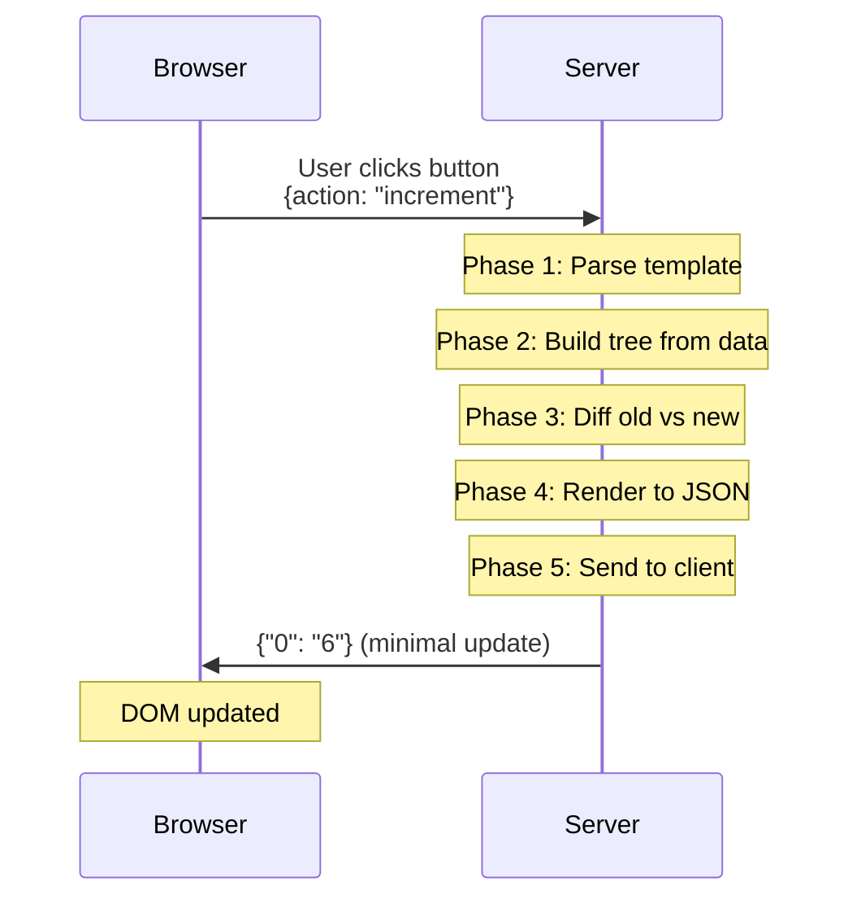

# LiveTemplate Contributor Walkthrough

Welcome! This guide introduces you to the LiveTemplate codebase through the lens of its **5-phase architecture**. By the end, you'll understand how a user action in the browser flows through the system and becomes a minimal DOM update.

## What Makes LiveTemplate Different

LiveTemplate is inspired by Phoenix LiveView - it lets you build reactive web applications by writing only server-side Go code. The key innovation is **tree-based diffing**: templates are parsed into tree structures that separate static HTML from dynamic values. When state changes, LiveTemplate calculates exactly what changed and sends only that data to the browser (typically 50-90% smaller than full HTML).



## The 5-Phase Architecture

The codebase is organized into 5 clear operational phases:

1. **[Parse](#phase-1-parse)** ([`internal/parse/`](../../internal/parse/)) - Convert Go templates to executable AST
2. **[Build](#phase-2-build)** ([`internal/build/`](../../internal/build/)) - Generate tree structures from AST + data
3. **[Diff](#phase-3-diff)** ([`internal/diff/`](../../internal/diff/)) - Calculate minimal changes between trees
4. **[Render](#phase-4-render)** ([`internal/render/`](../../internal/render/)) - Convert trees/changes to HTML/JSON
5. **[Send](#phase-5-send)** ([`internal/send/`](../../internal/send/)) - Deliver updates via HTTP/WebSocket

Each phase has a single responsibility, making the codebase easier to understand and modify.

## Quick Start: Running the Counter Example

Before diving into internals, let's see LiveTemplate in action with the simplest example:

```bash
# Clone and navigate to examples (separate repo)
git clone https://github.com/livetemplate/examples
cd examples/counter
go run main.go
# Open http://localhost:8080
```

**Key files to explore:**
- [`main.go`](https://github.com/livetemplate/examples/blob/main/counter/main.go) - Server setup and state management
- [`counter.tmpl`](https://github.com/livetemplate/examples/blob/main/counter/counter.tmpl) - Template with `lvt-*` bindings

Click the buttons and open your browser's Network tab. Watch how each action produces a tiny JSON payload like `{"0": "6"}` instead of full HTML. That's tree-based diffing at work.

## Local Development Setup

**Required:**
- Go 1.22+ with modules enabled
- Git

**Optional but recommended:**
- Node.js/npm (for client TypeScript development)
- Docker (for E2E browser tests)

**Essential commands:**
```bash
# Run all tests
GOWORK=off go test ./...

# Run specific package tests
GOWORK=off go test ./internal/parse -v
GOWORK=off go test ./internal/build -v
GOWORK=off go test ./internal/diff -v

# Run with race detector
GOWORK=off go test -race ./...

# Update golden test files (when intentionally changing output)
UPDATE_GOLDEN=1 GOWORK=off go test ./...
```

## Repository Structure

```
livetemplate/
├── *.go                          # Public API (template.go, mount.go, action.go, etc.)
├── internal/
│   ├── parse/                    # Phase 1: Template parsing
│   ├── build/                    # Phase 2: Tree construction + fingerprinting
│   ├── diff/                     # Phase 3: Tree comparison
│   ├── render/                   # Phase 4: HTML/JSON rendering
│   ├── send/                     # Phase 5: Message serialization
│   ├── keys/                     # Sequential key generation
│   ├── observe/                  # Logging and metrics
│   ├── session/                  # Connection tracking
│   └── context/                  # Template execution context
├── client/                       # TypeScript browser client
├── docs/                         # Architecture and guides
├── testdata/                     # Test fixtures and golden files
└── examples/                     # Sample applications (separate repo)
```

## The Public API (Entry Points)

Before diving into the 5 phases, understand the public API that applications use:

### [template.go](../../template.go)
Main entry point for creating and managing templates:
- [`New(name string, opts ...TemplateOpt) *Template`](../../template.go#L50-L80) - Create a template
- [`Template.Handle(controller, AsState(state), ...options) http.Handler`](../../template.go#L150-L180) - Mount template as HTTP handler
- [`Template.ExecuteUpdates(data interface{}) (tree, error)`](../../template.go#L200-L250) - Orchestrates all 5 phases

**Tests:** [`template_test.go`](../../template_test.go)

### [mount.go](../../mount.go)
HTTP/WebSocket handling and session lifecycle:
- [`ServeHTTP(w, r)`](../../mount.go#L80-L120) - HTTP entry point
- [`handleWebSocket(conn, req)`](../../mount.go#L150-L200) - WebSocket lifecycle
- [`handleAction(ctx, msg)`](../../mount.go#L220-L280) - Action dispatch to controller methods

**Tests:** [`mount_test.go`](../../mount_test.go)

### [action.go](../../action.go)
Action data binding and errors:
- [`ActionData.Bind(dest)`](../../action.go#L70-L90) - Parse form/JSON into structs
- [`FieldError` / `MultiError`](../../action.go#L100-L130) - Validation errors

### [context.go](../../context.go)
Unified context for all lifecycle methods:
- [`Context`](../../context.go#L20-L40) - Provides action name, data, request metadata
- `Context.GetString(key)`, `GetInt(key)`, etc. - Type-safe data access

### [state.go](../../state.go)
State interface and wrapper:
- [`State` interface](../../state.go#L15-L25) - Marker interface for serializable state
- [`AsState[T]()`](../../state.go#L35-L50) - Generic wrapper for state types

**Tests:** [`action_test.go`](../../action_test.go)

## Phase 1: Parse

**Package:** [`internal/parse/`](../../internal/parse/)
**Job:** Convert Go template strings into executable Abstract Syntax Tree (AST)

### How It Works

The parse phase takes a template string like `<h1>{{.Title}}</h1>` and converts it into a structured representation that can be executed with data.

**Key files:**
- [`parse.go`](../../internal/parse/parse.go) - Main parsing orchestrator
  - [`Parse(tmpl, funcMap)`](../../internal/parse/parse.go#L30-L80) - Entry point
  - Uses Go's `text/template` parser, wraps with LiveTemplate constructs
- [`field.go`](../../internal/parse/field.go) - Handles `{{.Field}}` expressions
  - [`FieldConstruct`](../../internal/parse/field.go#L15-L25) - Represents a field access
  - [`CompileField(node)`](../../internal/parse/field.go#L40-L60) - Parse field from AST
  - [`HydrateField(data)`](../../internal/parse/field.go#L70-L90) - Resolve field value
- [`conditional.go`](../../internal/parse/conditional.go) - Handles `{{if}}{{else}}{{end}}`
  - [`ConditionalConstruct`](../../internal/parse/conditional.go#L20-L35) - If/else branches
  - [`CompileConditional(node)`](../../internal/parse/conditional.go#L50-L90) - Parse branches
  - [`HydrateConditional(data)`](../../internal/parse/conditional.go#L100-L130) - Evaluate condition
- [`range.go`](../../internal/parse/range.go) - Handles `{{range}}{{end}}` loops
  - [`RangeConstruct`](../../internal/parse/range.go#L25-L40) - Loop representation
  - [`CompileRange(node)`](../../internal/parse/range.go#L60-L100) - Parse range template
  - [`HydrateRange(data, keyGen)`](../../internal/parse/range.go#L120-L180) - Iterate with keys
- [`with.go`](../../internal/parse/with.go) - Handles `{{with}}{{end}}` context switching
- [`var_context.go`](../../internal/parse/var_context.go) - Variable scope tracking during parsing

### Example Flow

Template:
```html
{{if .ShowTitle}}
  <h1>{{.Title}}</h1>
{{end}}
```

After parsing:
```go
ConditionalConstruct{
  Condition: ".ShowTitle",
  TrueBranch: []Construct{
    FieldConstruct{Path: ".Title"}
  },
  FalseBranch: nil
}
```

**Key insight:** Parsing happens once per template. The result is cached and reused for every render.

**Tests to explore:**
- [`parse_test.go`](../../internal/parse/parse_test.go) - Overall parsing
- [`field_test.go`](../../internal/parse/field_test.go) - Field handling
- [`conditional_test.go`](../../internal/parse/conditional_test.go) - If/else logic
- [`range_test.go`](../../internal/parse/range_test.go) - Range iteration

## Phase 2: Build

**Package:** [`internal/build/`](../../internal/build/)
**Job:** Execute parsed AST with data to generate tree structures

### How It Works

The build phase takes the parsed AST and your data (e.g., `CounterState{Counter: 5}`) and generates a **TreeNode** - the core data structure that separates static HTML from dynamic values.

**Key files:**
- [`types.go`](../../internal/build/types.go) - Core data structures
  - [`TreeNode`](../../internal/build/types.go#L15-L25) - `map[string]interface{}` with special keys
    - `"s"` key: array of static HTML strings
    - `"0"`, `"1"`, etc: dynamic values or nested trees
  - [`RangeData`](../../internal/build/types.go#L40-L55) - Metadata for range iterations
  - [`TreeMetadata`](../../internal/build/types.go#L65-L75) - Wrapper IDs and tree metadata
- [`fingerprint.go`](../../internal/build/fingerprint.go) - Change detection
  - [`CalculateFingerprint(node)`](../../internal/build/fingerprint.go#L20-L50) - MD5 hash of tree
  - Used to skip rendering when nothing changed
- [`wrapper.go`](../../internal/build/wrapper.go) - Wrapper div injection
  - [`InjectWrapper(html, wrapperID)`](../../internal/build/wrapper.go#L30-L70) - Adds `<div id="lvt-xxx">`
  - Client uses this ID to target DOM updates

### TreeNode Structure

Example template:
```html
<div>Counter: {{.Counter}}</div>
```

With data `{Counter: 5}`, builds tree:
```json
{
  "s": ["<div>Counter: ", "</div>"],
  "0": "5"
}
```

**Key insight:** Static parts (`"s"`) are sent only once. Updates send only changed dynamics (`"0": "6"`).

### The Wire Format Optimization

This is crucial to understand:

1. **First render:** Tree includes full structure (statics + dynamics)
   ```json
   {"s": ["<div>Counter: ", "</div>"], "0": "5"}
   ```

2. **Subsequent updates:** Tree includes ONLY changed dynamics
   ```json
   {"0": "6"}
   ```

The implementation: [`prepare.go`](../../internal/diff/prepare.go)
- [`PrepareTreeForClient(node, clientHasStatics)`](../../internal/diff/prepare.go#L30-L80)
- Removes statics from wire format if client has cached them
- Result: Updates are ~10% the size of full renders

**Tests to explore:**
- [`types_test.go`](../../internal/build/types_test.go) - TreeNode operations
- [`fingerprint_test.go`](../../internal/build/fingerprint_test.go) - Change detection
- [`wrapper_test.go`](../../internal/build/wrapper_test.go) - Wrapper injection

## Phase 3: Diff

**Package:** [`internal/diff/`](../../internal/diff/)
**Job:** Compare old and new trees to calculate minimal updates

### How It Works

The diff phase takes two TreeNodes (previous and current render) and determines the minimal set of changes needed to update the DOM.

**Key files:**
- [`tree_compare.go`](../../internal/diff/tree_compare.go) - Main diffing algorithm
  - [`CompareTreesAndGetChanges(old, new)`](../../internal/diff/tree_compare.go#L30-L100) - Recursively compare nodes
  - Returns tree containing only changed values
  - Handles nested trees and conditional branches
- [`range_ops.go`](../../internal/diff/range_ops.go) - Range-specific diffing
  - [`DiffRanges(oldItems, newItems)`](../../internal/diff/range_ops.go#L40-L150) - List diffing
  - Generates operations:
    - `["u", "item-id", updates]` - Update existing item
    - `["i", "after-id", "position", data]` - Insert new item
    - `["r", "item-id"]` - Remove item
    - `["o", ["id1", "id2", ...]]` - Reorder items
- [`prepare.go`](../../internal/diff/prepare.go) - Wire format preparation
  - [`PrepareTreeForClient(node, hasStatics)`](../../internal/diff/prepare.go#L30-L80) - Strip statics for updates
- [`helpers.go`](../../internal/diff/helpers.go) - Diff utilities

### Example: Counter Increment

**Old tree:**
```json
{"s": ["<div>Counter: ", "</div>"], "0": "5"}
```

**New tree:**
```json
{"s": ["<div>Counter: ", "</div>"], "0": "6"}
```

**Diff result (after prepare):**
```json
{"0": "6"}
```

Only the changed dynamic value is included. Statics are cached client-side.

### Range Diffing

**Critical feature:** When iterating over lists, the diff phase generates efficient operations instead of re-sending entire lists.

Example - adding an item to a todo list:
```json
["i", "todo-2", "end", {"s": ["<li>", "</li>"], "0": "New item"}]
```

This insert operation is much smaller than re-sending all todos.

**Tests to explore:**
- [`tree_compare_test.go`](../../internal/diff/tree_compare_test.go) - Tree comparison
- [`range_ops_test.go`](../../internal/diff/range_ops_test.go) - Range operations
- [`prepare_test.go`](../../internal/diff/prepare_test.go) - Wire format prep
- [`helpers_test.go`](../../internal/diff/helpers_test.go) - Diff utilities

## Phase 4: Render

**Package:** [`internal/render/`](../../internal/render/)
**Job:** Convert tree structures to HTML or JSON for transmission

### How It Works

The render phase formats tree structures for consumption by clients or tests.

**Key files:**
- [`html.go`](../../internal/render/html.go) - HTML rendering
  - [`TreeToHTML(node)`](../../internal/render/html.go#L30-L100) - Convert tree to HTML string
  - [`Node(node)`](../../internal/render/html.go#L120-L180) - Render single node
  - [`IsVoidElement(tag)`](../../internal/render/html.go#L200-L220) - Check for self-closing tags
  - Used primarily for testing and validation
- [`minify.go`](../../internal/render/minify.go) - HTML minification
  - Removes unnecessary whitespace

### When This Phase Runs

**For initial page load:**
- Tree → HTML → Full HTML document
- Client receives complete page

**For updates:**
- Tree → JSON (happens in Phase 5)
- Client receives minimal update object

**For tests:**
- Tree → HTML for golden file comparison

### Example

Tree:
```json
{"s": ["<div>Counter: ", "</div>"], "0": "5"}
```

Rendered HTML:
```html
<div>Counter: 5</div>
```

**Tests to explore:**
- [`html_test.go`](../../internal/render/html_test.go) - HTML rendering

## Phase 5: Send

**Package:** [`internal/send/`](../../internal/send/)
**Job:** Package updates and deliver to clients via HTTP/WebSocket

### How It Works

The send phase wraps diff results with metadata and serializes for wire transmission.

**Key files:**
- [`message.go`](../../internal/send/message.go) - Incoming message parsing
  - [`ParseActionFromHTTP(req)`](../../internal/send/message.go#L30-L80) - Parse HTTP POST
  - [`ParseActionFromWebSocket(msg)`](../../internal/send/message.go#L90-L130) - Parse WebSocket frame
  - Extracts action name and data from client
- [`response.go`](../../internal/send/response.go) - Outgoing response formatting
  - [`PrepareUpdate(tree, metadata)`](../../internal/send/response.go#L30-L70) - Wrap tree with metadata
  - [`SerializeUpdate(update)`](../../internal/send/response.go#L80-L110) - JSON serialization
  - Adds success/error status, validation errors, action context
- [`json.go`](../../internal/send/json.go) - JSON encoding utilities

### Update Response Format

The complete response sent to clients:

```json
{
  "tree": {"0": "6"},
  "meta": {
    "success": true,
    "action": "increment",
    "errors": null
  }
}
```

**With validation errors:**
```json
{
  "tree": {"0": "5"},
  "meta": {
    "success": false,
    "action": "signup",
    "errors": {
      "username": "already taken",
      "password": "too short"
    }
  }
}
```

**Transport:**
- **WebSocket:** Direct frame push (preferred for reactivity)
- **HTTP POST:** JSON response with appropriate headers (fallback)

**Tests to explore:**
- [`message_test.go`](../../internal/send/message_test.go) - Message parsing
- [`response_test.go`](../../internal/send/response_test.go) - Response formatting
- [`json_test.go`](../../internal/send/json_test.go) - JSON serialization

## Supporting Packages

### Key Generation ([`internal/keys/`](../../internal/keys/))

**Purpose:** Generate stable, sequential keys for range items

**Files:**
- [`generator.go`](../../internal/keys/generator.go)
  - [`Generator`](../../internal/keys/generator.go#L15-L25) - Thread-safe counter
  - [`Next()`](../../internal/keys/generator.go#L35-L50) - Get next sequential key
  - [`Reset()`](../../internal/keys/generator.go#L60-L70) - Reset counter between renders

**Why it matters:** Range items need stable keys for diffing. The generator ensures keys are deterministic within a render but reset between renders for consistency.

**Tests:** [`generator_test.go`](../../internal/keys/generator_test.go)

### Session Management ([`internal/session/`](../../internal/session/))

**Purpose:** Track WebSocket connections and enforce limits

**Key types:**
- [`Connection`](../../internal/session/connection.go#L20-L35) - Single WebSocket connection
- [`ConnectionRegistry`](../../internal/session/registry.go#L25-L45) - Index connections by user/group
- [`ConnectionLimits`](../../internal/session/limits.go#L20-L35) - Enforce max connections

**Tests:** [`registry_test.go`](../../internal/session/registry_test.go)

### Observability ([`internal/observe/`](../../internal/observe/))

**Purpose:** Production-ready logging and metrics

**Files:**
- [`logger.go`](../../internal/observe/logger.go) - Structured logging with slog
- [`metrics.go`](../../internal/observe/metrics.go) - Operational metrics
- [`prometheus_test.go`](../../internal/observe/prometheus_test.go) - Prometheus integration

## The Client Runtime

**Location:** [`client/livetemplate-client.ts`](../../client/livetemplate-client.ts)

The TypeScript client handles:
1. **Event delegation:** Listens for `lvt-click`, `lvt-submit`, `lvt-change`, etc.
2. **Transport:** WebSocket (preferred) with HTTP fallback
3. **Statics cache:** Stores `"s"` arrays from first render for reuse
4. **DOM patching:** Uses morphdom to apply minimal updates
5. **Lifecycle events:** Fires `lvt:pending`, `lvt:success`, `lvt:error`, `lvt:done`

**Tests:** [`client/tests/`](../../client/tests/)

## End-to-End Flow: Counter Example Revisited

Now that you understand the 5 phases, let's trace a complete flow:

### Initial Page Load (GET /)

1. **Request:** Browser requests `/`
2. **Handler:** [`mount.go`](../../mount.go) calls [`ServeHTTP()`](../../mount.go#L80-L120)
3. **Phase 1-5:** Execute all phases to generate initial HTML
   - Parse template (cached after first run)
   - Build tree with data `{Counter: 0}`
   - No diff (first render)
   - Render tree to HTML
   - Send complete HTML document
4. **Response:** Browser receives full page with WebSocket connection script

### User Clicks "+1" Button (Action)

1. **Client:** Detects `lvt-click="increment"`, sends `{action: "increment"}` via WebSocket
2. **Parse:** [`ParseActionFromWebSocket()`](../../internal/send/message.go#L90-L130) extracts action
3. **Execute:** [`handleAction()`](../../mount.go#L220-L280) calls `CounterController.Increment(state, ctx)`
4. **Update:** `state.Counter++` changes state from 0 to 1, returns new state
5. **Phase 1:** Template already parsed (cached)
6. **Phase 2:** Build new tree with `{Counter: 1}`
   ```json
   {"s": ["<div>Counter: ", "</div>"], "0": "1"}
   ```
7. **Phase 3:** Diff against old tree
   ```json
   // Old: {"s": [...], "0": "0"}
   // New: {"s": [...], "0": "1"}
   // Diff: {"0": "1"}
   ```
8. **Phase 4:** Prepare for client (statics already cached)
9. **Phase 5:** Serialize response
   ```json
   {"tree": {"0": "1"}, "meta": {"success": true, "action": "increment"}}
   ```
10. **Client:** Merges statics from cache with new dynamics, patches DOM

**Total bytes sent:** ~50-60 bytes vs ~200-300 bytes for full HTML

## Testing Strategy

LiveTemplate has comprehensive test coverage across all phases:

### Unit Tests

Run tests for specific packages:
```bash
GOWORK=off go test ./internal/parse -v       # Parse phase
GOWORK=off go test ./internal/build -v       # Build phase
GOWORK=off go test ./internal/diff -v        # Diff phase
GOWORK=off go test ./internal/render -v      # Render phase
GOWORK=off go test ./internal/send -v        # Send phase
```

### Integration Tests

Core template functionality:
```bash
GOWORK=off go test ./... -run TestTemplate -v
GOWORK=off go test ./... -run TestMount -v
GOWORK=off go test ./... -run TestAction -v
```

### Golden File Tests

Many tests use golden files in [`testdata/`](../../testdata/):
- `testdata/fixtures/` - Input templates
- `testdata/golden/` - Expected output

Update golden files when intentionally changing output:
```bash
UPDATE_GOLDEN=1 GOWORK=off go test ./...
```

### Browser E2E Tests

E2E tests live in the [lvt repository](https://github.com/livetemplate/lvt):
- Location: `github.com/livetemplate/lvt/e2e/livetemplate_core_test.go`
- Uses chromedp for real browser automation
- Tests: focus preservation, loading indicators, form submission, etc.

## Common Contributor Tasks

### 1. Add Support for a New Template Construct

**Example:** Add support for `{{block}}` syntax

**Steps:**
1. Create construct in [`internal/parse/`](../../internal/parse/)
   - Add `block.go` with `BlockConstruct` type
   - Implement parsing logic
   - Add tests in `block_test.go`

2. Update build phase if needed
   - Typically constructs map naturally to existing TreeNode structure
   - Add tests in [`internal/build/`](../../internal/build/)

3. Ensure diff handles it correctly
   - Usually works automatically if construct produces valid TreeNode
   - Add edge case tests in [`internal/diff/`](../../internal/diff/)

4. Update documentation
   - Add to this guide
   - Update [`ARCHITECTURE.md`](../ARCHITECTURE.md)

**Example PR pattern:**
- Phase 1 commit: Parse + tests
- Phase 2 commit: Build integration + tests
- Phase 3 commit: Diff tests for edge cases
- Phase 4 commit: Documentation

### 2. Improve Diff Algorithm

**Example:** Optimize range diffing for large lists

**Steps:**
1. Add benchmark in [`range_ops_test.go`](../../internal/diff/range_ops_test.go)
   ```go
   func BenchmarkDiffRanges_LargeList(b *testing.B) { ... }
   ```

2. Implement optimization in [`range_ops.go`](../../internal/diff/range_ops.go)
   - Preserve existing behavior (golden tests verify)
   - Focus on performance

3. Verify with tests:
   ```bash
   GOWORK=off go test ./internal/diff -bench=. -benchmem
   ```

4. Update documentation with performance characteristics

### 3. Extend Client Runtime

**Example:** Add new lifecycle event

**Steps:**
1. Update [`client/livetemplate-client.ts`](../../client/livetemplate-client.ts)
   - Add event dispatch
   - Update TypeScript types

2. Build client:
   ```bash
   cd client && npm run build
   ```

3. Test in examples:
   ```bash
   cd examples/counter && go run main.go
   ```

4. Add E2E test in lvt repository

### 4. Add Observability

**Example:** Add new metric for tracking template render time

**Steps:**
1. Define metric in [`internal/observe/metrics.go`](../../internal/observe/metrics.go)
   ```go
   var TemplateRenderDuration = prometheus.NewHistogram(...)
   ```

2. Instrument in [`template.go`](../../template.go)
   ```go
   start := time.Now()
   defer observe.TemplateRenderDuration.Observe(time.Since(start).Seconds())
   ```

3. Add test in [`prometheus_test.go`](../../internal/observe/prometheus_test.go)

4. Update docs on metrics available

## Debugging Tips

### Enable Verbose Logging

```go
tmpl := livetemplate.New("myapp",
    livetemplate.WithDevMode(true),  // Enables detailed logs
)
```

### Inspect Tree Structures

Add temporary logging in [`template.go`](../../template.go) before diff:
```go
func (t *Template) ExecuteUpdates(data interface{}) (TreeNode, error) {
    newTree := // ... build tree
    log.Printf("Old tree: %+v", t.lastTree)
    log.Printf("New tree: %+v", newTree)
    // ... diff
}
```

### Use Render Package for Debugging

Convert any tree to HTML for inspection:
```go
import "github.com/livetemplate/livetemplate/internal/render"

html := render.TreeToHTML(myTree)
fmt.Println(html)
```

### Golden File Workflow

When changing output format:

1. Run tests to see diff:
   ```bash
   GOWORK=off go test ./internal/diff -v
   ```

2. Verify changes are intentional

3. Update golden files:
   ```bash
   UPDATE_GOLDEN=1 GOWORK=off go test ./internal/diff
   ```

4. Commit updated golden files with code changes

### Race Detector

Always test concurrent code with race detector:
```bash
GOWORK=off go test -race ./internal/session
GOWORK=off go test -race ./...
```

## Architecture Decisions

Understanding why things are designed this way:

### Why 5 Separate Phases?

Clear separation of phases makes it easy to:

- Test each phase independently
- Optimize one phase without affecting others
- Understand data flow through the system
- Onboard new contributors (you're here!)

This architecture evolved from earlier versions where logic was more intertwined across files. The current structure emerged from applying first principles to the problem domain.

See: [`docs/design/FIRST_PRINCIPLES.md`](../design/FIRST_PRINCIPLES.md)

### Why Tree-Based Diffing vs HTML Diffing?

**HTML diffing** (like htmx):
- Parses HTML strings on client
- Compares DOM structures
- Unpredictable sizes

**Tree-based diffing** (LiveTemplate):
- Structured data model
- Predictable payload sizes
- Enables code generation (lvt CLI works because format is structured)
- Server knows exactly what changed

See: [`docs/specifications/tree-update-specification.md`](../specifications/tree-update-specification.md)

### Why Sequential Keys for Ranges?

**Problem:** Need stable keys to track list items across renders

**Alternative 1:** Hash-based keys
- Expensive to compute
- Can have collisions

**Alternative 2:** Require user-provided IDs
- Burdens users
- Doesn't work for all data types

**Solution:** Sequential keys per render
- Fast (simple counter)
- No collisions (reset each render)
- Works with any data type
- Stable within single render (enables diffing)

See: [`internal/keys/generator.go`](../../internal/keys/generator.go)

## Further Reading

**Architecture:**
- [`docs/ARCHITECTURE.md`](../ARCHITECTURE.md) - Detailed design and diagrams
- [`docs/design/FIRST_PRINCIPLES.md`](../design/FIRST_PRINCIPLES.md) - Core principles

**Specifications:**
- [`docs/specifications/tree-update-specification.md`](../specifications/tree-update-specification.md) - Tree format spec
- [`docs/specifications/test-scenarios.md`](../specifications/test-scenarios.md) - Test coverage

**Broadcasting:**
- [`docs/BROADCASTING.md`](../BROADCASTING.md) - Server-initiated updates

**Examples:**
- [Counter](https://github.com/livetemplate/examples/tree/main/counter) - Simplest example
- [Todos](https://github.com/livetemplate/examples/tree/main/todos) - CRUD operations
- [Chat](https://github.com/livetemplate/examples/tree/main/chat) - Broadcasting

## Getting Help

**Questions?**
- GitHub Discussions: https://github.com/livetemplate/livetemplate/discussions
- Issues: https://github.com/livetemplate/livetemplate/issues

**Contributing:**
- See [`CONTRIBUTING.md`](../../CONTRIBUTING.md) for guidelines
- All contributions welcome: docs, tests, features, bug fixes

## Suggested First Issues

Good starting points for new contributors:

1. **Documentation**
   - Add more code examples to existing docs
   - Create topic-specific guides (validation, broadcasting patterns)
   - Improve inline code comments

2. **Testing**
   - Add test cases for edge scenarios
   - Improve test coverage reports
   - Add benchmarks for performance-critical paths

3. **Observability**
   - Add more detailed metrics
   - Improve log messages
   - Add trace spans for debugging

4. **Client**
   - Add more lifecycle events
   - Improve error messages
   - Better loading states

Look for issues labeled `good-first-issue` in the repository.

---

**You're ready!** You now understand the 5-phase architecture and how data flows through LiveTemplate. Start by exploring the code referenced in this guide, run the tests, and try modifying the counter example. Welcome to the project!
